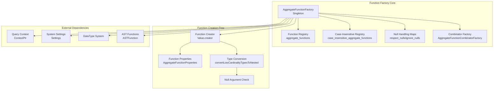
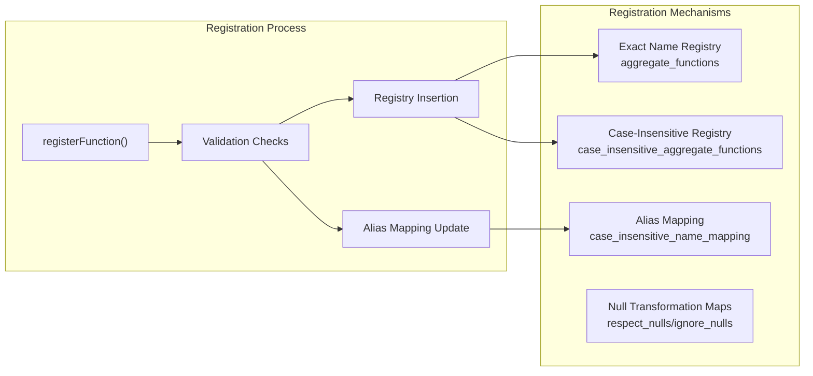
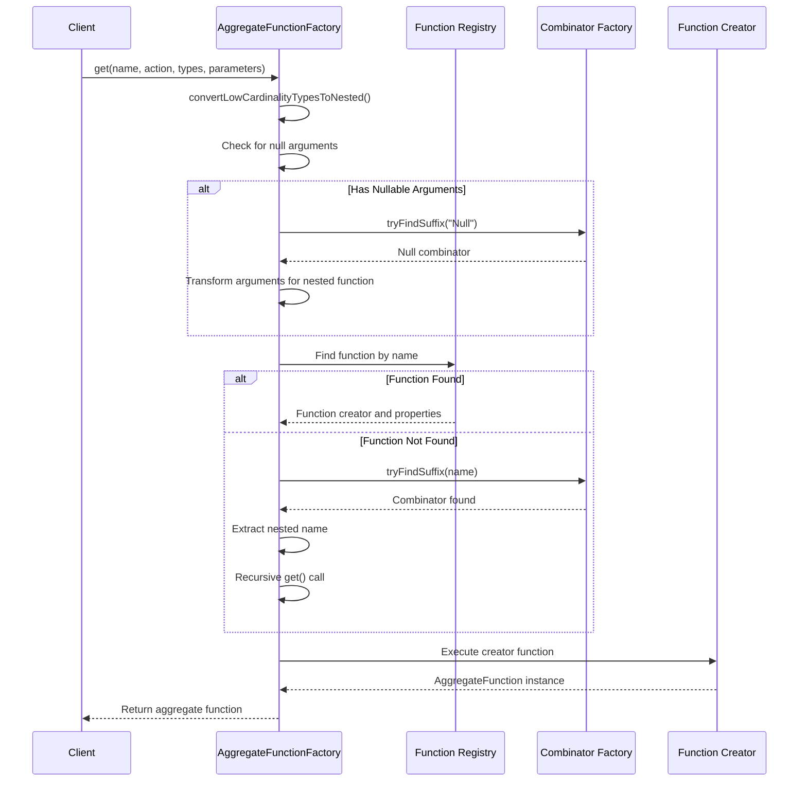
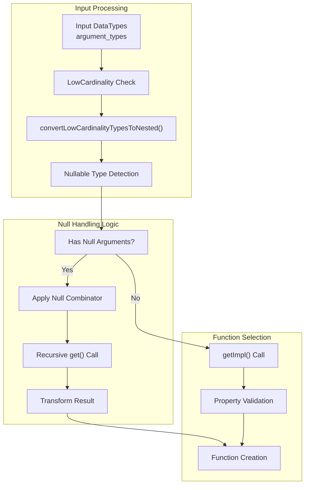
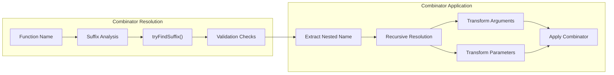
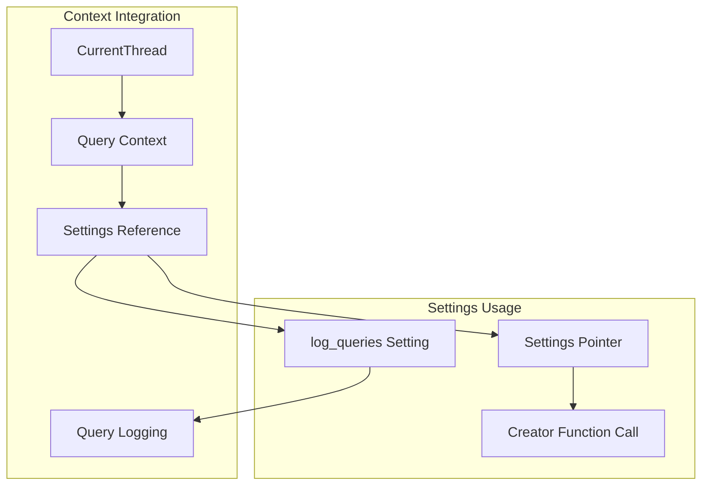
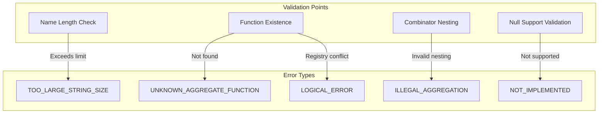
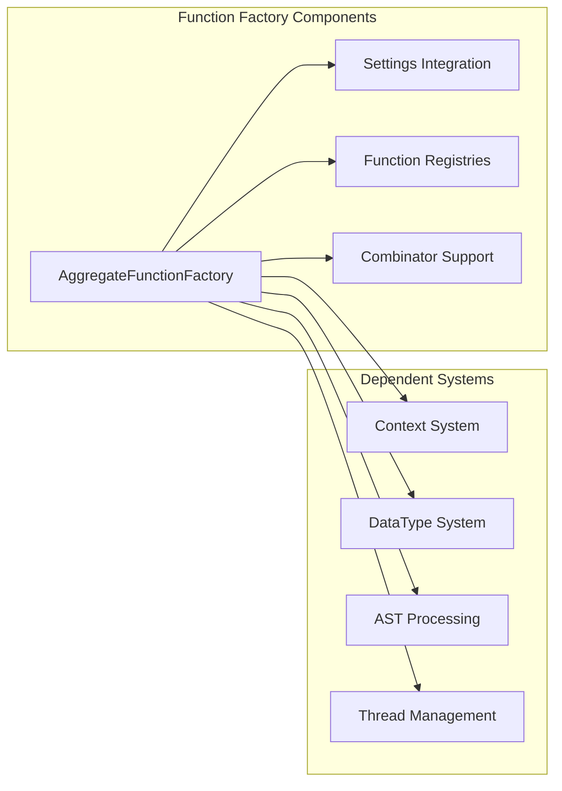

# Function Factory Module Documentation

## Introduction

The Function Factory module is a critical component of the ClickHouse database system that serves as the central registry and instantiation mechanism for aggregate functions. This module provides a factory pattern implementation for creating aggregate function instances, managing function registration, and handling function combinators that extend base aggregate functions with additional behaviors.

The module plays a pivotal role in query execution by dynamically resolving aggregate function names to their implementations, applying appropriate type transformations, and managing the complex ecosystem of function combinators that enhance base functionality.

## Architecture Overview

The Function Factory module implements a sophisticated factory pattern with support for function combinators, case-insensitive name resolution, and null-handling transformations. The architecture is built around the `AggregateFunctionFactory` singleton class that maintains registries of function creators and their properties.



## Core Components

### AggregateFunctionFactory

The `AggregateFunctionFactory` class serves as the central registry and factory for all aggregate functions in the system. It implements the singleton pattern to ensure a single point of access for function resolution and instantiation.

**Key Responsibilities:**
- Function registration and name resolution
- Case-insensitive function name handling
- Null-handling transformations (RESPECT_NULLS/IGNORE_NULLS)
- Combinator application and validation
- Type conversion for LowCardinality types
- Query logging integration

**Core Methods:**
- `registerFunction()`: Registers new aggregate functions with the factory
- `get()`: Main factory method for creating aggregate function instances
- `getImpl()`: Internal implementation for function resolution
- `tryGetProperties()`: Retrieves function properties without instantiation
- `isAggregateFunctionName()`: Validates if a name corresponds to an aggregate function

### Function Registration System

The factory maintains multiple registries to support different naming conventions and access patterns:



### Function Resolution Process

The function resolution follows a multi-step process to handle the complexity of aggregate function ecosystem:



## Data Flow Architecture

### Type Conversion and Null Handling

The module implements sophisticated type conversion logic to handle LowCardinality types and null values:



### Combinator Processing

Function combinators extend base aggregate functions with additional behaviors:



## Integration with System Components

### Context and Settings Integration

The Function Factory integrates with the query execution context to access system settings and logging capabilities:



### Error Handling and Validation

The module implements comprehensive error handling for various failure scenarios:



## Dependencies and Interactions

### External Module Dependencies

The Function Factory module has significant dependencies on other system modules:

- **[Core_Engine](Core_Engine.md)**: Utilizes Settings system for configuration management
- **[Interpreters](Interpreters.md)**: Integrates with Context system for query execution state
- **[Data_Types](Data_Types.md)**: Leverages DataType system for type conversion and validation
- **[Parsers](Parsers.md)**: Processes ASTFunction nodes for function identification
- **[IO_System](IO_System.md)**: Uses WriteHelpers for error message formatting

### Internal Component Relationships



## Key Features and Capabilities

### Function Combinator Support

The module supports a rich ecosystem of function combinators that extend base aggregate functions:

- **Null Combinator**: Automatically applies null-handling behavior
- **Suffix-based Combinators**: Supports arbitrary suffix-based function extensions
- **Nested Combinator Support**: Handles complex combinator chains (with validation)
- **Internal Combinators**: Supports system-internal combinator types

### Case-Insensitive Function Resolution

The factory provides case-insensitive function name resolution while maintaining exact case mappings for display and logging purposes.

### Null Handling Transformations

Advanced null-handling capabilities including:
- **RESPECT_NULLS**: Functions that explicitly handle null values
- **IGNORE_NULLS**: Functions that ignore null values (default behavior)
- **Automatic Transformation**: Dynamic function selection based on null handling requirements

### Type System Integration

Seamless integration with the DataType system including:
- **LowCardinality Type Handling**: Automatic conversion to nested types
- **Nullable Type Processing**: Intelligent null combinator application
- **Type Validation**: Comprehensive type checking and validation

## Performance Considerations

### Caching and Registry Optimization

The factory implements efficient registry mechanisms with O(1) lookup performance for function resolution:

- **Hash-based Registries**: Standard unordered_map for exact name lookups
- **Case-insensitive Registry**: Separate registry for case-insensitive resolution
- **Alias Mapping**: Efficient alias resolution without full registry scans

### Memory Management

- **Singleton Pattern**: Single factory instance reduces memory overhead
- **Creator Function Storage**: Function pointers minimize per-instance memory usage
- **Property Caching**: Function properties cached at registration time

### Query Performance Impact

The factory design minimizes query execution overhead through:
- **Early Validation**: Function validation during parsing phase
- **Efficient Resolution**: Optimized lookup algorithms
- **Type Caching**: Reuse of type conversion results
- **Context Integration**: Minimal context switching overhead

## Extension Points

### Custom Function Registration

The module provides clear extension points for adding new aggregate functions:

```cpp
// Example registration pattern
AggregateFunctionFactory::instance().registerFunction(
    "custom_function",
    {creator_function, properties},
    Case::Sensitive
);
```

### Combinator Development

New combinators can be integrated through the AggregateFunctionCombinatorFactory system, following the established suffix-based naming convention.

### Null Handling Extensions

The null transformation system supports registration of custom null-handling relationships between functions.

This comprehensive documentation provides the foundation for understanding the Function Factory module's role in the ClickHouse system architecture, its internal workings, and its integration with other system components.