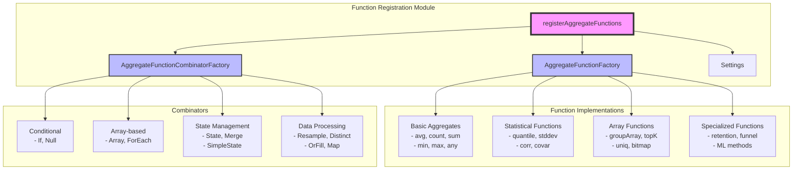
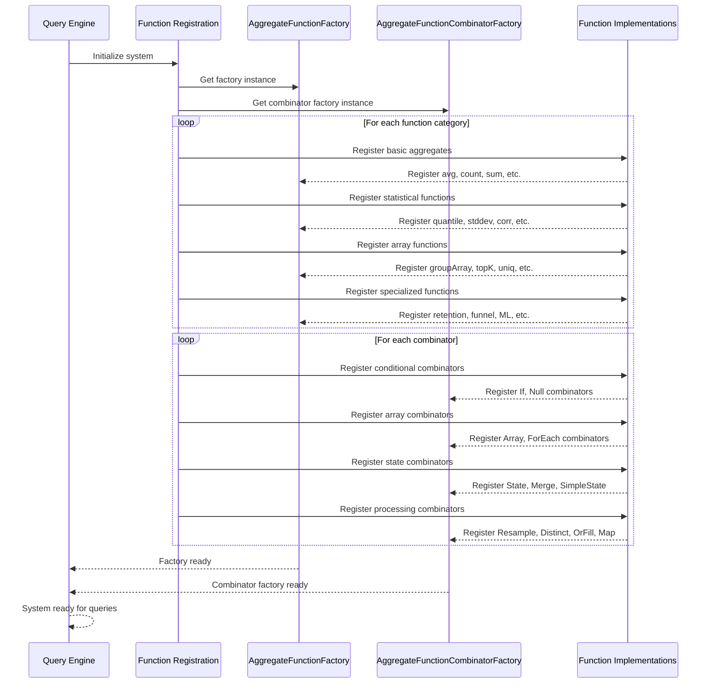
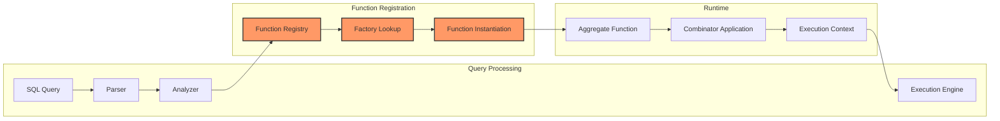

# Function Registration Module Documentation

## Introduction

The Function Registration module is a critical component of the database system's aggregate function infrastructure. It serves as the central registry and initialization system for all aggregate functions and their combinators, providing a systematic approach to function discovery, registration, and management within the database engine.

This module acts as the orchestration layer that brings together various aggregate function implementations and makes them available for query execution, ensuring that the database can perform complex analytical operations across diverse data types and use cases.

## Architecture Overview

### Core Components

The Function Registration module consists of three primary components that work together to manage the aggregate function ecosystem:

1. **AggregateFunctionFactory** - The main factory responsible for creating and managing aggregate function instances
2. **AggregateFunctionCombinatorFactory** - Manages function combinators that modify the behavior of base aggregate functions
3. **Settings** - Configuration management for function registration and behavior

### System Architecture

## Registration Process Flow

### Function Registration Sequence

### Function Discovery and Instantiation

## Function Categories and Dependencies

### Basic Aggregate Functions

The module registers fundamental aggregation operations that form the foundation of analytical processing:

- **Counting Operations**: `count`, `sum`, `avg`, `avgWeighted`
- **Extreme Value Functions**: `min`, `max`, `argMin`, `argMax`, `any`, `anyHeavy`
- **Mathematical Aggregations**: `sumMap`, `deltaSum`, `deltaSumTimestamp`

### Statistical and Analytical Functions

Advanced statistical functions for data analysis:

- **Quantile Functions**: Multiple quantile implementations including exact, timing, t-digest, and bfloat16 variants
- **Statistical Measures**: Standard deviation, variance, correlation, covariance
- **Distribution Analysis**: Histogram, entropy, Kolmogorov-Smirnov test

### Array and Collection Functions

Functions for working with arrays and collections:

- **Array Aggregation**: `groupArray`, `groupUniqArray`, `groupArraySorted`
- **Set Operations**: `uniq`, `topK`, `groupArrayIntersect`
- **Bitmap Operations**: Bitmap-based aggregations for high-cardinality data

### Specialized Functions

Domain-specific functions for advanced analytics:

- **Time Series Analysis**: `retention`, `windowFunnel`, `sequenceMatch`
- **Machine Learning**: `MLMethod`, `categoricalIV`, `simpleLinearRegression`
- **Statistical Testing**: `mannWhitney`, `welchTTest`, `studentTTest`, `meanZTest`

## Combinator System

### Conditional Combinators

Modify function behavior based on conditions:

- **If Combinator**: Applies aggregation only when conditions are met
- **Null Combinator**: Handles NULL values in aggregation

### Array Combinators

Enable array-based operations:

- **Array Combinator**: Applies aggregation to array elements
- **ForEach Combinator**: Iterates over array elements

### State Management Combinators

Handle aggregation state persistence:

- **State Combinator**: Returns intermediate aggregation state
- **Merge Combinator**: Combines aggregation states
- **SimpleState Combinator**: Simplified state representation

### Data Processing Combinators

Advanced data manipulation:

- **Resample Combinator**: Resamples data for aggregation
- **Distinct Combinator**: Applies aggregation to distinct values only
- **OrFill Combinator**: Fills missing values during aggregation
- **Map Combinator**: Applies aggregation to mapped values

## Integration with Query Processing

### Query Planning Integration

The Function Registration module integrates with the [Query_Planning](Query_Planning.md) module to provide:

- Function availability information during query planning
- Cost estimation for different aggregate functions
- Optimization hints based on function characteristics

### Execution Context

Functions registered through this module work within the [Interpreters](Interpreters.md) framework:

- Access to execution context and shared state
- Integration with the ActionsDAG for expression evaluation
- Support for lazy execution and result caching

### Storage Engine Integration

Aggregate functions interact with the [Storage_Engine](Storage_Engine.md) through:

- Specialized readers for MergeTree tables
- Partition-level aggregation optimization
- Index-aware aggregation strategies

## Configuration and Settings

### Factory Configuration

The module supports configuration through the Settings system:

- Function-specific behavior tuning
- Performance optimization parameters
- Compatibility settings for different function versions

### Runtime Behavior

Settings control various aspects of function execution:

- Memory usage limits for aggregation
- Precision settings for statistical functions
- Timeout configurations for complex aggregations

## Performance Considerations

### Registration Overhead

The registration process is optimized for:

- Minimal startup time impact
- Lazy loading of function implementations
- Efficient factory pattern usage

### Memory Management

The module implements strategies for:

- Shared function instance reuse
- Efficient state management for combinators
- Memory pool allocation for temporary structures

### Scalability

Design considerations for large-scale deployments:

- Thread-safe factory operations
- Lock-free registration where possible
- Distributed aggregation support

## Error Handling and Validation

### Registration Validation

The module ensures:

- No duplicate function registrations
- Valid function signatures and implementations
- Proper combinator compatibility checks

### Runtime Error Handling

Comprehensive error management includes:

- Function not found errors
- Invalid argument type handling
- Resource exhaustion management

## Extension Points

### Custom Function Registration

The module provides interfaces for:

- Plugin-based function registration
- Dynamic loading of external functions
- Custom combinator development

### Factory Extension

Extensibility features include:

- Custom factory implementations
- Specialized function categories
- Integration with external function libraries

## Dependencies

### Internal Dependencies

The Function Registration module relies on:

- **[Aggregate_Functions](Aggregate_Functions.md)**: Factory and settings infrastructure
- **[Interpreters](Interpreters.md)**: Execution context and query processing
- **[Core_Engine](Core_Engine.md)**: System settings and configuration

### External Dependencies

The module interfaces with:

- Function implementation libraries
- Statistical computation libraries
- Memory management subsystems

## Best Practices

### Function Development

When implementing new aggregate functions:

1. Follow the established registration pattern
2. Implement proper factory integration
3. Consider combinator compatibility
4. Provide comprehensive error handling

### Performance Optimization

For optimal function performance:

1. Leverage factory instance reuse
2. Implement efficient state management
3. Consider parallel execution strategies
4. Profile memory usage patterns

### Maintenance Guidelines

To ensure long-term maintainability:

1. Document function behavior and dependencies
2. Maintain backward compatibility
3. Implement proper version management
4. Provide migration paths for deprecated functions

## Future Enhancements

### Planned Improvements

Potential enhancements to the module include:

- Dynamic function loading and unloading
- Advanced function composition mechanisms
- Machine learning-based function optimization
- Distributed aggregation coordination

### Emerging Patterns

New patterns being explored:

- Streaming aggregation support
- GPU-accelerated function execution
- Approximate computation frameworks
- Federated aggregation across multiple systems