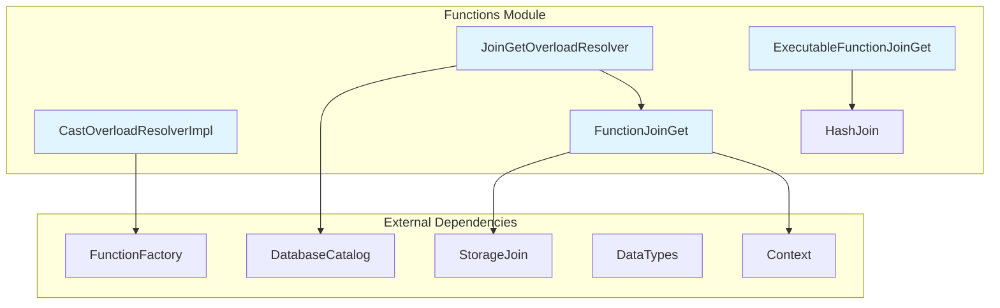
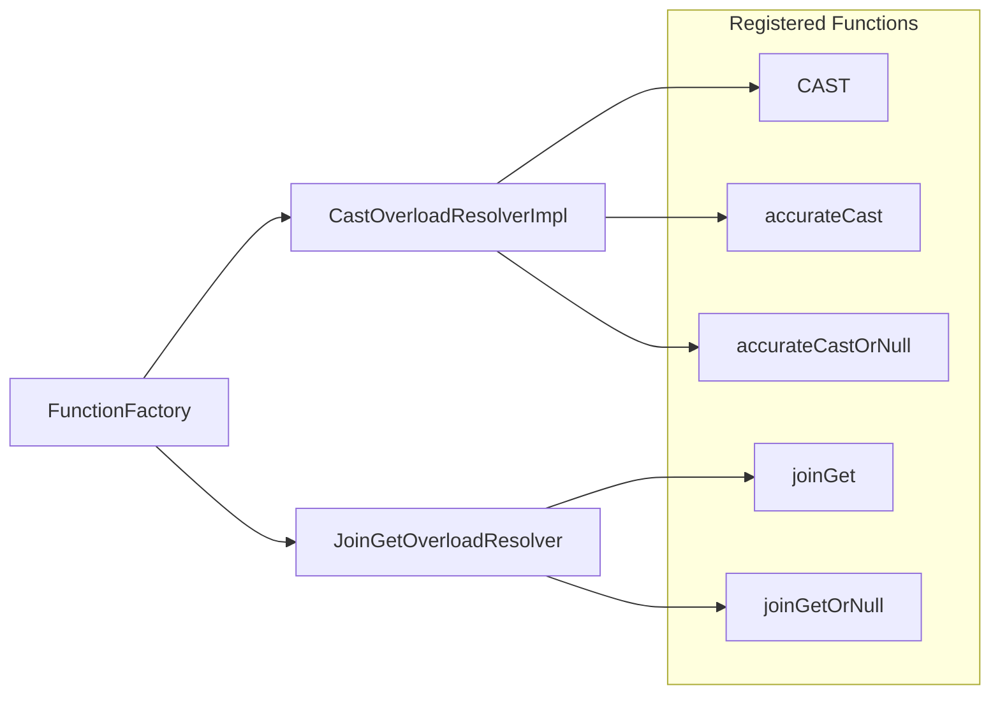
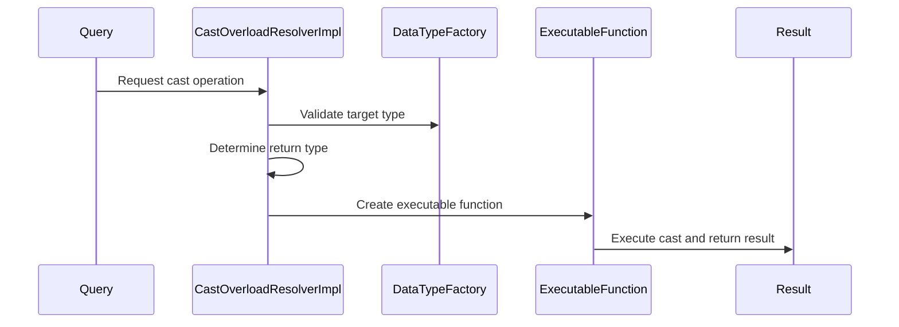
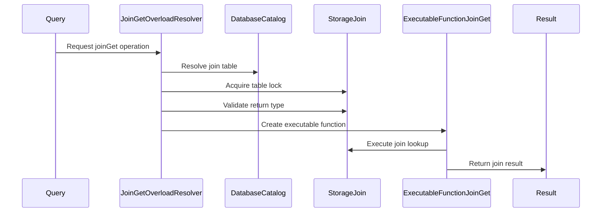

# Functions Module Documentation

## Overview

The Functions module is a core component of the database system that provides SQL function implementations and execution capabilities. It serves as the primary interface for function registration, resolution, and execution within the query processing pipeline. The module handles both built-in functions and user-defined functions, managing their lifecycle from parsing through execution.

## Architecture

## Core Components

### 1. CastOverloadResolverImpl

The `CastOverloadResolverImpl` class implements type casting functionality within the database system. It provides comprehensive type conversion capabilities with support for different casting behaviors:

- **Standard CAST**: Regular type conversion with nullability preservation based on settings
- **Accurate CAST**: Precise type conversion with error handling
- **Accurate CAST OR NULL**: Type conversion that returns NULL on conversion failure
- **Internal CAST**: System-level casting operations

**Key Features:**
- Handles nullable type conversions
- Supports various casting types (accurate, non-acurate, accurateOrNull)
- Integrates with system settings for nullability preservation
- Provides diagnostic information for debugging

**Dependencies:**
- [Data_Types](Data_Types.md) - For type validation and conversion
- [Core_Engine](Core_Engine.md) - For settings management
- [Interpreters](Interpreters.md) - For context and parsing utilities

**Detailed Documentation**: [Cast_Operations](Cast_Operations.md)

### 2. FunctionJoinGet System

The FunctionJoinGet system provides specialized functions for retrieving data from Join tables. For detailed documentation of each component, see [JoinGet_Operations](JoinGet_Operations.md).

#### FunctionJoinGet
- Implements the base functionality for joinGet operations
- Manages table locks and storage access
- Handles argument type validation and result type determination

#### JoinGetOverloadResolver
- Resolves function overloads for joinGet operations
- Validates arguments and determines appropriate function variants
- Supports both joinGet and joinGetOrNull variants

#### ExecutableFunctionJoinGet
- Executes the actual joinGet operations
- Interfaces with HashJoin for data retrieval
- Handles result column construction

#### HashJoin Integration
- Provides access to join table data
- Manages join key matching and result retrieval
- Supports null-safe operations

**Key Features:**
- Support for joinGet and joinGetOrNull functions
- Automatic table locking for consistency
- Integration with StorageJoin engine
- Support for multiple join keys

**Dependencies:**
- [Storage_Engine](Storage_Engine.md) - For StorageJoin access
- [Interpreters](Interpreters.md) - For HashJoin implementation
- [DatabaseCatalog](DatabaseCatalog.md) - For table resolution

## Function Registration

The module uses a factory pattern for function registration:

## Data Flow

### Cast Operation Flow

### JoinGet Operation Flow

## Integration Points

The Functions module integrates with several other system components:

1. **[Query_Planning](Query_Planning.md)**: Functions are integrated into query execution plans
2. **[Data_Types](Data_Types.md)**: Type system integration for function arguments and return types
3. **[Storage_Engine](Storage_Engine.md)**: Access to table data for functions like joinGet
4. **[Interpreters](Interpreters.md)**: Context management and expression evaluation
5. **[Core_Engine](Core_Engine.md)**: Settings and configuration management

## Error Handling

The module implements comprehensive error handling:

- **Type Validation**: Validates argument types before execution
- **Null Safety**: Handles nullable types appropriately
- **Resource Management**: Proper cleanup of table locks and resources
- **Diagnostic Information**: Provides detailed error messages for debugging

## Performance Considerations

- **Caching**: Function resolution results are cached where appropriate
- **Lazy Evaluation**: Supports lazy execution for performance optimization
- **Short Circuit**: Implements short-circuit evaluation for suitable functions
- **Lock Management**: Efficient table locking to minimize contention

## Future Extensions

The modular design allows for easy extension with:
- New casting types and behaviors
- Additional join-related functions
- Custom function implementations
- Performance optimizations for specific use cases