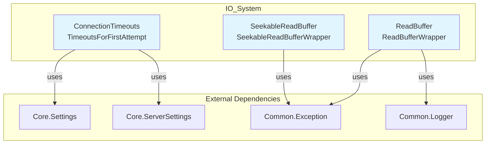
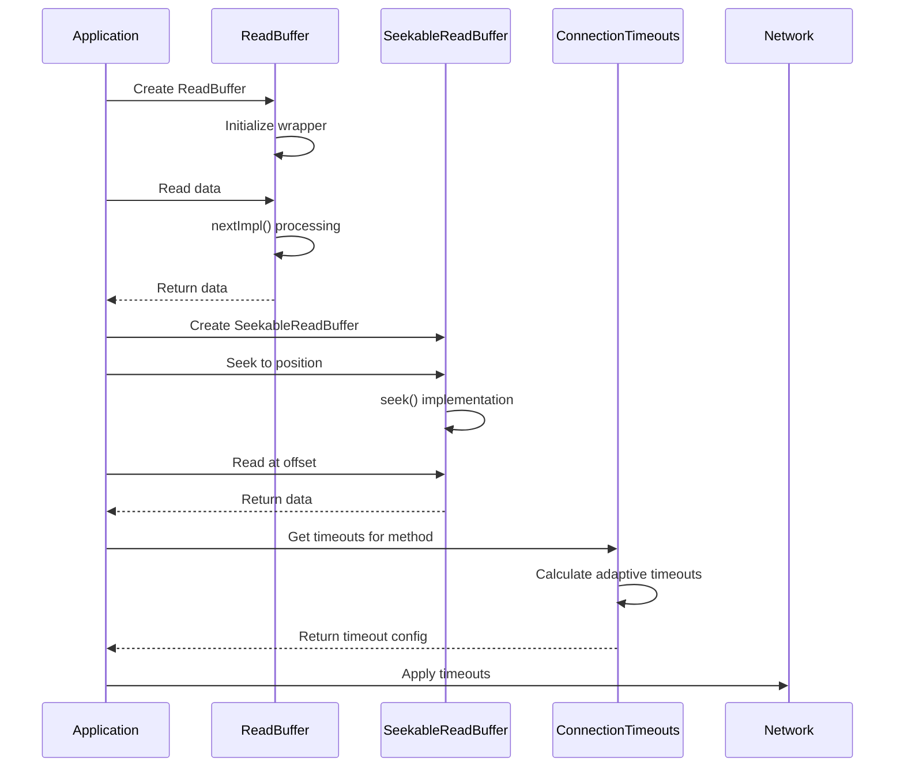

# IO_System Module Documentation

## Overview

The IO_System module provides the foundational input/output infrastructure for the database system. It handles all data reading operations, connection management, and timeout configurations for network communications. This module serves as the critical bridge between the database engine and external data sources, ensuring reliable and efficient data access.

## Architecture



## Core Components

### 1. ReadBuffer Infrastructure
The ReadBuffer system provides buffered reading capabilities with error handling and cancellation support. It includes wrapper functionality for both direct references and smart pointers.

**Key Features:**
- Buffered reading with automatic buffer management
- Exception handling and cancellation support
- Wrapper pattern for different buffer ownership models
- Strict reading with size validation

### 2. SeekableReadBuffer Extension
Extends the basic ReadBuffer functionality with seek operations, enabling random access to data streams.

**Key Features:**
- Position-based seeking within streams
- Big data reading at specific offsets
- Stream copying with progress callbacks
- Optional position retrieval with error handling

### 3. Connection Timeouts Management
Comprehensive timeout configuration system for network connections, supporting various protocols and adaptive timeout strategies.

**Key Features:**
- TCP and HTTP timeout configurations
- Adaptive timeouts based on HTTP methods
- First-attempt optimization for cloud storage
- Failover and non-failover scenarios

## Sub-modules

### [ReadBuffer Management](ReadBuffer_Management.md)
Handles all buffered reading operations with support for different data sources and error conditions.

**Core Components:**
- `ReadBufferWrapper`: Template-based wrapper for custom data handling
- Buffer management and position tracking
- Cancellation and exception handling

### [SeekableReadBuffer Operations](SeekableReadBuffer_Operations.md)
Provides random access capabilities for data streams that support seeking.

**Core Components:**
- `SeekableReadBufferWrapper`: Template wrapper with seek functionality
- Position tracking and buffer synchronization
- Stream copying with progress monitoring

### [Connection Timeouts Configuration](Connection_Timeouts_Configuration.md)
Manages network timeout settings for various connection types and scenarios.

**Core Components:**
- `TimeoutsForFirstAttempt`: Optimized timeouts for initial connection attempts
- Method-specific timeout configurations (GET, POST, DELETE, etc.)
- Adaptive timeout calculation based on connection history

## Data Flow



## Integration Points

The IO_System module integrates with several other system modules:

- **[Core_Engine](Core_Engine.md)**: Uses Settings and ServerSettings for timeout configuration
- **[Common_Utilities](Common_Utilities.md)**: Leverages exception handling and logging utilities
- **[Storage_Engine](Storage_Engine.md)**: Provides I/O capabilities for data storage operations
- **[Query_Pipeline](Query_Pipeline.md)**: Supports data reading during query execution

## Error Handling

The module implements comprehensive error handling:

- **EOF Detection**: Proper handling of end-of-file conditions
- **Read Validation**: Strict size validation for read operations
- **Exception Safety**: Automatic cancellation on exceptions
- **Network Errors**: Specific handling for connection timeouts and failures

## Performance Considerations

- **Buffer Management**: Efficient buffer reuse and memory management
- **Adaptive Timeouts**: Optimized timeout values for different scenarios
- **Wrapper Pattern**: Minimal overhead for buffer wrapping operations
- **Cancellation Support**: Early termination support for long-running operations

## Configuration

The module relies on system settings for configuration:

- Connection timeouts from Settings and ServerSettings
- HTTP-specific timeout configurations
- Method-specific adaptive timeout values
- Cloud storage optimization parameters

## Usage Examples

### Basic ReadBuffer Usage
```cpp
auto buffer = wrapReadBufferReference(source_buffer);
buffer->read(data, size);
```

### SeekableReadBuffer with Position
```cpp
auto seekable_buffer = wrapSeekableReadBufferReference(source);
seekable_buffer->seek(offset, SEEK_SET);
seekable_buffer->read(data, size);
```

### Connection Timeouts
```cpp
auto timeouts = ConnectionTimeouts::getHTTPTimeouts(settings, server_settings);
auto adaptive_timeouts = timeouts.getAdaptiveTimeouts("POST", true, true);
```