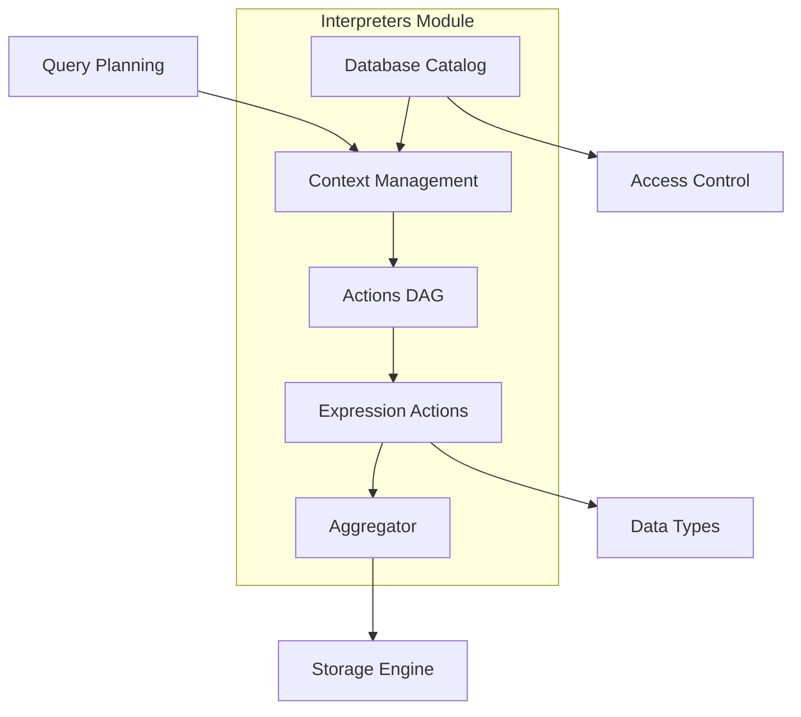
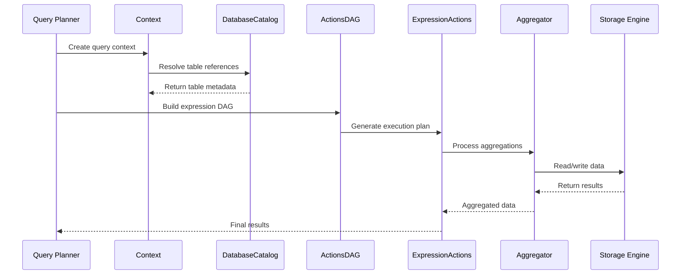

# Interpreters Module Documentation

## Overview

The Interpreters module is a core component of the ClickHouse database system that handles query execution, expression evaluation, and data processing operations. It serves as the bridge between the query planning phase and the actual execution of database operations.

## Purpose and Scope

The Interpreters module is responsible for:
- **Query Context Management**: Managing execution context, user sessions, and query lifecycle
- **Expression Evaluation**: Processing and executing expressions, functions, and calculations
- **Data Aggregation**: Handling GROUP BY operations and aggregate function execution
- **Database Catalog Management**: Managing database objects, tables, and metadata
- **Action Execution**: Processing data transformations and computations

## Architecture Overview

## Core Components

### 1. Context Management
Manages the execution environment for queries including:
- User authentication and authorization
- Session management
- Query settings and configuration
- Resource management and throttling
- Temporary data storage

**See:** [Context.md](Context.md) for detailed documentation

### 2. Database Catalog
Handles database metadata and object management:
- Database and table registration
- UUID mapping and resolution
- Dependency tracking between objects
- Table lifecycle management (creation, dropping, cleanup)

**See:** [DatabaseCatalog.md](DatabaseCatalog.md) for detailed documentation

### 3. Actions DAG
Implements a Directed Acyclic Graph for expression evaluation:
- Function and operator processing
- Column transformations
- Expression optimization and compilation
- Filter pushdown and predicate optimization

**See:** [ActionsDAG.md](ActionsDAG.md) for detailed documentation

### 4. Expression Actions
Executes expression evaluations and data transformations:
- Column-wise operations
- Function execution with lazy evaluation
- Short-circuit evaluation for conditional expressions
- Memory management for temporary columns

**See:** [ExpressionActions.md](ExpressionActions.md) for detailed documentation

### 5. Aggregator
Handles aggregation operations and GROUP BY processing:
- Hash table-based aggregation
- Two-level aggregation for large datasets
- External aggregation with disk spill
- Compiled aggregate function execution

**See:** [Aggregator.md](Aggregator.md) for detailed documentation

## Data Flow

## Key Features

### Performance Optimizations
- **Compiled Expressions**: JIT compilation of frequently used expressions
- **Lazy Evaluation**: Deferred execution of expressions when possible
- **Short-circuit Evaluation**: Early termination for conditional expressions
- **Two-level Aggregation**: Memory-efficient processing of large datasets
- **External Aggregation**: Disk-based processing for memory-constrained scenarios

### Memory Management
- **Arena-based Allocation**: Efficient memory allocation for temporary data
- **Reference Counting**: Automatic cleanup of shared resources
- **Memory Tracking**: Real-time monitoring of memory usage
- **Resource Limits**: Configurable limits on memory consumption

### Concurrency Support
- **Thread-safe Operations**: Concurrent execution of independent operations
- **Lock-free Data Structures**: Minimized contention in hot paths
- **Background Tasks**: Asynchronous cleanup and maintenance operations

## Integration with Other Modules

### Dependencies
- **Core Engine**: Provides fundamental data structures and utilities
- **Data Types**: Type system for column and expression handling
- **Storage Engine**: Data persistence and retrieval
- **Access Control**: Security and permission management
- **Query Planning**: Query optimization and execution planning

### Downstream Consumers
- **Query Pipeline**: Stream processing and result delivery
- **System Tables**: Monitoring and introspection capabilities
- **Background Processes**: Maintenance and cleanup operations

## Configuration and Settings

The Interpreters module supports various configuration options:
- Memory limits for aggregation operations
- Compilation thresholds for expression optimization
- Thread pool sizes for parallel execution
- Cache sizes for frequently used expressions

## Error Handling

The module implements comprehensive error handling:
- **Graceful Degradation**: Fallback to simpler execution strategies
- **Resource Exhaustion**: Proper cleanup on memory or disk space exhaustion
- **Concurrent Access**: Safe handling of race conditions
- **Data Corruption**: Detection and recovery from inconsistent states

## Monitoring and Observability

The module provides extensive monitoring capabilities:
- Performance metrics for expression evaluation
- Memory usage statistics
- Aggregation operation counters
- Query execution timelines

## Future Enhancements

Planned improvements include:
- Enhanced expression compilation capabilities
- Improved memory management strategies
- Better parallelization of aggregation operations
- Advanced query optimization techniques

## Related Documentation

- [Core Engine](Core_Engine.md) - Fundamental system components
- [Storage Engine](Storage_Engine.md) - Data storage and retrieval
- [Query Planning](Query_Planning.md) - Query optimization and planning
- [Data Types](Data_Types.md) - Type system and serialization