# MergeTree_Reading Module Documentation

## Introduction

The MergeTree_Reading module is a critical component of the ClickHouse query execution engine, responsible for reading data from MergeTree tables. It implements sophisticated algorithms for efficient data retrieval, including parallel reading, index utilization, and various optimization strategies. This module serves as the bridge between the query planning phase and actual data access, orchestrating how data is read from disk and processed through the query pipeline.

## Core Architecture

### Primary Components

The module centers around the `ReadFromMergeTree` class, which implements the `IQueryPlanStep` interface. This class coordinates the entire reading process, from analyzing which parts and ranges to read, to creating the actual data processing pipeline.

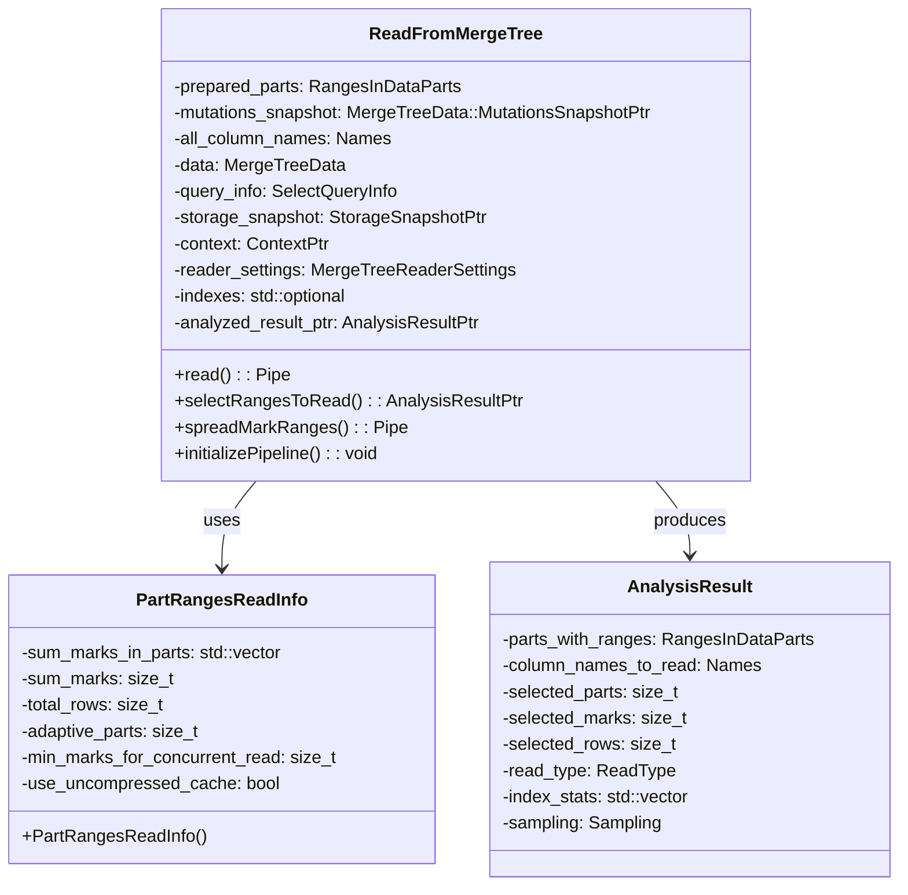

### Reading Strategies

The module implements multiple reading strategies optimized for different scenarios:

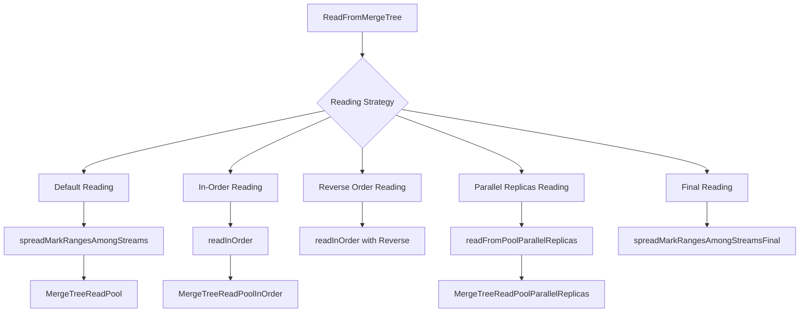

## Data Flow Architecture

### Query Processing Pipeline

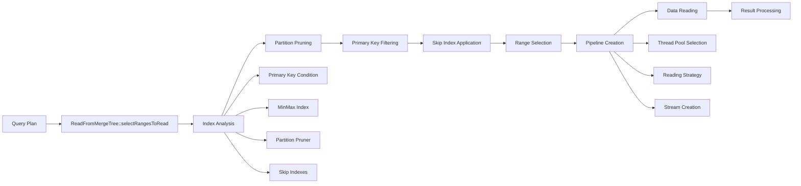

### Index Utilization Flow

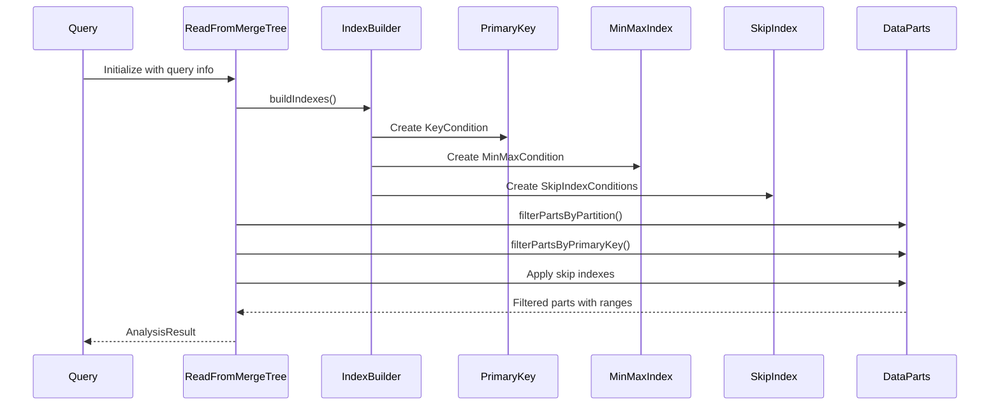

## Key Components and Dependencies

### External Dependencies

The MergeTree_Reading module integrates with several other system modules:

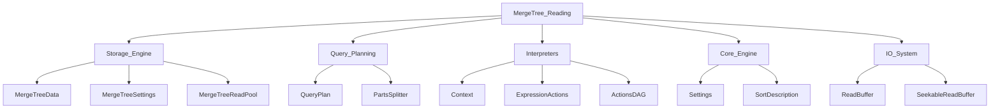

### Internal Component Relationships

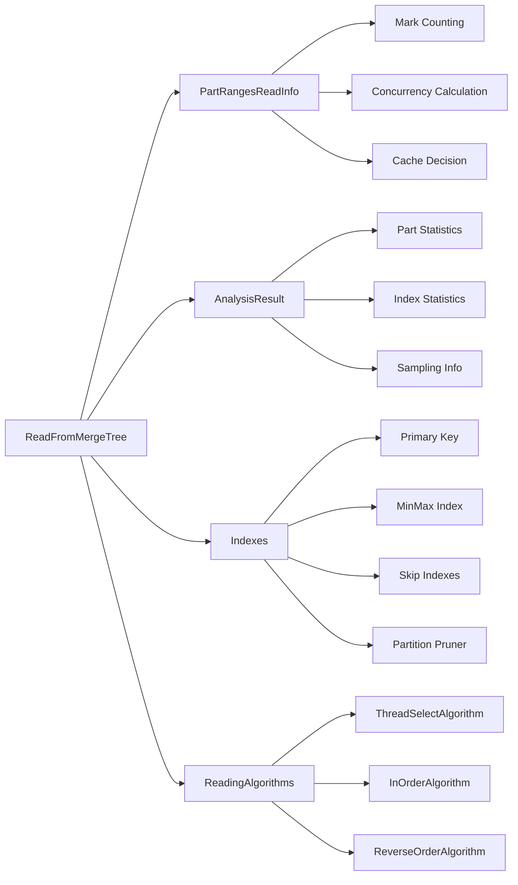

## Reading Process Flow

### Main Reading Algorithm

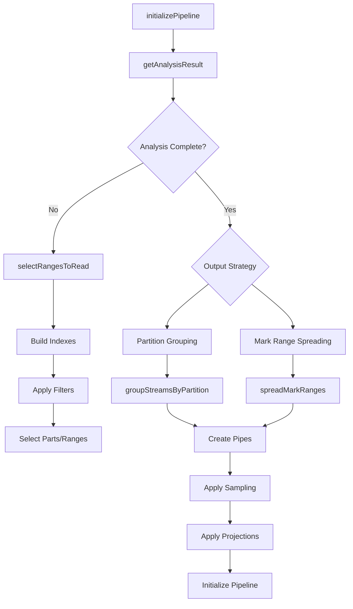

### Range Selection Process

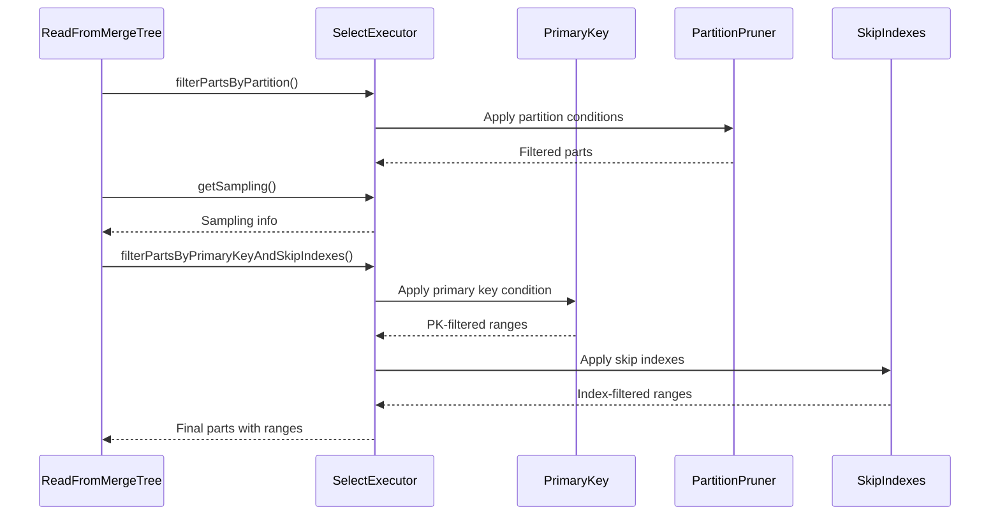

## Optimization Strategies

### Parallel Reading Optimization

The module implements several parallel reading strategies based on data characteristics:

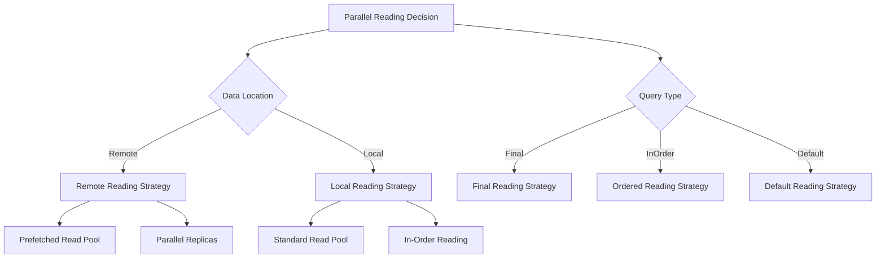

### Index Optimization

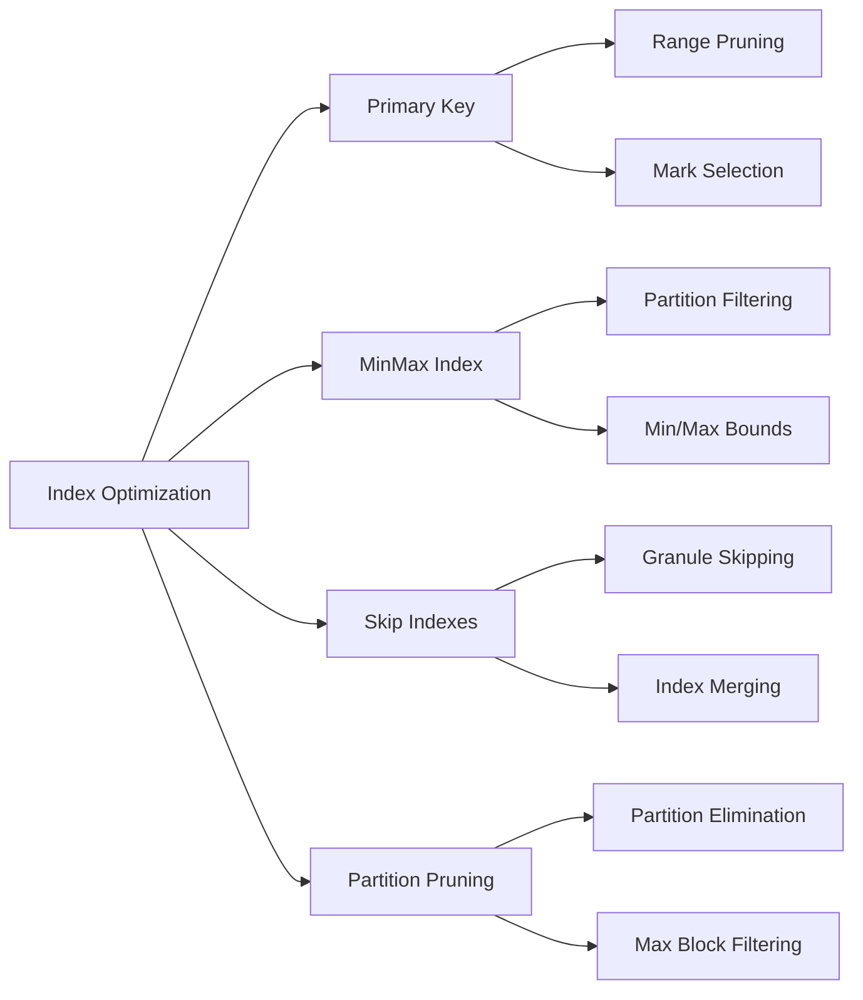

## Configuration and Settings

### Key Settings Integration

The module integrates with multiple setting categories from the Core_Engine module:

- **Reading Settings**: `max_streams_for_merge_tree_reading`, `merge_tree_min_rows_for_concurrent_read`
- **Cache Settings**: `use_uncompressed_cache`, `merge_tree_max_rows_to_use_cache`
- **Index Settings**: `use_skip_indexes`, `force_primary_key`
- **Parallel Settings**: `max_parallel_replicas`, `parallel_replicas_local_plan`

### Performance Tuning

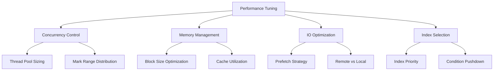

## Error Handling and Monitoring

### Statistics Collection

The module provides comprehensive statistics for monitoring and debugging:

- **Part Selection**: Number of parts selected at each filtering stage
- **Index Usage**: Which indexes were applied and their effectiveness
- **Performance Metrics**: Marks read, rows selected, cache hit rates
- **Resource Usage**: Memory consumption, thread utilization

### Error Scenarios

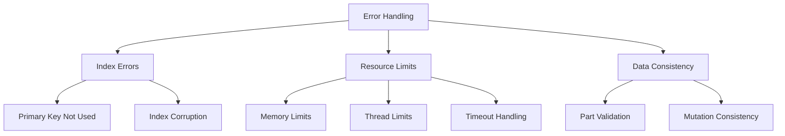

## Integration Points

### Query Plan Integration

The module integrates with the Query_Planning module through:

- **Step Interface**: Implements `IQueryPlanStep` for pipeline integration
- **Cost Estimation**: Provides cardinality and cost estimates
- **Parallel Execution**: Coordinates with parallel query execution

### Storage Layer Integration

Integration with the Storage_Engine module includes:

- **Data Part Access**: Through `MergeTreeData` interface
- **Metadata Management**: Using `StorageMetadataPtr`
- **Mutation Handling**: Via `MutationsSnapshotPtr`

## Performance Characteristics

### Scalability Patterns

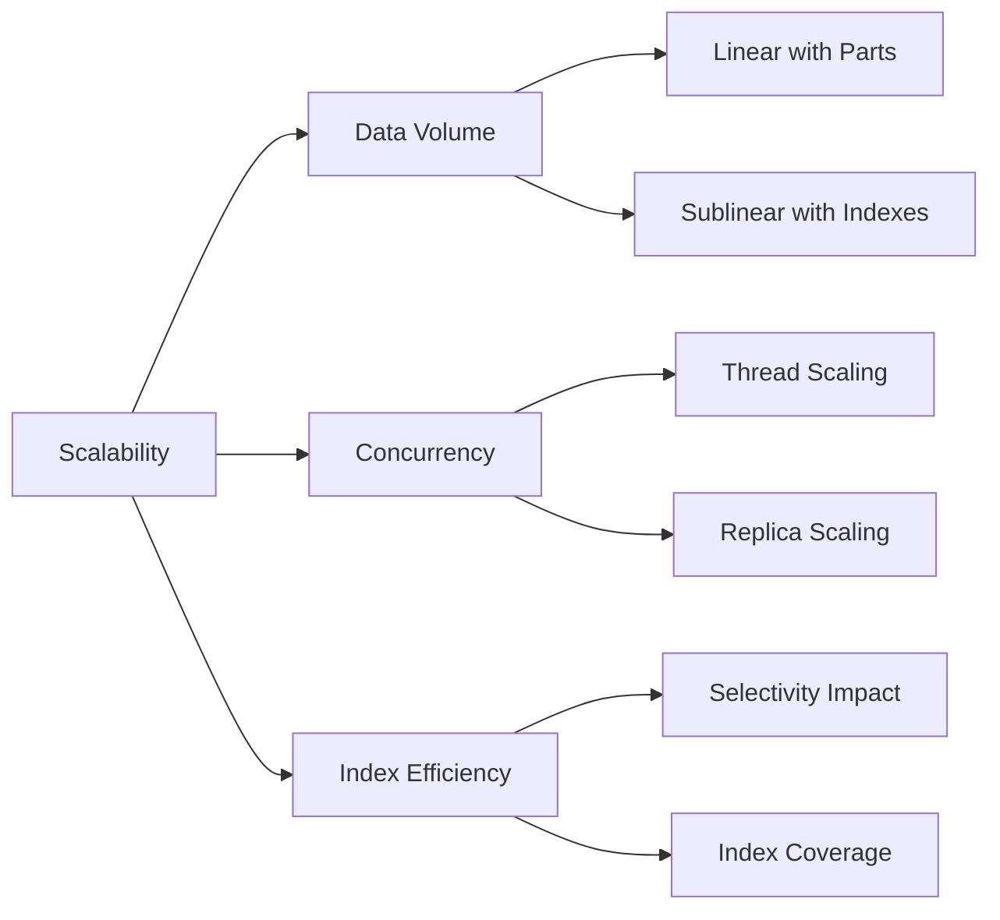

### Optimization Triggers

The module automatically applies optimizations based on:

- **Query Characteristics**: FINAL, ORDER BY, WHERE conditions
- **Data Distribution**: Part sizes, partition distribution
- **System Resources**: Available memory, CPU cores
- **Storage Type**: Local vs remote filesystem characteristics

## References

- [Storage_Engine Module](Storage_Engine.md) - For MergeTree data storage details
- [Query_Planning Module](Query_Planning.md) - For query plan integration
- [Core_Engine Module](Core_Engine.md) - For settings and configuration
- [Interpreters Module](Interpreters.md) - For context and expression handling