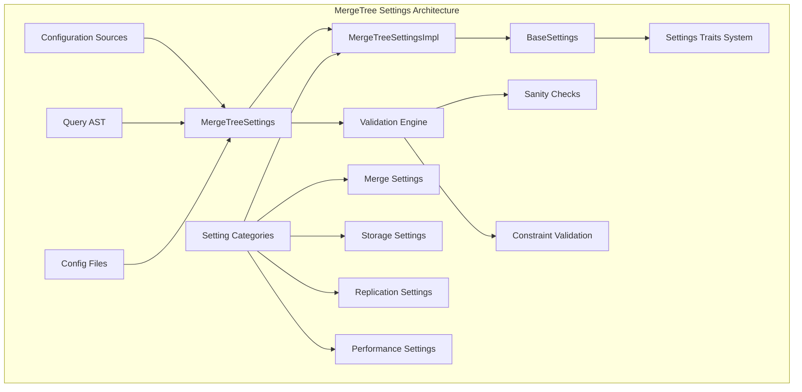
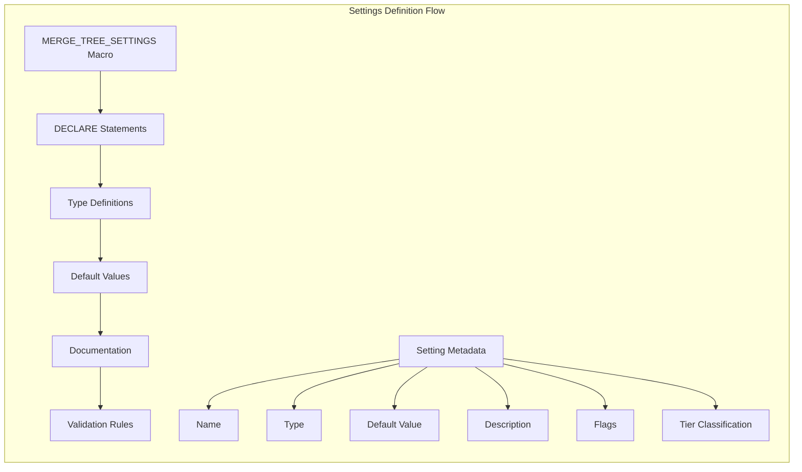
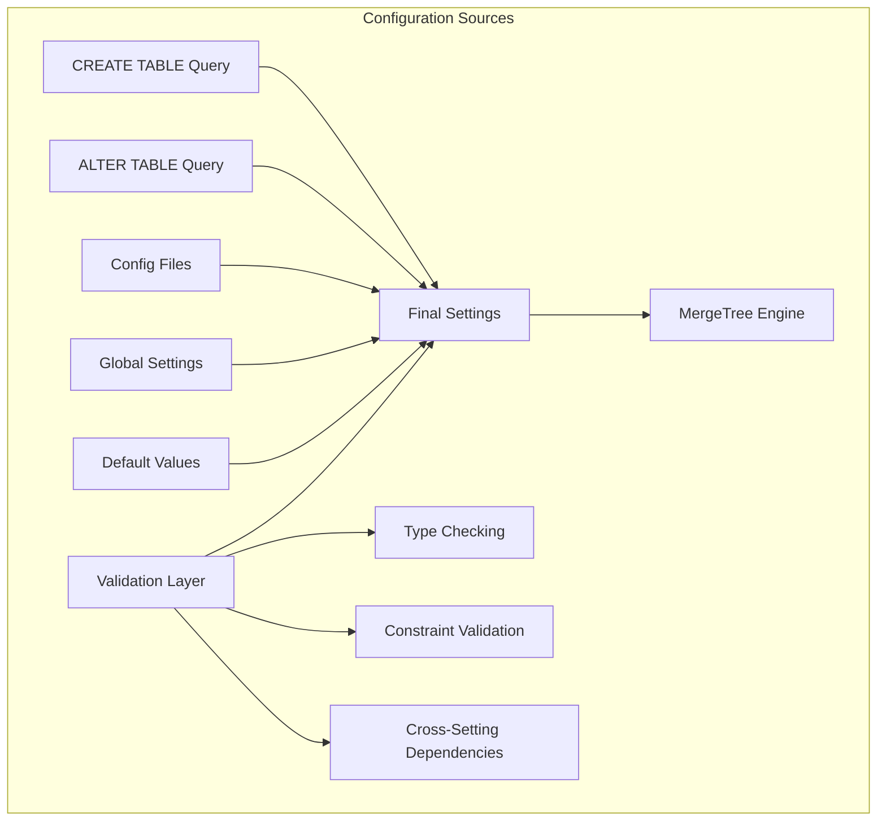
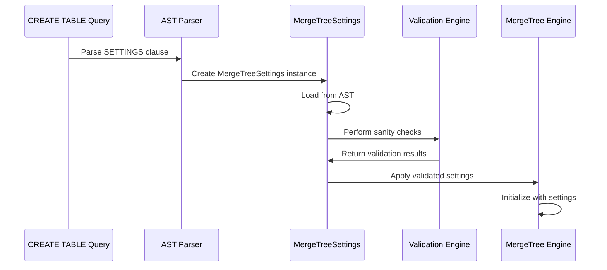
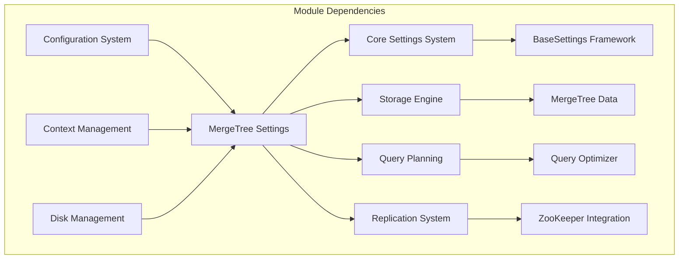

# MergeTree Settings Module Documentation

## Introduction

The MergeTree Settings module is a critical component of the ClickHouse database system that manages configuration parameters for MergeTree table engines. MergeTree is the primary table engine family in ClickHouse, designed for high-performance analytical workloads with features like data partitioning, indexing, and background merge operations.

This module provides a comprehensive settings management system that controls various aspects of MergeTree behavior, including merge strategies, compression settings, replication parameters, performance tuning, and storage optimization. The settings can be configured at table creation time, modified for existing tables, or set globally through configuration files.

## Architecture Overview

The MergeTree Settings module follows a hierarchical architecture with clear separation of concerns:



## Core Components

### MergeTreeSettingsImpl

The `MergeTreeSettingsImpl` class is the core implementation that inherits from `BaseSettings<MergeTreeSettingsTraits>`. It manages all MergeTree-specific settings through a macro-driven system that defines over 200 individual settings parameters.

**Key Features:**
- Settings definition through macro system for maintainability
- Type-safe setting access and modification
- Support for different setting tiers (stable, experimental, beta, obsolete)
- Validation and constraint checking
- Compatibility management across ClickHouse versions

**Settings Categories:**

1. **Data Storage Format Settings**
   - `min_bytes_for_wide_part`: Controls when data parts switch to wide format
   - `min_rows_for_wide_part`: Row-based threshold for wide format
   - `ratio_of_defaults_for_sparse_serialization`: Enables sparse serialization for columns with many default values
   - `object_serialization_version`: Version control for JSON data type serialization

2. **Merge Strategy Settings**
   - `merge_max_block_size`: Controls memory usage during merges
   - `max_bytes_to_merge_at_max_space_in_pool`: Maximum merge size with available resources
   - `merge_selector_algorithm`: Algorithm selection for merge operations
   - `enable_vertical_merge_algorithm`: Enables vertical merge optimization

3. **Replication Settings**
   - `replicated_deduplication_window`: Controls insert deduplication
   - `max_replicated_merges_in_queue`: Limits concurrent replication operations
   - `prefer_fetch_merged_part_time_threshold`: Optimizes long merge operations

4. **Performance Tuning Settings**
   - `index_granularity`: Primary key index density
   - `parts_to_delay_insert`: Insert throttling thresholds
   - `background_task_preferred_step_execution_time_ms`: Background task timing

### Settings Definition System

The module uses a sophisticated macro system to define settings:



Each setting is defined with:
- **Name**: Unique identifier for the setting
- **Type**: Strong type (UInt64, Bool, String, Float, etc.)
- **Default Value**: Initial value when not explicitly set
- **Description**: Comprehensive documentation with examples
- **Flags**: Control behavior and visibility
- **Tier**: Classification (stable, experimental, beta, obsolete)

### Configuration Management

The module supports multiple configuration sources with specific precedence:



**Configuration Sources:**
1. **Table-level settings**: Specified in CREATE/ALTER TABLE statements
2. **Global configuration**: From config.xml and users.xml
3. **Default values**: Hard-coded defaults defined in the macro system
4. **Compatibility settings**: Version-specific overrides

## Data Flow and Processing

### Settings Loading Process



### Settings Validation

The module implements comprehensive validation through the `sanityCheck()` method:

1. **Background Pool Validation**: Ensures settings don't exceed available background threads
2. **Index Granularity Checks**: Validates index settings for consistency
3. **Storage Policy Validation**: Conflicts between disk and storage_policy settings
4. **Experimental Feature Control**: Enforces tier-based feature access
5. **Cross-Setting Dependencies**: Validates relationships between related settings

## Integration with Other Modules

### Dependencies

The MergeTree Settings module integrates with several other system components:



**Key Dependencies:**
- **Core.Settings**: Inherits from BaseSettings framework for type safety and validation
- **Storage_Engine**: Provides settings to MergeTree table engines
- **Query_Planning**: Influences query execution strategies through performance settings
- **Interpreters.Context**: Accesses global configuration and context information

### Related Modules

- **[Storage_Engine](Storage_Engine.md)**: Parent module containing MergeTree table implementations
- **[Core_Engine](Core_Engine.md)**: Provides base settings infrastructure
- **[Query_Planning](Query_Planning.md)**: Uses settings for optimization decisions
- **[Interpreters](Interpreters.md)**: Context and query execution integration

## Key Features and Capabilities

### Advanced Setting Types

The module supports sophisticated setting types beyond basic primitives:

1. **Enumeration Types**: `MergeSelectorAlgorithm`, `MergeTreeObjectSerializationVersion`
2. **Custom Types**: `NonZeroUInt64` for validated numeric ranges
3. **Time Durations**: `Seconds`, `Milliseconds` with automatic unit handling
4. **String-based Enums**: Version strings with validation

### Dynamic Configuration

Settings can be modified at different levels:

- **Table Creation**: Permanent settings in CREATE TABLE
- **Runtime Modification**: Some settings via ALTER TABLE
- **Session Override**: Query-level setting overrides
- **Global Defaults**: Server-wide configuration

### Performance Optimization

The module includes numerous performance-oriented settings:

- **Merge Optimization**: Controls merge algorithm selection and resource usage
- **Memory Management**: Settings for buffer sizes and caching strategies
- **I/O Optimization**: Direct I/O thresholds and prefetch settings
- **Network Optimization**: Replication bandwidth controls

### Cloud-Specific Features

Many settings are designed specifically for ClickHouse Cloud:

- **Shared Merge Tree**: Settings for distributed merge coordination
- **Storage Optimization**: Cloud-specific storage format controls
- **Resource Management**: Multi-tenant resource sharing settings
- **Coordination**: Leader election and distributed decision making

## Usage Examples

### Basic Table Creation

```sql
CREATE TABLE example_table (
    id UInt64,
    timestamp DateTime,
    data String
) ENGINE = MergeTree()
ORDER BY (timestamp, id)
SETTINGS 
    index_granularity = 8192,
    min_bytes_for_wide_part = 10485760,
    compress_marks = true;
```

### Advanced Configuration

```sql
CREATE TABLE optimized_table (
    id UInt64,
    timestamp DateTime,
    data String
) ENGINE = MergeTree()
ORDER BY timestamp
SETTINGS 
    index_granularity = 4096,
    index_granularity_bytes = 10485760,
    merge_max_block_size = 16384,
    max_bytes_to_merge_at_max_space_in_pool = 107374182400,
    enable_vertical_merge_algorithm = 1,
    vertical_merge_algorithm_min_rows_to_activate = 131072,
    ratio_of_defaults_for_sparse_serialization = 0.9,
    compress_primary_key = true,
    marks_compression_codec = 'ZSTD(3)';
```

### Runtime Modification

```sql
-- Modify existing table settings
ALTER TABLE example_table 
MODIFY SETTING 
    merge_max_block_size = 8192,
    parts_to_delay_insert = 500;
```

## Best Practices

### Setting Selection Guidelines

1. **Index Granularity**: Balance between query performance and memory usage
   - Smaller values (1024-4096): Better for point lookups, higher memory usage
   - Larger values (8192-32768): Better for analytical queries, lower memory usage

2. **Merge Settings**: Configure based on data volume and hardware resources
   - High-volume systems: Increase `max_bytes_to_merge_at_max_space_in_pool`
   - Memory-constrained systems: Decrease `merge_max_block_size`

3. **Compression Settings**: Enable for I/O-bound workloads
   - `compress_marks`: Recommended for most deployments
   - `compress_primary_key`: Beneficial for large primary keys

### Performance Tuning

1. **Background Operations**: Monitor and adjust based on system load
   - `merge_selecting_sleep_ms`: Balance between merge responsiveness and CPU usage
   - `background_task_preferred_step_execution_time_ms`: Control task granularity

2. **Memory Management**: Configure based on available system memory
   - `merge_max_block_size`: Primary control for merge memory usage
   - `max_merge_delayed_streams_for_parallel_write`: Parallel write optimization

3. **Storage Optimization**: Choose appropriate settings for storage type
   - Local storage: Focus on merge efficiency
   - Remote storage: Enable prefetching and caching

### Monitoring and Maintenance

1. **Setting Validation**: Regular sanity checks through system tables
   ```sql
   SELECT * FROM system.merge_tree_settings 
   WHERE changed = 1;
   ```

2. **Performance Monitoring**: Track setting impact on system metrics
   - Merge performance: `system.merges` table
   - Part counts: `system.parts` table
   - Query performance: `system.query_log` table

## Migration and Compatibility

### Version Compatibility

The module maintains backward compatibility through:

1. **Obsolete Settings**: Preserved for compatibility but non-functional
2. **Version-specific Defaults**: Different defaults for different ClickHouse versions
3. **Compatibility Mode**: Settings to enable legacy behavior
4. **Migration Helpers**: Functions to assist with setting migration

### Cloud Migration

Special considerations for ClickHouse Cloud:

1. **Shared Merge Tree**: Different setting requirements
2. **Resource Limits**: Cloud-specific constraints
3. **Multi-tenancy**: Settings affecting resource sharing
4. **Distributed Operations**: Coordination-related settings

## Troubleshooting

### Common Issues

1. **Setting Validation Errors**: Check `sanityCheck()` constraints
2. **Performance Issues**: Review merge and memory-related settings
3. **Storage Problems**: Verify disk and storage policy settings
4. **Replication Issues**: Check replication-specific settings

### Diagnostic Tools

1. **System Tables**: 
   - `system.merge_tree_settings`: Current setting values
   - `system.parts`: Part information and statistics
   - `system.merges`: Merge operation details

2. **Log Analysis**: Enable appropriate logging levels for troubleshooting
3. **Metrics Monitoring**: Use ClickHouse metrics for performance analysis

## Future Developments

The MergeTree Settings module continues to evolve with:

1. **New Setting Categories**: Support for emerging features
2. **Enhanced Validation**: More sophisticated constraint checking
3. **Dynamic Reconfiguration**: Runtime setting modification capabilities
4. **Cloud Integration**: Enhanced cloud-specific settings
5. **Machine Learning**: AI-assisted setting optimization

## Conclusion

The MergeTree Settings module is a sophisticated configuration management system that provides fine-grained control over ClickHouse's primary table engine. Through its comprehensive setting definitions, robust validation system, and integration with the broader ClickHouse ecosystem, it enables users to optimize their deployments for specific workloads, hardware configurations, and operational requirements. Understanding and properly configuring these settings is essential for achieving optimal performance, reliability, and efficiency in ClickHouse deployments.