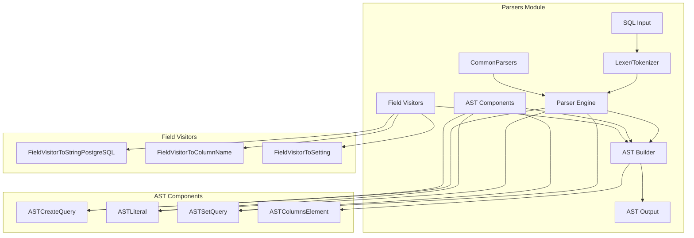
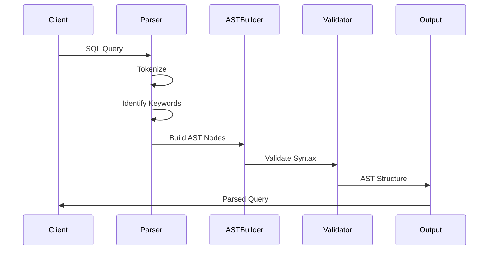

# Parsers Module Documentation

## Overview

The Parsers module is a fundamental component of the ClickHouse database system responsible for parsing SQL queries and converting them into Abstract Syntax Trees (AST). This module handles the lexical analysis, syntactic analysis, and initial semantic processing of SQL statements, serving as the entry point for query processing in the database system.

## Purpose and Core Functionality

The Parsers module serves several critical functions:

1. **SQL Query Parsing**: Converts raw SQL text into structured AST representations
2. **Lexical Analysis**: Tokenizes SQL input and identifies keywords, identifiers, literals, and operators
3. **Syntactic Analysis**: Validates SQL syntax according to ClickHouse grammar rules
4. **AST Construction**: Builds hierarchical AST nodes representing query structure
5. **Query Validation**: Performs initial validation of query components

## Architecture Overview

## Core Components

### 1. ASTCreateQuery Components
Handles parsing and representation of CREATE queries including tables, views, and databases.

**Key Features:**
- Support for multiple CREATE statement types (TABLE, VIEW, DATABASE, DICTIONARY)
- Column definition parsing with constraints and indices
- Storage engine specification handling
- SQL security and access control parsing

**Core Classes:**
- `ASTColumnsElement`: Represents individual column elements in CREATE statements
- `ASTStorage`: Handles storage engine specifications and settings
- `ASTCreateQuery`: Main class for CREATE query AST representation

### 2. ASTLiteral Components
Manages parsing and formatting of literal values in SQL queries.

**Key Features:**
- Multi-format literal support (PostgreSQL compatibility)
- Column name generation for complex literals
- Hash-based optimization for large arrays/tuples
- Type-specific formatting rules

**Core Classes:**
- `FieldVisitorToStringPostgreSQL`: PostgreSQL-compatible string formatting
- `FieldVisitorToColumnName`: Column name generation for literals

### 3. ASTSetQuery Components
Handles SET statement parsing and settings management.

**Key Features:**
- Settings change management
- Secret value handling and masking
- Engine-specific setting validation
- Query parameter support

**Core Classes:**
- `FieldVisitorToSetting`: Settings value formatting and validation

### 4. CommonParsers Components
Provides shared parsing utilities and keyword management.

**Key Features:**
- Keyword recognition and validation
- Parser utility functions
- Common parsing patterns

**Core Classes:**
- `KeyWordToStringConverter`: Keyword-to-string conversion utility

## Data Flow

## Integration with Other Modules

The Parsers module integrates closely with several other system modules:

- **[Interpreters](Interpreters.md)**: Provides parsed AST for query execution planning
- **[Analyzer](Analyzer.md)**: Receives AST for semantic analysis and optimization
- **[Core Engine](Core_Engine.md)**: Uses parser for DDL statement processing
- **[Data Types](Data_Types.md)**: Collaborates on literal type parsing and validation

## Key Design Patterns

### 1. Visitor Pattern
The module extensively uses the visitor pattern for AST traversal and field processing:
- `FieldVisitorToString` for string representation
- `FieldVisitorToColumnName` for column name generation
- `FieldVisitorToSetting` for settings formatting

### 2. Factory Pattern
AST node creation follows factory patterns for extensibility and maintainability.

### 3. Template-Based Design
Heavy use of templates for type-safe AST construction and visitor implementations.

## Performance Considerations

1. **Hash-Based Optimization**: Large arrays and tuples use hash-based column names to avoid excessive string lengths
2. **Lazy Evaluation**: AST construction is optimized for minimal memory usage
3. **Caching**: Common parsing patterns are cached for improved performance
4. **Streaming Parsing**: Support for parsing large queries in chunks

## Security Features

1. **Secret Masking**: Automatic detection and masking of sensitive settings
2. **SQL Injection Prevention**: Robust input validation and sanitization
3. **Access Control Integration**: Parser respects user permissions and access levels

## Error Handling

The module implements comprehensive error handling:
- Syntax error detection with detailed error messages
- Position tracking for error reporting
- Recovery mechanisms for partial parsing failures
- Validation of engine-specific settings

## Sub-modules

For detailed information about specific parser components, refer to:

- [AST_Create_Query](AST_Create_Query.md) - CREATE statement parsing including table, view, and database creation with column definitions and storage specifications
- [AST_Literal](AST_Literal.md) - Literal value handling with PostgreSQL compatibility and optimized column name generation for complex data types
- [AST_Set_Query](AST_Set_Query.md) - SET statement processing with security features for sensitive settings and engine-specific validations
- [Common_Parsers](Common_Parsers.md) - Shared parsing utilities including keyword management and common parsing patterns

## Future Enhancements

1. **Extended SQL Support**: Continued expansion of SQL standard compliance
2. **Performance Optimization**: Further optimization of parsing algorithms
3. **Error Recovery**: Enhanced error recovery mechanisms
4. **Plugin Architecture**: Support for custom parser extensions