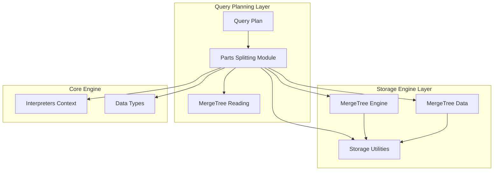
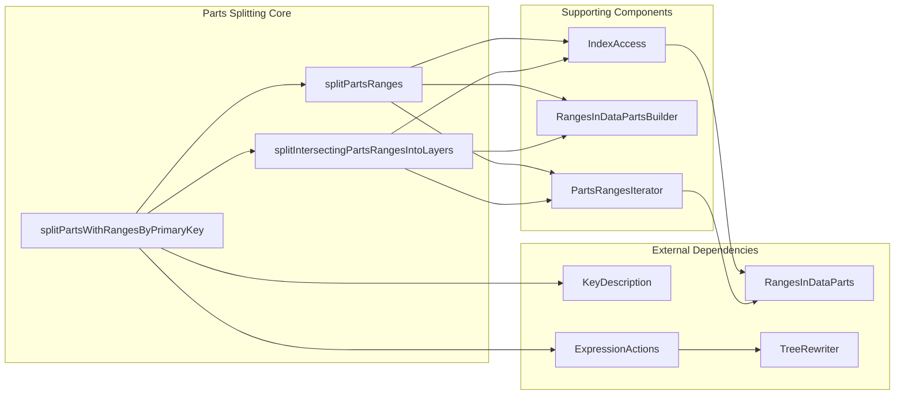
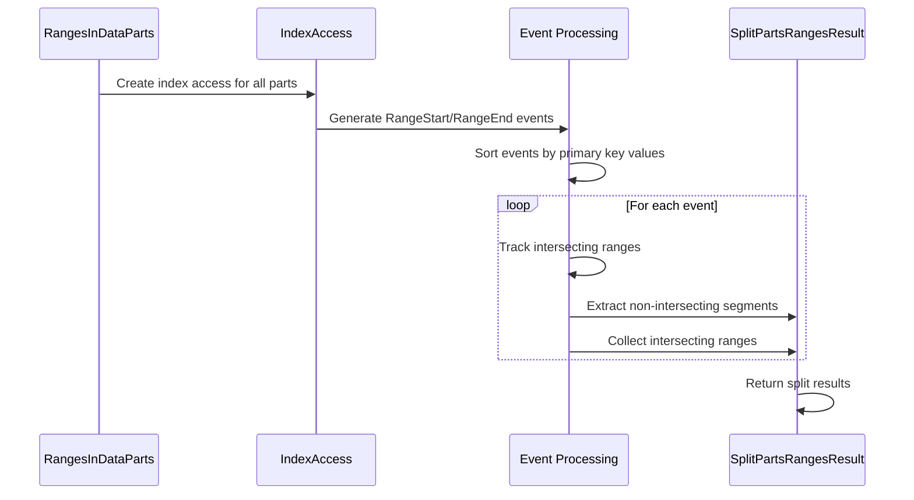
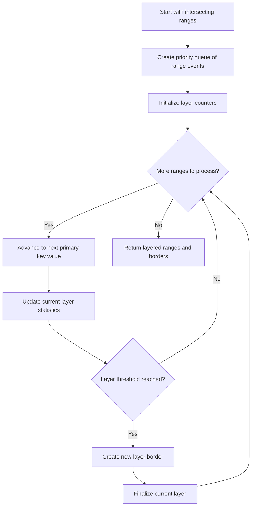
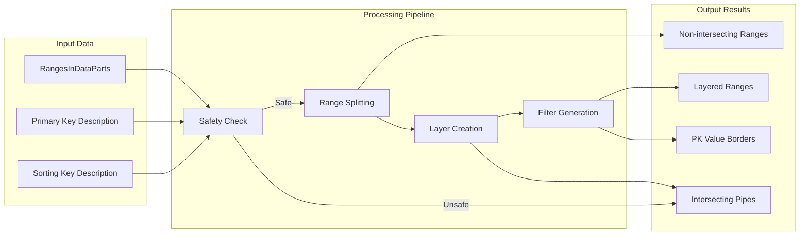

# Parts Splitting Module Documentation

## Introduction

The Parts Splitting module is a critical component of the Query Planning system in ClickHouse, responsible for optimizing query execution by intelligently partitioning and organizing data parts based on primary key ranges. This module enables efficient parallel processing and minimizes data overlap during query execution, significantly improving performance for large-scale analytical workloads.

## Module Overview

The Parts Splitting module operates at the intersection of query planning and storage engine layers, providing sophisticated algorithms to:
- Split intersecting part ranges into non-overlapping segments
- Organize parts into layers for parallel processing
- Optimize primary key range filtering
- Handle complex data types and sorting scenarios

## Core Components

### SplitPartsRangesResult
**Location**: `src.Processors.QueryPlan.PartsSplitter.SplitPartsRangesResult`

A result structure that contains the output of part range splitting operations:
- `non_intersecting_parts_ranges`: Ranges that don't overlap with other ranges
- `intersecting_parts_ranges`: Ranges that overlap with other ranges and require special handling

### PartRangeIndexHash
**Location**: `src.Processors.QueryPlan.PartsSplitter.PartRangeIndexHash`

A hash function implementation for `PartRangeIndex` objects, enabling efficient storage and lookup in unordered containers. Uses boost::hash_combine for robust hashing of part indices and range boundaries.

## Architecture

### High-Level Architecture



### Component Interaction Diagram



## Key Algorithms

### 1. Parts Range Splitting Algorithm

The core algorithm splits intersecting part ranges into non-intersecting and intersecting segments:



### 2. Layer-based Splitting Algorithm

Organizes intersecting ranges into layers for parallel processing:



## Data Flow

### Primary Data Flow



## Key Functions

### splitPartsWithRangesByPrimaryKey
Main entry point for parts splitting operations. Coordinates the entire splitting process including safety checks, range splitting, and layer creation.

### splitPartsRanges
Implements the core algorithm for splitting intersecting ranges into non-intersecting and intersecting segments.

### splitIntersectingPartsRangesIntoLayers
Organizes intersecting ranges into layers for parallel processing, with configurable maximum layers and row distribution.

### buildFilters
Generates AST filters for each layer based on primary key value borders, enabling efficient range-based filtering during query execution.

## Safety and Validation

### Primary Key Safety Checks

The module implements comprehensive safety checks for primary key types:

```cpp
bool isSafePrimaryDataKeyType(const IDataType & data_type)
{
    // Rejects unsafe types: Float32, Float64, Nullable, Array, etc.
    // Ensures deterministic comparison behavior
}
```

### Type Safety Considerations

- **Floating Point Types**: Rejected due to NaN comparison issues
- **Nullable Types**: Require special null-handling logic
- **Complex Containers**: Arrays, Maps, Tuples need recursive validation
- **Low Cardinality**: Requires dictionary type validation

## Integration with Other Modules

### Query Planning Integration
- **MergeTree Reading**: Provides optimized part ranges for reading operations
- **Query Plan Core**: Integrates with overall query execution planning
- **Query Plan Serialization**: Supports serialization of splitting results

### Storage Engine Integration
- **MergeTree Engine**: Works directly with MergeTree data parts
- **MergeTree Data**: Utilizes partition statistics and removal ranges
- **Storage Utilities**: Leverages part movement and size comparison utilities

### Core Engine Dependencies
- **Interpreters Context**: Accesses query context and settings
- **Data Types**: Validates primary key data type safety
- **Expression Actions**: Builds filtering expressions

## Performance Optimizations

### 1. Index-based Processing
Utilizes primary key indices for efficient range boundary determination without full data scans.

### 2. Event-driven Architecture
Processes ranges as sorted events, enabling linear-time complexity for range splitting operations.

### 3. Layer-based Parallelization
Organizes intersecting ranges into layers that can be processed in parallel, maximizing resource utilization.

### 4. Adaptive Thresholds
Dynamically adjusts layer boundaries based on row counts and intersection ratios to optimize performance.

## Error Handling

### Logical Error Detection
- Validates unique range assumptions
- Ensures proper event ordering
- Checks for invalid range boundaries

### Graceful Degradation
When primary keys are not safe for splitting, falls back to processing all ranges without optimization.

## Configuration Parameters

- `max_layers`: Maximum number of layers for intersecting range processing
- `max_columns_in_index`: Limit on primary key columns to consider
- `min_number_of_marks_for_non_intersecting_range`: Threshold for creating non-intersecting segments
- `split_parts_ranges_into_intersecting_and_non_intersecting_final`: Enable range splitting optimization
- `split_intersecting_parts_ranges_into_layers`: Enable layer-based processing

## References

- [Query_Planning.md](Query_Planning.md) - Parent module documentation
- [MergeTree_Engine.md](MergeTree_Engine.md) - Storage engine integration
- [Interpreters.md](Interpreters.md) - Expression processing and context management
- [Data_Types.md](Data_Types.md) - Data type validation and handling
- [Core_Engine.md](Core_Engine.md) - Core system settings and utilities