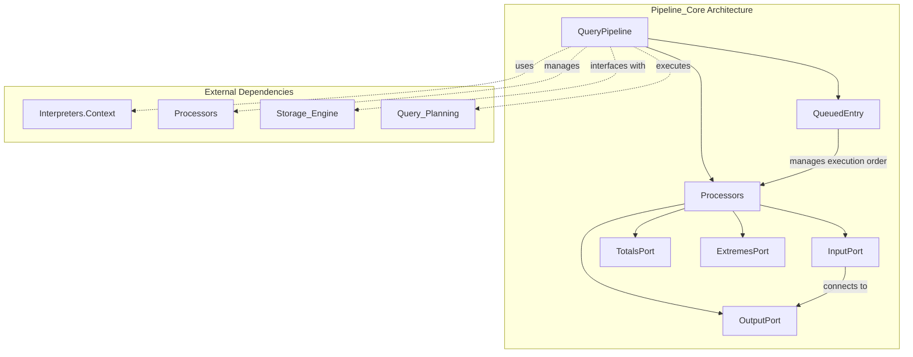
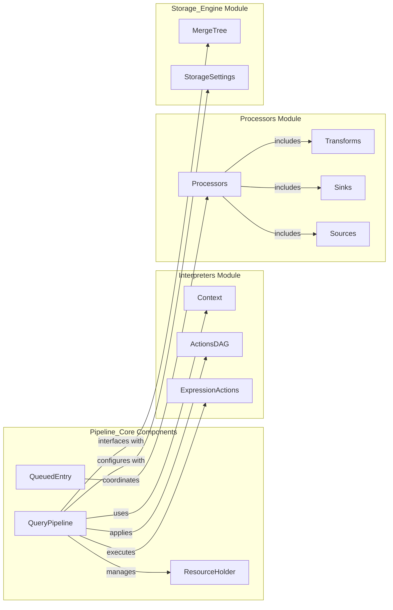
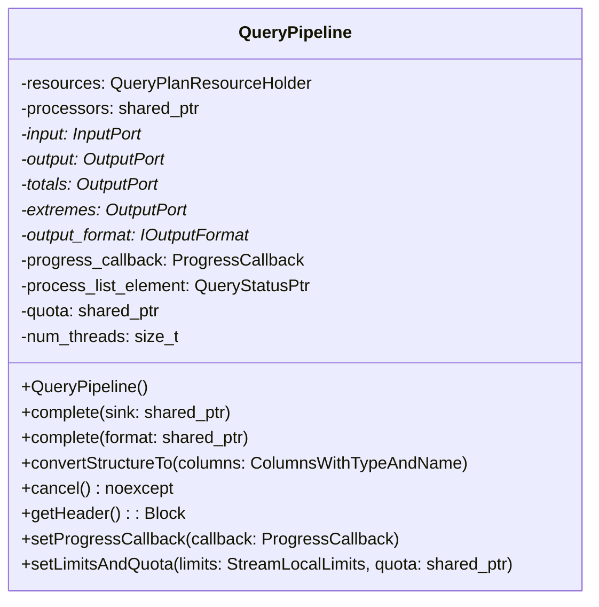
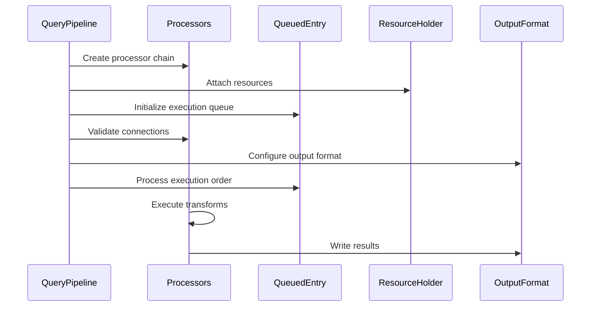
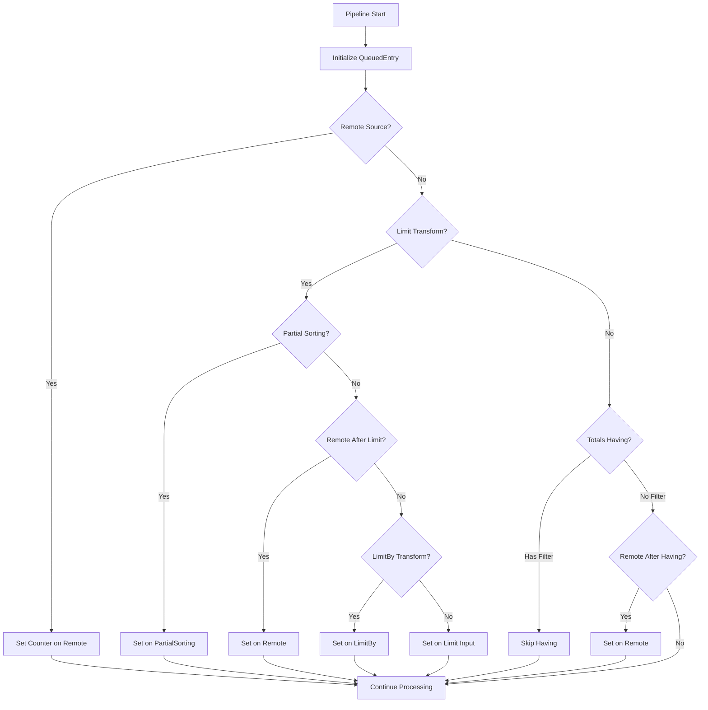

# Pipeline_Core Module Documentation

## Introduction

The Pipeline_Core module is the central orchestration component of the query execution system in ClickHouse. It manages the complete lifecycle of query pipelines, from construction through execution to completion. This module provides the fundamental infrastructure for connecting processors, managing data flow, and coordinating query execution across distributed systems.

The core component `QueuedEntry` serves as the primary mechanism for managing processor execution order and dependency resolution within the query pipeline, ensuring efficient and correct data processing workflows.

## Architecture Overview

### Core Architecture



### Component Relationships



## Core Components

### QueuedEntry Structure

The `QueuedEntry` is a fundamental data structure that manages processor execution within the pipeline:

```cpp
struct QueuedEntry
{
    IProcessor * processor;           // Pointer to the processor to execute
    LimitTransform * limit_processor; // Optional limit processor context
    ssize_t limit_input_port;        // Input port index for limit processing
};
```

**Purpose**: The QueuedEntry structure enables the pipeline to track which processors need execution, their relationship to limit operations, and the specific input ports that require processing. This is crucial for implementing efficient query execution strategies and managing complex data flow dependencies.

### QueryPipeline Class

The main orchestration class that manages the complete pipeline lifecycle:



## Data Flow Architecture

### Pipeline Construction Flow



### Execution Strategy Flow



## Integration with Other Modules

### Interpreters Module Integration

The Pipeline_Core module heavily relies on the [Interpreters](Interpreters.md) module for:

- **Context Management**: Uses `Context` for query execution settings and configuration
- **ActionsDAG**: Applies expression transformations and data processing operations
- **ExpressionActions**: Executes compiled expression trees on data streams

### Processors Module Integration

Pipeline_Core manages the complete lifecycle of processors from the Processors module:

- **Transform Management**: Coordinates various transform operations like sorting, aggregation, and filtering
- **Source/Sink Coordination**: Manages data input sources and output sinks
- **Processor Connection**: Validates and establishes connections between processor ports

### Storage_Engine Integration

Interfaces with the [Storage_Engine](Storage_Engine.md) module for:

- **MergeTree Operations**: Coordinates with MergeTree storage for efficient data reading
- **Storage Settings**: Applies storage-specific configurations and optimizations
- **Data Partitioning**: Manages partition-aware query execution strategies

### Query_Planning Integration

Works closely with [Query_Planning](Query_Planning.md) to:

- **Plan Execution**: Converts query plans into executable processor pipelines
- **Optimization**: Applies query plan optimizations during pipeline construction
- **Resource Management**: Coordinates resource allocation based on query plan requirements

## Key Features

### 1. Pipeline Construction

The module supports multiple pipeline construction patterns:

- **Pulling Pipeline**: For reading data from sources
- **Pushing Pipeline**: For writing data to sinks
- **Complete Pipeline**: For end-to-end query execution
- **Chain-based Pipeline**: For sequential processing operations

### 2. Execution Strategy Optimization

Implements sophisticated execution strategies:

- **Remote Source Optimization**: Special handling for distributed queries
- **Limit Pushdown**: Optimizes limit operations across the pipeline
- **Aggregation Optimization**: Coordinates aggregation operations efficiently
- **Sorting Integration**: Manages sorting operations within the pipeline

### 3. Resource Management

Comprehensive resource management including:

- **Memory Management**: Tracks and manages memory usage across processors
- **Thread Coordination**: Manages multi-threaded execution
- **Storage Holders**: Maintains references to storage objects
- **Query Context**: Preserves query execution context throughout the pipeline

### 4. Progress and Monitoring

Built-in monitoring and progress tracking:

- **Progress Callbacks**: Supports custom progress reporting
- **Row Counting**: Tracks rows processed before limits and aggregations
- **Query Result Caching**: Integrates with query result cache for performance
- **Quota Management**: Enforces resource quotas during execution

## Error Handling

The module implements comprehensive error handling:

- **Connection Validation**: Validates all processor connections before execution
- **Port State Checking**: Ensures ports are properly connected and available
- **Resource Cleanup**: Properly cleans up resources in case of errors
- **Cancellation Support**: Supports graceful pipeline cancellation

## Performance Considerations

### Memory Efficiency

- **Shared Headers**: Uses shared headers to minimize memory allocation
- **Resource Reuse**: Reuses resources across pipeline operations
- **Lazy Evaluation**: Supports lazy evaluation where appropriate

### Execution Optimization

- **Processor Ordering**: Optimizes processor execution order for efficiency
- **Parallel Execution**: Supports parallel execution where possible
- **Cache Integration**: Integrates with query result cache to avoid redundant computation

## Usage Examples

### Basic Pipeline Construction

```cpp
// Create a simple pulling pipeline
QueryPipeline pipeline(std::move(processors), output_port, totals_port, extremes_port);

// Set progress callback
pipeline.setProgressCallback([](const Progress & progress) {
    // Handle progress updates
});

// Complete pipeline with output format
pipeline.complete(output_format);
```

### Advanced Pipeline with Limits

```cpp
// Initialize rows before limit tracking
initRowsBeforeLimit(output_format);

// Configure aggregation tracking if needed
if (settings[Setting::rows_before_aggregation]) {
    initRowsBeforeAggregation(processors, output_format);
}
```

## Future Enhancements

The Pipeline_Core module is designed to support future enhancements such as:

- **Adaptive Execution**: Dynamic adjustment of execution strategies based on runtime statistics
- **Advanced Caching**: More sophisticated caching strategies for complex queries
- **Distributed Optimization**: Enhanced optimization for distributed query execution
- **Resource Prediction**: Predictive resource allocation based on query characteristics

## Conclusion

The Pipeline_Core module serves as the central nervous system of the ClickHouse query execution engine. Through its sophisticated management of processor execution, resource coordination, and integration with other system modules, it enables efficient and scalable query processing. The `QueuedEntry` structure and associated execution strategies ensure optimal performance across diverse query workloads while maintaining system stability and resource efficiency.