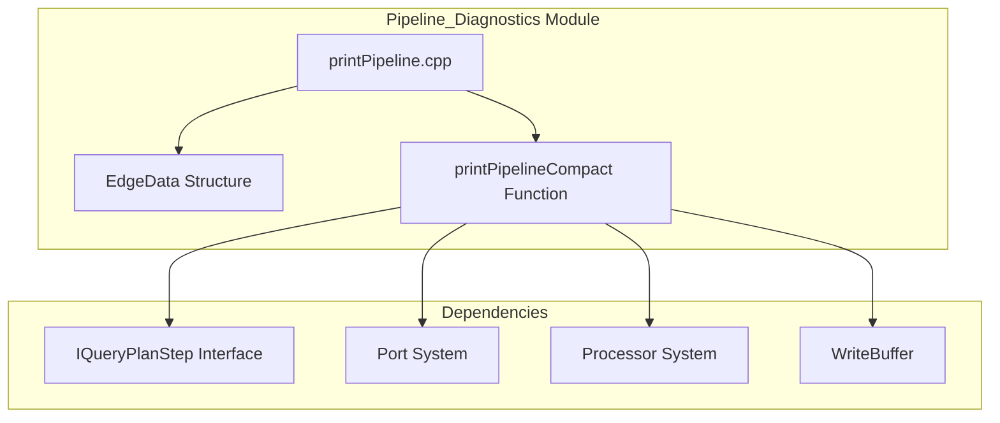
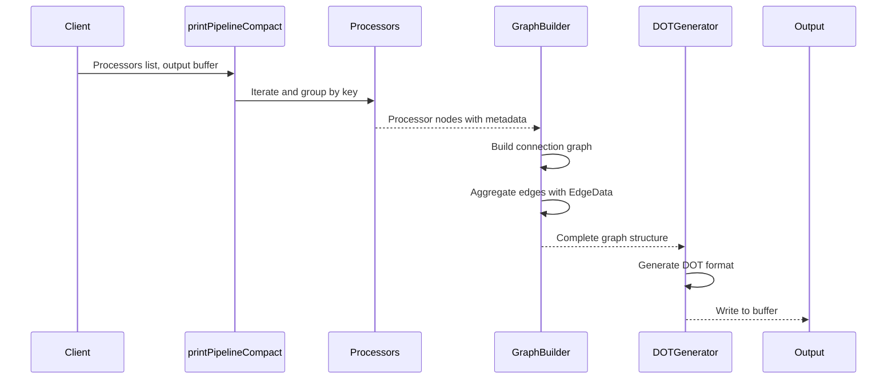
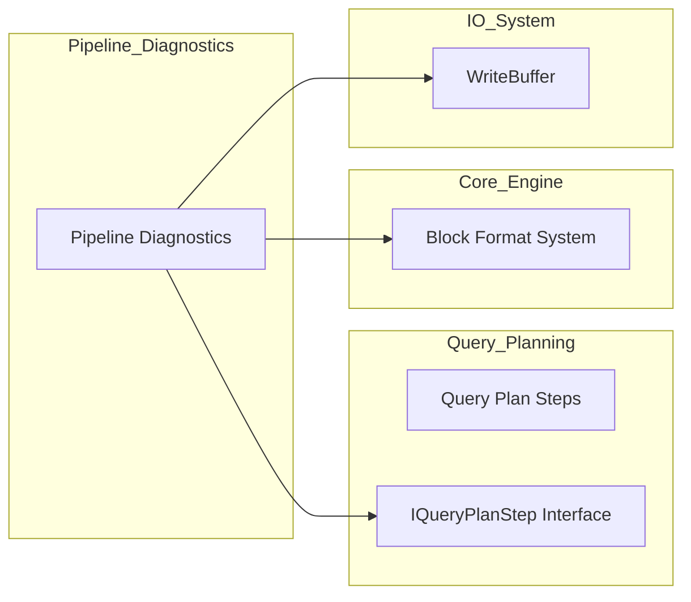
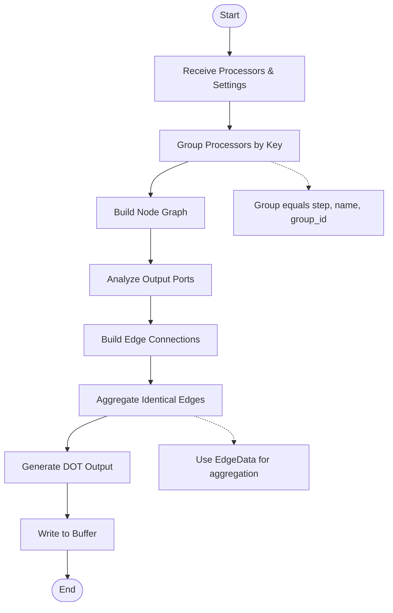

# Pipeline_Diagnostics Module Documentation

## Introduction

The Pipeline_Diagnostics module provides diagnostic and visualization capabilities for query pipeline execution in the database system. It enables developers and administrators to understand the structure and data flow of query execution plans through compact pipeline visualization, making it easier to debug performance issues and optimize query execution.

## Core Functionality

The module's primary function is to generate compact visual representations of query pipelines using Graphviz DOT format. It analyzes processor connections, groups them by query plan steps, and creates a hierarchical visualization that shows:

- Processor groupings by query plan steps
- Data flow connections between processors
- Header information for data blocks
- Processor multiplicity and descriptions

## Architecture Overview

### Component Structure



### Key Components

#### EdgeData Structure
The `EdgeData` structure is the core data structure that represents connections between pipeline processors:

```cpp
struct EdgeData
{
    Block header;      // Data structure describing column types
    size_t count;      // Number of identical connections
};
```

This structure enables the module to:
- Track data flow between processors
- Group identical connections to reduce visual clutter
- Optionally display data structure information

#### printPipelineCompact Function
The main function that orchestrates the pipeline visualization process:

1. **Processor Grouping**: Groups processors by their query plan step, name, and group ID
2. **Connection Analysis**: Analyzes output ports to build connection graph
3. **Edge Aggregation**: Combines identical connections using EdgeData structures
4. **Graph Generation**: Creates DOT format output with hierarchical clustering

## Data Flow Architecture



## Integration with Query Pipeline System

### Relationship to Query Pipeline Module

The Pipeline_Diagnostics module is a child of the [Query_Pipeline](Query_Pipeline.md) module, specifically focusing on diagnostic capabilities. It leverages the core pipeline components:

- **QueuedEntry**: Used for pipeline queue management
- **Processor System**: Analyzes processor connections and metadata
- **Query Plan Integration**: Groups processors by their associated query plan steps

### Dependencies on Other Modules



## Process Flow

### Pipeline Visualization Process



### Key Processing Steps

1. **Processor Analysis**: Each processor is analyzed to extract its query plan step, name, and group identifier
2. **Node Creation**: Processors with identical keys are grouped into single nodes with multiplicity counts
3. **Connection Mapping**: Output ports are examined to build the connection graph between nodes
4. **Edge Aggregation**: Connections with identical data structures are combined using EdgeData structures
5. **Hierarchical Layout**: Nodes are organized into clusters based on their query plan steps
6. **DOT Generation**: The final graph is rendered in Graphviz DOT format

## Configuration Options

The module supports configuration through the `printPipelineCompact` function parameters:

- **with_header**: Controls whether to include data structure information in edge labels
- **Output buffer**: Customizable WriteBuffer for directing the visualization output

## Usage Patterns

### Typical Use Cases

1. **Query Performance Analysis**: Visualize complex query execution plans
2. **Pipeline Debugging**: Identify bottlenecks or unexpected data flows
3. **Optimization Verification**: Confirm query plan optimizations are applied correctly
4. **Educational Purposes**: Understand query execution architecture

### Integration Points

The module integrates with the broader query execution system through:
- Processor metadata access via the processor system
- Query plan step information from the query planning module
- Data structure analysis through the Block format system
- Output handling via the IO system's WriteBuffer interface

## Performance Considerations

### Optimization Strategies

1. **Edge Aggregation**: Reduces visual complexity by combining identical connections
2. **Hierarchical Grouping**: Organizes visualization by query plan structure
3. **Optional Header Display**: Allows users to control the level of detail
4. **Efficient Graph Building**: Uses map-based structures for fast lookups

### Scalability

The module is designed to handle complex pipelines with:
- Efficient data structures for large processor counts
- Memory-efficient edge aggregation
- Scalable graph generation algorithms

## Error Handling

The module handles various edge cases:
- **Disconnected Ports**: Skips unconnected output ports
- **Null Query Plan Steps**: Handles processors without associated query plan steps
- **Empty Headers**: Gracefully handles empty data structures
- **Missing Metadata**: Continues processing with available information

## Future Enhancements

Potential areas for expansion include:
- Interactive visualization capabilities
- Performance metrics integration
- Real-time pipeline monitoring
- Advanced filtering and search options
- Export to additional visualization formats

## Related Documentation

- [Query_Pipeline](Query_Pipeline.md) - Parent module containing core pipeline functionality
- [Query_Planning](Query_Planning.md) - Module providing query plan step management
- [Core_Engine](Core_Engine.md) - Core data structure and format handling
- [IO_System](IO_System.md) - Output buffer and streaming functionality