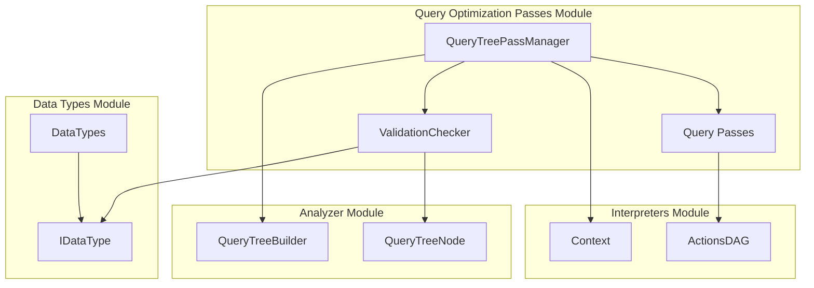
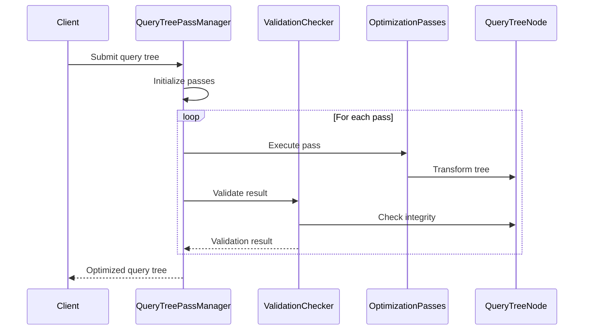

# Query Optimization Passes Module

## Introduction

The Query Optimization Passes module is a critical component of the ClickHouse query analyzer system, responsible for applying a series of transformation and optimization passes to query trees. This module implements a sophisticated optimization framework that systematically improves query performance through various algebraic, logical, and structural transformations.

## Module Overview

The Query Optimization Passes module serves as the orchestration layer for query optimization in ClickHouse. It manages a collection of specialized optimization passes, each targeting specific aspects of query performance improvement. The module ensures that queries are transformed into their most efficient form before execution, significantly impacting overall system performance.

## Core Architecture

### QueryTreePassManager

The central component of this module is the `QueryTreePassManager` class, which coordinates the execution of all optimization passes. It provides a flexible framework for:

- **Pass Registration**: Dynamically adding optimization passes to the execution pipeline
- **Pass Execution**: Running passes in a specific order with proper validation
- **Context Management**: Maintaining query context throughout the optimization process
- **Debug Support**: Comprehensive validation and debugging capabilities

### Validation Framework

The module includes a robust validation system (`ValidationChecker`) that ensures query tree integrity after each optimization pass. This validation is particularly crucial in debug builds, where it performs extensive checks on:

- Column node validity and source references
- Function resolution status
- Argument type consistency
- Aggregate function compatibility

## Component Relationships

## Optimization Pass Categories

The module implements numerous optimization passes, organized into several categories:

### 1. Analysis and Resolution Passes
- **QueryAnalysisPass**: Core query analysis and semantic checking
- **GroupingFunctionsResolvePass**: Resolution of grouping functions
- **AutoFinalOnQueryPass**: Automatic FINAL clause optimization

### 2. Function Optimization Passes
- **FunctionToSubcolumnsPass**: Conversion of functions to subcolumn accesses
- **RegexpFunctionRewritePass**: Regular expression function optimization
- **FuseFunctionsPass**: Function fusion for improved performance

### 3. Aggregate Function Passes
- **AggregateFunctionOfGroupByKeysPass**: Optimization of aggregate functions on GROUP BY keys
- **AggregateFunctionsArithmericOperationsPass**: Arithmetic operation optimization in aggregates
- **RewriteSumFunctionWithSumAndCountPass**: Sum function rewriting
- **CountDistinctPass**: COUNT(DISTINCT) optimization
- **UniqToCountPass**: Conversion of uniq functions to count

### 4. Conditional Expression Passes
- **IfConstantConditionPass**: Constant condition elimination
- **IfChainToMultiIfPass**: IF chain to multiIf conversion
- **MultiIfToIfPass**: MultiIf to IF chain conversion
- **RewriteAggregateFunctionWithIfPass**: Aggregate function rewriting with IF conditions

### 5. Join and Relationship Passes
- **CrossToInnerJoinPass**: Cross join to inner join conversion
- **ComparisonTupleEliminationPass**: Tuple comparison elimination

### 6. Ordering and Grouping Passes
- **OptimizeGroupByFunctionKeysPass**: GROUP BY key optimization
- **OptimizeGroupByInjectiveFunctionsPass**: Injective function optimization in GROUP BY
- **OrderByTupleEliminationPass**: ORDER BY tuple elimination
- **OrderByLimitByDuplicateEliminationPass**: Duplicate elimination in ORDER BY/LIMIT BY

### 7. Type and Conversion Passes
- **IfTransformStringsToEnumPass**: String to enum transformation in conditions
- **OptimizeDateOrDateTimeConverterWithPreimagePass**: Date/time converter optimization

## Data Flow Architecture

## Pass Execution Order

The optimization passes are executed in a carefully designed order to maximize optimization effectiveness:

## Integration with Other Modules

### Analyzer Module Integration
The Query Optimization Passes module works closely with the [Analyzer](Analyzer.md) module, particularly with:
- **QueryTreeBuilder**: Provides the initial query tree structure
- **QueryTreeNode**: Represents nodes in the query tree that passes operate on

### Interpreters Module Integration
Integration with the [Interpreters](Interpreters.md) module includes:
- **Context**: Provides query execution context and settings
- **ActionsDAG**: Represents data flow graphs that some passes optimize

### Data Types Module Integration
The module leverages the [Data Types](Data_Types.md) module for:
- **Type validation**: Ensuring argument types match expected types
- **Type conversion**: Handling type transformations during optimization

## Key Features

### 1. Modular Pass Architecture
Each optimization pass is implemented as a separate class, allowing for:
- Easy addition of new passes
- Selective pass execution
- Pass-specific debugging and profiling

### 2. Comprehensive Validation
The validation framework ensures:
- Query tree integrity after each pass
- Type safety throughout optimization
- Early detection of optimization errors

### 3. Context-Aware Optimization
Passes have access to query context, enabling:
- Settings-based optimization decisions
- Session-specific optimizations
- Resource-aware transformations

### 4. Debug and Production Modes
Different validation levels for:
- Development builds with full validation
- Production builds with optimized execution
- Selective validation based on configuration

## Performance Considerations

The Query Optimization Passes module is designed with performance in mind:

1. **Pass Ordering**: Passes are ordered to maximize optimization effectiveness
2. **Early Termination**: Validation can be disabled in production for performance
3. **Memory Efficiency**: Passes operate in-place when possible
4. **Selective Execution**: Only necessary passes are executed based on query characteristics

## Error Handling

The module implements comprehensive error handling:

- **Validation Errors**: Detected through the ValidationChecker framework
- **Type Mismatches**: Caught during function argument validation
- **Logical Errors**: Identified through consistency checks
- **Exception Propagation**: Errors are properly propagated with context

## Future Enhancements

The module is designed to accommodate future enhancements:

- **New Pass Types**: Easy addition of new optimization categories
- **Machine Learning Integration**: Potential for ML-based pass selection
- **Distributed Optimization**: Support for distributed query optimization
- **Adaptive Optimization**: Dynamic pass selection based on query characteristics

## Conclusion

The Query Optimization Passes module represents a sophisticated approach to query optimization in ClickHouse. Through its modular architecture, comprehensive validation framework, and extensive collection of optimization passes, it ensures that queries are transformed into their most efficient form before execution. The module's integration with other core components of the ClickHouse system makes it an essential part of the query processing pipeline, directly impacting the system's overall performance and efficiency.