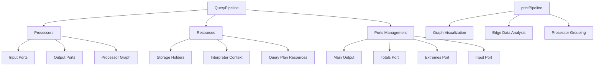

# Query Pipeline Module

## Overview

The Query Pipeline module is a critical component of the database system that orchestrates the execution of query processing workflows. It manages the flow of data through various processors, handles different pipeline configurations (pushing, pulling, and completed), and provides mechanisms for monitoring, limiting, and optimizing query execution.

## Purpose

The Query Pipeline module serves as the execution framework that:
- Manages the lifecycle of query execution from initialization to completion
- Coordinates data flow between processors in the query execution graph
- Provides different pipeline modes (pushing, pulling) to accommodate various execution scenarios
- Handles resource management and cleanup during query execution
- Implements monitoring and limiting mechanisms for query performance control

## Architecture

### Core Components

The module consists of two primary sub-modules:

1. **[Pipeline Core](Pipeline_Core.md)** - Contains the main QueryPipeline implementation
   - Main pipeline orchestrator that manages processor execution
   - Handles different pipeline configurations and state transitions
   - Implements resource management and lifecycle control

2. **[Pipeline Diagnostics](Pipeline_Diagnostics.md)** - Provides visualization and analysis capabilities
   - Generates compact visual representations of pipeline structure
   - Supports debugging and performance optimization
   - Analyzes processor relationships and data flow

### Pipeline Architecture



### Pipeline Execution Modes

The Query Pipeline supports three distinct execution modes:

1. **Pulling Mode**: Data is pulled from the pipeline output
   - Used for SELECT queries and result retrieval
   - Supports limits, aggregation counters, and progress monitoring
   - Can be completed with output formats or sinks

2. **Pushing Mode**: Data is pushed into the pipeline input
   - Used for INSERT operations and data ingestion
   - Supports chain-based processing and resource management

3. **Completed Mode**: Pipeline is fully configured and ready for execution
   - Represents a finalized pipeline configuration
   - Used for pipeline composition and resource sharing

## Key Features

### Resource Management
- **Storage Holders**: Manages storage object lifetimes during query execution
- **Interpreter Context**: Preserves query execution context and settings
- **Query Plan Resources**: Coordinates resources from query planning phase

### Monitoring and Control
- **Progress Callbacks**: Supports real-time query progress tracking
- **Process List Integration**: Integrates with system process monitoring
- **Quota Management**: Enforces resource usage limits and quotas
- **Row Counters**: Tracks rows before limits and aggregation for optimization

### Pipeline Completion
- **Format Integration**: Seamless integration with output formats
- **Sink Completion**: Support for storage sinks and data persistence
- **Chain Completion**: Flexible pipeline extension and modification
- **Structure Conversion**: Dynamic schema adaptation during execution

### Query Result Cache Integration
- **Cache Writing**: Automatic result caching for repeated queries
- **Cache Reading**: Efficient retrieval of cached results
- **Stream Integration**: Transparent cache integration with pipeline execution

## Dependencies

The Query Pipeline module interacts with several other system modules:

- **[Processors](Processors.md)**: Core processing units that execute query operations
- **[Interpreters](Interpreters.md)**: Query interpretation and execution context
- **[Query Planning](Query_Planning.md)**: Query plan execution and resource management
- **[IO System](IO_System.md)**: Data input/output operations and buffering

## Usage Patterns

### Basic Pipeline Construction
```cpp
// Create pipeline from source
QueryPipeline pipeline(std::make_shared<Source>());

// Complete with output format
pipeline.complete(std::make_shared<OutputFormat>());
```

### Pipeline with Monitoring
```cpp
// Set progress callback
pipeline.setProgressCallback(progress_callback);

// Set process list element
pipeline.setProcessListElement(process_element);

// Set limits and quota
pipeline.setLimitsAndQuota(limits, quota);
```

### Resource Management
```cpp
// Add storage holder
pipeline.addStorageHolder(storage);

// Add completed pipeline resources
pipeline.addCompletedPipeline(std::move(other_pipeline));
```

## Performance Considerations

The Query Pipeline module implements several optimization strategies:

1. **Processor Reuse**: Efficient processor lifecycle management and reuse
2. **Resource Sharing**: Coordinated resource management across pipeline components
3. **Lazy Initialization**: Deferred initialization of expensive operations
4. **Memory Management**: Careful memory allocation and deallocation patterns

## Error Handling

The module implements comprehensive error handling:
- **Port Validation**: Ensures all ports are properly connected
- **State Validation**: Validates pipeline state transitions
- **Resource Cleanup**: Guarantees proper resource cleanup on errors
- **Exception Safety**: Provides strong exception safety guarantees

## Thread Safety

The Query Pipeline module is designed for concurrent execution:
- **Processor Isolation**: Individual processors operate independently
- **Shared State Management**: Coordinated access to shared resources
- **Cancellation Support**: Thread-safe pipeline cancellation mechanisms