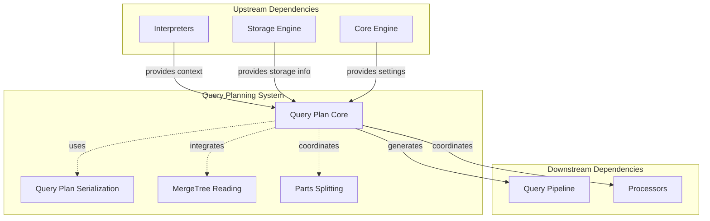
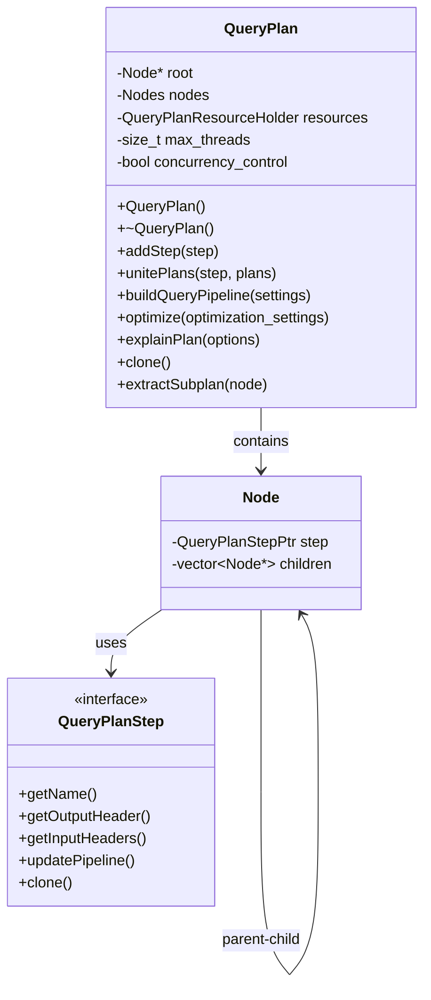
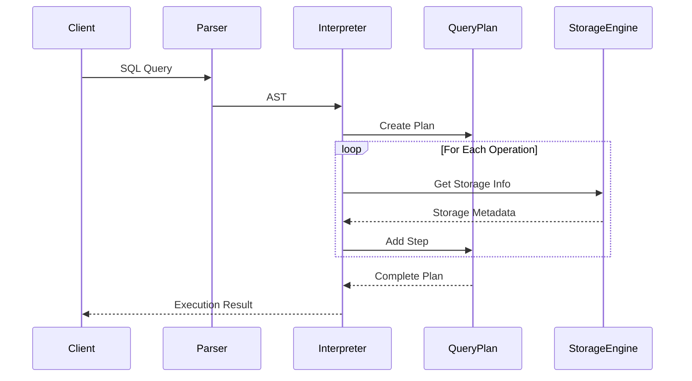
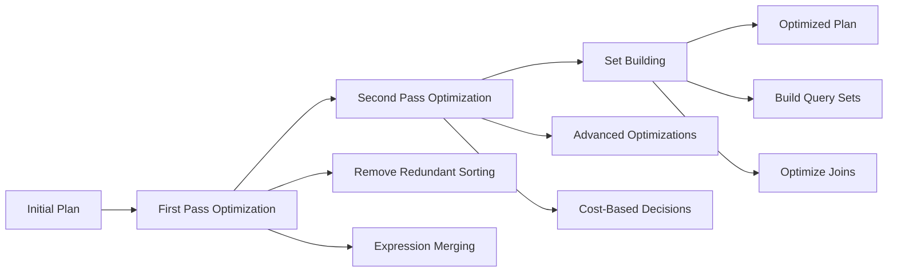
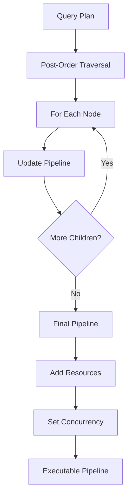

# Query Plan Core Module Documentation

## Introduction

The Query Plan Core module is the central component of the query planning system in the database engine. It provides the fundamental infrastructure for building, optimizing, and executing query execution plans. This module implements the core `QueryPlan` class that serves as the primary abstraction for representing and manipulating query execution plans throughout the query processing pipeline.

The module is responsible for managing the hierarchical structure of query plan nodes, coordinating plan optimization passes, and converting logical query plans into executable query pipelines. It forms the backbone of the query execution engine by providing the essential framework that other query planning components build upon.

## Architecture Overview

### Core Components

The Query Plan Core module consists of two primary components:

1. **EstimateCounters** - Provides cost estimation and statistics collection for query plan nodes
2. **Frame** - Manages the execution context and state during query plan processing

### Module Relationships

## Detailed Component Analysis

### QueryPlan Class

The `QueryPlan` class is the central abstraction that represents a complete query execution plan. It manages a tree structure of query plan nodes, where each node represents a specific operation in the query execution process.

#### Key Responsibilities

- **Plan Construction**: Building query plans by adding steps and uniting sub-plans
- **Plan Optimization**: Applying various optimization passes to improve query performance
- **Pipeline Generation**: Converting logical plans into executable query pipelines
- **Plan Analysis**: Providing detailed explanations and cost estimates for query plans

#### Internal Structure

### EstimateCounters Component

The `EstimateCounters` component provides statistical information and cost estimation for query plan nodes. It collects and aggregates performance metrics such as:

- **Parts**: Number of data parts that will be processed
- **Rows**: Estimated number of rows to be processed
- **Marks**: Number of index marks that will be read

This information is crucial for the query optimizer to make informed decisions about execution strategies and resource allocation.

### Frame Component

The `Frame` component manages the execution context during query plan processing. It maintains state information for:

- **Node Processing**: Current node being processed in the plan tree
- **Pipeline Management**: Collection of intermediate query pipelines
- **Execution Context**: Runtime information needed for plan execution

## Data Flow Architecture

### Query Plan Construction Flow

### Plan Optimization Pipeline

### Pipeline Generation Process

## Component Interactions

### Plan Construction Phase

During plan construction, the Query Plan Core module interacts with various components:

1. **Interpreters Module**: Receives parsed query information and context
2. **Storage Engine Module**: Obtains storage metadata and access patterns
3. **Core Engine Module**: Retrieves system settings and configuration

### Optimization Phase

The optimization process involves coordination with:

1. **Query Plan Optimization**: Applies transformation rules and cost-based optimizations
2. **MergeTree Reading**: Optimizes data access patterns for MergeTree tables
3. **Parts Splitting**: Determines optimal data partitioning strategies

### Execution Phase

During execution, the module coordinates with:

1. **Query Pipeline**: Converts logical plans to physical execution pipelines
2. **Processors**: Manages the actual execution of plan nodes

## Key Features and Capabilities

### Plan Manipulation

- **Step Addition**: Dynamically add new operations to existing plans
- **Plan Unification**: Combine multiple sub-plans into a single plan
- **Subplan Extraction**: Extract portions of plans for independent execution
- **Plan Cloning**: Create deep copies of complete query plans

### Optimization Support

- **Multi-Pass Optimization**: Support for multiple optimization passes
- **Cost-Based Decisions**: Integration with cost estimation components
- **Rule-Based Transformations**: Application of optimization rules
- **Set Building**: Optimization of set operations and joins

### Analysis and Debugging

- **Plan Explanation**: Detailed textual and JSON representations of plans
- **Pipeline Visualization**: Graphical representation of execution pipelines
- **Cost Estimation**: Statistical information about plan execution
- **Performance Metrics**: Collection of execution statistics

## Integration Points

### With Query Plan Serialization Module

The Query Plan Core module works closely with the [Query_Plan_Serialization](Query_Plan_Serialization.md) module to provide:

- Plan persistence and restoration
- Cross-system plan transfer
- Version compatibility handling

### With MergeTree Reading Module

Integration with the [MergeTree_Reading](MergeTree_Reading.md) module enables:

- Optimized data access patterns
- Index utilization strategies
- Partition pruning decisions

### With Parts Splitting Module

Coordination with the [Parts_Splitting](Parts_Splitting.md) module provides:

- Optimal data partitioning
- Parallel execution strategies
- Resource allocation decisions

## Performance Considerations

### Memory Management

- **Resource Holder Pattern**: Efficient management of query resources
- **Node Pool Allocation**: Minimizing allocation overhead for plan nodes
- **Pipeline Reuse**: Reusing pipeline objects where possible

### Concurrency Control

- **Thread Limiting**: Configurable maximum thread usage
- **Resource Sharing**: Coordinated resource allocation across plan nodes
- **Progress Tracking**: Monitoring execution progress across parallel operations

### Optimization Strategies

- **Early Pruning**: Removing unnecessary operations as early as possible
- **Lazy Evaluation**: Deferring expensive operations until necessary
- **Caching**: Caching intermediate results and metadata

## Error Handling

The module implements comprehensive error handling for:

- **Plan Validation**: Ensuring plan consistency and correctness
- **Header Compatibility**: Verifying data flow compatibility between nodes
- **Resource Constraints**: Handling resource limitations gracefully
- **Execution Failures**: Providing meaningful error messages for debugging

## Future Enhancements

Potential areas for future development include:

- **Machine Learning Integration**: Using ML for optimization decisions
- **Adaptive Optimization**: Runtime plan modification based on actual performance
- **Distributed Planning**: Enhanced support for distributed query execution
- **GPU Acceleration**: Integration with GPU-based query processing

## Conclusion

The Query Plan Core module serves as the foundation of the query planning system, providing the essential infrastructure for building, optimizing, and executing query plans. Its flexible architecture enables integration with various optimization strategies and execution engines while maintaining high performance and reliability. The module's comprehensive feature set makes it suitable for handling complex analytical workloads while providing the necessary hooks for future enhancements and specialized use cases.