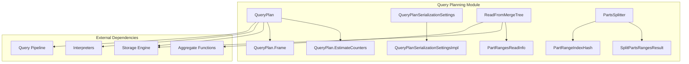
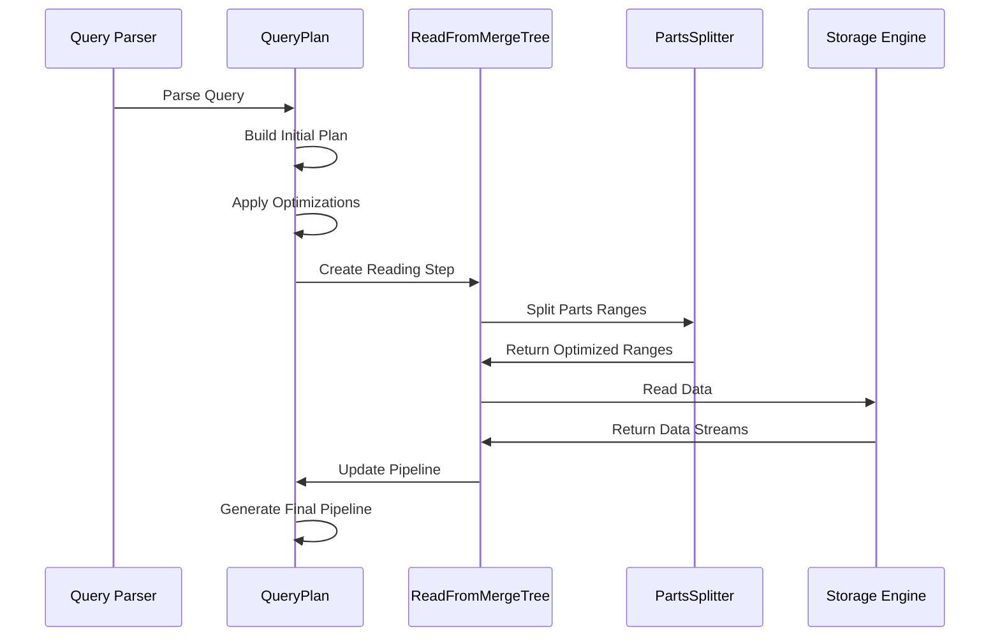

# Query Planning Module Documentation

## Overview

The Query Planning module is a critical component of the database system responsible for creating, optimizing, and executing query execution plans. It transforms high-level SQL queries into efficient execution strategies that can be processed by the underlying storage engines and execution engines.

## Purpose and Core Functionality

The Query Planning module serves as the bridge between query parsing and query execution. Its primary responsibilities include:

- **Query Plan Construction**: Building logical and physical execution plans from parsed SQL queries
- **Query Optimization**: Applying various optimization techniques to improve query performance
- **Resource Management**: Managing computational resources and execution constraints
- **Index Selection**: Choosing optimal indexes for query execution
- **Parallel Execution Planning**: Determining optimal parallelization strategies

## Architecture Overview

## Core Components

### 1. QueryPlan (`src.Processors.QueryPlan.QueryPlan`)

The central component that represents and manages query execution plans. It provides:

- **Plan Construction**: Building query plans from individual steps
- **Plan Optimization**: Applying optimization passes to improve performance
- **Pipeline Generation**: Converting plans to executable pipelines
- **Plan Analysis**: Providing detailed statistics and estimates

Key features:
- Tree-based plan representation with parent-child relationships
- Support for plan cloning and subplan extraction
- Integration with optimization frameworks
- Comprehensive plan explanation capabilities

### 2. QueryPlanSerializationSettings (`src.Processors.QueryPlan.QueryPlanSerializationSettings`)

Manages serialization settings for query plans, including:

- **Block Size Configuration**: Controls data processing granularity
- **Memory Limits**: Manages memory usage for sorting and aggregation
- **Join Settings**: Configures join algorithm parameters
- **External Processing**: Controls spilling to disk operations

### 3. ReadFromMergeTree (`src.Processors.QueryPlan.ReadFromMergeTree`)

Specialized component for reading data from MergeTree storage engine:

- **Index Analysis**: Primary key and skip index optimization
- **Range Selection**: Optimal data range selection for queries
- **Parallel Reading**: Multi-threaded data reading strategies
- **Final Processing**: Handling FINAL queries for deduplication

### 4. PartsSplitter (`src.Processors.QueryPlan.PartsSplitter`)

Optimizes data access by splitting parts ranges:

- **Range Intersection Analysis**: Identifying overlapping data ranges
- **Layer-based Processing**: Splitting data into processing layers
- **Primary Key Optimization**: Leveraging primary key for efficient splitting
- **Parallel Execution**: Enabling parallel processing of data partitions

## Data Flow Architecture

## Key Features

### Query Optimization
- **Cost-based Optimization**: Estimates query execution costs
- **Rule-based Optimization**: Applies transformation rules
- **Index Selection**: Chooses optimal indexes for query execution
- **Join Order Optimization**: Optimizes join sequence for performance

### Parallel Execution
- **Multi-threading**: Leverages multiple CPU cores
- **Data Partitioning**: Splits data for parallel processing
- **Pipeline Parallelism**: Enables concurrent stage execution
- **Resource Management**: Controls memory and CPU usage

### Storage Integration
- **MergeTree Optimization**: Specialized optimizations for MergeTree engine
- **Index Utilization**: Primary key and skip index usage
- **Data Skipping**: Minimizes data reading through intelligent filtering
- **Caching**: Leverages query condition cache for repeated queries

## Configuration and Settings

The module provides extensive configuration options through `QueryPlanSerializationSettings`:

- **Memory Management**: Controls for external sorting and aggregation
- **Join Configuration**: Algorithm selection and memory limits
- **Block Processing**: Size controls for optimal throughput
- **Parallel Execution**: Thread and concurrency management

## Performance Considerations

### Optimization Strategies
1. **Early Filtering**: Apply filters as early as possible in the pipeline
2. **Index Utilization**: Maximize use of available indexes
3. **Data Locality**: Minimize data movement and maximize cache usage
4. **Parallelization**: Balance between parallelism and overhead

### Monitoring and Debugging
- **Plan Explanation**: Detailed query plan visualization
- **Performance Metrics**: Comprehensive execution statistics
- **Index Usage Tracking**: Monitor index effectiveness
- **Resource Usage**: Memory and CPU consumption tracking

## Integration Points

### Upstream Dependencies
- **Query Parser**: Receives parsed SQL queries
- **Context Management**: Uses execution context and settings
- **Metadata Access**: Retrieves table and index information

### Downstream Dependencies
- **Query Pipeline**: Generates executable pipelines
- **Storage Engines**: Interfaces with data storage systems
- **Execution Engine**: Provides execution strategies

## Error Handling

The module implements comprehensive error handling for:
- **Invalid Plans**: Detection and reporting of malformed query plans
- **Resource Limits**: Enforcement of memory and time constraints
- **Data Consistency**: Validation of data integrity during processing
- **Optimization Failures**: Graceful fallback when optimizations cannot be applied

## Future Enhancements

Potential areas for improvement include:
- **Machine Learning Integration**: AI-driven optimization strategies
- **Adaptive Optimization**: Runtime plan adjustment based on actual performance
- **Cross-Engine Optimization**: Enhanced support for heterogeneous storage systems
- **Advanced Statistics**: More sophisticated cost estimation models

---

For detailed information about sub-modules, please refer to:
- [Query Plan Core](Query_Plan_Core.md) - Core query plan functionality including plan construction, optimization, and pipeline generation
- [Query Plan Serialization](Query_Plan_Serialization.md) - Serialization settings and configuration management for query plans
- [MergeTree Reading](MergeTree_Reading.md) - Specialized reading strategies and optimizations for MergeTree storage engine
- [Parts Splitting](Parts_Splitting.md) - Advanced data partitioning and range splitting algorithms for parallel processing