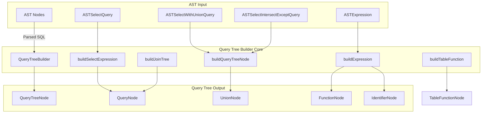
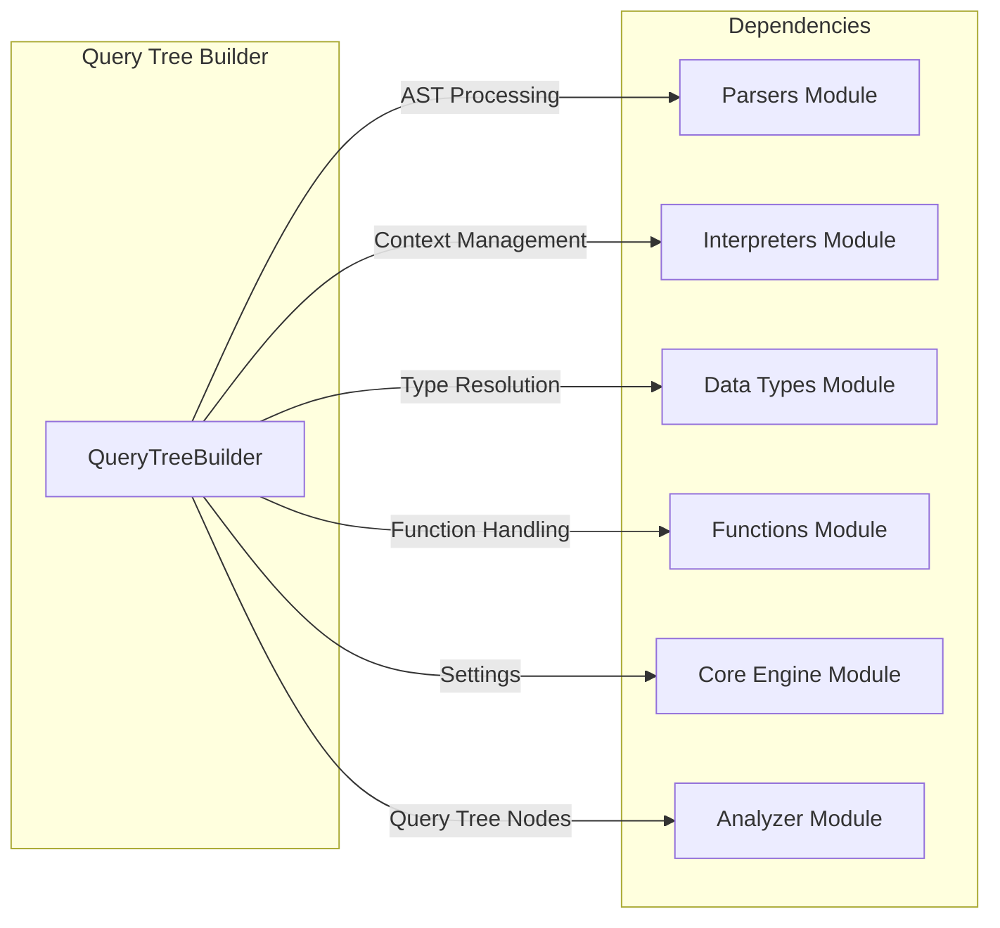
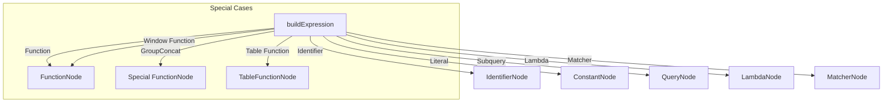
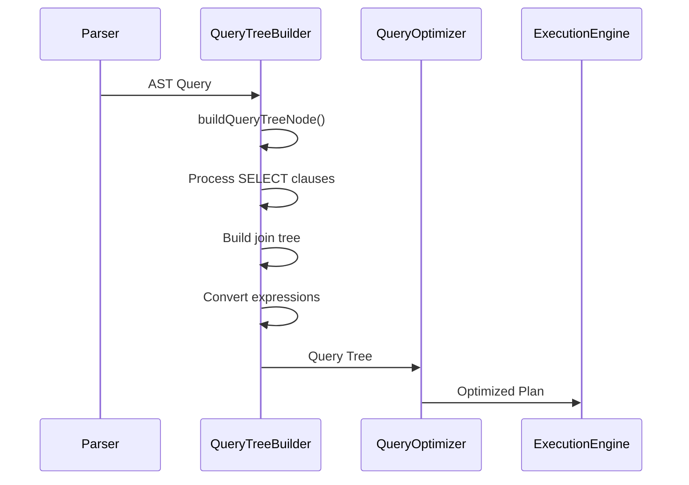
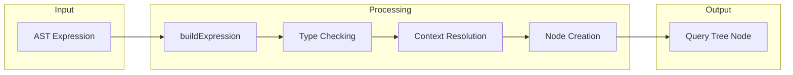

# Query Tree Builder Module

## Introduction

The Query Tree Builder module is a core component of the SQL query analysis and optimization system. It transforms Abstract Syntax Tree (AST) representations of SQL queries into a structured Query Tree format that can be processed by the query optimizer and execution engine. This module serves as the bridge between the parsing phase and the query optimization phase, providing a normalized, analyzable representation of SQL queries.

## Overview

The Query Tree Builder is responsible for converting parsed SQL statements from their AST form into a hierarchical Query Tree structure. This transformation involves:

- **AST to Query Tree Conversion**: Transforming parsed SQL AST nodes into corresponding Query Tree nodes
- **Expression Resolution**: Converting expressions, functions, and operators into analyzable tree structures
- **Query Structure Analysis**: Building the logical structure of queries including SELECT, FROM, WHERE, GROUP BY, HAVING, ORDER BY clauses
- **Join Tree Construction**: Creating join relationships between tables
- **Subquery Handling**: Processing nested queries and CTEs (Common Table Expressions)
- **Window Function Support**: Building window definitions for analytical functions
- **Table Function Processing**: Handling table-valued functions

## Architecture

### Core Components



### Module Dependencies



## Component Details

### QueryTreeBuilder Class

The `QueryTreeBuilder` class is the main entry point for converting AST representations into Query Tree structures. It provides methods for handling different types of SQL constructs:

#### Key Methods

- **`buildQueryTreeNode()`**: Main entry point for AST to Query Tree conversion
- **`buildSelectExpression()`**: Processes SELECT queries and builds QueryNode structures
- **`buildSelectWithUnionExpression()`**: Handles UNION, INTERSECT, EXCEPT operations
- **`buildExpression()`**: Converts individual expressions to Query Tree nodes
- **`buildJoinTree()`**: Constructs join relationships between tables
- **`buildTableFunction()`**: Processes table-valued functions

#### Expression Building

The module supports building Query Tree nodes for various expression types:



### Query Tree Node Types

The builder creates various types of Query Tree nodes:

- **QueryNode**: Represents complete SELECT queries
- **UnionNode**: Handles UNION, INTERSECT, EXCEPT operations
- **FunctionNode**: Represents function calls and operators
- **IdentifierNode**: Represents table/column identifiers
- **ConstantNode**: Represents literal values
- **LambdaNode**: Represents lambda expressions
- **MatcherNode**: Handles asterisk and pattern matching
- **SortNode**: Represents ORDER BY elements
- **WindowNode**: Represents window definitions
- **JoinNode**: Represents table joins
- **ArrayJoinNode**: Represents ARRAY JOIN operations

## Data Flow

### Query Processing Pipeline



### Expression Conversion Flow



## Key Features

### 1. Complex Query Support

The builder handles sophisticated SQL constructs:

- **UNION/INTERSECT/EXCEPT**: Set operations with proper node creation
- **Subqueries**: Nested queries in SELECT, FROM, WHERE clauses
- **CTEs**: Common Table Expressions with recursive support
- **Window Functions**: Analytical functions with window definitions
- **Array JOINs**: Special join operations for array columns

### 2. Expression Resolution

Advanced expression handling includes:

- **Lambda Functions**: Converting lambda expressions to LambdaNode
- **Table Functions**: Processing table-valued functions
- **Column Transformers**: Handling asterisk expansions and transformations
- **Parameter Binding**: Managing query parameters

### 3. Join Processing

Sophisticated join handling:

- **Join Type Resolution**: Determining join strictness and kind
- **Cross Join Optimization**: Combining multiple cross joins
- **Join Expression Building**: Processing ON and USING clauses
- **Implicit Table Handling**: Managing default tables when none specified

### 4. Settings Integration

The builder integrates with the system settings:

- **Limit/Offset Processing**: Combining expression and setting-based limits
- **Join Configuration**: Applying default join strictness
- **Type Resolution**: Using variant types when enabled
- **Order By All**: Supporting ORDER BY ALL syntax

## Integration with Other Modules

### Parsers Module
The Query Tree Builder depends heavily on the [Parsers](Parsers.md) module for:
- AST node definitions and structures
- SQL parsing and validation
- Expression representation

### Interpreters Module
Integration with [Interpreters](Interpreters.md) module provides:
- Context management and settings
- Database catalog access
- Expression execution context

### Data Types Module
The [Data Types](Data_Types.md) module supports:
- Type resolution for literals
- Field to data type conversion
- Custom type handling

### Functions Module
[Functions](Functions.md) module integration enables:
- Function name resolution
- Parameter handling
- Special function processing (e.g., groupConcat)

## Error Handling

The module implements comprehensive error handling for:

- **Unsupported SQL Constructs**: Throws `UNSUPPORTED_METHOD` exceptions
- **Invalid Arguments**: Validates function arguments and types
- **Missing Parameters**: Detects unset query parameters
- **Logical Errors**: Catches inconsistent query structures

## Performance Considerations

### Optimization Strategies

1. **Node Reuse**: Efficient cloning and reuse of query tree nodes
2. **Context Copying**: Minimizing context copying overhead
3. **Expression Caching**: Leveraging AST node properties
4. **Early Validation**: Detecting errors during tree building

### Memory Management

- **Smart Pointers**: Using `std::shared_ptr` for automatic memory management
- **Move Semantics**: Efficient transfer of ownership between nodes
- **Reserve Operations**: Pre-allocating memory for node collections

## Usage Examples

### Basic Query Building

```cpp
// Create context and parse query
auto context = Context::createCopy(base_context);
ASTPtr ast = parseQuery(query_string);

// Build query tree
QueryTreeNodePtr query_tree = buildQueryTree(ast, context);
```

### Table Function Building

```cpp
// Build table function query tree
auto table_function_ast = parseTableFunction(function_string);
auto table_function_node = buildTableFunctionQueryTree(table_function_ast, context);
```

## Future Enhancements

### Planned Improvements

1. **Enhanced Error Reporting**: More detailed error messages with suggestions
2. **Performance Optimization**: Faster tree building for complex queries
3. **Extended SQL Support**: Additional SQL dialect compatibility
4. **Caching Mechanisms**: Query tree caching for repeated queries

### Extensibility Points

The modular design allows for:
- New expression types through visitor pattern extension
- Custom node types for specialized use cases
- Plugin architecture for domain-specific optimizations

## Conclusion

The Query Tree Builder module is a foundational component that enables the transformation of parsed SQL queries into an analyzable, optimizable format. Its robust architecture supports complex SQL constructs while maintaining clean separation of concerns and providing excellent extensibility for future enhancements.