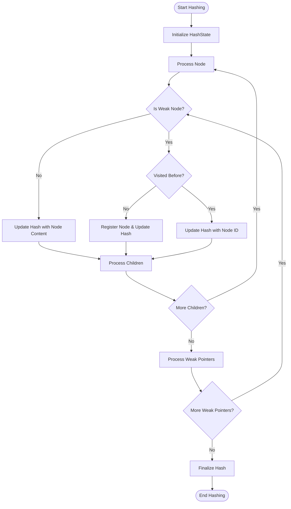

# Query Tree Node Management Module

## Introduction

The Query Tree Node Management module is a core component of the ClickHouse query analyzer system, responsible for managing the lifecycle, comparison, and manipulation of query tree nodes. This module provides the foundational infrastructure for representing and handling query structures in a tree format, enabling efficient query analysis, optimization, and execution planning.

The module's primary component, `NodePairHash`, serves as a critical utility for comparing and hashing query tree nodes, which is essential for query optimization, caching, and duplicate detection mechanisms.

## Architecture Overview


## Core Components

### NodePairHash

The `NodePairHash` is a specialized hash function designed to handle pairs of query tree nodes. This component is crucial for:

- **Node Comparison**: Efficient comparison of query tree structures
- **Caching Mechanisms**: Hash-based caching of query analysis results
- **Duplicate Detection**: Identifying equivalent query patterns
- **Optimization**: Avoiding redundant computations on identical subtrees


## Data Flow and Processing

### Query Tree Comparison Flow


### Tree Hashing Process



## Component Interactions

### Integration with Query Tree Builder

The Query Tree Node Management module works closely with the [Query_Tree_Builder](Query_Tree_Builder.md) module:


### Relationship with Query Optimization Passes

The module supports the [Query_Optimization_Passes](Query_Optimization_Passes.md) by providing:

- **Structural Comparison**: Determining if optimization passes have modified query structure
- **Hash-based Lookups**: Fast identification of equivalent query patterns
- **Tree Validation**: Ensuring query tree integrity after transformations

## Key Features and Capabilities

### 1. Efficient Node Comparison

The `NodePairHash` enables efficient comparison of query tree nodes through:
- **Hash-based Pre-screening**: Quick elimination of non-matching nodes
- **Structural Comparison**: Deep comparison of tree structures
- **Alias Handling**: Optional consideration of node aliases in comparisons

### 2. Tree Cloning and Replacement

The module supports sophisticated tree manipulation operations:
- **Complete Tree Cloning**: Deep copying of entire query trees
- **Selective Replacement**: Targeted replacement of specific nodes
- **Weak Pointer Management**: Proper handling of weak references during cloning

### 3. Hash-based Caching

The tree hashing mechanism enables:
- **Query Result Caching**: Cache query results based on tree structure
- **Optimization Result Caching**: Store optimization decisions
- **Intermediate Result Caching**: Cache intermediate analysis results

## Performance Considerations

### Hash Collision Management

The module implements strategies to minimize hash collisions:
- **SipHash Implementation**: Cryptographically strong hash function
- **Boost Hash Combination**: Proper combination of individual node hashes
- **Weak Node Handling**: Special treatment of weak pointers to avoid false collisions

### Memory Efficiency

- **Lazy Evaluation**: Hash computation only when needed
- **Cache-friendly Design**: Reuse of computed hashes where possible
- **Weak Pointer Optimization**: Avoid unnecessary strong references

## Error Handling and Validation

### Comparison Validation

The module includes robust validation mechanisms:
- **Null Pointer Checks**: Safe handling of null nodes
- **Type Consistency**: Verification of node type compatibility
- **Circular Reference Detection**: Prevention of infinite loops in comparisons

### Hash Computation Safety

- **Weak Pointer Validation**: Graceful handling of expired weak pointers
- **State Consistency**: Maintenance of hash state integrity
- **Error Propagation**: Proper error reporting for invalid operations

## Dependencies and Integration Points

### Internal Dependencies

The Query Tree Node Management module depends on:

- **Common Utilities**: [Common_Utilities](Common_Utilities.md) for hash functions and stack trace management
- **IO System**: [IO_System](IO_System.md) for buffer operations and serialization
- **Parser Components**: [Parsers](Parsers.md) for AST handling and conversion

### External Integration

The module integrates with:

- **Query Planning**: [Query_Planning](Query_Planning.md) for execution plan generation
- **Interpreters**: [Interpreters](Interpreters.md) for query execution context
- **Storage Engine**: [Storage_Engine](Storage_Engine.md) for data access patterns

## Usage Examples

### Node Comparison

```cpp
// Compare two query tree nodes for equality
IQueryTreeNode* node1 = /* ... */;
IQueryTreeNode* node2 = /* ... */;

CompareOptions options;
options.compare_aliases = true;

bool are_equal = node1->isEqual(*node2, options);
```

### Tree Hashing

```cpp
// Compute hash of a query tree
IQueryTreeNode* root_node = /* ... */;

CompareOptions options;
auto tree_hash = root_node->getTreeHash(options);
// Use hash for caching or comparison
```

### Tree Cloning

```cpp
// Clone a query tree with replacements
IQueryTreeNode* original_tree = /* ... */;
IQueryTreeNode* node_to_replace = /* ... */;
QueryTreeNodePtr replacement_node = /* ... */;

auto cloned_tree = original_tree->cloneAndReplace(
    node_to_replace, 
    replacement_node
);
```

## Future Enhancements

### Performance Optimizations

- **SIMD Hash Computation**: Vectorized hash calculations for large trees
- **Parallel Comparison**: Multi-threaded node comparison for complex queries
- **Memory Pool Allocation**: Reduced allocation overhead for frequent operations

### Functional Extensions

- **Incremental Hash Updates**: Efficient re-computation after minor changes
- **Semantic Comparison**: Beyond structural equality to semantic equivalence
- **Version-aware Caching**: Handle schema changes and version migrations

## Conclusion

The Query Tree Node Management module provides the essential infrastructure for managing query tree nodes in ClickHouse. Through its sophisticated hashing and comparison mechanisms, it enables efficient query analysis, optimization, and caching. The module's design emphasizes performance, correctness, and extensibility, making it a cornerstone of the query processing pipeline.

The integration with other analyzer components creates a cohesive system for query processing, where each module builds upon the capabilities provided by the Query Tree Node Management infrastructure to deliver high-performance query analysis and optimization.