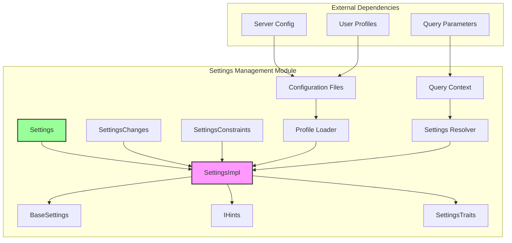
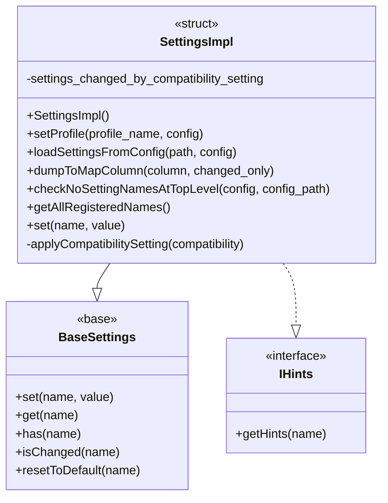
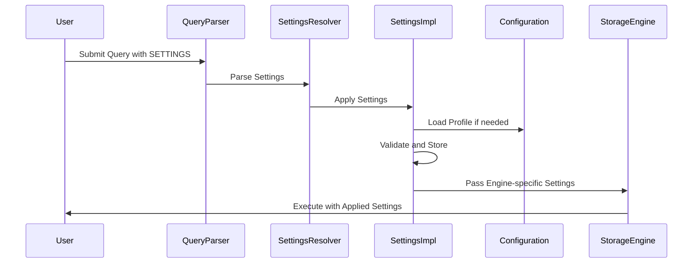
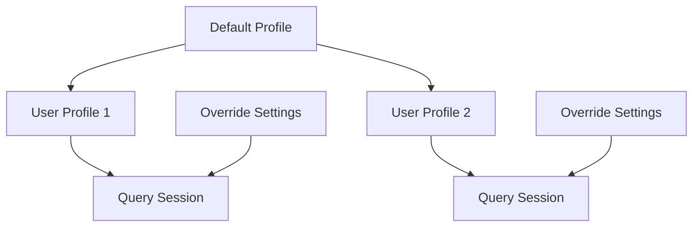

# Settings Management Module

## Introduction

The Settings Management module is a core component of ClickHouse that provides centralized configuration management for query execution, server behavior, and system-wide parameters. This module implements a comprehensive settings framework that allows fine-grained control over ClickHouse's behavior through user-defined settings, profiles, and configuration inheritance.

## Core Purpose

The Settings Management module serves as the central nervous system for ClickHouse configuration, providing:

- **Unified Configuration Interface**: A single point of access for all ClickHouse settings
- **Profile-Based Configuration**: Support for configuration profiles with inheritance
- **Runtime Configuration Management**: Dynamic setting modification during query execution
- **Version Compatibility**: Backward compatibility through settings migration
- **Type Safety**: Strong typing for all configuration parameters
- **Validation and Constraints**: Built-in validation for setting values and constraints

## Architecture Overview



## Core Components

### SettingsImpl Structure

The `SettingsImpl` class is the heart of the settings system, inheriting from `BaseSettings<SettingsTraits>` and implementing the `IHints<2>` interface for auto-completion support.



### Settings Categories

The module organizes settings into several categories:

#### 1. Performance Settings
- **Threading Control**: `max_threads`, `max_insert_threads`, `max_final_threads`
- **Memory Management**: `max_memory_usage`, `max_bytes_before_external_group_by`
- **I/O Optimization**: `max_read_buffer_size`, `min_bytes_to_use_direct_io`

#### 2. Query Execution Settings
- **Timeout Controls**: `max_execution_time`, `connect_timeout`, `receive_timeout`
- **Result Limits**: `max_result_rows`, `max_result_bytes`, `max_rows_to_read`
- **Optimization Flags**: `optimize_move_to_prewhere`, `use_skip_indexes`

#### 3. Storage and Format Settings
- **Compression**: `network_compression_method`, `output_format_compression_level`
- **Format Options**: `input_format_parallel_parsing`, `output_format_parallel_formatting`
- **Storage Engines**: `default_table_engine`, `merge_tree_*` settings

#### 4. Security and Access Control
- **User Limits**: `max_concurrent_queries_for_user`, `max_sessions_for_user`
- **Permissions**: `readonly`, `allow_ddl`, `allow_introspection_functions`

## Data Flow Architecture



## Settings Resolution Process

### 1. Setting Sources Hierarchy

Settings are resolved in the following priority order:

1. **Query-level SETTINGS**: Highest priority, specified in the query
2. **User Profile Settings**: From user configuration
3. **Default Profile Settings**: System-wide defaults
4. **Built-in Defaults**: Fallback values defined in code

### 2. Profile Inheritance



### 3. Compatibility Management

The module includes sophisticated version compatibility handling:

```cpp
void SettingsImpl::applyCompatibilitySetting(const String & compatibility_value)
{
    // Revert previous compatibility changes
    // Apply new compatibility settings based on version
    // Track changes to avoid conflicts with user settings
}
```

## Key Features

### 1. Type Safety and Validation

All settings are strongly typed with compile-time validation:

```cpp
DECLARE(UInt64, max_threads, 0, "Maximum query processing threads", 0)
DECLARE(Bool, use_uncompressed_cache, false, "Use uncompressed block cache", 0)
DECLARE(String, network_compression_method, "LZ4", "Network compression method", 0)
```

### 2. Setting Constraints

Settings support constraints for validation:

```cpp
// Min/Max constraints
// Disallowed values
// Writability constraints
SettingConstraintWritability writability = SettingConstraintWritability::WRITABLE;
```

### 3. Change Tracking

The system tracks setting changes for debugging and auditing:

```cpp
bool isChanged(std::string_view name) const;
SettingsChanges changes() const;
void dumpToMapColumn(IColumn * column, bool changed_only = true);
```

### 4. Hierarchical Configuration

Support for nested configuration structures:

```cpp
// Profile inheritance
// Setting aliases
// Grouped settings
```

## Integration with Other Modules

### 1. Query Planning Module

The Settings Management module provides configuration to the Query Planning module:

- **Join Algorithm Selection**: `join_algorithm`, `max_bytes_in_join`
- **Aggregation Strategies**: `group_by_two_level_threshold`
- **Optimization Flags**: Various `optimize_*` settings

### 2. Storage Engine Module

Storage engines receive engine-specific settings:

- **MergeTree Settings**: `merge_tree_min_rows_for_concurrent_read`
- **Distributed Settings**: `distributed_*` settings
- **External Storage**: `s3_*`, `azure_*`, `hdfs_*` settings

### 3. Interpreters Module

Query interpreters use settings for execution control:

- **Timeout Management**: Various timeout settings
- **Resource Limits**: Memory and thread limits
- **Feature Flags**: Experimental feature toggles

## Configuration Management

### 1. Profile Management

```cpp
void setProfile(const String & profile_name, const Poco::Util::AbstractConfiguration & config)
{
    // Load profile from configuration
    // Apply inheritance from parent profiles
    // Validate profile settings
}
```

### 2. Configuration Validation

```cpp
static void checkNoSettingNamesAtTopLevel(const Poco::Util::AbstractConfiguration & config, const String & config_path)
{
    // Prevent common configuration mistakes
    // Ensure settings are in proper sections
    // Provide helpful error messages
}
```

### 3. Dynamic Updates

Settings can be updated dynamically through:

- **SET commands**: `SET max_threads = 8`
- **Query parameters**: `SELECT ... SETTINGS max_threads = 8`
- **Profile changes**: User profile updates

## Error Handling and Diagnostics

### 1. Validation Errors

The module provides comprehensive validation with detailed error messages:

```cpp
throw Exception(ErrorCodes::THERE_IS_NO_PROFILE, "There is no profile '{}' in configuration file.", profile_name);
```

### 2. Setting Hints

Auto-completion support for setting names:

```cpp
std::vector<String> getHints(const String & name) const;
```

### 3. Change Tracking

Settings changes are tracked for debugging:

```cpp
void dumpToSystemSettingsColumns(MutableColumnsAndConstraints & params) const;
```

## Performance Considerations

### 1. Memory Efficiency

- Settings are stored as compact field objects
- Lazy evaluation for expensive settings
- Minimal overhead for unchanged settings

### 2. Thread Safety

- Settings are typically read-only after initialization
- Copy-on-write for settings modifications
- Thread-local settings for query execution

### 3. Lookup Optimization

- Hash-based setting name lookup
- Compiled setting traits for fast access
- Minimal string operations during lookup

## Extension Points

### 1. Custom Settings

The module supports custom settings through:

```cpp
DECLARE_SETTINGS_TRAITS_ALLOW_CUSTOM_SETTINGS(SettingsTraits, LIST_OF_SETTINGS)
```

### 2. Setting Aliases

Backward compatibility through setting aliases:

```cpp
DECLARE_WITH_ALIAS(Bool, enable_analyzer, true, "Allow new query analyzer", BETA, allow_experimental_analyzer)
```

### 3. Experimental Features

Controlled rollout of experimental features:

```cpp
DECLARE(Bool, allow_experimental_json_type, true, "Allow experimental JSON type", EXPERIMENTAL)
```

## Best Practices

### 1. Setting Organization

- Group related settings together
- Use descriptive names with consistent prefixes
- Provide comprehensive documentation

### 2. Version Management

- Use compatibility settings for version migration
- Document setting changes in release notes
- Provide migration paths for deprecated settings

### 3. Performance Tuning

- Profile setting impact on query performance
- Use appropriate default values
- Provide guidance for common use cases

## Dependencies

The Settings Management module has dependencies on:

- **Core_Engine**: Base settings infrastructure
- **Poco Libraries**: Configuration file parsing
- **Boost Libraries**: Program options handling
- **System Tables**: Settings introspection

## Related Documentation

- [Server_Settings](Server_Settings.md) - Server-level configuration
- [Query_Planning](Query_Planning.md) - Query optimization settings
- [Storage_Engine](Storage_Engine.md) - Storage-specific settings
- [Interpreters](Interpreters.md) - Query execution settings

## Conclusion

The Settings Management module provides a robust, scalable, and user-friendly configuration system for ClickHouse. Its design enables fine-grained control over system behavior while maintaining backward compatibility and providing excellent performance. The module's architecture supports both simple and complex configuration scenarios, making it suitable for deployments ranging from development environments to large-scale production clusters.