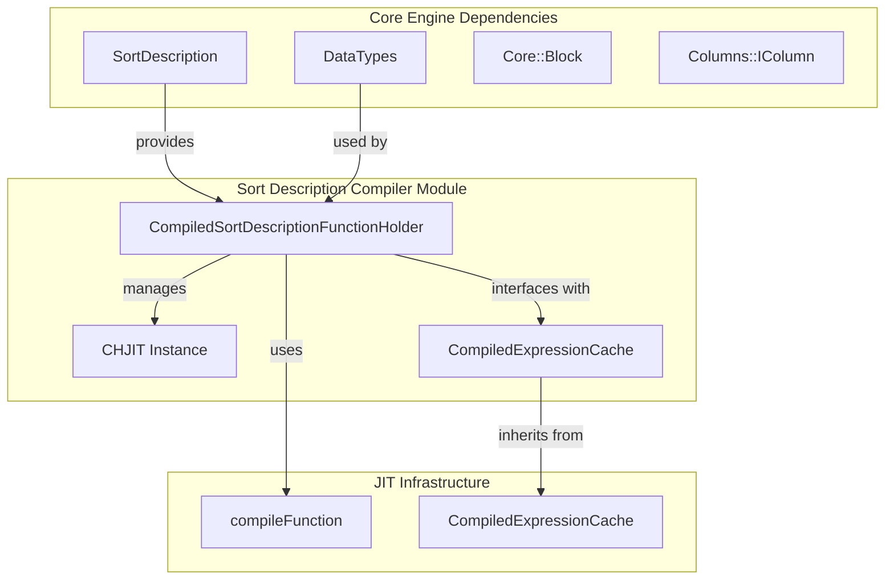
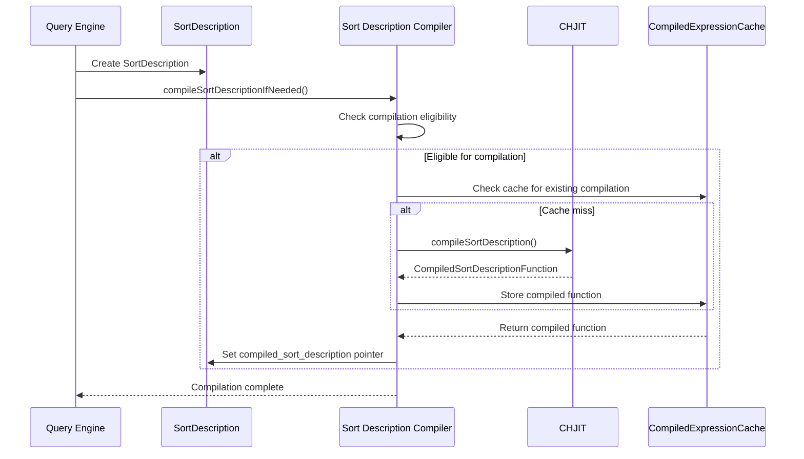
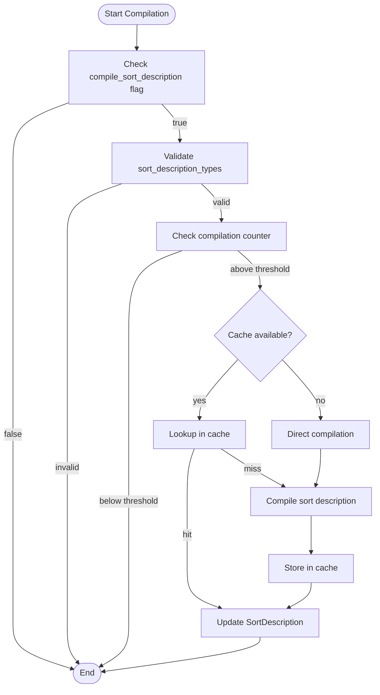
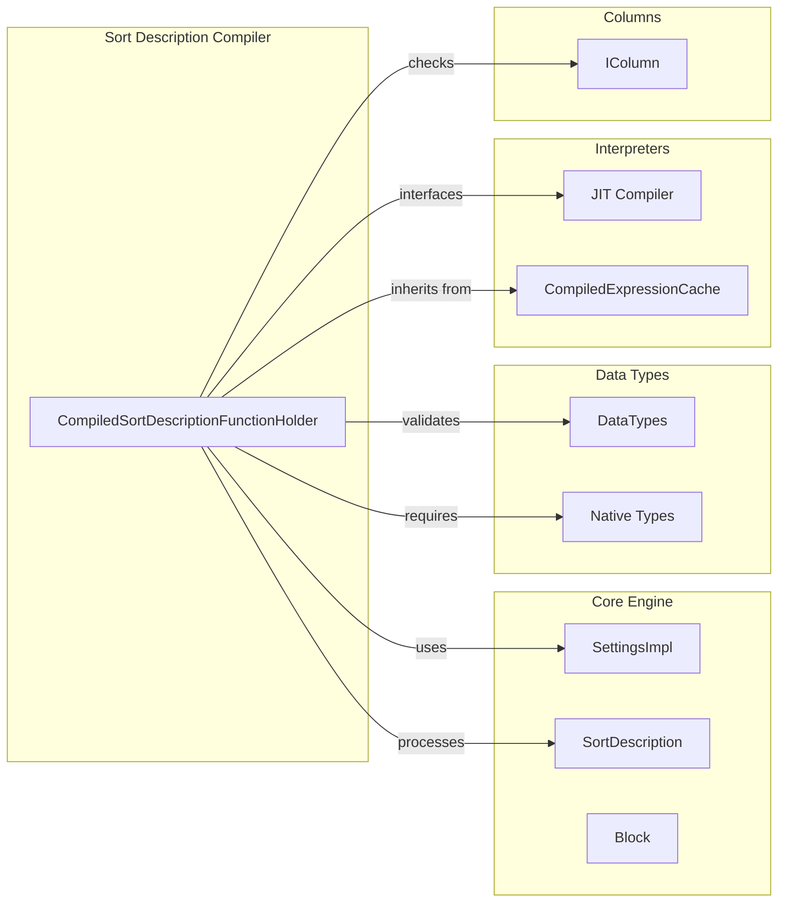

# Sort Description Compiler Module

## Introduction

The Sort Description Compiler module is a performance-critical component within the Core Engine that provides Just-In-Time (JIT) compilation capabilities for sort operations. This module optimizes query execution by compiling sort descriptions into native machine code, significantly improving sorting performance for frequently used sort patterns.

## Architecture Overview

The Sort Description Compiler module operates as a specialized compilation service within the database engine, focusing on transforming high-level sort descriptions into optimized native code. The module integrates with the JIT compilation infrastructure to provide runtime optimization of sorting operations.

## Core Components

### CompiledSortDescriptionFunctionHolder

The `CompiledSortDescriptionFunctionHolder` is the central component of this module, serving as a managed wrapper for compiled sort functions. This class inherits from `CompiledExpressionCacheEntry` and provides lifecycle management for JIT-compiled sort operations.

**Key Responsibilities:**
- Manages the lifecycle of compiled sort description functions
- Interfaces with the JIT compilation infrastructure
- Provides memory management for compiled modules
- Integrates with the expression cache system

**Key Features:**
- Automatic cleanup of JIT-compiled modules on destruction
- Integration with the compiled expression cache
- Thread-safe operation through static JIT instance management

## Data Flow Architecture

## Compilation Process Flow

## Integration with Core Engine

The Sort Description Compiler module integrates with several core engine components:

### Dependencies on Other Modules

1. **[Core Settings](Settings_Management.md)**: Uses settings to determine compilation thresholds and enablement flags
2. **[Data Types](Data_Types.md)**: Validates that data types are compatible with JIT compilation
3. **[Interpreters](Interpreters.md)**: Leverages JIT compilation infrastructure from the interpreters module
4. **[Columns](Columns.md)**: Ensures column types support compilation through `isComparatorCompilable()`

### Module Dependencies Diagram

## Performance Optimization Strategy

The module implements a sophisticated performance optimization strategy:

### Compilation Thresholds
- Uses counters to track sort description usage patterns
- Only compiles frequently used sort descriptions (configurable threshold)
- Prevents unnecessary compilation of one-time or infrequent sorts

### Type Compatibility
- Validates that all data types in the sort description are compilable
- Ensures types can be represented as native types for optimal performance
- Falls back to interpreted execution for incompatible types

### Caching Strategy
- Integrates with the global compiled expression cache
- Shares compiled functions across queries and sessions
- Provides memory-efficient storage of compiled code

## Configuration and Settings

The module behavior is controlled through several configuration parameters:

- `compile_sort_description`: Master flag to enable/disable compilation
- `min_count_to_compile_sort_description`: Threshold for compilation trigger
- JIT compilation settings from the interpreters module

## Error Handling and Fallbacks

The module implements robust error handling:

- Graceful fallback to interpreted sort execution on compilation failure
- Type incompatibility detection prevents invalid compilation attempts
- Thread-safe counter management prevents race conditions
- Proper resource cleanup through RAII patterns

## Thread Safety

All operations within the Sort Description Compiler are thread-safe:

- Static JIT instance with proper synchronization
- Mutex-protected counter management
- Immutable compiled function objects
- Thread-safe cache operations

## Performance Characteristics

- **Compilation Overhead**: Initial compilation cost offset by repeated execution gains
- **Memory Usage**: Minimal overhead through shared compiled modules
- **Scalability**: Linear scaling with number of unique sort patterns
- **Cache Efficiency**: High hit rates for typical query workloads

## Future Enhancements

The module architecture supports future enhancements such as:

- Advanced optimization techniques (vectorization, parallel execution)
- Support for additional data types and sort algorithms
- Integration with query planning for predictive compilation
- Enhanced profiling and performance monitoring capabilities