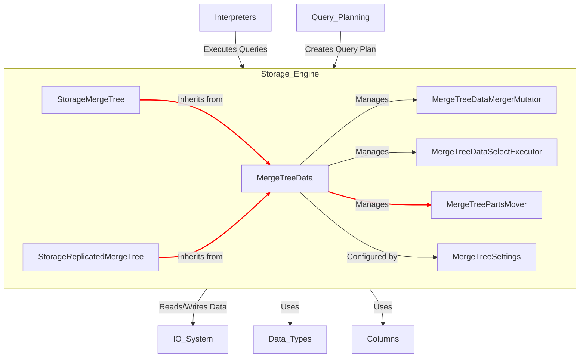
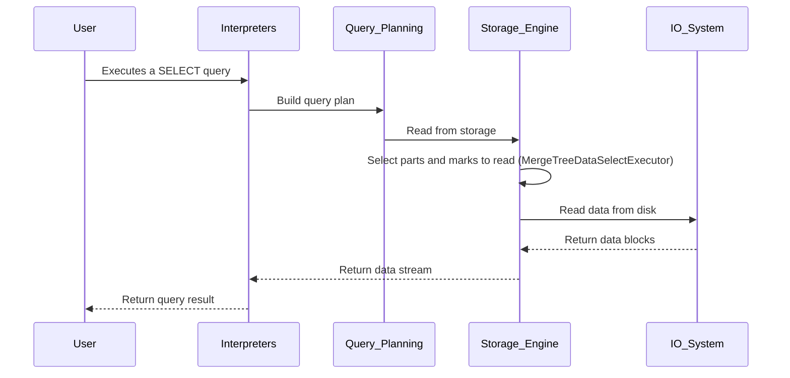

# Storage Engine Module

## 1. Introduction

The Storage Engine is the component responsible for managing the physical storage of data on disk. It defines how data is stored, retrieved, updated, and deleted. The primary implementation within this module is the `MergeTree` family of table engines, which are designed for high-performance data insertion and large-scale data analysis.

## 2. Architecture

The Storage Engine's architecture is centered around the `MergeTree` engine and its variants. The core class, `MergeTreeData`, manages the data parts, their metadata, and background processes like merging and mutation. `StorageMergeTree` and `StorageReplicatedMergeTree` are the main table engine implementations that build upon `MergeTreeData`.

### Component Dependencies

## 3. Sub-modules

The Storage Engine is divided into several key sub-modules:

- **[MergeTree Engine](MergeTree_Engine.md)**: Implements the `StorageMergeTree` and `StorageReplicatedMergeTree` table engines, which are the primary entry points for data manipulation and querying.
- **[MergeTree Data](MergeTree_Data.md)**: The core data management layer for the MergeTree family. It handles data parts, background merging, mutations, and data selection.
- **[MergeTree Settings](MergeTree_Settings.md)**: Provides a comprehensive set of configurable parameters to fine-tune the behavior of MergeTree tables.
- **[Storage Utilities](Storage_Utilities.md)**: Contains helper components and data structures used across the storage engine.
