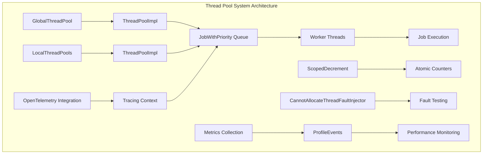
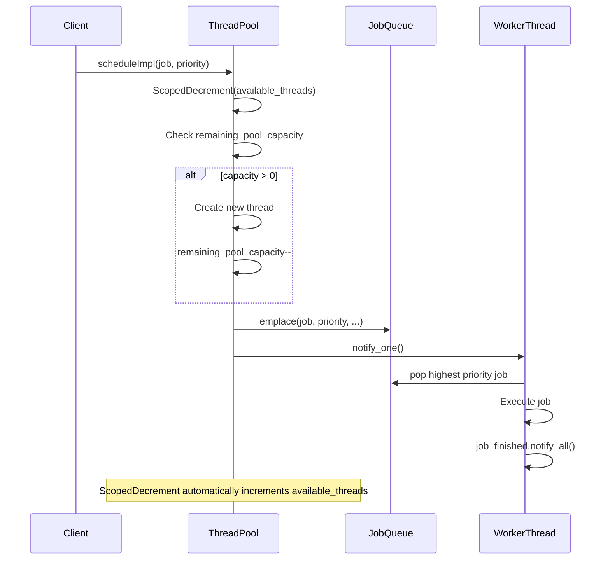
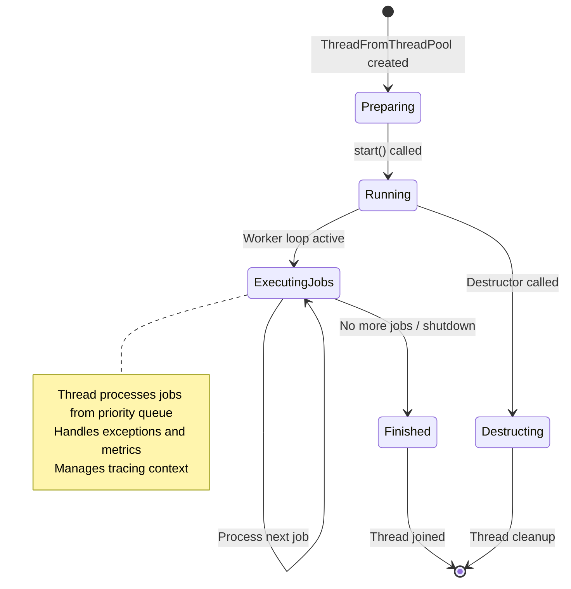

# Thread Pool System Documentation

## Introduction

The Thread Pool System is a sophisticated concurrent execution framework that provides efficient thread management and task scheduling capabilities for the database system. It implements both global and local thread pools with advanced features including priority-based job scheduling, dynamic thread pool resizing, comprehensive monitoring, and fault injection mechanisms for testing.

The system is designed to optimize resource utilization while providing robust error handling, OpenTelemetry tracing integration, and detailed performance metrics collection. It serves as the foundation for concurrent operations throughout the database engine, enabling efficient parallel query execution, background maintenance tasks, and I/O operations.

## Architecture Overview

### Core Components

The Thread Pool System is built around several key architectural components:

**ThreadPoolImpl**: The main template-based thread pool implementation that provides the core functionality for both global and local thread pools. It manages thread lifecycle, job scheduling, and resource allocation.

**GlobalThreadPool**: A singleton instance of ThreadPoolImpl that serves as the system-wide thread pool for general-purpose tasks. It provides centralized thread management and resource sharing across the entire system.

**JobWithPriority**: A wrapper class that encapsulates individual jobs with their priority information, tracing context, and metadata. It implements priority queue semantics for efficient job scheduling.

**ScopedDecrement**: An RAII utility that ensures thread-safe atomic counter management, automatically decrementing on construction and incrementing on destruction.

**ThreadFromThreadPool**: Manages individual worker threads within the pool, handling thread lifecycle, job execution, and graceful shutdown procedures.

### System Architecture



## Component Details

### ThreadPoolImpl Template Class

The ThreadPoolImpl is a template-based implementation that provides the core thread pool functionality. It supports both std::thread for the global pool and ThreadFromGlobalPoolImpl for local pools that borrow threads from the global pool.

**Key Features:**
- Dynamic thread pool resizing with configurable max_threads, max_free_threads, and queue_size
- Priority-based job scheduling using std::priority_queue
- Comprehensive error handling with exception propagation
- Atomic operations for thread-safe counter management
- Integration with OpenTelemetry for distributed tracing
- Detailed performance metrics collection

**Template Specializations:**
- `ThreadPoolImpl<std::thread>`: Used for the global thread pool
- `ThreadPoolImpl<ThreadFromGlobalPoolImpl<false, true>>`: Local pools with fault injection
- `ThreadPoolImpl<ThreadFromGlobalPoolImpl<false, false>>`: Standard local pools

### Job Scheduling Mechanism



### Priority-Based Job Queue

The system implements a priority queue where jobs with lower priority values are executed first. The JobWithPriority class encapsulates:

- **Job Function**: The actual task to be executed
- **Priority**: Numeric priority value (lower = higher priority)
- **Metrics Tracking**: CurrentMetrics::Increment for monitoring
- **Tracing Context**: OpenTelemetry tracing information
- **Stack Trace Capture**: Optional frame pointer collection for debugging
- **Timing Information**: Job creation and execution timing

### Thread Lifecycle Management



## Key Features

### Dynamic Thread Pool Management

The system supports dynamic adjustment of thread pool parameters:

- **setMaxThreads()**: Adjusts the maximum number of threads in the pool
- **setMaxFreeThreads()**: Controls how many idle threads to maintain
- **setQueueSize()**: Limits the number of pending jobs in the queue

Thread creation and destruction are managed atomically to ensure thread safety and optimal resource utilization.

### Comprehensive Error Handling

The system implements robust error handling mechanisms:

- **Exception Propagation**: Exceptions from jobs are captured and can be rethrown in the scheduling thread
- **Fault Injection**: CannotAllocateThreadFaultInjector enables testing of error scenarios
- **Graceful Degradation**: The pool continues operating even when individual threads fail
- **Shutdown on Exception**: Optional shutdown behavior when exceptions occur

### Performance Monitoring and Metrics

Extensive metrics collection is integrated throughout the system:

**Global Thread Pool Metrics:**
- GlobalThreadPoolExpansions/Shrinks: Thread pool size changes
- GlobalThreadPoolThreadCreationMicroseconds: Thread creation time
- GlobalThreadPoolLockWaitMicroseconds: Lock contention time
- GlobalThreadPoolJobs: Total jobs processed
- GlobalThreadPoolJobWaitTimeMicroseconds: Job queue wait time

**Local Thread Pool Metrics:**
- LocalThreadPoolBusyMicroseconds: Thread utilization time
- LocalThreadPoolJobWaitTimeMicroseconds: Job scheduling latency

### OpenTelemetry Integration

The system provides comprehensive distributed tracing support:

- **Context Propagation**: Tracing context is passed from scheduling thread to worker thread
- **Span Management**: Each job can create its own spans with appropriate operation names
- **Attribute Collection**: Exceptions and performance data are added as span attributes
- **Thread Name Integration**: Dynamic operation names based on thread names or job types

## Dependencies and Integration

### Internal Dependencies

The Thread Pool System integrates with several other system components:

**[Common_Utilities](Common_Utilities.md)**: Provides DNS resolution, stack trace management, and other utility functions that support thread pool operations.

**[Core_Engine](Core_Engine.md)**: Supplies system settings and configuration management that control thread pool behavior and resource limits.

**[IO_System](IO_System.md)**: Utilizes thread pools for asynchronous I/O operations and connection management, particularly for read buffer operations.

### External Dependencies

- **Poco Libraries**: Configuration management and application framework integration
- **Standard Library**: std::thread, std::priority_queue, and atomic operations
- **OpenTelemetry**: Distributed tracing and monitoring integration

## Usage Patterns

### Global Thread Pool

The GlobalThreadPool provides system-wide thread management:

```cpp
// Initialize the global thread pool
GlobalThreadPool::initialize(max_threads, max_free_threads, queue_size);

// Get the singleton instance
auto& pool = GlobalThreadPool::instance();

// Schedule a job with priority
pool.scheduleOrThrow([job_function](), priority);

// Schedule with timeout
bool scheduled = pool.trySchedule([job_function](), priority, timeout_microseconds);
```

### Local Thread Pools

Local thread pools borrow threads from the global pool for specific subsystems:

```cpp
// Create a local thread pool
ThreadPoolImpl<ThreadFromGlobalPoolImpl<false, false>> local_pool(
    metric_threads, metric_active_threads, metric_scheduled_jobs,
    max_threads, max_free_threads, queue_size
);

// Use like the global pool
local_pool.scheduleOrThrow(job, priority);
```

### Priority-Based Scheduling

Jobs are scheduled based on priority values:

```cpp
enum class Priority : int
{
    LOWEST = 10,
    LOW = 5,
    NORMAL = 0,
    HIGH = -5,
    HIGHEST = -10
};

// Higher priority jobs execute first
pool.scheduleOrThrow(high_priority_job, Priority::HIGHEST);
pool.scheduleOrThrow(low_priority_job, Priority::LOWEST);
```

## Configuration and Tuning

### Thread Pool Sizing

The system provides several configuration parameters:

- **max_threads**: Maximum number of threads in the pool
- **max_free_threads**: Number of idle threads to maintain for quick job startup
- **queue_size**: Maximum number of pending jobs (0 for unlimited)

### Performance Tuning

Optimal configuration depends on system characteristics:

- **CPU-bound workloads**: Set max_threads close to CPU core count
- **I/O-bound workloads**: Can use higher thread counts
- **Memory constraints**: Limit max_free_threads to reduce memory usage
- **Latency requirements**: Adjust queue_size to prevent excessive queuing

### Monitoring and Diagnostics

The system provides several monitoring capabilities:

- **CurrentMetrics**: Real-time thread pool statistics
- **ProfileEvents**: Detailed performance counters
- **OpenTelemetry**: Distributed tracing for job execution
- **Stack Traces**: Optional capture of job scheduling call stacks

## Error Handling and Fault Tolerance

### Exception Management

The system handles exceptions at multiple levels:

1. **Job Execution**: Exceptions from individual jobs are captured and stored
2. **Thread Creation**: Failed thread creation is handled gracefully
3. **Memory Allocation**: std::bad_alloc and other allocation failures are caught
4. **Shutdown Scenarios**: Graceful handling during system shutdown

### Fault Injection Testing

The CannotAllocateThreadFaultInjector enables testing of error conditions:

```cpp
// Enable fault injection with 10% probability
CannotAllocateThreadFaultInjector::instance().setFaultProbability(0.1);

// Test error handling in thread scheduling
// ... schedule jobs and verify error handling ...

// Disable fault injection
CannotAllocateThreadFaultInjector::instance().setFaultProbability(0.0);
```

## Thread Safety and Concurrency

### Atomic Operations

The system uses atomic operations for thread-safe counter management:

- **remaining_pool_capacity**: Tracks available thread creation capacity
- **available_threads**: Monitors currently available threads
- **scheduled_jobs**: Counts jobs currently in the system

### Lock-Based Synchronization

Mutex-protected sections handle complex state changes:

- **Job Queue Management**: Adding/removing jobs from the priority queue
- **Thread List Management**: Adding/removing threads from the pool
- **Configuration Changes**: Dynamic adjustment of pool parameters

### Memory Ordering

The system uses relaxed memory ordering where appropriate to minimize synchronization overhead while maintaining correctness.

## Future Enhancements

### Planned Improvements

- **Work-Stealing**: Implementation of work-stealing algorithms for better load balancing
- **NUMA Awareness**: NUMA topology-aware thread placement and memory allocation
- **Adaptive Sizing**: Automatic adjustment of pool sizes based on workload characteristics
- **Energy Efficiency**: Power-aware thread management for reduced energy consumption

### Performance Optimizations

- **Lock-Free Data Structures**: Implementation of lock-free job queues for reduced contention
- **CPU Affinity**: Thread affinity management for better cache utilization
- **Memory Pool**: Dedicated memory pools for job allocation to reduce fragmentation

## Conclusion

The Thread Pool System provides a robust, scalable, and feature-rich foundation for concurrent execution in the database system. Its template-based design enables flexible deployment scenarios, while comprehensive monitoring and error handling ensure reliable operation in production environments. The integration with modern observability tools and support for advanced features like priority scheduling and fault injection make it well-suited for high-performance database workloads.