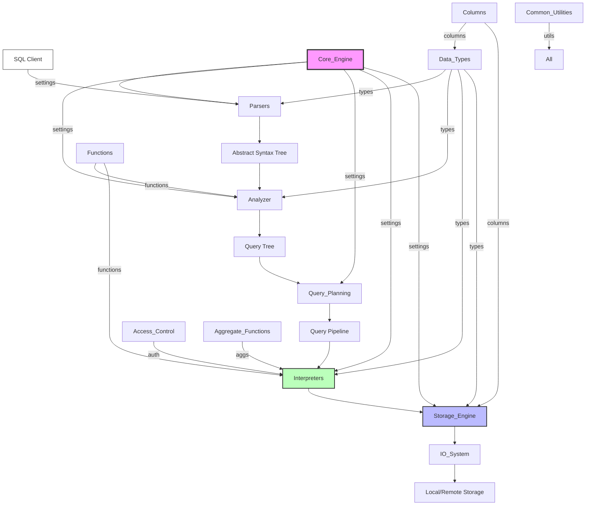

# ClickHouse--ClickHouse Repository Overview

## Purpose
ClickHouse is an open-source, column-oriented database management system (DBMS) designed for real-time analytical processing (OLAP). The repository contains the complete source code for the ClickHouse server, client libraries, and tools, enabling high-performance data ingestion, storage, and querying at petabyte scale.

## End-to-End Architecture

## Core Modules Documentation

| Module | Path | Purpose |
|--------|------|---------|
| **Core_Engine** | `src/Core` | Central configuration, settings, and server-wide parameters. See [Core_Engine.md](Core_Engine.md) |
| **Interpreters** | `src/Interpreters` | Query execution context, expression evaluation, aggregation, and catalog management. See [Interpreters.md](Interpreters.md) |
| **Storage_Engine** | `src/Storages` | MergeTree family table engines, data parts, merges, mutations, and physical I/O. See [Storage_Engine.md](Storage_Engine.md) |
| **Query_Planning** | `src/Processors/QueryPlan` | Query plan construction, optimization passes, index selection, and parallel execution strategies. See [Query_Planning.md](Query_Planning.md) |
| **Data_Types** | `src/DataTypes` | Type system, serialization, LowCardinality, enums, and schema evolution. See [Data_Types.md](Data_Types.md) |
| **Functions** | `src/Functions` | Scalar and aggregate function registry, overload resolution, and runtime execution. See [Functions.md](Functions.md) |
| **Parsers** | `src/Parsers` | SQL lexer, grammar, AST construction, and query validation. See [Parsers.md](Parsers.md) |
| **IO_System** | `src/IO` | Buffered readers, seekers, connection timeouts, and data streaming. See [IO_System.md](IO_System.md) |
| **Columns** | `src/Columns` | Columnar data structures, compression, SIMD operations, and memory management. See [Columns.md](Columns.md) |
| **Access_Control** | `src/Access` | Authentication, RBAC, row-level security, quotas, and LDAP integration. See [Access_Control.md](Access_Control.md) |
| **Query_Pipeline** | `src/QueryPipeline` | Pipeline orchestration, resource tracking, progress monitoring, and cancellation. See [Query_Pipeline.md](Query_Pipeline.md) |
| **Aggregate_Functions** | `src/AggregateFunctions` | Aggregate function factory, combinators, and compiled aggregation. See [Aggregate_Functions.md](Aggregate_Functions.md) |
| **Analyzer** | `src/Analyzer` | AST-to-Query-Tree conversion, semantic analysis, and optimization passes. See [Analyzer.md](Analyzer.md) |
| **Common_Utilities** | `src/Common` | DNS resolution, stack traces, thread pools, and shared utilities. See [Common_Utilities.md](Common_Utilities.md) |

## Quick Start

1. **Build**: `cmake -S . -B build && cmake --build build`
2. **Run**: `build/programs/clickhouse-server --config-file=programs/server/config.xml`
3. **Connect**: `clickhouse-client --query "SELECT version()"`

## Key Features

- **Columnar Storage**: Vectorized execution and compression
- **Real-time Inserts**: Millions of rows per second ingestion
- **SQL Support**: ANSI SQL plus powerful extensions
- **Distributed Processing**: Sharding and replication out-of-the-box
- **Data Formats**: CSV, JSON, Parquet, ORC, Avro, and more
- **Integrations**: Kafka, S3, Hadoop, MySQL, PostgreSQL
- **Monitoring**: Built-in metrics, query log, and system tables