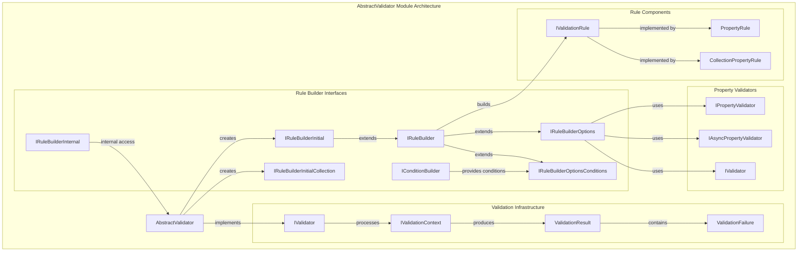
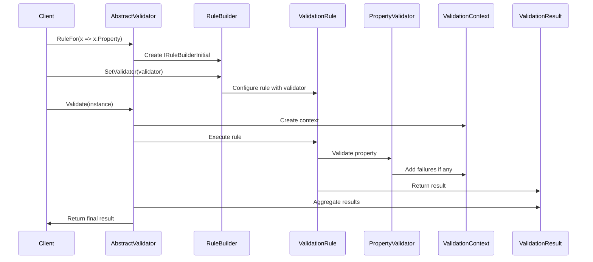

# AbstractValidator Module Documentation

## Introduction

The AbstractValidator module is the cornerstone of the FluentValidation library, providing a fluent API for building validation rules and defining validation logic for complex objects. This module serves as the primary entry point for developers to create custom validators by inheriting from the AbstractValidator base class and defining validation rules using a highly expressive, chainable syntax.

The AbstractValidator enables developers to validate object properties with various built-in validators, create conditional validation rules, define dependent rules, and compose complex validation scenarios while maintaining clean, readable code. It acts as the orchestrator that brings together all other validation components including property validators, validation rules, rule builders, and localization features.

## Architecture Overview

The AbstractValidator module is built around a sophisticated interface hierarchy that provides a fluent, type-safe API for defining validation rules. The architecture follows a builder pattern where each method call returns an interface that exposes the next set of available operations, creating an intuitive and discoverable API surface.



## Core Components

### Rule Builder Interface Hierarchy

The rule builder interfaces form the foundation of the fluent API, providing a type-safe way to define validation rules:

#### IRuleBuilderInitial<T, TProperty>
The starting point for defining validation rules for a specific property. This interface marks the beginning of the rule definition chain and provides access to the core rule building functionality.

#### IRuleBuilder<T, TProperty>
The core interface that provides the essential methods for associating validators with properties. It offers multiple overloads for setting validators:

- **SetValidator(IPropertyValidator<T, TProperty>)**: Associates a synchronous property validator
- **SetValidator(IAsyncPropertyValidator<T, TProperty>)**: Associates an asynchronous property validator  
- **SetValidator(IValidator<TProperty>)**: Associates a nested validator for complex objects
- **SetValidator(Func<T, TValidator>)**: Associates a validator provider that can create validators based on the parent object
- **SetValidator(Func<T, TProperty, TValidator>)**: Associates a validator provider that can create validators based on both parent object and property value

#### IRuleBuilderOptions<T, TProperty>
Extends the base rule builder with additional configuration options. Currently provides the **DependentRules(Action)** method for creating scopes where rules depend on the success of previous rules.

#### IRuleBuilderOptionsConditions<T, TProperty>
A specialized version of the rule builder that only supports conditional operations (When/Unless/WhenAsync/UnlessAsync) without other configuration options.

#### IRuleBuilderInitialCollection<T, TElement>
Specialized interface for starting validation rule chains for collection properties, providing the same functionality as IRuleBuilderInitial but tailored for collection elements.

#### IConditionBuilder
Provides the **Otherwise(Action)** method for defining alternative rules when conditions fail, enabling complex conditional validation scenarios.

#### IRuleBuilderInternal<T, TProperty>
Internal interface that provides access to the underlying validation rule and parent validator, used by the framework to manage rule construction and validation execution.

## Data Flow and Validation Process



## Integration with Other Modules

### Validation Rules Module
The AbstractValidator heavily depends on the [Validation Rules](Validation_Rules.md) module for the actual rule implementation. The rule builder interfaces create and configure instances of IValidationRule<T, TProperty>, which are implemented by PropertyRule<T, TProperty> and CollectionPropertyRule<T, TElement> from the Validation Rules module.

### Property Validators Module  
All validator association methods in IRuleBuilder<T, TProperty> work with validators from the [Property Validators](Property_Validators.md) module. The SetValidator methods accept various types of property validators including synchronous, asynchronous, and nested validators.

### Rule Building Module
The internal rule building logic is handled by components from the [Rule Building](Rule_Building.md) module. The RuleBuilder<T, TProperty> class implements the rule builder interfaces and coordinates with ConditionBuilder and related components for conditional rule construction.

### Validator Selection Module
When validators are executed, the [Validator Selection](Validator_Selection.md) module determines which rules should be applied based on selectors like DefaultValidatorSelector, MemberNameValidatorSelector, or RulesetValidatorSelector.

### Localization Module
Error messages and validation results are processed through the [Localization](Localization.md) module, which handles message formatting and language-specific content via ILanguageManager and MessageFormatter.

## Usage Patterns

### Basic Property Validation
```csharp
public class PersonValidator : AbstractValidator<Person>
{
    public PersonValidator()
    {
        RuleFor(x => x.Name)
            .NotEmpty()
            .Length(1, 100);
            
        RuleFor(x => x.Email)
            .NotEmpty()
            .EmailAddress();
    }
}
```

### Complex Object Validation with Nested Validators
```csharp
public class OrderValidator : AbstractValidator<Order>
{
    public OrderValidator()
    {
        RuleFor(x => x.Customer)
            .SetValidator(new CustomerValidator());
            
        RuleFor(x => x.Items)
            .SetCollectionValidator(new OrderItemValidator());
    }
}
```

### Conditional Validation
```csharp
public class UserValidator : AbstractValidator<User>
{
    public UserValidator()
    {
        RuleFor(x => x.SocialSecurityNumber)
            .NotEmpty()
            .When(x => x.Country == "US");
            
        RuleFor(x => x.VatNumber)
            .NotEmpty()
            .Unless(x => x.IsIndividual);
    }
}
```

### Dependent Rules
```csharp
public class PaymentValidator : AbstractValidator<Payment>
{
    public PaymentValidator()
    {
        RuleFor(x => x.CreditCardNumber)
            .NotEmpty()
            .CreditCard()
            .DependentRules(() =>
            {
                RuleFor(x => x.ExpirationDate)
                    .NotEmpty()
                    .Must(BeValidExpirationDate);
            });
    }
}
```

## Key Design Principles

### Type Safety
The rule builder interfaces leverage C#'s generic type system to provide compile-time type safety. The T and TProperty type parameters ensure that only valid property expressions and validators can be used.

### Fluent Interface
The interface hierarchy follows the fluent interface pattern, where each method returns an interface that exposes the next logical set of operations. This creates an intuitive, discoverable API that guides developers through the rule definition process.

### Extensibility
The design allows for easy extension through custom property validators and nested validators. The validator association methods accept interfaces (IPropertyValidator, IAsyncPropertyValidator, IValidator) rather than concrete types, enabling dependency injection and custom implementations.

### Separation of Concerns
The interfaces separate different aspects of rule configuration:
- Basic validator association (IRuleBuilder)
- Advanced options (IRuleBuilderOptions)  
- Conditional logic (IRuleBuilderOptionsConditions)
- Internal framework operations (IRuleBuilderInternal)

This separation keeps the public API clean while providing the necessary functionality for complex validation scenarios.

## Performance Considerations

The AbstractValidator module is designed with performance in mind:

- **Compiled Expression Trees**: Property access expressions are compiled and cached to minimize reflection overhead
- **Rule Caching**: Validation rules are built once during validator construction and reused across validation calls
- **Lazy Initialization**: Components are initialized only when needed, reducing memory footprint for unused features
- **Minimal Allocations**: The fluent interface design minimizes object allocations during rule definition

## Thread Safety

The rule builder interfaces and AbstractValidator implementations are designed to be thread-safe for validation operations. Once configured, validators can be safely used across multiple threads. However, rule configuration should typically be done during application initialization and not modified at runtime.

## Error Handling

The module provides comprehensive error handling through the validation result system. All validation failures are collected and returned as part of the ValidationResult, allowing applications to handle validation errors appropriately without throwing exceptions during the validation process itself.