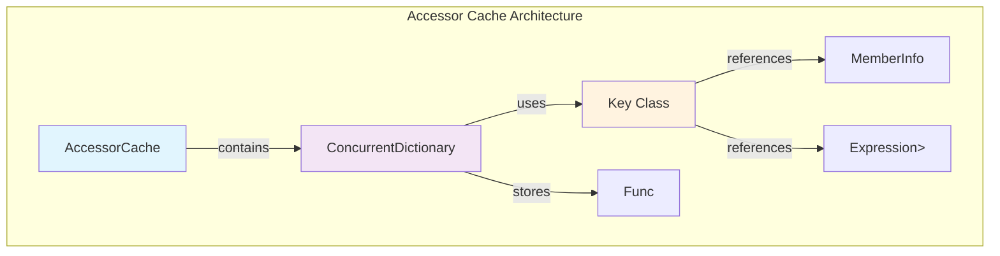
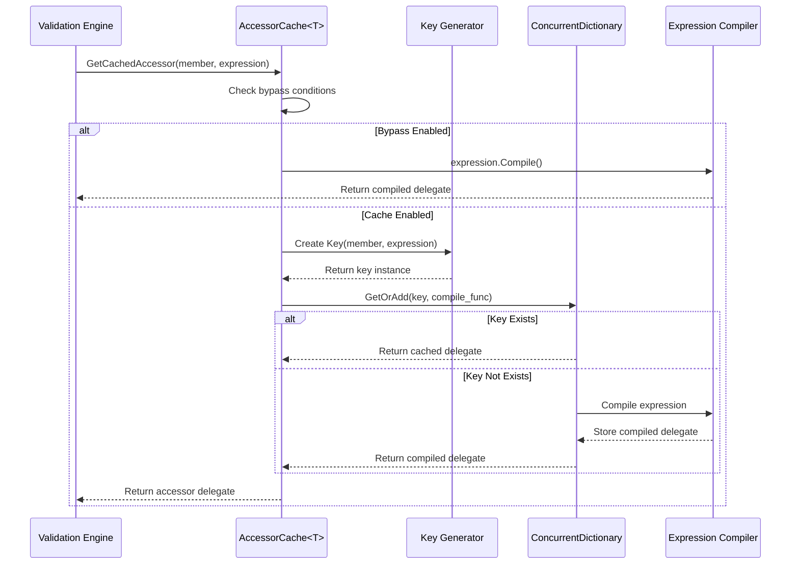
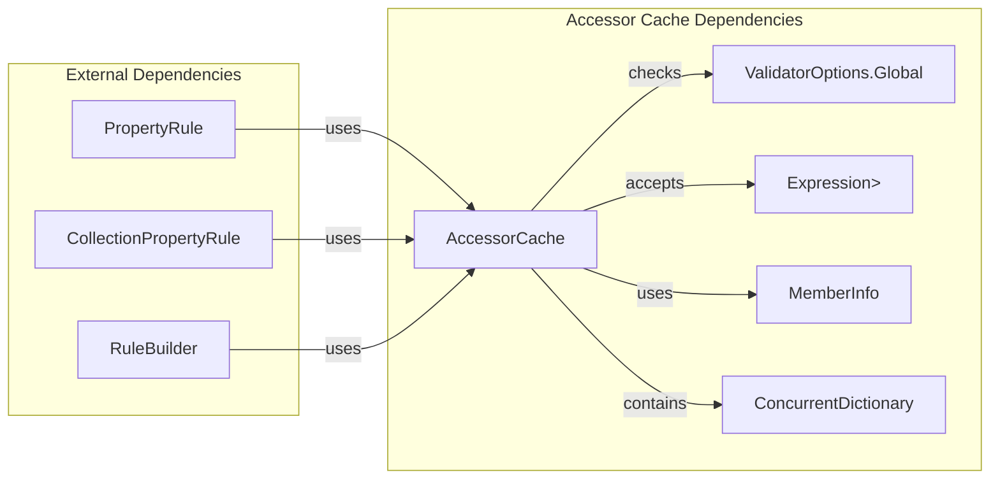
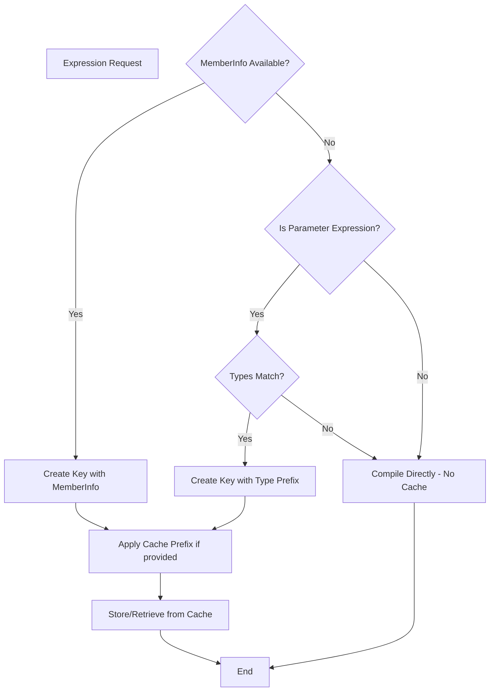

# Accessor Cache Module Documentation

## Introduction

The Accessor Cache module is a performance optimization component within the FluentValidation framework that provides efficient caching of compiled expression-based property accessors. This module eliminates the overhead of repeatedly compiling LINQ expressions when accessing object properties during validation operations, significantly improving validation performance in high-throughput scenarios.

## Architecture Overview

The Accessor Cache module implements a thread-safe, generic caching mechanism specifically designed for property accessor delegates. It serves as a central optimization point for the validation engine by storing compiled expressions that are frequently used to access object properties during validation rule execution.



## Core Components

### AccessorCache<T> Class

The main static generic class that provides caching functionality for a specific type `T`. It maintains a thread-safe concurrent dictionary that maps cache keys to compiled accessor delegates.

**Key Responsibilities:**
- Cache management for compiled property accessors
- Thread-safe access to cached delegates
- Cache key generation and management
- Bypass mechanism for cache-disabled scenarios

### Key Class

A private nested class that represents a unique cache key. The key is designed to distinguish between different types of property access patterns, particularly between collection and non-collection access scenarios.

**Key Components:**
- `MemberInfo`: Reference to the member being accessed
- `ExpressionKey`: String representation of the expression with optional prefix
- Equality comparison based on both member info and expression key

## Data Flow



## Component Interactions

The Accessor Cache module interacts with several other components within the FluentValidation framework:



## Cache Key Strategy

The cache key generation strategy is crucial for maintaining correctness while maximizing cache hits:



## Performance Considerations

### Memory Management
- Uses `ConcurrentDictionary` for thread-safe operations
- Implements proper equality comparison for cache keys
- Supports cache clearing for memory pressure scenarios

### Compilation Optimization
- Avoids redundant expression compilation
- Supports cache bypass for one-time access patterns
- Handles parameter expressions efficiently

### Thread Safety
- All operations are thread-safe due to `ConcurrentDictionary` usage
- No locking required for read operations
- Atomic get-or-add operations for cache population

## Integration Points

The Accessor Cache module is primarily used by:

1. **PropertyRule** - For caching property access during validation rule execution
2. **CollectionPropertyRule** - For caching collection property access
3. **RuleBuilder** - For optimizing property access in rule construction

## Configuration Options

The module respects global validation options:

- `ValidatorOptions.Global.DisableAccessorCache` - Completely disables caching when set to true
- `cachePrefix` parameter - Allows distinguishing between different access patterns (e.g., collection vs. non-collection)

## Usage Examples

The Accessor Cache is typically used internally by the validation engine, but understanding its operation helps in optimizing validation performance:

```csharp
// The cache automatically handles property access optimization
var accessor = AccessorCache<MyClass>.GetCachedAccessor(
    memberInfo, 
    x => x.PropertyName,
    bypassCache: false,
    cachePrefix: "collection"
);
```

## Related Modules

- [Property_Validators](Property_Validators.md) - Uses accessor cache for property validation
- [Validation_Rules](Validation_Rules.md) - Leverages cache for rule execution
- [Rule_Building](Rule_Building.md) - Integrates with cache during rule construction

## Thread Safety and Concurrency

The Accessor Cache module is designed for high-concurrency scenarios:

- All public methods are thread-safe
- Uses `ConcurrentDictionary` for lock-free reads
- Atomic operations for cache population
- No shared mutable state between different generic type instances

## Error Handling

The module implements graceful degradation:

- Falls back to direct compilation if caching fails
- Handles null member info appropriately
- Supports expression types that cannot be cached
- No exceptions thrown for unsupported scenarios

This design ensures that the validation engine continues to function even if the cache encounters issues, prioritizing correctness over performance optimization.