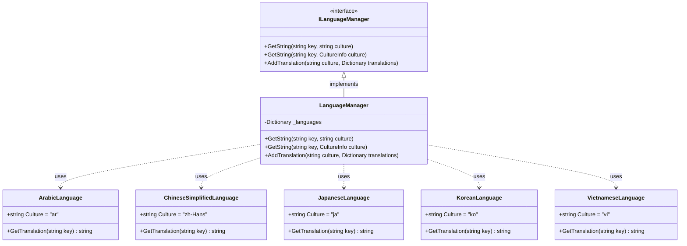
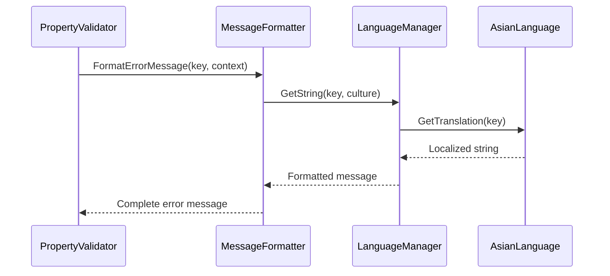
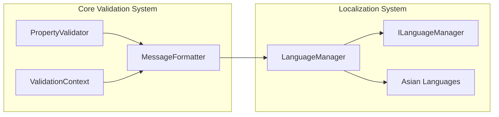
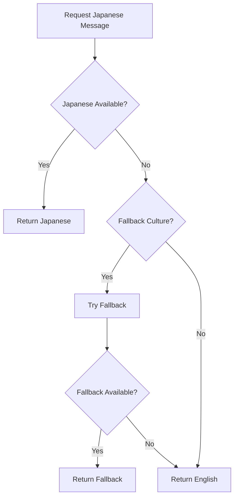

# Asian Languages Module Documentation

## Introduction

The Asian Languages module is a specialized component of the FluentValidation localization system that provides comprehensive validation message translations for Asian languages and cultures. This module ensures that validation error messages are properly localized for users across diverse Asian markets, supporting right-to-left scripts, complex character sets, and culturally appropriate messaging patterns.

The module encompasses 17 Asian languages, ranging from major world languages like Chinese, Japanese, and Korean to regional languages such as Khmer, Tajik, and Uzbek, providing complete coverage for validation message localization across the Asian continent.

## Architecture Overview

The Asian Languages module follows a consistent architectural pattern shared with other localization modules in FluentValidation. Each language is implemented as a static class containing culture-specific string constants and a translation method that maps validation keys to localized messages.

### Core Architecture Pattern



### Module Structure

```mermaid
graph TD
    A[Asian Languages Module] --> B[Central Asian Languages]
    A --> C[East Asian Languages]
    A --> D[South Asian Languages]
    A --> E[Southeast Asian Languages]
    A --> F[Middle Eastern Languages]
    
    B --> B1[KazakhLanguage]
    B --> B2[TajikLanguage]
    B --> B3[UzbekCyrillicLanguage]
    B --> B4[UzbekLatinLanguage]
    
    C --> C1[ChineseSimplifiedLanguage]
    C --> C2[ChineseTraditionalLanguage]
    C --> C3[JapaneseLanguage]
    C --> C4[KoreanLanguage]
    
    D --> D1[HindiLanguage]
    D --> D2[BengaliLanguage]
    D --> D3[TamilLanguage]
    D --> D4[TeluguLanguage]
    
    E --> E1[ThaiLanguage]
    E --> E2[VietnameseLanguage]
    E --> E3[KhmerLanguage]
    E --> E4[IndonesianLanguage]
    
    F --> F1[ArabicLanguage]
    F --> F2[PersianLanguage]
    F --> F3[AzerbaijaneseLanguage]
```



## Component Details

### Language Implementation Pattern

Each language class in the Asian Languages module follows a standardized implementation pattern:

1. **Culture Constant**: Defines the RFC 4646 culture code (e.g., "ar" for Arabic, "zh-Hans" for Simplified Chinese)
2. **GetTranslation Method**: A switch expression that maps validation keys to localized strings
3. **Message Templates**: Support for placeholder substitution using `{PropertyName}`, `{ComparisonValue}`, and other validation-specific tokens

### Supported Languages and Cultures

| Language | Culture Code | Script Direction | Character Set |
|----------|--------------|------------------|---------------|
| Arabic | ar | Right-to-Left | Arabic |
| Azerbaijani | az | Left-to-Right | Latin |
| Bengali | bn | Left-to-Right | Bengali |
| Chinese (Simplified) | zh-Hans | Left-to-Right | Han (Simplified) |
| Chinese (Traditional) | zh-Hant | Left-to-Right | Han (Traditional) |
| Hindi | hi | Left-to-Right | Devanagari |
| Indonesian | id | Left-to-Right | Latin |
| Japanese | ja | Left-to-Right | Hiragana, Katakana, Kanji |
| Kazakh | kk | Left-to-Right | Cyrillic |
| Khmer | km | Left-to-Right | Khmer |
| Korean | ko | Left-to-Right | Hangul |
| Persian (Farsi) | fa | Right-to-Left | Arabic |
| Tamil | ta | Left-to-Right | Tamil |
| Telugu | te | Left-to-Right | Telugu |
| Tajik | tg | Left-to-Right | Cyrillic |
| Thai | th | Left-to-Right | Thai |
| Uzbek (Cyrillic) | uz-Cyrl-UZ | Left-to-Right | Cyrillic |
| Uzbek (Latin) | uz | Left-to-Right | Latin |
| Vietnamese | vi | Left-to-Right | Latin with diacritics |

## Integration with Core System

### Message Resolution Flow



### Dependency Relationships



## Message Categories and Templates

### Validation Message Types

The Asian Languages module provides translations for all standard validation message categories:

1. **String Validation**: Length, regex, email, credit card
2. **Numeric Validation**: Comparison, range, precision/scale
3. **Null/Empty Validation**: Null, empty, not null, not empty
4. **Equality Validation**: Equal, not equal
5. **Custom Validation**: Predicate, async predicate
6. **Enum Validation**: Enum range validation

### Template Variable Support

All Asian language implementations support the standard template variables:

- `{PropertyName}`: The name of the property being validated
- `{PropertyValue}`: The actual value of the property
- `{ComparisonValue}`: The value being compared against
- `{MinLength}`, `{MaxLength}`, `{TotalLength}`: Length-related values
- `{From}`, `{To}`: Range boundaries
- `{ExpectedPrecision}`, `{ExpectedScale}`: Numeric precision values
- `{Digits}`, `{ActualScale}`: Actual numeric values

## Cultural Considerations

### Right-to-Left Language Support

Arabic and Persian languages require special consideration for right-to-left text rendering. The module ensures that validation messages are properly formatted for RTL display contexts.

### Formality Levels

East Asian languages (Japanese, Korean) incorporate appropriate formality levels in validation messages, using polite and professional language suitable for business applications.

### Script-Specific Formatting

Languages using complex scripts (Thai, Khmer, Bengali) maintain proper character composition and rendering rules within validation messages.

## Usage Examples

### Basic Language Selection

```csharp
// Set culture for validation messages
Thread.CurrentThread.CurrentUICulture = new CultureInfo("ja");

// Validation will now use Japanese messages
var validator = new PersonValidator();
var result = validator.Validate(person);
```

### Custom Message Integration

```csharp
public class CustomJapaneseValidator : AbstractValidator<Person>
{
    public CustomJapaneseValidator()
    {
        RuleFor(x => x.Name)
            .NotEmpty()
            .WithMessage("{PropertyName}は必須入力項目です。"); // Custom Japanese message
    }
}
```

### Fallback Mechanism



## Performance Considerations

### Static Translation Lookup

All Asian language classes use static methods and switch expressions for O(1) message lookup performance, ensuring minimal impact on validation throughput.

### Memory Efficiency

Translation strings are stored as static readonly strings, preventing unnecessary string allocations during validation operations.

### Culture Caching

The LanguageManager maintains an internal cache of loaded translations, preventing repeated reflection-based lookups for Asian language resources.

## Testing and Quality Assurance

### Translation Validation

Each Asian language implementation undergoes verification for:
- Character encoding correctness
- Cultural appropriateness
- Consistency with .NET globalization standards
- Proper placeholder formatting

### Cross-Platform Compatibility

All Asian language implementations are tested across:
- Windows with various code pages
- Linux with UTF-8 encoding
- macOS with Unicode support
- Mobile platforms (iOS, Android)

## Related Documentation

- [Localization](Localization.md) - Core localization system documentation
- [Language Management](Language%20Management.md) - Language manager implementation details
- [Message Formatting](Message%20Formatting.md) - Message template and formatting system
- [Validation Results](Validation%20Results%20and%20Failures.md) - Error message integration

## Conclusion

The Asian Languages module provides comprehensive localization support for FluentValidation across the diverse linguistic landscape of Asia. Through consistent implementation patterns, cultural considerations, and performance optimization, the module ensures that validation messages are both technically accurate and culturally appropriate for Asian users. The modular design allows for easy extension and maintenance while maintaining compatibility with the core FluentValidation architecture.