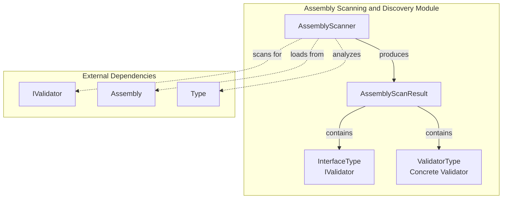
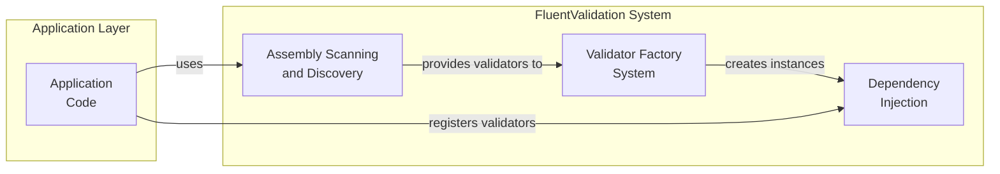
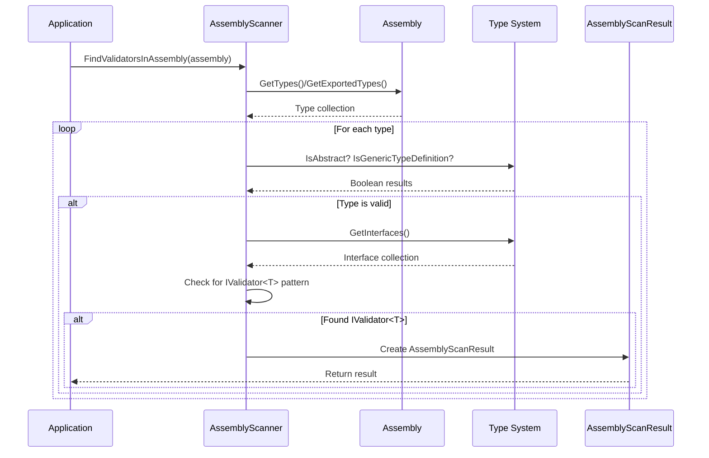
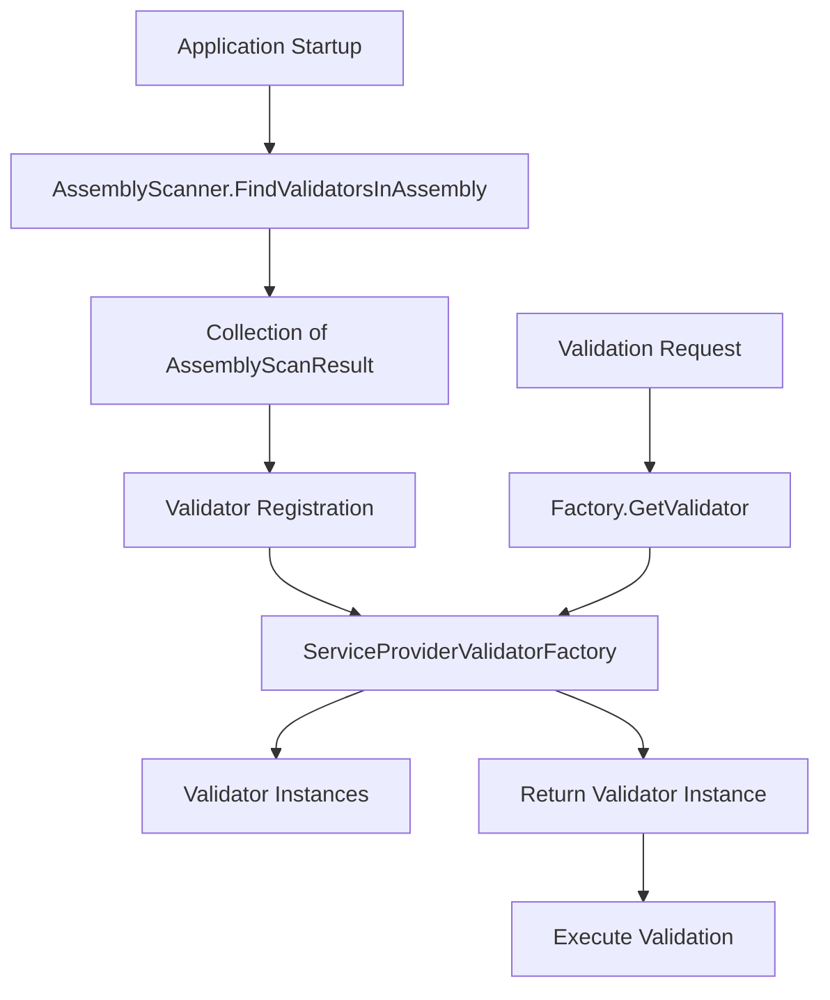
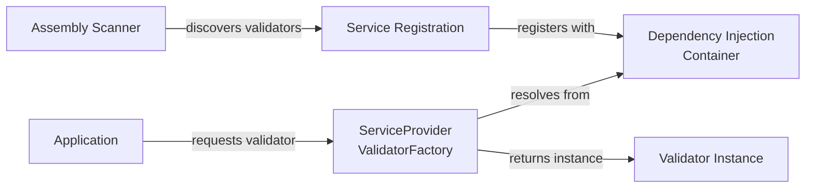

# Assembly Scanning and Discovery Module

## Introduction

The Assembly Scanning and Discovery module provides automatic discovery and registration capabilities for FluentValidation validators within .NET assemblies. This module eliminates the need for manual validator registration by scanning assemblies at runtime to identify and register all validator types that implement the `IValidator<T>` interface pattern.

The module serves as a critical component in the FluentValidation ecosystem, enabling convention-based validator discovery that simplifies application setup and maintenance, particularly in large applications with numerous validators.

## Overview

The Assembly Scanning and Discovery module consists of two primary components:

- **AssemblyScanner**: The main scanning engine that performs assembly analysis and validator discovery
- **AssemblyScanResult**: A result container that holds information about discovered validator types

These components work together to provide a fluent, efficient mechanism for locating validators across single or multiple assemblies, supporting both public and internal validator types.

## Architecture

### Component Architecture



### Integration Architecture



## Core Components

### AssemblyScanner

The `AssemblyScanner` class is the primary entry point for validator discovery operations. It implements `IEnumerable<AssemblyScanResult>` to provide a fluent, LINQ-compatible interface for scanning operations.

#### Key Features:

- **Multiple Assembly Support**: Can scan single assemblies or collections of assemblies
- **Access Control**: Supports scanning both public and internal types
- **Generic Type Discovery**: Automatically identifies types implementing `IValidator<T>`
- **Fluent Interface**: Provides method chaining for flexible scanning scenarios
- **Static Factory Methods**: Offers convenient entry points for common scanning scenarios

#### Static Factory Methods:

```csharp
// Scan a single assembly
FindValidatorsInAssembly(Assembly assembly, bool includeInternalTypes = false)

// Scan multiple assemblies
FindValidatorsInAssemblies(IEnumerable<Assembly> assemblies, bool includeInternalTypes = false)

// Scan assembly containing a specific type
FindValidatorsInAssemblyContaining<T>()
FindValidatorsInAssemblyContaining(Type type)
```

#### Scanning Algorithm:

The scanner uses a LINQ query to identify validator types based on the following criteria:

1. **Type Filtering**: Excludes abstract types and generic type definitions
2. **Interface Analysis**: Examines all implemented interfaces
3. **Generic Interface Matching**: Identifies interfaces matching `IValidator<T>` pattern
4. **Result Creation**: Creates `AssemblyScanResult` instances for each match

### AssemblyScanResult

The `AssemblyScanResult` class encapsulates the results of a scanning operation, providing type information for discovered validators.

#### Properties:

- **InterfaceType**: The generic validator interface type (e.g., `IValidator<Person>`)
- **ValidatorType**: The concrete validator implementation type (e.g., `PersonValidator`)

#### Usage:

Results can be enumerated directly or processed using the `ForEach` method for batch operations.

## Data Flow

### Scanning Process Flow



### Integration with Validator Factory



## Usage Patterns

### Basic Assembly Scanning

```csharp
// Scan the current assembly
var scanner = AssemblyScanner.FindValidatorsInAssembly(Assembly.GetExecutingAssembly());

// Process results
foreach (var result in scanner)
{
    Console.WriteLine($"Found validator: {result.ValidatorType.Name} for {result.InterfaceType.GenericTypeArguments[0].Name}");
}
```

### Scanning with Internal Types

```csharp
// Include internal validators
var scanner = AssemblyScanner.FindValidatorsInAssembly(assembly, includeInternalTypes: true);
```

### Multiple Assembly Scanning

```csharp
// Scan multiple assemblies
var assemblies = new[] { assembly1, assembly2, assembly3 };
var scanner = AssemblyScanner.FindValidatorsInAssemblies(assemblies);
```

### Type-Based Assembly Scanning

```csharp
// Scan assembly containing a specific type
var scanner = AssemblyScanner.FindValidatorsInAssemblyContaining<Person>();
```

## Integration with Dependency Injection

The Assembly Scanning and Discovery module works seamlessly with the [Dependency Injection Extensions](Dependency Injection Extensions.md) module:



### Typical Registration Pattern:

1. **Discovery**: Use `AssemblyScanner` to find all validators
2. **Registration**: Register discovered types with DI container
3. **Factory Configuration**: Configure `ServiceProviderValidatorFactory` to use the DI container
4. **Runtime Resolution**: Factory creates validator instances as needed

## Performance Considerations

### Scanning Efficiency

- **Assembly Loading**: Scanner operates on already-loaded assemblies
- **Type Caching**: Results are not cached; each scan performs fresh analysis
- **LINQ Optimization**: Uses deferred execution for memory efficiency

### Memory Management

- **Streaming Results**: Results are yielded as they're discovered
- **Minimal Allocation**: Creates only necessary objects during scanning
- **Disposable Pattern**: Scanner itself doesn't require disposal

## Error Handling

The Assembly Scanner handles several edge cases gracefully:

- **Empty Assemblies**: Returns empty result set for assemblies without validators
- **Invalid Types**: Skips types that cannot be analyzed
- **Generic Type Definitions**: Excludes open generic types from results
- **Abstract Classes**: Filters out abstract validator base classes

## Relationship to Other Modules

### Core Dependencies

- **[IValidator<T>](Core & Validation Execution.md)**: The scanner searches for implementations of this interface
- **[Validation Context Management](Core & Validation Execution.md#validation-context-management)**: Discovered validators work with the validation context system
- **[Validator Selection System](Core & Validation Execution.md#validator-selection-system)**: Scanned validators integrate with selector mechanisms

### Extended Integration

- **[Dependency Injection Extensions](Dependency Injection Extensions.md)**: Provides factory implementation for scanned validators
- **[Validator Metadata and Descriptors](Core & Validation Execution.md#validator-metadata-and-descriptors)**: Discovered validators expose metadata through descriptor system
- **[Configuration and Global Options](Core & Validation Execution.md#configuration-and-global-options)**: Global settings affect validator behavior post-discovery

## Best Practices

### Assembly Organization

- **Logical Grouping**: Organize validators in assemblies based on business domains
- **Naming Conventions**: Use consistent validator naming patterns (e.g., `*Validator` suffix)
- **Namespace Structure**: Mirror entity namespaces with validator namespaces

### Scanning Strategy

- **Targeted Scanning**: Scan only necessary assemblies to improve startup performance
- **Caching Results**: Cache scan results in application startup if assemblies don't change
- **Internal Validator Support**: Use `includeInternalTypes` for internal validators in library projects

### Registration Patterns

- **Lifetime Management**: Register validators with appropriate DI lifetimes (typically transient)
- **Generic Registration**: Register both closed and open generic validator types
- **Factory Integration**: Use `ServiceProviderValidatorFactory` for automatic resolution

## Advanced Scenarios

### Custom Scanning Logic

Extend the basic scanning functionality by filtering results:

```csharp
var scanner = AssemblyScanner.FindValidatorsInAssembly(assembly)
    .Where(result => result.ValidatorType.Namespace.StartsWith("MyApp.Validators"));
```

### Batch Registration

Use the `ForEach` method for efficient batch operations:

```csharp
AssemblyScanner.FindValidatorsInAssembly(assembly)
    .ForEach(result => {
        // Custom registration logic
        services.AddTransient(result.InterfaceType, result.ValidatorType);
    });
```

### Assembly Scanning with Reflection Contexts

The scanner works with various assembly loading scenarios:

- **Runtime Assembly Loading**: Scans dynamically loaded assemblies
- **Plugin Architectures**: Discovers validators in plugin assemblies
- **Module Systems**: Supports modular application architectures

## Summary

The Assembly Scanning and Discovery module provides a robust, efficient mechanism for automatic validator discovery and registration. By eliminating manual registration requirements, it simplifies application setup and maintenance while supporting flexible scanning scenarios. The module's integration with the broader FluentValidation ecosystem makes it an essential component for convention-based validation architectures.