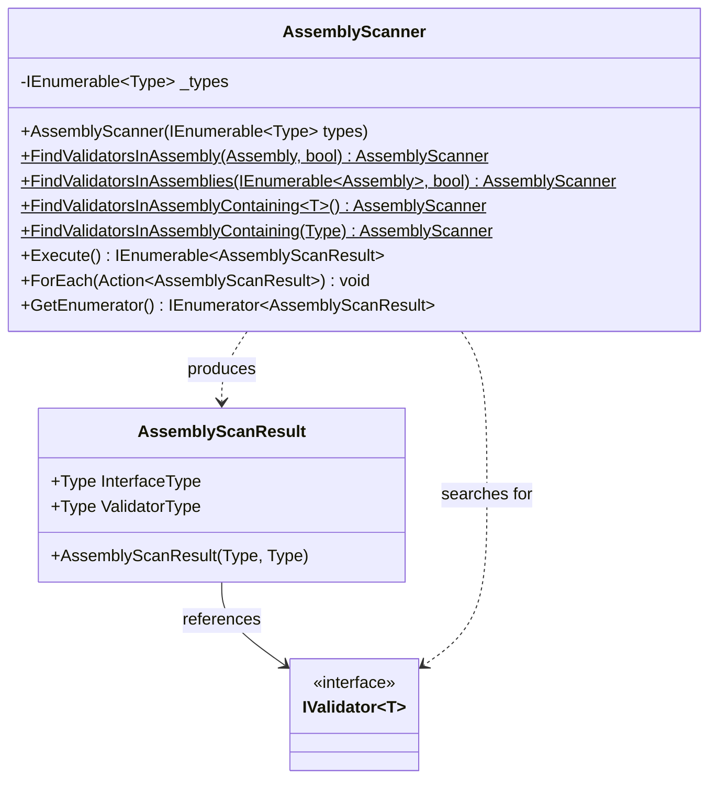
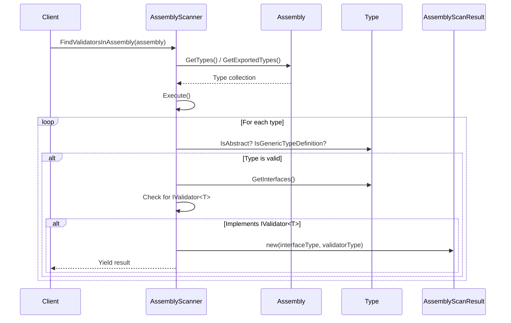
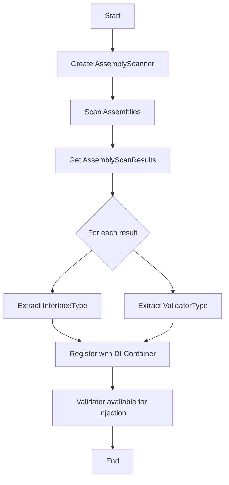

# Assembly Scanning Module Documentation

## Introduction

The Assembly Scanning module provides automatic discovery and registration capabilities for FluentValidation validators within .NET assemblies. This module eliminates the need for manual validator registration by scanning assemblies and identifying all classes that implement the `IValidator<T>` interface, enabling automatic dependency injection and validator discovery patterns.

## Core Components

### AssemblyScanner
The `AssemblyScanner` class is the primary component responsible for discovering validators within assemblies. It provides static factory methods for different scanning scenarios and implements `IEnumerable<AssemblyScanResult>` to yield scan results.

### AssemblyScanResult
The `AssemblyScanResult` class represents the outcome of a scanning operation, containing the discovered validator interface type and its concrete implementation type.

## Architecture

### Component Overview



### Scanning Process Flow



## Key Features

### 1. Flexible Assembly Scanning
The module supports multiple scanning approaches:
- **Single Assembly**: Scan a specific assembly
- **Multiple Assemblies**: Scan a collection of assemblies
- **Type-based**: Scan the assembly containing a specific type
- **Visibility Control**: Option to include internal types

### 2. Generic Validator Discovery
The scanner specifically looks for implementations of the generic `IValidator<T>` interface, ensuring that only proper validators are discovered.

### 3. LINQ-based Querying
The scanning process uses LINQ queries to efficiently filter and identify validator types based on interface implementation.

## Usage Patterns

### Basic Assembly Scanning
```csharp
// Scan a specific assembly
var scanner = AssemblyScanner.FindValidatorsInAssembly(typeof(MyEntity).Assembly);

// Scan multiple assemblies
var assemblies = new[] { typeof(MyEntity).Assembly, typeof(OtherEntity).Assembly };
var scanner = AssemblyScanner.FindValidatorsInAssemblies(assemblies);

// Scan assembly containing a type
var scanner = AssemblyScanner.FindValidatorsInAssemblyContaining<MyEntity>();
```

### Processing Scan Results
```csharp
// Iterate through results
foreach (var result in scanner)
{
    Console.WriteLine($"Found validator: {result.ValidatorType.Name} for {result.InterfaceType.GenericTypeArguments[0].Name}");
}

// Use ForEach method
scanner.ForEach(result => 
{
    // Register validator with DI container
    services.AddTransient(result.InterfaceType, result.ValidatorType);
});
```

## Integration with Dependency Injection

The Assembly Scanning module is designed to work seamlessly with dependency injection containers. The typical integration pattern involves:

1. Scanning assemblies for validators
2. Registering discovered validators with the DI container
3. Using the registered validators throughout the application



## Relationship to Other Modules

### Core Validation Engine
The Assembly Scanning module depends on the [Core Validation Engine](Core_Validation_Engine.md) through the `IValidator<T>` interface. It discovers concrete implementations of validators that are defined and configured using the core validation components.

### Validator Factory
The scanning results are typically consumed by the [Validator Factory](Validator_Factory.md) module, which uses the discovered types to create validator instances. The `ServiceProviderValidatorFactory` in the Dependency Injection module often relies on assembly scanning to populate its validator registry.

### Dependency Injection
The Assembly Scanning module works closely with the [Dependency Injection](Dependency_Injection.md) module to automatically register discovered validators with the service collection, enabling constructor injection of validators throughout the application.

## Performance Considerations

### Type Filtering
The scanner performs efficient filtering by:
- Excluding abstract types
- Excluding generic type definitions
- Only processing types that implement generic interfaces

### Memory Efficiency
The module uses deferred execution (yield return) to process results, making it memory-efficient for large assemblies.

### Caching Opportunities
Applications can cache scan results to avoid repeated assembly scanning operations, especially in production environments.

## Error Handling

The module handles edge cases gracefully:
- **No Validators Found**: Returns empty collection
- **Invalid Assemblies**: Handles reflection exceptions appropriately
- **Type Access Issues**: Respects visibility modifiers (public vs. internal)

## Best Practices

### 1. Assembly Selection
- Scan only necessary assemblies to improve performance
- Use assembly containing known types to ensure relevant validators are discovered
- Consider organizing validators in dedicated assemblies

### 2. Registration Strategy
- Register validators with appropriate lifetimes (typically transient)
- Consider using factory patterns for complex validator creation scenarios
- Implement proper disposal patterns for validators with dependencies

### 3. Integration Patterns
- Combine with dependency injection for automatic registration
- Use with validator factories for runtime validator resolution
- Implement caching strategies for frequently accessed validators

## Extension Points

The Assembly Scanning module can be extended by:
- Creating custom scanner implementations with additional filtering criteria
- Implementing custom result processing logic
- Adding metadata to scan results for advanced registration scenarios
- Integrating with different dependency injection containers

## Conclusion

The Assembly Scanning module provides a robust foundation for automatic validator discovery in FluentValidation-based applications. By eliminating manual registration requirements and providing flexible scanning options, it simplifies the development process and ensures that all validators are properly registered and available for use throughout the application lifecycle.