# Built-in Validators Module

## Overview

The Built-in Validators module is a comprehensive collection of pre-built validation components that form the core validation logic of the FluentValidation library. This module provides a rich set of validators for common validation scenarios, eliminating the need for developers to write custom validation logic for standard use cases.

## Purpose

The primary purpose of this module is to:
- Provide ready-to-use validators for common validation patterns
- Ensure consistent validation behavior across applications
- Offer both synchronous and asynchronous validation capabilities
- Support complex validation scenarios including nested objects and collections
- Enable extensibility through base classes and interfaces

## Architecture

The Built-in Validators module follows a hierarchical design pattern with clear separation of concerns:

```mermaid
graph TD
    A[IPropertyValidator] --> B[PropertyValidator<T,TProperty>]
    A --> C[IAsyncPropertyValidator<T,TProperty>]
    A --> D[IComparisonValidator]
    A --> E[IBetweenValidator]
    A --> F[IEmailValidator]
    A --> G[ILengthValidator]
    A --> H[IEnumValidator]
    
    B --> I[AbstractComparisonValidator<T,TProperty>]
    B --> J[RangeValidator<T,TProperty>]
    B --> K[ChildValidatorAdaptor<T,TProperty>]
    B --> L[PolymorphicValidator<T,TProperty>]
    
    I --> M[EqualValidator<T,TProperty>]
    I --> N[GreaterThanValidator<T,TProperty>]
    I --> O[LessThanValidator<T,TProperty>]
    I --> P[GreaterThanOrEqualValidator<T,TProperty>]
    I --> Q[LessThanOrEqualValidator<T,TProperty>]
    
    J --> R[InclusiveBetweenValidator<T,TProperty>]
    J --> S[ExclusiveBetweenValidator<T,TProperty>]
    
    B --> T[NotNullValidator<T,TProperty>]
    B --> U[NullValidator<T,TProperty>]
    B --> V[NotEmptyValidator<T,TProperty>]
    B --> W[EmptyValidator<T,TProperty>]
    B --> X[EmailValidator<T>]
    B --> Y[AspNetCoreCompatibleEmailValidator<T>]
    B --> Z[CreditCardValidator<T>]
    B --> AA[RegularExpressionValidator<T>]
    B --> AB[LengthValidator<T>]
    B --> AC[EnumValidator<T,TProperty>]
    B --> AD[StringEnumValidator<T>]
    B --> AE[PredicateValidator<T,TProperty>]
    B --> AF[AsyncPredicateValidator<T,TProperty>]
    B --> AG[PrecisionScaleValidator<T>]
```



## Core Components

### Base Validator Classes

#### PropertyValidator<T,TProperty>
The foundational base class for all synchronous property validators. Provides:
- Common validation context handling
- Message formatting and localization support
- Error code management
- Default message template generation

#### AbstractComparisonValidator<T,TProperty>
Base class for comparison-based validators. Features:
- Support for both constant and property-to-property comparisons
- Nullable type handling
- Member comparison capabilities
- Generic type constraints for IComparable<T>

#### RangeValidator<T,TProperty>
Foundation for range-based validation. Provides:
- Configurable comparers
- From/To value management
- Extensible range checking logic

### Validator Categories

#### 1. [Comparison Validators](Comparison Validators.md)
Perform various comparison operations including equality, inequality, greater than, less than, and range validations.

#### 2. [String Validators](String Validators.md)
Specialized string validation including length, regex, email, credit card, and enum string validation.

#### 3. [Null and Empty Validators](Null and Empty Validators.md)
Handle null and empty value validation scenarios.

#### 4. [Custom and Predicate Validators](Custom and Predicate Validators.md)
Support for custom validation logic through predicates and async predicates.

#### 5. [Complex Object Validators](Complex Object Validators.md)
Handle nested object validation including child validators and polymorphic scenarios.

#### 6. [Enum and Numeric Validators](Enum and Numeric Validators.md)
Handle enum validation and numeric precision/scale validation.

## Key Features

### Type Safety
All validators are strongly typed with generic parameters T (model type) and TProperty (property type), ensuring compile-time type safety.

### Async Support
Many validators provide async variants through IAsyncPropertyValidator<T,TProperty>, enabling non-blocking validation operations.

### Localization
All validators support localization through the Localized() method, integrating with the [Localization](Localization.md) module for multi-language support.

### Extensibility
The module provides multiple extension points:
- Custom validators can inherit from PropertyValidator<T,TProperty>
- Interface-based design allows for custom validator implementations
- Support for custom comparers and equality comparers

### Performance
- Efficient validation logic with early exit strategies
- Minimal memory allocation during validation
- Support for value type validation without boxing

## Integration with Other Modules

The Built-in Validators module integrates seamlessly with other FluentValidation modules:

- **[Core & Validation Execution](Core & Validation Execution.md)**: Validators are executed within the validation context managed by the core module
- **[Fluent API & Rule Definition](Fluent API & Rule Definition.md)**: Validators are configured and applied through the fluent API
- **[Localization](Localization.md)**: All validators support localized error messages
- **[Validation Results and Failures](Validation Results and Failures.md)**: Validators generate validation failures that are collected and managed by the results module

## Usage Examples

### Basic Usage
```csharp
RuleFor(x => x.Email)
    .NotEmpty()
    .EmailAddress();

RuleFor(x => x.Age)
    .InclusiveBetween(18, 65);

RuleFor(x => x.Password)
    .MinimumLength(8)
    .MaximumLength(50);
```

### Advanced Usage
```csharp
RuleFor(x => x.OrderDate)
    .LessThan(DateTime.Now)
    .WithMessage("Order date must be in the past");

RuleFor(x => x.ConfirmPassword)
    .Equal(x => x.Password)
    .WithMessage("Passwords must match");

RuleFor(x => x.CreditCard)
    .CreditCard()
    .When(x => x.PaymentMethod == PaymentMethod.CreditCard);
```

## Best Practices

1. **Choose the Right Validator**: Select the most specific validator for your use case
2. **Combine Validators**: Use multiple validators for comprehensive validation
3. **Consider Performance**: Use async validators for I/O-bound validation
4. **Handle Nulls Appropriately**: Most validators return true for null values - add NotNull validators when needed
5. **Use Custom Validators**: Create custom validators for complex business rules

## Summary

The Built-in Validators module provides a comprehensive, extensible, and performant set of validation components that cover the majority of common validation scenarios. Its well-designed architecture, type safety, and integration capabilities make it an essential part of the FluentValidation ecosystem.