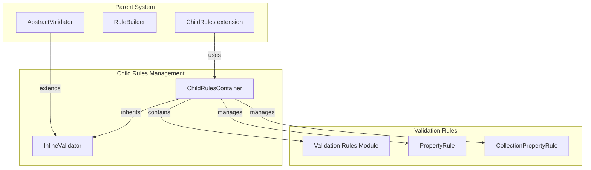
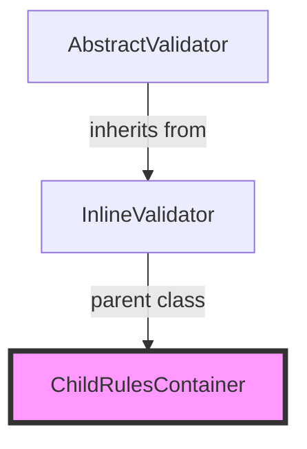
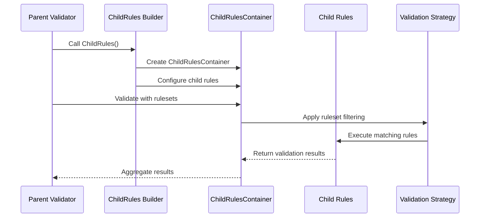
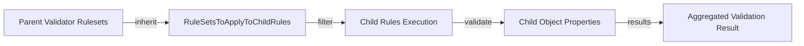
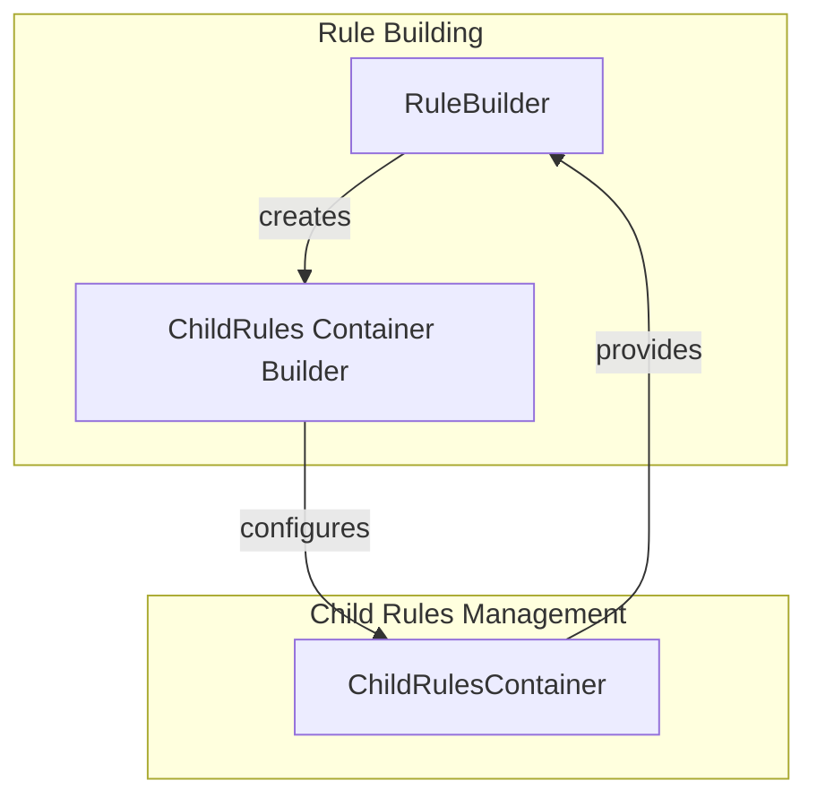
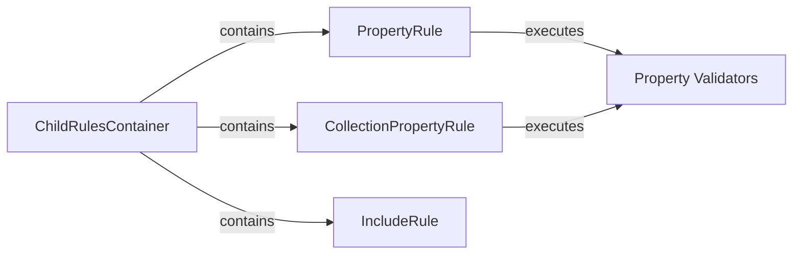
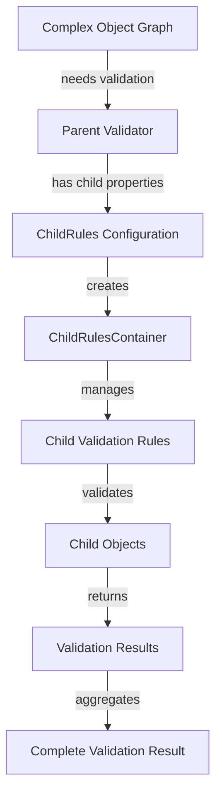
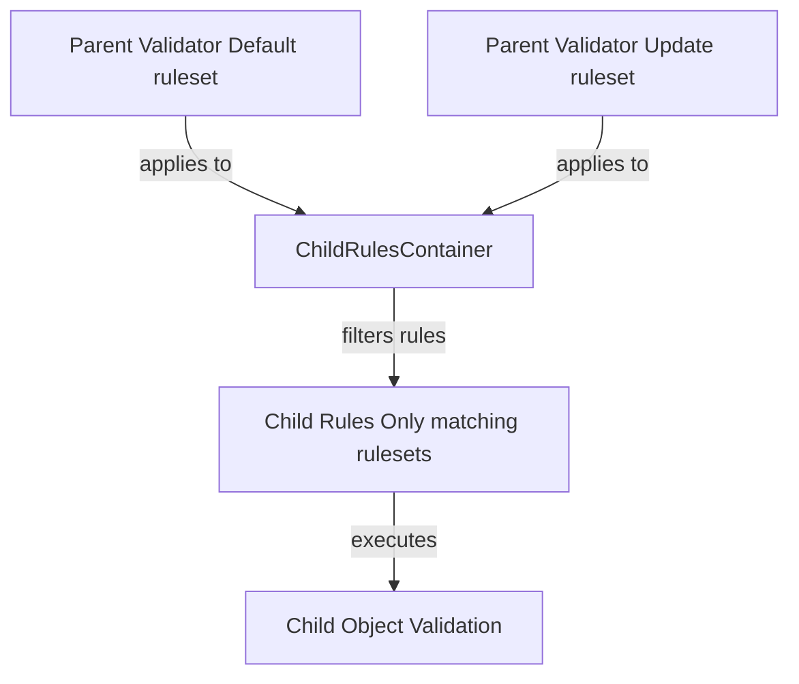

# Child Rules Management Module

## Introduction

The Child Rules Management module is a specialized component within the FluentValidation framework that handles the containment and management of child validation rules. This module provides the infrastructure for managing nested validation scenarios where complex object hierarchies require validation at multiple levels. It serves as a bridge between parent validators and their child rule definitions, enabling sophisticated validation scenarios for complex object graphs.

## Core Purpose

The primary purpose of this module is to:
- Manage child validation rules within parent validation contexts
- Handle ruleset propagation from parent validators to child rules
- Provide a container mechanism for nested validation scenarios
- Enable complex object hierarchy validation with proper rule inheritance

## Architecture Overview

### Component Structure

### Inheritance Hierarchy

## Core Components

### ChildRulesContainer<T>

The `ChildRulesContainer<T>` is the primary component of this module. It's an internal class that extends `InlineValidator<T>` to provide specialized functionality for containing and managing child validation rules.

**Key Characteristics:**
- **Internal Access**: Designed for internal framework use
- **Generic Type Support**: Works with any type `T` that needs validation
- **Ruleset Propagation**: Manages ruleset inheritance from parent validators
- **Nested Validation Support**: Enables complex object graph validation

**Key Property:**
- `RuleSetsToApplyToChildRules`: An array of ruleset names that should be applied to child rules, enabling selective validation based on context

## Data Flow

### Child Rules Validation Flow

### Ruleset Propagation Process

## Integration with Other Modules

### Relationship with Rule Building Module

The Child Rules Management module works closely with the [Rule Building](Rule_Building.md) module:

### Integration with Validation Rules Module

The module leverages the [Validation Rules](Validation_Rules.md) module for actual rule execution:

## Usage Patterns

### Typical Usage Scenario

### Ruleset Inheritance Example

## Key Features

### 1. Ruleset Propagation
- Automatically inherits rulesets from parent validators
- Enables context-aware validation for different scenarios
- Supports multiple nested levels of child rules

### 2. Container Management
- Provides dedicated container for child rule definitions
- Maintains separation between parent and child validation logic
- Enables reusable child validation patterns

### 3. Integration with FluentValidation Pipeline
- Seamlessly integrates with existing validation infrastructure
- Leverages standard validation components and patterns
- Maintains consistency with overall framework design

## Dependencies

### Direct Dependencies
- **InlineValidator<T>**: Parent class providing base validation functionality
- **Validation Rules Module**: For rule execution and management
- **Rule Building Module**: For configuration and setup

### Indirect Dependencies
- **Property Validators Module**: For actual validation logic execution
- **Validator Selection Module**: For ruleset-based filtering
- **Localization Module**: For error message formatting

## Best Practices

### 1. Ruleset Management
- Use meaningful ruleset names that reflect validation contexts
- Ensure parent and child rulesets are properly aligned
- Consider validation performance when defining nested rules

### 2. Container Usage
- Leverage ChildRulesContainer for complex object hierarchies
- Keep child validation logic separate and focused
- Use appropriate ruleset propagation for context-aware validation

### 3. Performance Considerations
- Minimize deep nesting of child rules when possible
- Use ruleset filtering to avoid unnecessary validation execution
- Consider caching strategies for frequently validated object graphs

## Extension Points

The module is designed for internal framework use but provides extension opportunities through:
- Custom ruleset propagation logic
- Specialized child rule containers for specific scenarios
- Integration with custom validation strategies

## Related Documentation

- [Rule Building Module](Rule_Building.md) - For understanding rule configuration
- [Validation Rules Module](Validation_Rules.md) - For rule execution details
- [Property Validators Module](Property_Validators.md) - For validation logic implementation
- [Validator Selection Module](Validator_Selection.md) - For ruleset filtering mechanisms