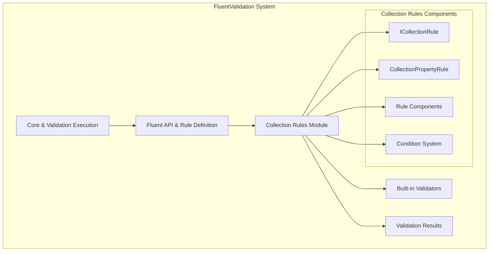
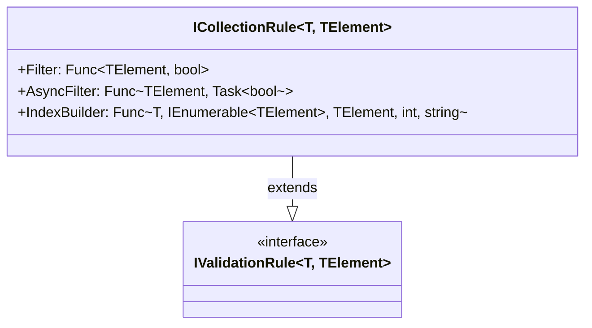
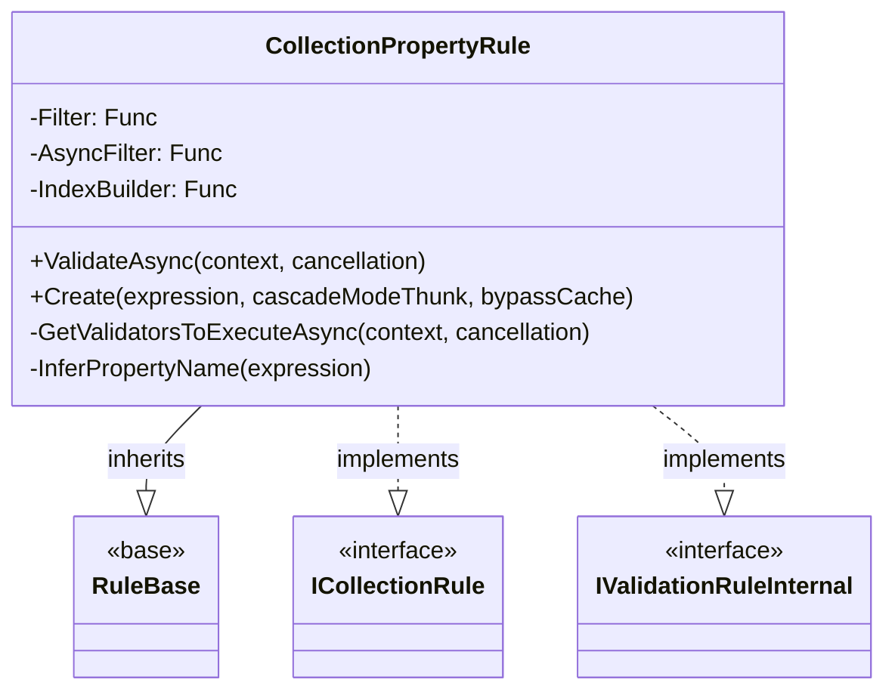
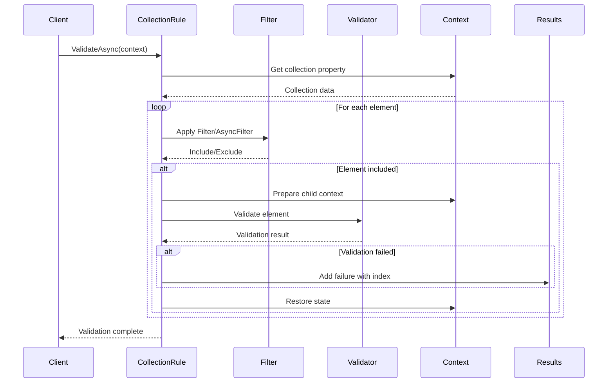
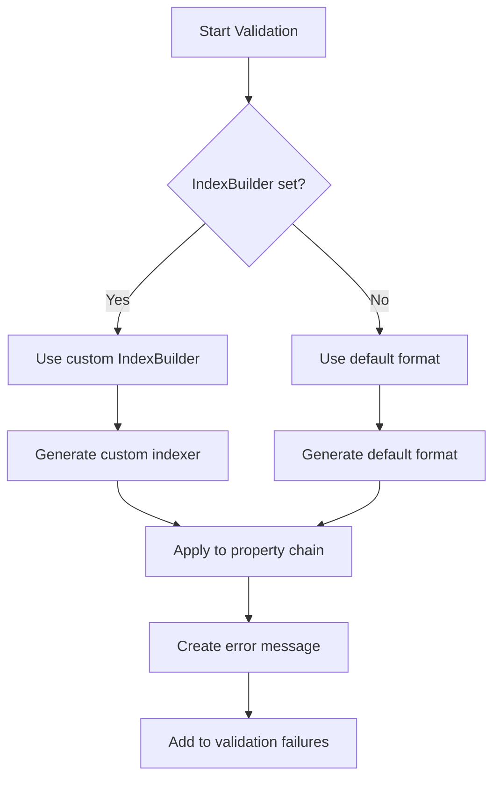
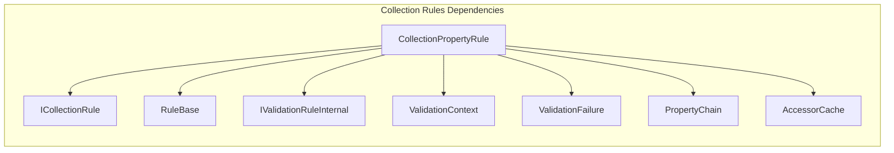
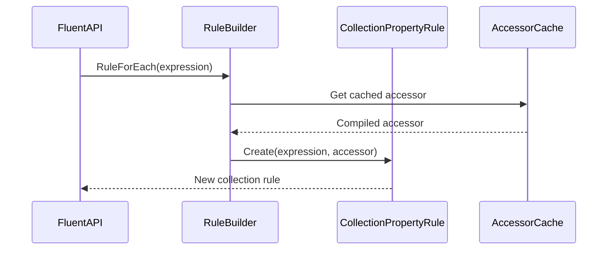

# Collection Rules Module Documentation

## Introduction

The Collection Rules module in FluentValidation provides specialized validation capabilities for collection properties within objects. It enables developers to apply validation rules to individual elements within collections, supporting both synchronous and asynchronous filtering, custom indexing, and comprehensive error reporting for collection-based data structures.

This module is essential for scenarios where you need to validate complex object graphs containing lists, arrays, or other enumerable types, ensuring data integrity across collection elements while maintaining detailed error context.

## Architecture Overview

The Collection Rules module is built around two primary components that work together to provide comprehensive collection validation functionality:

### Core Components

1. **ICollectionRule<T, TElement>** - The public interface defining the contract for collection validation rules
2. **CollectionPropertyRule<T, TElement>** - The internal implementation that handles the actual validation logic

### Module Position in System Architecture



## Component Architecture

### Interface Design (ICollectionRule)

The `ICollectionRule<T, TElement>` interface extends the base `IValidationRule<T, TElement>` to provide collection-specific functionality:



### Implementation Architecture (CollectionPropertyRule)

The `CollectionPropertyRule<T, TElement>` class implements the collection validation logic with sophisticated error handling and performance optimization:



## Data Flow Architecture

### Validation Process Flow



### Index Building Process



## Key Features and Capabilities

### 1. Collection Filtering

The module supports both synchronous and asynchronous filtering of collection elements before validation:

- **Synchronous Filter**: `Func<TElement, bool>` for simple inclusion/exclusion logic
- **Asynchronous Filter**: `Func<TElement, Task<bool>>` for complex filtering requiring async operations

### 2. Custom Index Formatting

Developers can customize how collection indices appear in error messages through the `IndexBuilder` function:

```csharp
// Default format: "[0]", "[1]", etc.
// Custom format: "Item 1", "Item 2", etc.
collectionRule.IndexBuilder = (root, collection, element, index) => $"Item {index + 1}";
```

### 3. Performance Optimization

The implementation includes several performance optimizations:

- **Accessor Caching**: Compiled property accessors are cached for repeated use
- **Validator Pre-filtering**: Conditions are evaluated before collection enumeration
- **State Management**: Efficient context state save/restore during iteration

### 4. Error Context Preservation

Each validation failure includes:
- Collection property path
- Element index with custom formatting
- Element-specific error details
- Full property chain for nested collections

## Integration with FluentValidation System

### Dependency Relationships



### Rule Creation Process

Collection rules are typically created through the fluent API using `RuleForEach()`:



## Error Handling and Edge Cases

### Null Reference Protection

The implementation includes comprehensive null reference protection:

```csharp
try {
    collection = PropertyFunc(context.InstanceToValidate);
}
catch (NullReferenceException nre) {
    throw new NullReferenceException($"NullReferenceException occurred when executing rule for {Expression}. If this property can be null you should add a null check using a When condition", nre);
}
```

### Property Name Inference

When property names cannot be automatically determined, the system provides clear guidance:

```csharp
private static string InferPropertyName(LambdaExpression expression) {
    var paramExp = expression.Body as ParameterExpression;
    
    if (paramExp == null) {
        throw new InvalidOperationException("Could not infer property name for expression: " + expression + ". Please explicitly specify a property name by calling OverridePropertyName as part of the rule chain. Eg: RuleForEach(x => x).NotNull().OverridePropertyName(\"MyProperty\")");
    }
    
    return paramExp.Name;
}
```

### Cascade Mode Support

The module supports FluentValidation's cascade modes for early termination:

- **Continue**: Validate all elements regardless of failures
- **Stop**: Stop validation on first failure within the collection

## Usage Patterns

### Basic Collection Validation

```csharp
RuleForEach(x => x.Items)
    .NotEmpty()
    .WithMessage("Item cannot be empty");
```

### Filtered Collection Validation

```csharp
RuleForEach(x => x.Orders)
    .Filter(order => order.Status == OrderStatus.Active)
    .Must(order => order.Total > 0)
    .WithMessage("Active orders must have positive totals");
```

### Custom Index Formatting

```csharp
RuleForEach(x => x.Students)
    .IndexBuilder((root, collection, element, index) => $"Student #{index + 1}")
    .Must(student => student.Grade >= 60)
    .WithMessage("Student must have passing grade");
```

## Performance Considerations

### Memory Management

- **Object Pooling**: Context objects are reused where possible
- **State Restoration**: Property chain state is efficiently restored after each element
- **Lazy Evaluation**: Collection elements are processed on-demand

### Async Performance

- **Concurrent Validation**: Multiple elements can be validated concurrently
- **Cancellation Support**: Proper cancellation token propagation
- **Task Optimization**: Minimal task allocation for synchronous paths

## Testing and Quality Assurance

The Collection Rules module includes comprehensive test coverage for:

- Collection validation with various data types
- Filter functionality (sync and async)
- Custom index formatting
- Error message accuracy
- Performance under load
- Edge case handling (null collections, empty collections, etc.)

## Related Documentation

For additional information about related modules, see:

- [Fluent API & Rule Definition](Fluent API & Rule Definition.md) - For general rule creation patterns
- [Validation Results and Failures](Validation Results and Failures.md) - For error handling and result processing
- [Built-in Validators](Built-in Validators.md) - For available validation constraints
- [Validation Context Management](Validation Context Management.md) - For context and state management

## Conclusion

The Collection Rules module provides a robust, performant, and flexible solution for validating collection properties within the FluentValidation framework. Its design emphasizes developer experience through intuitive APIs, comprehensive error reporting, and seamless integration with the broader validation ecosystem. The module's architecture supports complex validation scenarios while maintaining high performance and reliability standards.