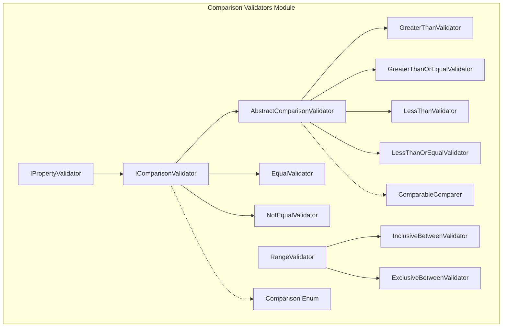
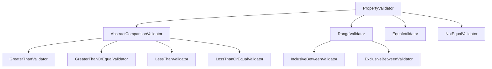
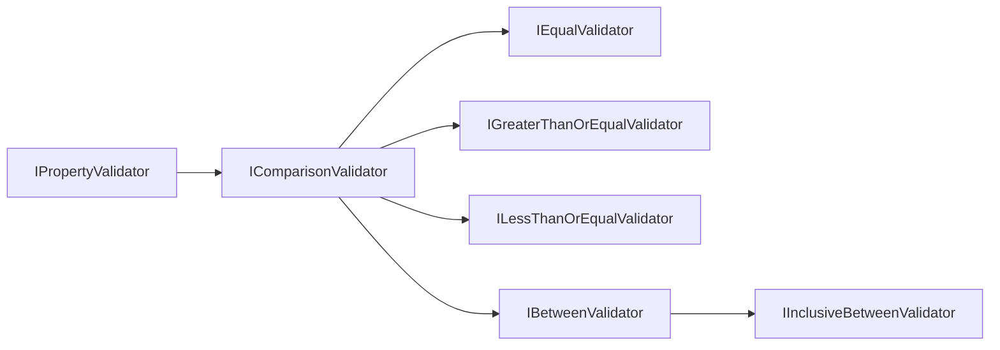
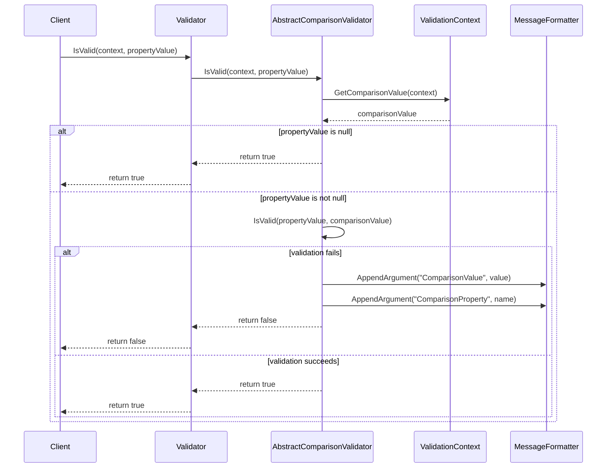
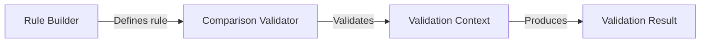

# Comparison Validators Module

## Introduction

The Comparison Validators module provides a comprehensive set of validation rules for comparing property values against other values, properties, or ranges. This module is essential for implementing business rules that require numerical comparisons, equality checks, range validations, and relative value validations in .NET applications.

## Overview

Comparison validators enable developers to validate that property values meet specific comparison criteria, such as being greater than a threshold, falling within a range, or matching specific values. The module supports both simple value comparisons and complex property-to-property comparisons, making it highly flexible for various validation scenarios.

## Architecture

### Core Components

The module is built around several key architectural components:

#### 1. Abstract Base Classes
- **AbstractComparisonValidator<T, TProperty>**: The foundation for all comparison validators, providing common functionality for value comparison logic
- **RangeValidator<T, TProperty>**: Base class for range-based validators (InclusiveBetween, ExclusiveBetween)

#### 2. Concrete Validator Implementations
- **EqualValidator**: Validates equality with a specific value or property
- **NotEqualValidator**: Validates inequality with a specific value or property
- **GreaterThanValidator**: Validates that a value is greater than a threshold
- **GreaterThanOrEqualValidator**: Validates that a value is greater than or equal to a threshold
- **LessThanValidator**: Validates that a value is less than a threshold
- **LessThanOrEqualValidator**: Validates that a value is less than or equal to a threshold
- **InclusiveBetweenValidator**: Validates that a value falls within a range (inclusive)
- **ExclusiveBetweenValidator**: Validates that a value falls within a range (exclusive)

#### 3. Supporting Infrastructure
- **IComparisonValidator**: Interface defining the contract for all comparison validators
- **ComparableComparer<T>**: Internal comparer for handling IComparable<T> types
- **Comparison Enum**: Defines the types of comparisons available

### Architecture Diagram



## Component Relationships

### Inheritance Hierarchy



### Interface Implementation



## Data Flow

### Validation Process Flow



## Key Features

### 1. Flexible Comparison Sources
Comparison validators support multiple sources for comparison values:
- **Static Values**: Direct value comparison (e.g., `GreaterThan(18)`)
- **Property Comparisons**: Compare against other properties (e.g., `GreaterThan(x => x.MinimumAge)`)
- **Nullable Support**: Proper handling of nullable types with value extraction

### 2. Type Safety
- Generic implementation ensures type safety at compile time
- Support for any type implementing `IComparable<T>` and `IComparable`
- Specialized equality comparers for custom comparison logic

### 3. Localization Support
- All validators inherit localization capabilities from the base [Property Validator](Property%20Validator.md) system
- Consistent error message formatting across all comparison validators

### 4. Range Validation
- Inclusive range validation (between two values, including boundaries)
- Exclusive range validation (between two values, excluding boundaries)
- Support for custom comparers for specialized comparison logic

## Usage Patterns

### Basic Value Comparison
```csharp
RuleFor(x => x.Age).GreaterThan(18);
RuleFor(x => x.Price).LessThanOrEqualTo(1000);
RuleFor(x => x.Name).NotEqual("admin");
```

### Property-to-Property Comparison
```csharp
RuleFor(x => x.EndDate).GreaterThan(x => x.StartDate);
RuleFor(x => x.MaxValue).GreaterThanOrEqualTo(x => x.MinValue);
```

### Range Validation
```csharp
RuleFor(x => x.Score).InclusiveBetween(0, 100);
RuleFor(x => x.Temperature).ExclusiveBetween(-273.15, 1000);
```

## Integration with FluentValidation

The Comparison Validators module integrates seamlessly with the broader FluentValidation ecosystem:

### Dependencies
- **Property Validator System**: Inherits from [Property Validator](Property%20Validator.md) base classes
- **Validation Context**: Uses [Validation Context Management](Core%20&%20Validation%20Execution.md#validation-context-management) for execution
- **Localization**: Leverages [Localization](Localization.md) for error messages
- **Rule Builder**: Integrates with [Fluent API & Rule Definition](Fluent%20API%20&%20Rule%20Definition.md) for syntax

### Validation Execution Flow


## Error Handling and Messaging

### Message Formatting
Comparison validators automatically populate message formatters with:
- `{ComparisonValue}`: The value being compared against
- `{ComparisonProperty}`: The name of the property being compared (for property comparisons)
- `{PropertyName}`: The name of the property being validated
- `{PropertyValue}`: The actual value of the property

### Custom Error Messages
All comparison validators support custom error messages through the standard FluentValidation message customization APIs.

## Performance Considerations

### Caching
- Comparison values are calculated once per validation execution
- No caching of comparison values across multiple validations (by design, to support dynamic comparisons)

### Memory Efficiency
- Generic implementations avoid boxing for value types
- Minimal object allocation during validation execution

## Extensibility

### Custom Comparison Validators
Developers can extend the comparison validation system by:
1. Inheriting from `AbstractComparisonValidator<T, TProperty>`
2. Implementing the `IComparisonValidator` interface
3. Overriding the `IsValid(TProperty value, TProperty valueToCompare)` method

### Custom Comparers
- Support for custom `IComparer<T>` implementations in range validators
- Support for custom `IEqualityComparer<T>` implementations in equality validators

## Best Practices

### 1. Null Handling
- Comparison validators automatically handle null values by returning `true` (no validation error)
- Use [Null and Empty Validators](Built-in%20Validators.md#null-and-empty-validators) for explicit null checking

### 2. Type Compatibility
- Ensure compared types implement `IComparable<T>` for ordering comparisons
- Use appropriate equality comparers for complex types

### 3. Property Comparison
- When comparing properties, ensure the comparison property is validated first
- Consider using [Condition System](Fluent%20API%20&%20Rule%20Definition.md#condition-system) for conditional validation

## Related Documentation

- [Built-in Validators](Built-in%20Validators.md) - Overview of all built-in validators
- [Property Validator](Property%20Validator.md) - Base property validation system
- [Fluent API & Rule Definition](Fluent%20API%20&%20Rule%20Definition.md) - Rule building syntax
- [Core & Validation Execution](Core%20&%20Validation%20Execution.md) - Validation execution framework
- [Localization](Localization.md) - Error message localization system