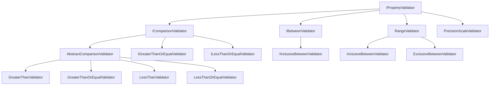
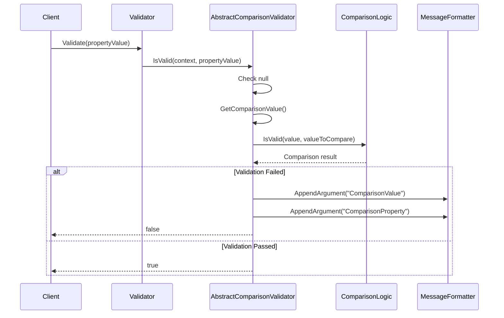
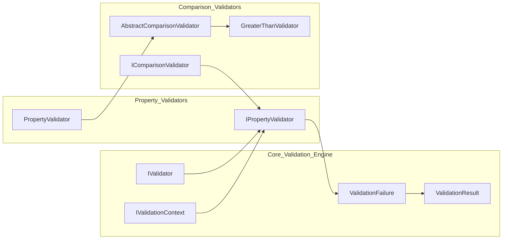

# Comparison Validators Module

## Introduction

The Comparison_Validators module provides a comprehensive set of validation rules for comparing property values against other values, properties, or ranges. This module is essential for implementing business rules that require numerical comparisons, range validations, and precision/scale constraints for decimal values.

## Module Overview

The Comparison_Validators module extends the [Property_Validators](Property_Validators.md) module by providing specialized validators that perform comparison operations. These validators are built on top of the abstract comparison framework and support various comparison types including greater than, less than, equal, and range validations.

## Core Architecture

### Component Hierarchy



### Key Components

#### AbstractComparisonValidator<T, TProperty>
The foundation class for all comparison validators that:
- Implements `IComparisonValidator` interface
- Constrains `TProperty` to `IComparable<TProperty>, IComparable`
- Provides comparison logic against static values, property values, or nullable values
- Handles null value scenarios appropriately
- Supports both direct value comparison and member-to-member comparison

#### Comparison Types
The module supports six comparison operations through the `Comparison` enum:
- **Equal**: Value equality comparison
- **NotEqual**: Value inequality comparison  
- **LessThan**: Strictly less than comparison
- **GreaterThan**: Strictly greater than comparison
- **GreaterThanOrEqual**: Greater than or equal comparison
- **LessThanOrEqual**: Less than or equal comparison

## Validator Types

### Single Value Comparison Validators

#### GreaterThanValidator<T, TProperty>
Validates that a property value is strictly greater than a specified value.
- **Use Case**: Age validation (must be greater than 18), price thresholds
- **Comparison**: Uses `value.CompareTo(valueToCompare) > 0`

#### GreaterThanOrEqualValidator<T, TProperty>
Validates that a property value is greater than or equal to a specified value.
- **Use Case**: Minimum order quantities, minimum lengths
- **Comparison**: Uses `value.CompareTo(valueToCompare) >= 0`
- **Interface**: Implements `IGreaterThanOrEqualValidator`

#### LessThanValidator<T, TProperty>
Validates that a property value is strictly less than a specified value.
- **Use Case**: Maximum limits, capacity constraints
- **Comparison**: Uses `value.CompareTo(valueToCompare) < 0`

#### LessThanOrEqualValidator<T, TProperty>
Validates that a property value is less than or equal to a specified value.
- **Use Case**: Maximum order limits, upper bounds
- **Comparison**: Uses `value.CompareTo(valueToCompare) <= 0`
- **Interface**: Implements `ILessThanOrEqualValidator`

### Range Validators

#### InclusiveBetweenValidator<T, TProperty>
Validates that a property value falls within a specified range, including the boundary values.
- **Use Case**: Age ranges, price ranges, date ranges
- **Validation**: `value < from || value > to`
- **Interface**: Implements `IInclusiveBetweenValidator`

#### ExclusiveBetweenValidator<T, TProperty>
Validates that a property value falls within a specified range, excluding the boundary values.
- **Use Case**: Open intervals, exclusive ranges
- **Validation**: `value <= from || value >= to`

### Specialized Validators

#### PrecisionScaleValidator<T>
Validates decimal values for precision and scale constraints.
- **Use Case**: Financial calculations, database constraints
- **Features**:
  - Configurable precision (total digits) and scale (decimal places)
  - Optional trailing zero ignoring
  - Detailed error reporting with actual vs expected values
- **Implementation**: Uses decimal bit manipulation for accurate analysis

#### ComparableComparer<T>
Internal utility class providing `IComparer<T>` implementation for `IComparable<T>` types.
- **Purpose**: Standardizes comparison operations across the module
- **Usage**: Singleton pattern for efficiency

## Data Flow Architecture



## Integration with Validation Framework

### Relationship with Core Validation Engine



### Rule Building Integration

Comparison validators integrate with the [Rule_Building](Rule_Building.md) module through extension methods on `IRuleBuilder<T, TProperty>`:

```csharp
// Example usage patterns
RuleFor(x => x.Age).GreaterThan(18);
RuleFor(x => x.Price).InclusiveBetween(10.00m, 100.00m);
RuleFor(x => x.OrderDate).LessThan(DateTime.Now);
RuleFor(x => x.Discount).PrecisionScale(5, 2, true);
```

## Configuration Options

### Value Comparison Modes
1. **Static Value**: Compare against a fixed value
2. **Property Comparison**: Compare against another property of the same object
3. **Nullable Value**: Handle nullable value types appropriately
4. **Function-based**: Use a function to determine the comparison value

### Error Message Customization
All comparison validators support:
- Custom error message templates
- Localization through [Localization](Localization.md) module
- Message formatting with comparison values and property names
- Default message templates based on validator type

## Performance Considerations

### Efficient Comparisons
- Uses `IComparable<T>` for type-safe comparisons
- Avoids boxing for value types
- Implements singleton pattern for comparers
- Caches comparison values when possible

### Memory Management
- Reuses validation contexts
- Minimizes object allocations during validation
- Uses struct-based tuples for nullable value handling

## Error Handling

### Null Value Handling
- Comparison validators return `true` for null property values
- Null comparison values cause validation to fail
- Separate null validation should be handled by `NotNullValidator`

### Type Safety
- Generic constraints ensure comparable types
- Compile-time type checking for comparison operations
- Runtime type compatibility verification

## Usage Examples

### Basic Comparison
```csharp
public class OrderValidator : AbstractValidator<Order>
{
    public OrderValidator()
    {
        RuleFor(x => x.Quantity).GreaterThan(0);
        RuleFor(x => x.Price).GreaterThanOrEqualTo(0.01m);
        RuleFor(x => x.DiscountPercent).InclusiveBetween(0, 100);
    }
}
```

### Property Comparison
```csharp
public class DateRangeValidator : AbstractValidator<Event>
{
    public DateRangeValidator()
    {
        RuleFor(x => x.EndDate).GreaterThan(x => x.StartDate);
        RuleFor(x => x.RegistrationDeadline).LessThan(x => x.StartDate);
    }
}
```

### Precision and Scale Validation
```csharp
public class FinancialValidator : AbstractValidator<Transaction>
{
    public FinancialValidator()
    {
        RuleFor(x => x.Amount).PrecisionScale(10, 2, true);
        RuleFor(x => x.TaxRate).PrecisionScale(5, 4, false);
    }
}
```

## Testing Considerations

### Unit Testing
- Test boundary conditions (equal values, just above/below thresholds)
- Verify null handling behavior
- Test with different data types (int, decimal, DateTime, etc.)
- Validate error message formatting

### Integration Testing
- Test property comparison scenarios
- Verify localization of error messages
- Test with complex object graphs
- Validate performance with large datasets

## Dependencies

### Direct Dependencies
- [Property_Validators](Property_Validators.md): Base property validation infrastructure
- [Core_Validation_Engine](Core_Validation_Engine.md): Core validation interfaces and context
- [Localization](Localization.md): Error message localization support

### Indirect Dependencies
- [Validation_Rules](Validation_Rules.md): Rule execution framework
- [Rule_Building](Rule_Building.md): Fluent API for rule construction

## Extension Points

### Custom Comparison Validators
Create custom comparison validators by:
1. Inheriting from `AbstractComparisonValidator<T, TProperty>`
2. Implementing the `IsValid(TProperty value, TProperty valueToCompare)` method
3. Defining the `Comparison` property
4. Providing appropriate error message templates

### Custom Comparer Implementation
Implement `IComparer<T>` for specialized comparison logic:
- Case-insensitive string comparisons
- Culture-specific comparisons
- Custom business logic comparisons

## Best Practices

### When to Use Comparison Validators
- Numerical range validations
- Date/time comparisons
- String ordering validations
- Financial precision requirements
- Business rule constraints

### Avoiding Common Pitfalls
- Don't use for null checking (use `NotNullValidator`)
- Ensure comparison values are appropriate for the property type
- Consider timezone issues for DateTime comparisons
- Test edge cases thoroughly
- Document business rules clearly in validation messages