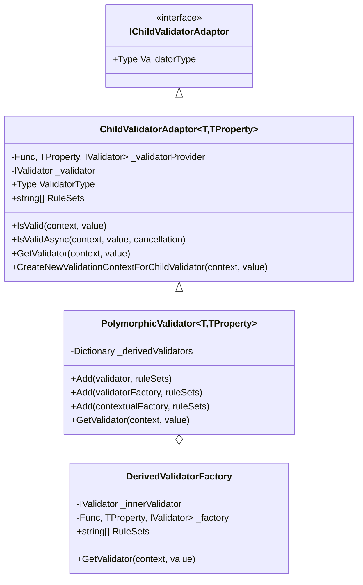
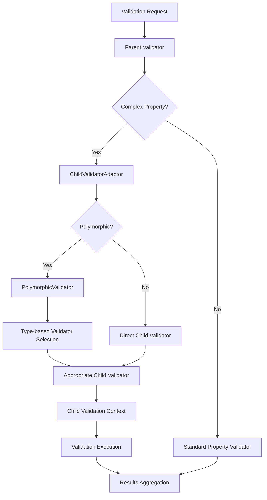
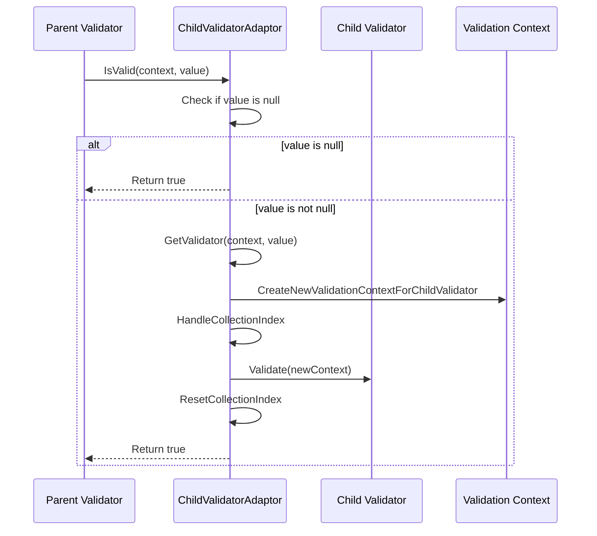
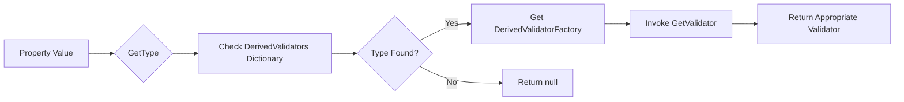

# Complex Object Validators Module

## Introduction

The Complex Object Validators module provides specialized validators for handling complex object validation scenarios in FluentValidation. This module enables validation of nested objects, polymorphic types, and complex object hierarchies through two primary validators: `ChildValidatorAdaptor` and `PolymorphicValidator`. These validators serve as bridges between parent validators and child validators, allowing for sophisticated validation scenarios that go beyond simple property validation.

## Module Overview

The Complex Object Validators module is part of the Built-in Validators section of the FluentValidation framework. It provides the infrastructure for validating complex object relationships, including:

- **Nested Object Validation**: Validating properties that are themselves complex objects
- **Polymorphic Validation**: Handling validation for inheritance hierarchies where the actual type is determined at runtime
- **Dynamic Validator Selection**: Choosing appropriate validators based on runtime type information
- **Context Preservation**: Maintaining validation context across nested validation operations

## Core Components

### ChildValidatorAdaptor

The `ChildValidatorAdaptor` is the foundation for nested object validation. It wraps another validator and delegates validation to it, serving as an adapter between parent and child validation contexts.

**Key Features:**
- Wraps existing validators for use in property validation
- Supports both synchronous and asynchronous validation
- Preserves validation context and collection indices
- Handles null values gracefully
- Supports ruleset filtering for selective validation

**Interface Definition:**
```csharp
public interface IChildValidatorAdaptor {
    Type ValidatorType { get; }
}
```

### PolymorphicValidator

The `PolymorphicValidator` extends `ChildValidatorAdaptor` to handle polymorphic validation scenarios. It performs runtime type checking and delegates validation to appropriate subclass validators.

**Key Features:**
- Runtime type-based validator selection
- Support for inheritance hierarchies
- Multiple validator registration options
- Ruleset support for selective validation
- Type-safe validator factories

## Architecture

### Component Relationships



### Integration with Validation Framework



## Data Flow

### ChildValidatorAdaptor Validation Flow



### PolymorphicValidator Type Resolution



## Key Features and Capabilities

### 1. Nested Object Validation

The `ChildValidatorAdaptor` enables validation of complex object properties by:
- Wrapping existing validators for reuse
- Creating appropriate validation contexts for child objects
- Preserving parent context information
- Handling collection scenarios with index preservation

### 2. Polymorphic Type Support

The `PolymorphicValidator` handles inheritance scenarios by:
- Runtime type inspection of property values
- Dynamic validator selection based on actual type
- Support for multiple registration patterns
- Type-safe validator factories

### 3. Context Preservation

Both validators maintain validation context integrity by:
- Preserving collection indices across nested validation
- Maintaining property chains for accurate error reporting
- Supporting ruleset filtering for selective validation
- Handling context cloning for child validators

### 4. Flexible Registration Patterns

The `PolymorphicValidator` supports multiple registration approaches:

```csharp
// Direct validator registration
polymorphicValidator.Add<DerivedType>(derivedValidator);

// Factory function with context access
polymorphicValidator.Add<DerivedType>(context => CreateValidator(context));

// Factory function with context and value access
polymorphicValidator.Add<DerivedType>((context, value) => CreateValidator(context, value));
```

## Usage Patterns

### Basic Nested Validation

```csharp
public class OrderValidator : AbstractValidator<Order> {
    public OrderValidator() {
        RuleFor(order => order.Customer)
            .SetValidator(new CustomerValidator());
    }
}
```

### Polymorphic Validation

```csharp
public class AnimalValidator : AbstractValidator<Animal> {
    public AnimalValidator() {
        RuleFor(animal => animal)
            .SetInheritanceValidator(v => {
                v.Add<Dog>(new DogValidator());
                v.Add<Cat>(new CatValidator());
            });
    }
}
```

### Dynamic Validator Selection

```csharp
public class PaymentValidator : AbstractValidator<Payment> {
    public PaymentValidator() {
        RuleFor(payment => payment.PaymentMethod)
            .SetInheritanceValidator(v => {
                v.Add<CreditCardPayment>((context, payment) => 
                    new CreditCardValidator(payment.CardType));
                v.Add<BankTransferPayment>(context => 
                    new BankTransferValidator(context.InstanceToValidate.Currency));
            });
    }
}
```

## Integration with Other Modules

### Validation Context Management

The Complex Object Validators module integrates with the [Validation Context Management](Validation Context Management.md) module to:
- Create appropriate validation contexts for child validators
- Preserve context data across nested validation operations
- Handle collection-specific context requirements

### Validator Selection System

Integration with the [Validator Selection System](Validator Selection System.md) enables:
- Ruleset-based validator selection for child validators
- Selective validation based on ruleset membership
- Composite validator selection for complex scenarios

### Validation Results and Failures

The module works with the [Validation Results and Failures](Validation Results and Failures.md) system to:
- Aggregate validation results from child validators
- Maintain proper error message formatting
- Preserve property paths for nested validation errors

## Error Handling and Edge Cases

### Null Value Handling

Both validators handle null values gracefully:
- Null property values result in successful validation (return true)
- No child validator is invoked for null values
- Parent validation continues normally

### Missing Validator Scenarios

When no appropriate validator is found:
- `ChildValidatorAdaptor`: Returns true if no validator is available
- `PolymorphicValidator`: Returns null, resulting in successful validation
- Parent validation continues without errors

### Type Safety Considerations

The `PolymorphicValidator` includes type safety checks:
- Validates that registered validators can handle the specified types
- Provides compile-time type safety for generic registration methods
- Includes runtime validation for non-generic registration approaches

## Performance Considerations

### Caching and Reuse

- Validators are cached when provided as instances
- Factory functions are invoked for each validation operation
- Type dictionaries are used for efficient runtime type resolution

### Context Creation Overhead

- Child validation contexts are cloned from parent contexts
- Property chains are maintained for accurate error reporting
- Collection index handling adds minimal overhead

### Memory Management

- Tracking collections are used for disposable resource management
- Context data is properly cleaned up after validation
- Collection indices are reset to prevent memory leaks

## Best Practices

### 1. Validator Reuse

- Use validator instances when the validator doesn't depend on runtime data
- Use factory functions when validators need context-specific configuration
- Consider the performance implications of factory function invocation

### 2. Type Registration

- Register the most specific types first in polymorphic scenarios
- Use generic registration methods for compile-time type safety
- Validate that registered validators can handle the specified types

### 3. Context Management

- Leverage context cloning for proper isolation between parent and child validation
- Use ruleset filtering to control which validation rules are executed
- Preserve collection indices for accurate error reporting in collection scenarios

### 4. Error Handling

- Handle null values appropriately in parent validators
- Consider the implications of missing validators in polymorphic scenarios
- Use proper error message formatting for nested validation errors

## Conclusion

The Complex Object Validators module provides essential functionality for handling sophisticated validation scenarios in FluentValidation. Through the `ChildValidatorAdaptor` and `PolymorphicValidator` classes, it enables validation of nested objects and polymorphic types while maintaining proper context and error handling. The module's design emphasizes flexibility, type safety, and integration with the broader FluentValidation framework, making it a crucial component for complex validation scenarios.