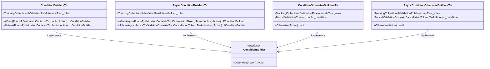
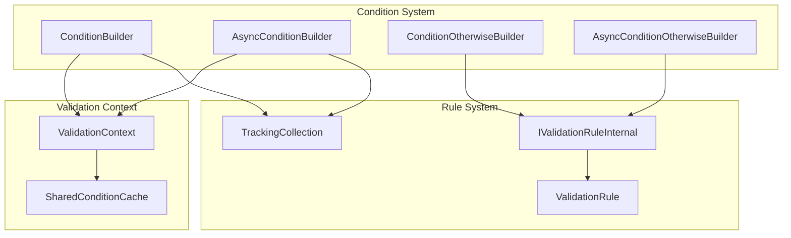
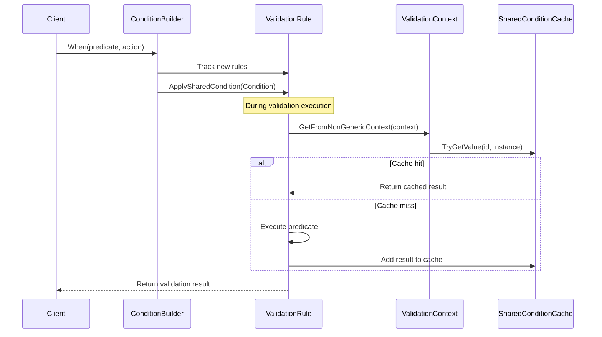
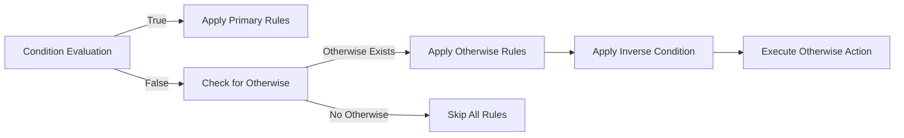
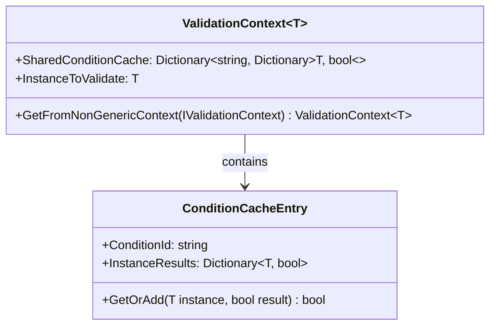

# Condition System

The Condition System module provides conditional validation capabilities within the FluentValidation framework, allowing developers to apply validation rules based on dynamic conditions. This system enables complex validation scenarios where rules should only be executed when certain conditions are met, supporting both synchronous and asynchronous condition evaluation.

## Overview

The Condition System is a core component of the FluentValidation library that implements conditional logic for validation rules. It provides a fluent API for defining when validation rules should be applied, supporting both simple boolean conditions and complex asynchronous conditions. The system includes caching mechanisms to optimize performance by avoiding redundant condition evaluations.

## Architecture

### Core Components

The Condition System consists of four main internal classes that work together to provide conditional validation capabilities:



### System Integration

The Condition System integrates with the broader FluentValidation architecture:



## Key Features

### 1. Synchronous Conditions

The `ConditionBuilder<T>` class provides synchronous condition evaluation through the `When` and `Unless` methods:

- **When**: Applies validation rules only when the condition evaluates to true
- **Unless**: Applies validation rules only when the condition evaluates to false (inverse of When)

### 2. Asynchronous Conditions

The `AsyncConditionBuilder<T>` class extends the system with asynchronous condition evaluation:

- **WhenAsync**: Applies validation rules based on asynchronous condition evaluation
- **UnlessAsync**: Inverse asynchronous condition evaluation

### 3. Otherwise Clauses

Both synchronous and asynchronous condition builders support `Otherwise` clauses, allowing developers to define alternative validation rules when the primary condition fails.

### 4. Condition Caching

The system implements intelligent caching to optimize performance:

- Conditions are evaluated only once per validation context
- Results are cached in the `SharedConditionCache` within the validation context
- Cache keys are generated using unique GUIDs for each condition group

## Data Flow

### Condition Evaluation Process



### Otherwise Clause Execution



## Implementation Details

### Condition Builder Pattern

The Condition System implements a builder pattern that allows for fluent configuration:

1. **Rule Collection Tracking**: Uses `TrackingCollection<IValidationRuleInternal<T>>` to monitor rule additions
2. **Condition Application**: Applies conditions to rules after they're created
3. **Shared Condition Logic**: Implements shared condition evaluation across multiple rules
4. **Memory Management**: Properly disposes of tracking subscriptions using `using` statements

### Cache Management

The caching mechanism ensures optimal performance:



## Usage Patterns

### Basic Conditional Validation

```csharp
// Synchronous condition
RuleFor(x => x.Email)
    .When(x => x.ContactMethod == ContactMethod.Email);

// Asynchronous condition
RuleFor(x => x.Email)
    .WhenAsync(async (x, ctx, ct) => 
        await IsValidEmailDomainAsync(x.Email, ct));
```

### Grouped Conditions

```csharp
When(x => x.IsBusinessCustomer, () => {
    RuleFor(x => x.CompanyName).NotEmpty();
    RuleFor(x => x.TaxId).NotEmpty();
}).Otherwise(() => {
    RuleFor(x => x.FirstName).NotEmpty();
    RuleFor(x => x.LastName).NotEmpty();
});
```

### Complex Conditions with Unless

```csharp
Unless(x => x.IsGuestCheckout, () => {
    RuleFor(x => x.Password).NotEmpty();
    RuleFor(x => x.ConfirmPassword).Equal(x => x.Password);
});
```

## Performance Considerations

### Caching Strategy

- Conditions are cached per validation context and instance
- Cache keys are unique per condition group (using GUIDs)
- Cache entries are automatically managed by the validation context lifecycle

### Memory Efficiency

- Tracking collections properly dispose of subscriptions
- Condition results are cached only for non-null instances
- Cache dictionaries are created on-demand

## Integration with Other Systems

### Rule Builder Integration

The Condition System integrates seamlessly with the [Rule Builder System](Rule%20Builder%20System.md):

- Conditions are applied to rules after rule creation
- Support for both property-level and validator-level conditions
- Integration with dependent rules through the `DependentRules` method

### Validation Context Integration

The system leverages the [Validation Context Management](Core%20%26%20Validation%20Execution.md#validation-context-management) for:

- Access to the instance being validated
- Shared condition cache storage
- Proper context type conversion

## Error Handling

The Condition System handles various edge cases:

- **Null Instances**: Conditions are evaluated but results are not cached for null instances
- **Context Conversion**: Proper handling of generic to non-generic context conversion
- **Async Cancellation**: Support for cancellation tokens in asynchronous conditions
- **Rule Tracking**: Proper cleanup of rule tracking subscriptions

## Thread Safety

The Condition System is designed with thread safety in mind:

- Condition evaluation is thread-safe within a single validation context
- Cache operations are atomic
- Async conditions support cancellation tokens
- Rule collections are safely tracked during condition setup

## Best Practices

### When to Use Conditions

- Apply conditions when validation rules should only execute under specific circumstances
- Use conditions to group related validation logic
- Implement complex business rules that affect multiple properties

### Performance Optimization

- Leverage the built-in caching mechanism by reusing condition predicates
- Consider using `Unless` instead of negating `When` conditions for clarity
- Group related conditions to minimize cache lookups

### Async Conditions

- Use `WhenAsync` for conditions that involve I/O operations
- Always pass and respect cancellation tokens
- Consider the performance implications of async condition evaluation

## Related Documentation

- [Rule Builder System](Rule%20Builder%20System.md) - Understanding how conditions integrate with rule building
- [Core & Validation Execution](Core%20%26%20Validation%20Execution.md) - Validation context and execution flow
- [Fluent API & Rule Definition](Fluent%20API%20%26%20Rule%20Definition.md) - Overall rule definition architecture