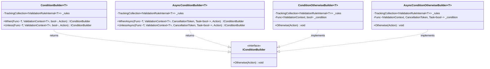
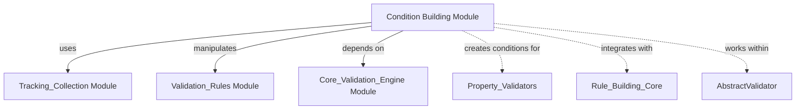
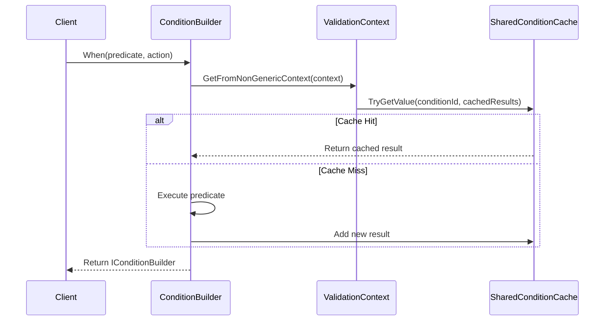
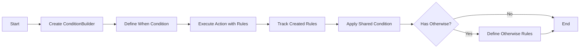
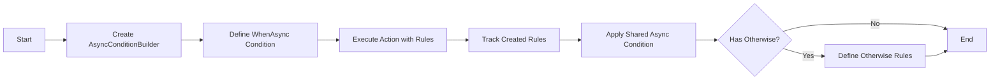
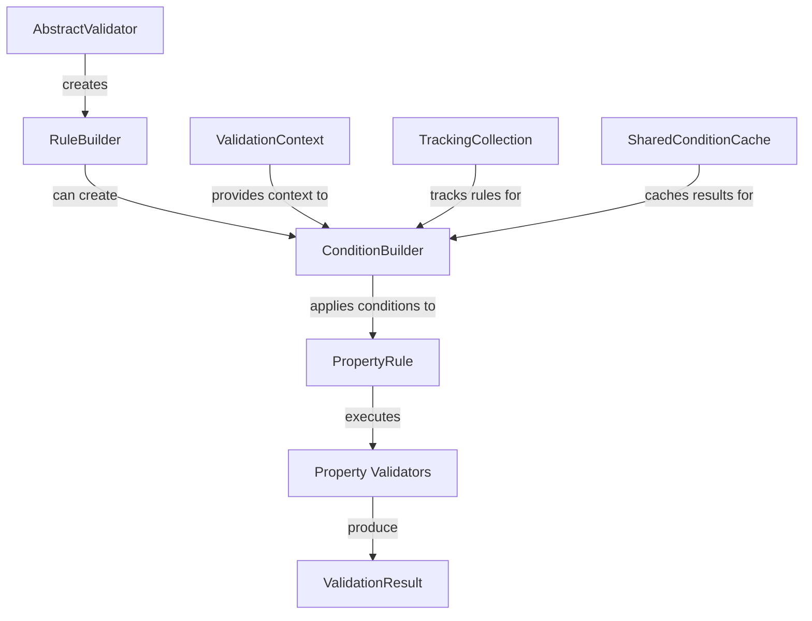

# Condition Building Module

## Introduction

The Condition Building module is a core component of the FluentValidation library that provides sophisticated conditional validation capabilities. This module enables developers to apply validation rules conditionally based on runtime conditions, supporting both synchronous and asynchronous condition evaluation. It forms a critical part of the rule-building infrastructure within the validation engine.

## Overview

The Condition Building module provides a fluent API for creating conditional validation logic that can be applied to multiple validation rules. It supports:

- **Synchronous conditions**: Conditions evaluated immediately during validation
- **Asynchronous conditions**: Conditions that require async operations (e.g., database lookups)
- **Shared conditions**: Conditions that can be cached and reused across multiple rules for performance optimization
- **Otherwise clauses**: Alternative validation logic when conditions are not met
- **Inverse conditions**: Using `Unless` for negated conditions

## Architecture

### Core Components

The module consists of four primary components that work together to provide comprehensive conditional validation support:



### Module Dependencies

The Condition Building module integrates with several other modules within the FluentValidation ecosystem:



## Component Details

### ConditionBuilder<T>

The `ConditionBuilder<T>` class provides synchronous conditional validation support. It tracks rules within its scope and applies shared conditions to them.

**Key Features:**
- **Rule Tracking**: Uses `TrackingCollection<IValidationRuleInternal<T>>` to monitor rule creation within condition scopes
- **Shared Condition Cache**: Implements caching mechanism to avoid redundant condition evaluations
- **Unique Condition IDs**: Generates GUID-based identifiers for condition caching
- **Context Awareness**: Works with `ValidationContext<T>` for type-safe validation

**Condition Caching Strategy:**


### AsyncConditionBuilder<T>

The `AsyncConditionBuilder<T>` class extends conditional validation to support asynchronous operations, essential for scenarios involving I/O operations or external service calls.

**Key Features:**
- **Async Predicate Support**: Accepts `Func<T, ValidationContext<T>, CancellationToken, Task<bool>>`
- **Cancellation Support**: Full `CancellationToken` support for async operations
- **Same Caching Strategy**: Uses identical caching mechanism as synchronous version
- **Thread-Safe Operations**: Ensures thread safety in async contexts

### ConditionOtherwiseBuilder<T> and AsyncConditionOtherwiseBuilder<T>

These classes implement the `Otherwise` functionality, allowing developers to specify alternative validation logic when the primary condition is not met.

**Implementation Pattern:**
- **Condition Negation**: Applies the inverse of the original condition to "otherwise" rules
- **Rule Isolation**: Maintains separate rule collections for primary and alternative logic
- **Fluent Interface**: Returns `IConditionBuilder` for method chaining

## Data Flow

### Synchronous Condition Flow



### Asynchronous Condition Flow



## Integration with Validation Pipeline

The Condition Building module integrates seamlessly with the FluentValidation pipeline:



## Usage Patterns

### Basic Conditional Validation

```csharp
// Synchronous condition
RuleFor(x => x.Email)
    .NotEmpty()
    .When(x => x.RequiresEmail);

// Multiple rules with shared condition
When(x => x.IsPremiumUser, () => {
    RuleFor(x => x.PremiumField1).NotEmpty();
    RuleFor(x => x.PremiumField2).GreaterThan(0);
});
```

### Advanced Conditional Scenarios

```csharp
// Asynchronous condition
WhenAsync(async (x, context, ct) => {
    return await userService.IsActiveAsync(x.UserId, ct);
}, () => {
    RuleFor(x => x.ActiveUserField).NotEmpty();
});

// Otherwise clause
When(x => x.UseAdvancedValidation, () => {
    RuleFor(x => x.AdvancedField).NotEmpty();
}).Otherwise(() => {
    RuleFor(x => x.BasicField).NotEmpty();
});
```

## Performance Considerations

### Condition Caching

The module implements intelligent caching to optimize performance:

- **Shared Condition Cache**: Conditions are cached per instance to avoid redundant evaluations
- **Memory Efficiency**: Cache entries are scoped to validation context instances
- **Thread Safety**: Cache operations are thread-safe for concurrent validation scenarios

### Memory Management

- **TrackingCollection Integration**: Automatic cleanup of tracked rules when conditions go out of scope
- **Disposable Pattern**: Proper resource management through `using` statements
- **Guid-based Keys**: Unique identifiers prevent cache collisions

## Error Handling

The Condition Building module handles various error scenarios:

- **Null Context Handling**: Graceful handling of null validation contexts
- **Async Operation Failures**: Proper exception propagation in async conditions
- **Cache Access Errors**: Fallback to direct condition evaluation if cache operations fail

## Related Documentation

- [Core_Validation_Engine](Core_Validation_Engine.md) - Core validation infrastructure
- [Validation_Rules](Validation_Rules.md) - Rule definition and management
- [Rule_Building_Core](Rule_Building_Core.md) - Basic rule building functionality
- [Property_Validators](Property_Validators.md) - Individual validator implementations
- [AbstractValidator](AbstractValidator.md) - Main validator class integration

## Conclusion

The Condition Building module provides a robust, performant, and flexible foundation for conditional validation in FluentValidation. Its design enables complex validation scenarios while maintaining clean, readable code through the fluent API pattern. The module's caching capabilities and async support make it suitable for high-performance applications and complex business rule validation scenarios.