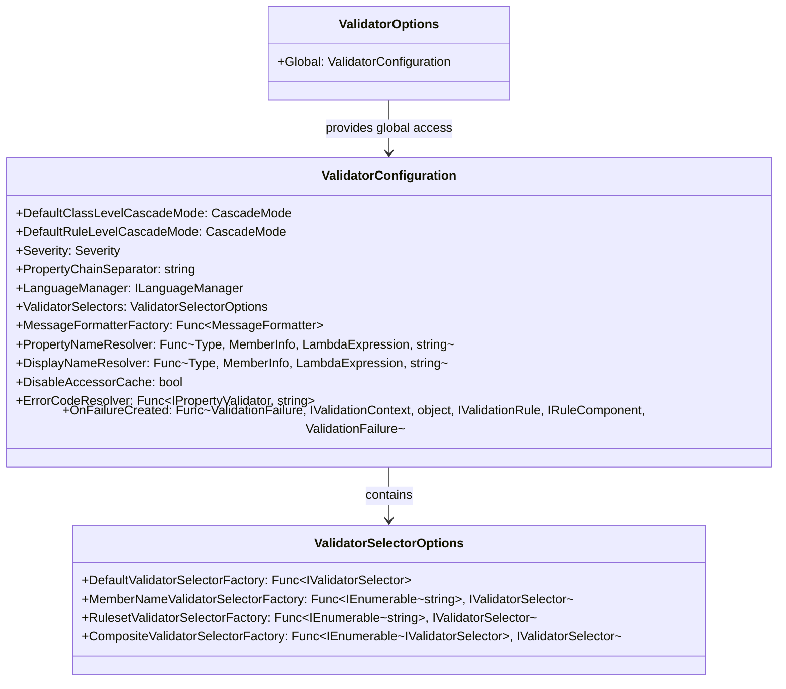
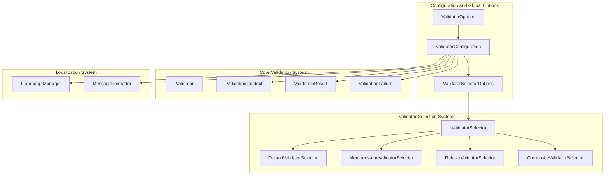
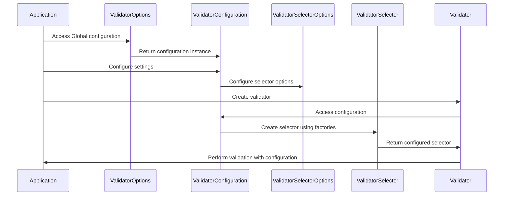

# Configuration and Global Options Module

## Introduction

The Configuration and Global Options module serves as the central configuration hub for the FluentValidation library. It provides a comprehensive set of global settings and options that control the behavior of validators across the entire application. This module enables developers to customize validation behavior, manage localization, configure error handling, and fine-tune the validation process through a centralized configuration system.

## Overview

The module consists of three primary components that work together to provide flexible configuration capabilities:

- **ValidatorConfiguration**: A comprehensive configuration class that manages global validation settings
- **ValidatorOptions**: A static entry point providing global access to configuration
- **ValidatorSelectorOptions**: Specialized configuration for validator selection strategies

## Architecture

### Component Structure



### System Integration



## Core Components

### ValidatorConfiguration

The `ValidatorConfiguration` class is the heart of the configuration system, providing comprehensive control over validation behavior:

#### Cascade Mode Configuration
- **DefaultClassLevelCascadeMode**: Controls how validation proceeds at the class level when failures occur
- **DefaultRuleLevelCascadeMode**: Controls how validation proceeds at the individual rule level when failures occur
- Both default to `CascadeMode.Continue`, allowing validation to proceed after failures

#### Property Resolution
- **PropertyNameResolver**: Pluggable logic for resolving property names from expressions and member info
- **DisplayNameResolver**: Pluggable logic for resolving display names for properties
- Both support custom naming strategies and localization

#### Error Handling and Messaging
- **ErrorCodeResolver**: Defines how error codes are resolved from property validators
- **MessageFormatterFactory**: Factory for creating message formatter instances
- **OnFailureCreated**: Hook that runs when a `ValidationFailure` is created, allowing custom failure processing

#### Localization Support
- **LanguageManager**: Manages language resources and localization for validation messages
- Integrates with the comprehensive [Localization](Localization.md) module

#### Performance Optimization
- **DisableAccessorCache**: Option to disable expression accessor caching (not recommended for production)
- **PropertyChainSeparator**: Defines the separator used in property chain expressions (default: ".")

### ValidatorOptions

The `ValidatorOptions` static class provides global access to the configuration:

- **Global**: Static property providing access to the global `ValidatorConfiguration` instance
- Serves as the single entry point for configuration across the entire application
- Ensures consistent configuration usage throughout the validation system

### ValidatorSelectorOptions

The `ValidatorSelectorOptions` class manages factory functions for different validator selection strategies:

#### Factory Functions
- **DefaultValidatorSelectorFactory**: Creates the default validator selector
- **MemberNameValidatorSelectorFactory**: Creates selectors for specific property validation
- **RulesetValidatorSelectorFactory**: Creates selectors for ruleset-based validation
- **CompositeValidatorSelectorFactory**: Creates composite selectors combining multiple strategies

These factories integrate with the [Validator Selection System](Core%20%26%20Validation%20Execution.md#validator-selection-system) to provide flexible validation targeting.

## Configuration Flow



## Key Features

### Global Configuration Management
- Centralized configuration for all validators
- Thread-safe global access through static property
- Support for both default and custom configurations

### Pluggable Components
- Property name and display name resolvers
- Error code resolution strategies
- Message formatter factories
- Language manager integration

### Performance Optimization
- Configurable accessor caching
- Efficient factory pattern for selectors
- Minimal overhead for configuration access

### Extensibility
- Hook points for custom failure processing
- Factory pattern for validator selectors
- Pluggable resolvers for names and error codes

## Usage Patterns

### Basic Configuration
```csharp
// Configure global settings
ValidatorOptions.Global.Severity = Severity.Warning;
ValidatorOptions.Global.PropertyChainSeparator = "->";
```

### Custom Property Name Resolution
```csharp
ValidatorOptions.Global.PropertyNameResolver = (type, member, expression) => {
    // Custom logic for property name resolution
    return member?.Name.ToUpper();
};
```

### Custom Language Management
```csharp
ValidatorOptions.Global.LanguageManager = new CustomLanguageManager();
```

### Failure Processing Hook
```csharp
ValidatorOptions.Global.OnFailureCreated = (failure, context, instance, rule, component) => {
    // Custom failure processing logic
    failure.ErrorMessage = $"Custom: {failure.ErrorMessage}";
    return failure;
};
```

## Integration with Other Modules

### Core Validation System
The configuration module integrates closely with the [Core & Validation Execution](Core%20%26%20Validation%20Execution.md) module:
- Provides configuration to validation contexts
- Controls cascade behavior for validators
- Manages error severity and property resolution

### Localization System
Deep integration with the [Localization](Localization.md) module:
- Language manager configuration
- Message formatter factory support
- Culture-specific property name resolution

### Validator Selection System
Configuration directly impacts the [Validator Selection System](Core%20%26%20Validation%20Execution.md#validator-selection-system):
- Factory configuration for selector creation
- Default selector behavior customization
- Ruleset and member name selection strategies

## Best Practices

### Configuration Management
1. **Centralize Configuration**: Use `ValidatorOptions.Global` for application-wide settings
2. **Configure Early**: Set up configuration during application startup
3. **Document Customizations**: Clearly document any custom resolvers or factories

### Performance Considerations
1. **Keep Caching Enabled**: Only disable accessor cache for debugging
2. **Optimize Resolvers**: Ensure custom resolver implementations are efficient
3. **Use Factories**: Leverage factory patterns for complex selector creation

### Extensibility Guidelines
1. **Preserve Defaults**: When customizing, fall back to sensible defaults
2. **Handle Nulls**: Always handle null values in custom resolvers
3. **Thread Safety**: Ensure custom implementations are thread-safe

## Dependencies

The Configuration and Global Options module has the following key dependencies:

- **Internal Components**: Uses internal validation infrastructure
- **Resources**: Integrates with language management and message formatting
- **Results**: Works with validation failure and result types
- **Validators**: Configures property validator behavior

## Summary

The Configuration and Global Options module provides the essential foundation for customizing and controlling validation behavior across the FluentValidation library. Through its comprehensive configuration system, developers can fine-tune validation processes, manage localization, optimize performance, and extend functionality to meet specific application requirements. The module's design emphasizes flexibility, performance, and ease of use while maintaining backward compatibility and providing sensible defaults for common scenarios.