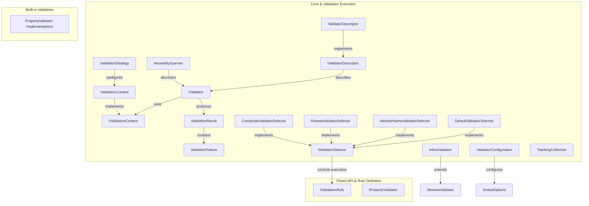
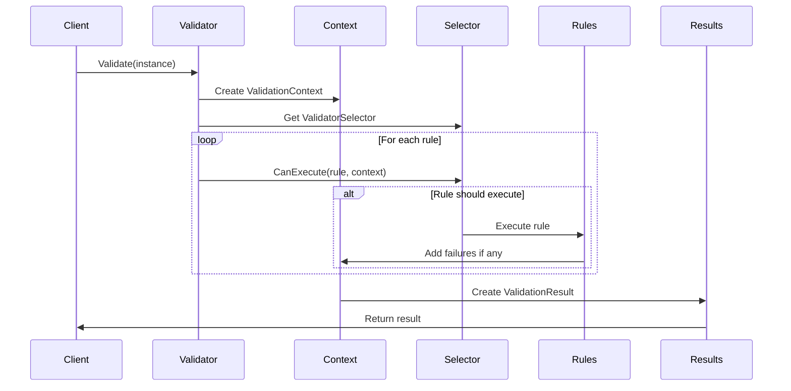

# Core & Validation Execution Module

## Overview

The Core & Validation Execution module is the foundational layer of the FluentValidation library, providing the essential infrastructure for validation execution, context management, and result processing. This module orchestrates the validation process, manages validation contexts, handles result aggregation, and provides the core abstractions that enable the entire validation framework to function.

## Architecture



## Core Components

### 1. Validation Context Management

The validation context system provides the execution environment for validation operations. See [Validation Context Management](Validation%20Context%20Management.md) for detailed documentation.

#### Key Features:
- Defines the contract for validation contexts
- Provides access to the instance being validated
- Manages property chains, selectors, and contextual data
- Supports both synchronous and asynchronous validation scenarios
- Handles nested validation through child context creation
- Provides shared condition caching for performance optimization

### 2. Validator Selection System

The validator selector system controls which validation rules execute based on various criteria. See [Validator Selection System](Validator%20Selection%20System.md) for detailed documentation.

#### Key Components:
- **IValidatorSelector Interface**: Defines the contract for rule execution control
- **DefaultValidatorSelector**: Executes rules not belonging to any ruleset
- **MemberNameValidatorSelector**: Validates only specific properties with nested path support
- **RulesetValidatorSelector**: Executes rules belonging to specified rulesets
- **CompositeValidatorSelector**: Combines multiple selectors using OR logic

### 3. Assembly Scanning and Discovery

See [Assembly Scanning and Discovery](Assembly%20Scanning%20and%20Discovery.md) for detailed documentation.

#### Key Features:
- **AssemblyScanner**: Discovers validator types in assemblies
- Supports scanning by assembly, type, or collections
- Identifies types implementing IValidator<T>
- Enables automatic validator registration in DI containers

### 4. Validation Results and Failures

See [Validation Results and Failures](Validation%20Results%20and%20Failures.md) for detailed documentation.

#### Key Components:
- **ValidationResult**: Encapsulates validation outcomes with failure collections
- **ValidationFailure**: Represents individual validation errors with property details
- Supports error message formatting and dictionary conversion
- Provides severity levels and custom state support

### 5. Validator Metadata and Descriptors

See [Validator Metadata and Descriptors](Validator%20Metadata%20and%20Descriptors.md) for detailed documentation.

#### Key Features:
- **IValidatorDescriptor**: Provides metadata about validator rules and properties
- **ValidatorDescriptor<T>**: Implements metadata introspection for validators
- Supports property name resolution and ruleset grouping
- Enables tooling and dynamic validation scenarios

### 6. Configuration and Global Options

See [Configuration and Global Options](Configuration%20and%20Global%20Options.md) for detailed documentation.

#### Key Components:
- **ValidatorConfiguration**: Global configuration for validation behavior
- **ValidatorSelectorOptions**: Factory configuration for selector creation
- Manages property name resolution and message formatting
- Controls cascade modes, severity levels, and language settings

### 7. Additional Components

#### InlineValidator<T>
- Allows validator definition without inheritance
- Enables inline rule definition using lambda expressions
- Useful for simple validation scenarios and testing

#### TrackingCollection<T>
- Provides collection change tracking
- Supports event-based notification of additions
- Used internally for managing validation rule collections

#### IValidatorFactory (Obsolete)
- Legacy interface for validator factory pattern
- Deprecated in favor of direct service provider usage
- Maintained for backward compatibility



## Integration Points

### With Fluent API & Rule Definition Module
- The Core module provides the execution engine for rules defined in the Fluent API module
- ValidationContext manages the execution state for complex rule hierarchies
- Validator selectors work with rule definitions to control execution flow

### With Built-in Validators Module
- Core components orchestrate the execution of property validators
- ValidationFailure objects are created by built-in validators
- Result aggregation handles failures from multiple validator types

### With Localization Module
- ValidationContext uses MessageFormatter for error message construction
- LanguageManager integration enables multilingual validation messages
- Property name resolution supports localized display names

## Key Features

1. **Type-Safe Validation**: Generic interfaces ensure compile-time type safety
2. **Flexible Context Management**: Supports nested validation and complex object graphs
3. **Selective Validation**: Execute only relevant rules based on criteria
4. **Performance Optimization**: Shared condition caching and efficient failure collection
5. **Extensibility**: Plugin architecture for custom selectors and configuration
6. **Async Support**: Full async/await support for validation operations
7. **Metadata Access**: Introspection capabilities for tooling and dynamic scenarios

## Usage Patterns

### Basic Validation
```csharp
var validator = new MyValidator();
var result = validator.Validate(myInstance);
```

### Selective Property Validation
```csharp
var result = validator.Validate(myInstance, options => 
    options.IncludeProperties(x => x.Name, x => x.Email));
```

### Ruleset-based Validation
```csharp
var result = validator.Validate(myInstance, options => 
    options.IncludeRuleSets("Create", "Update"));
```

### Assembly Scanning
```csharp
var scanner = AssemblyScanner.FindValidatorsInAssemblyContaining<Customer>();
foreach (var result in scanner) {
    // Register discovered validators
}
```

This module serves as the backbone of the FluentValidation library, providing the essential infrastructure that enables all other modules to function cohesively while maintaining flexibility and extensibility for diverse validation scenarios.