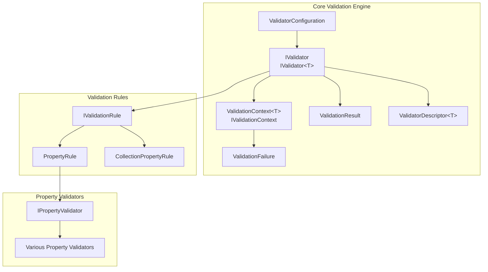
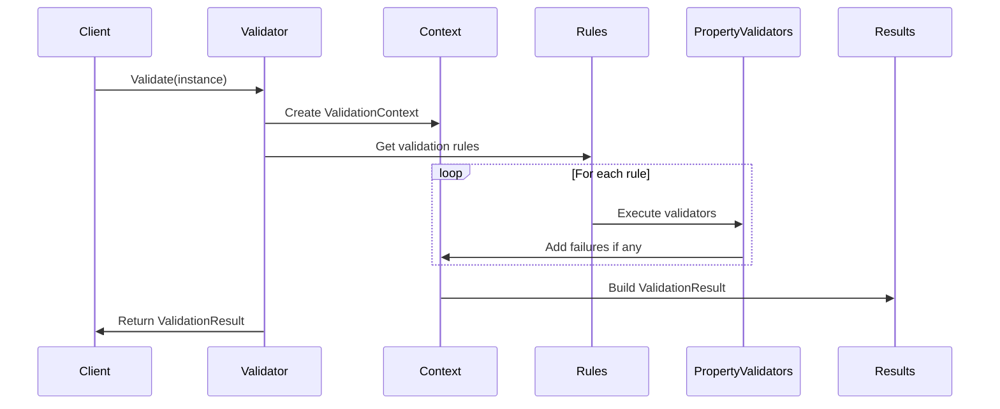

# Core Validation Engine

## Overview

The Core Validation Engine is the foundational module of the FluentValidation library, providing the essential infrastructure for object validation in .NET applications. This module defines the core interfaces, abstractions, and configuration mechanisms that enable flexible and extensible validation logic.

## Purpose

The Core Validation Engine serves as the central orchestration layer that:
- Defines validation contracts and interfaces
- Manages validation context and execution flow
- Provides configuration and extensibility points
- Handles validation result aggregation and reporting
- Enables validator discovery and metadata inspection

## Architecture



## Core Components

### 1. Validator Interfaces (`IValidator`, `IValidator<T>`)
The primary entry points for validation logic, defining synchronous and asynchronous validation methods. These interfaces establish the contract for all validators in the system.

**Key Responsibilities:**
- Execute validation against objects or validation contexts
- Provide metadata through validator descriptors
- Support both generic and non-generic validation scenarios
- Enable async validation with cancellation support

### 2. Validation Context (`ValidationContext<T>`, `IValidationContext`)
Encapsulates the state and configuration for a validation operation, including the instance being validated, property chains, selectors, and failure collection.

**Key Features:**
- Hierarchical context management for nested validation
- Property chain tracking for deep object validation
- Shared condition caching for performance optimization
- Support for both child and collection contexts

### 3. Validation Results (`ValidationResult`, `ValidationFailure`)
Represents the outcome of validation operations, including success/failure status and detailed error information.

### 4. Validator Descriptor (`ValidatorDescriptor<T>`)
Provides metadata inspection capabilities, allowing runtime discovery of validation rules, properties, and configurations.

### 5. Validator Configuration (`ValidatorConfiguration`)
Global configuration system for customizing validation behavior, including property name resolution, display names, error codes, and localization.

## Sub-modules Integration

The Core Validation Engine integrates with several specialized sub-modules:

### [Validation Rules](Validation_Rules.md)
Implements the rule-based validation system, including property rules, collection rules, and conditional logic. This module defines how validation rules are structured and executed.

### [Property Validators](Property_Validators.md)
Contains the actual validation logic for specific constraints (NotNull, Length, RegularExpression, etc.). These validators implement the core validation algorithms.

### [Validator Selection](Validator_Selection.md)
Manages which validation rules should be executed based on selectors, rulesets, and member names, enabling conditional validation scenarios.

### [Localization](Localization.md)
Handles error message formatting and localization, supporting multiple languages and custom message templates.

### [Comparison Validators](Comparison_Validators.md)
Provides validators for comparing values against other properties or constants, including greater than, less than, between, and precision/scale validations.

### [Rule Building](Rule_Building.md)
Implements the fluent API for constructing validation rules, including condition builders and child rule containers.

### [AbstractValidator](AbstractValidator.md)
Defines the base class and syntax interfaces for creating strongly-typed validators with a fluent API.

### [InlineValidator](InlineValidator.md)
Provides runtime validator construction capabilities for dynamic validation scenarios.

### [Assembly Scanning](Assembly_Scanning.md)
Enables automatic discovery and registration of validators from assemblies.

### [Validator Factory](Validator_Factory.md)
Defines the factory pattern for creating validator instances.

### [Property Chain](Property_Chain.md)
Manages property path construction for nested object validation.

### [Accessor Cache](Accessor_Cache.md)
Optimizes property access through caching of compiled expressions.

### [Validation Strategy](Validation_Strategy.md)
Provides configuration options for controlling validation behavior and execution.

### [Tracking Collection](Tracking_Collection.md)
Implements collection tracking for managing validation state.

### [Dependency Injection](Dependency_Injection.md)
Integrates with dependency injection containers for validator resolution.

## Data Flow



## Configuration and Extensibility

The Core Validation Engine provides multiple extension points:

- **Property Name Resolvers**: Customize how property names are determined
- **Display Name Resolvers**: Control display name generation for properties
- **Error Code Resolvers**: Map validators to error codes
- **Message Formatters**: Customize error message formatting
- **Language Managers**: Support for localization and custom messages

## Usage Patterns

### Basic Validation
```csharp
var validator = new MyValidator();
var result = validator.Validate(myObject);
if (!result.IsValid) {
    // Handle validation failures
}
```

### Async Validation
```csharp
var result = await validator.ValidateAsync(myObject, cancellationToken);
```

### Context-Based Validation
```csharp
var context = new ValidationContext<MyObject>(myObject);
var result = validator.Validate(context);
```

## Performance Considerations

- **Shared Condition Caching**: Conditions are cached per validation context to avoid redundant evaluations
- **Property Chain Optimization**: Property chains are reused and optimized for nested validation
- **Selector Efficiency**: Validator selectors minimize the number of rules evaluated
- **Accessor Caching**: Property accessors are cached unless explicitly disabled

## Thread Safety

The Core Validation Engine is designed to be thread-safe for validator instances. Validation contexts are not thread-safe and should not be shared across threads. Each validation operation should use its own context instance.

## Integration with Other Modules

The Core Validation Engine serves as the foundation for all other validation modules:
- **AbstractValidator**: Base class implementation that leverages core interfaces
- **InlineValidator**: Runtime validator construction using core components
- **Dependency Injection**: Integration with DI containers through factory patterns
- **Assembly Scanning**: Automatic validator discovery and registration

This modular design allows the validation system to be extended and customized while maintaining a consistent core architecture.