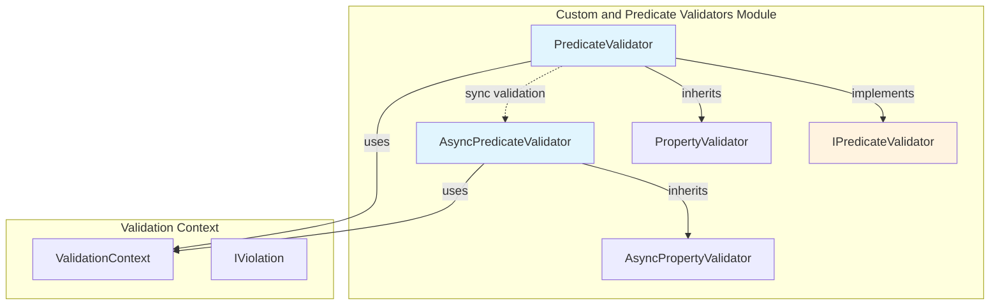
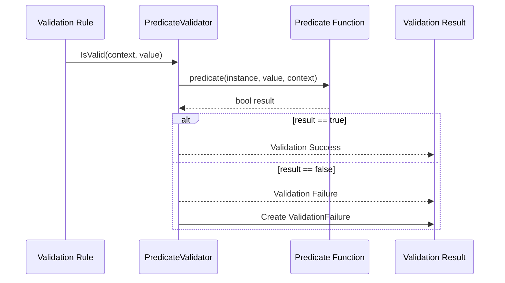
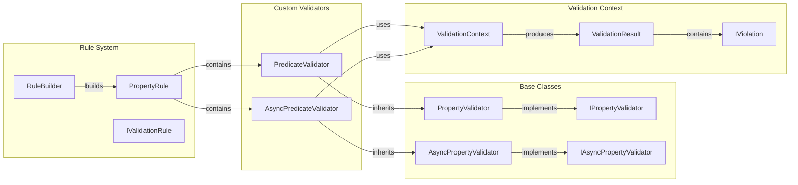
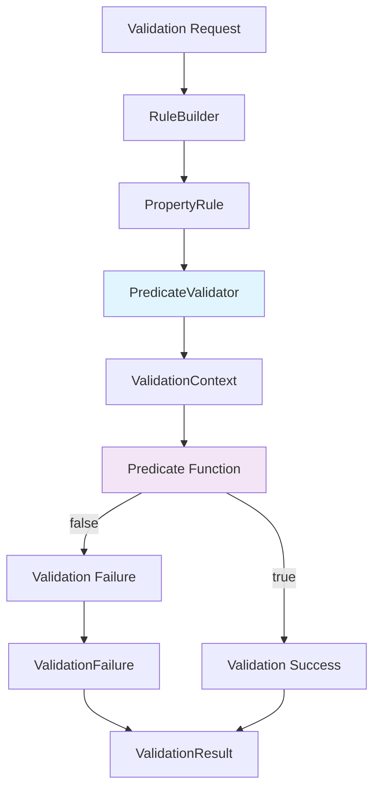
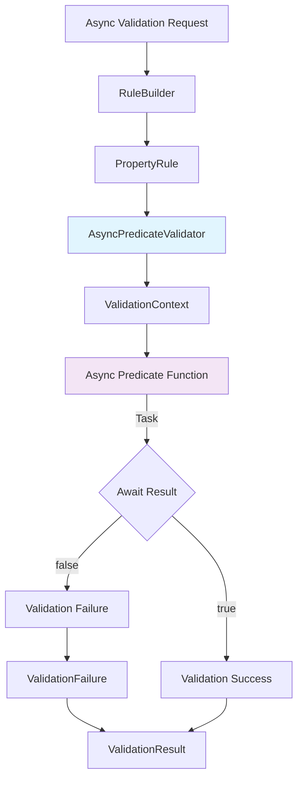
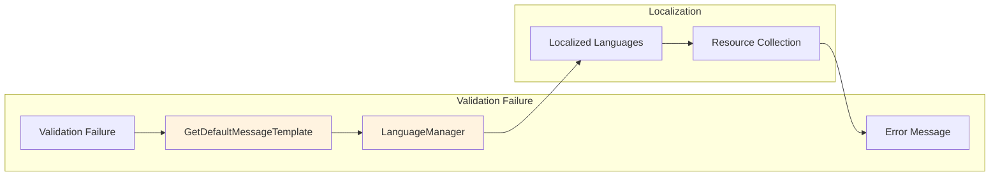

# Custom and Predicate Validators Module

## Introduction

The Custom and Predicate Validators module provides the foundation for creating custom validation logic in FluentValidation. This module enables developers to implement business-specific validation rules that go beyond the built-in validators by allowing custom predicate functions to determine validation success or failure. It supports both synchronous and asynchronous validation scenarios, making it suitable for complex validation requirements including database lookups, external service calls, or any custom business logic.

## Architecture Overview

The module consists of two primary validator types that work together to provide flexible custom validation capabilities:



## Core Components

### PredicateValidator<T,TProperty>

The `PredicateValidator` is the synchronous custom validator that executes user-defined validation logic. It accepts a predicate function that determines whether a property value is valid based on custom criteria.

**Key Features:**
- Generic type parameters for type safety (`T` for the object being validated, `TProperty` for the property type)
- Access to the entire validation context including the parent object
- Integration with FluentValidation's localization system
- Inherits from `PropertyValidator<T,TProperty>` for consistent behavior

**Constructor:**
```csharp
public PredicateValidator(Func<T, TProperty, ValidationContext<T>, bool> predicate)
```

**Validation Flow:**


### AsyncPredicateValidator<T,TProperty>

The `AsyncPredicateValidator` provides asynchronous validation capabilities, essential for scenarios involving I/O operations such as database queries, web service calls, or file system operations.

**Key Features:**
- Full async/await support with cancellation token
- Non-blocking validation for better application performance
- Same level of context access as synchronous version
- Inherits from `AsyncPropertyValidator<T,TProperty>`

**Constructor:**
```csharp
public AsyncPredicateValidator(Func<T, TProperty, ValidationContext<T>, CancellationToken, Task<bool>> predicate)
```

### IPredicateValidator Interface

A marker interface that identifies predicate-based validators within the FluentValidation ecosystem. This interface enables type checking and specialized handling of predicate validators in validation pipelines.

## Integration with FluentValidation Ecosystem

### Relationship with Core Validation Components



### Usage in Rule Builder System

Custom validators integrate seamlessly with the FluentValidation rule builder pattern:

```csharp
// Synchronous custom validation
RuleFor(x => x.Property)
    .Must((instance, value, context) => {
        // Custom validation logic
        return value != null && value.Length > 5;
    })
    .WithMessage("Property must be longer than 5 characters");

// Asynchronous custom validation
RuleFor(x => x.Property)
    .MustAsync(async (instance, value, context, cancellationToken) => {
        // Async validation logic
        var exists = await CheckDatabaseAsync(value, cancellationToken);
        return exists;
    })
    .WithMessage("Property does not exist in database");
```

## Data Flow and Validation Process

### Synchronous Validation Flow



### Asynchronous Validation Flow



## Error Handling and Localization

Both validators integrate with FluentValidation's localization system through the `GetDefaultMessageTemplate` method. The validators use the standard error code mechanism and support custom error messages through the rule builder API.

### Error Message Flow



## Dependencies and Relationships

### Direct Dependencies

- **[Fluent API & Rule Definition](Fluent API & Rule Definition.md)**: Custom validators are integrated into property rules and rule builders
- **[Core & Validation Execution](Core & Validation Execution.md)**: Uses validation context and produces validation results
- **[Localization](Localization.md)**: Leverages the localization system for error messages

### Related Components

- `PropertyRule`: Contains and executes custom validators
- `RuleBuilder`: Provides the fluent API for configuring custom validators
- `ValidationContext<T>`: Provides access to the object being validated and validation metadata
- `ValidationResult`: Contains the results of validation including any failures

## Best Practices and Usage Guidelines

### When to Use Custom Validators

1. **Business Logic Validation**: When validation requires complex business rules that cannot be expressed with built-in validators
2. **Cross-Property Validation**: When validation depends on multiple properties or the entire object state
3. **External Data Validation**: When validation requires checking against external data sources (use async version)
4. **Conditional Validation**: When validation logic needs to be dynamically determined at runtime

### Performance Considerations

1. **Synchronous vs Asynchronous**: Use `AsyncPredicateValidator` for I/O operations to avoid blocking threads
2. **Predicate Complexity**: Keep predicate functions focused and efficient
3. **Caching**: Consider caching expensive operations within the validation context
4. **Cancellation**: Always respect the `CancellationToken` in async validators

### Example Implementations

**Simple Custom Validation:**
```csharp
RuleFor(x => x.Email)
    .Must((user, email, context) => {
        // Ensure email domain matches company domain
        return email.EndsWith($"@{user.CompanyDomain}");
    })
    .WithMessage("Email must use company domain");
```

**Async Database Validation:**
```csharp
RuleFor(x => x.Username)
    .MustAsync(async (user, username, context, cancellationToken) => {
        using var dbContext = new UserDbContext();
        return !await dbContext.Users
            .AnyAsync(u => u.Username == username && u.Id != user.Id, cancellationToken);
    })
    .WithMessage("Username already exists");
```

**Complex Business Rule Validation:**
```csharp
RuleFor(x => x.OrderTotal)
    .Must((order, total, context) => {
        // Complex business rule: Order total must be within credit limit
        // considering pending orders and payment history
        var availableCredit = CalculateAvailableCredit(order.CustomerId);
        var pendingOrders = GetPendingOrderTotal(order.CustomerId);
        return total <= (availableCredit - pendingOrders);
    })
    .WithMessage("Order exceeds available credit");
```

## Testing Considerations

Custom validators should be thoroughly tested as they contain critical business logic:

1. **Unit Testing**: Test predicate functions in isolation
2. **Integration Testing**: Test validators within the complete validation pipeline
3. **Edge Cases**: Test boundary conditions and error scenarios
4. **Async Testing**: Ensure async validators handle cancellation and exceptions properly

## Summary

The Custom and Predicate Validators module provides the extensibility point for FluentValidation, enabling developers to implement any validation logic that their applications require. By providing both synchronous and asynchronous options, it supports a wide range of validation scenarios from simple business rules to complex, data-driven validations. The seamless integration with the FluentValidation ecosystem ensures that custom validators behave consistently with built-in validators while providing the flexibility needed for specialized validation requirements.