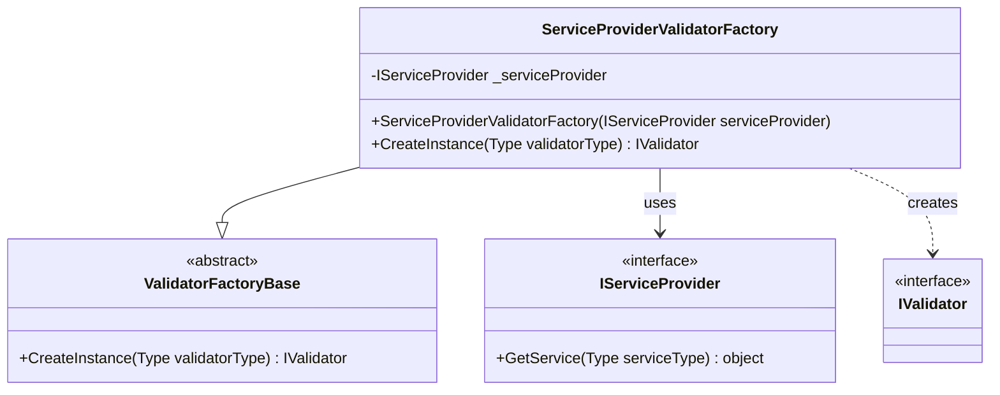
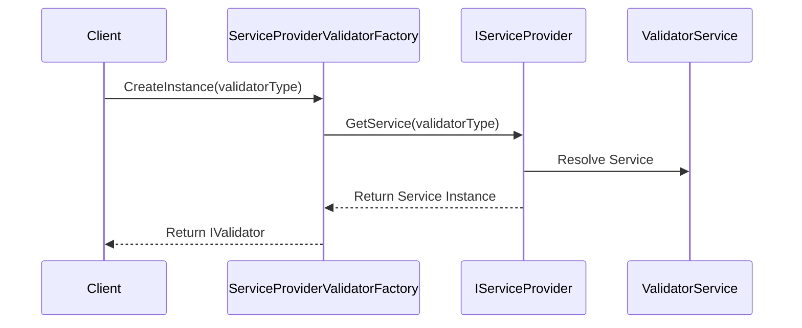
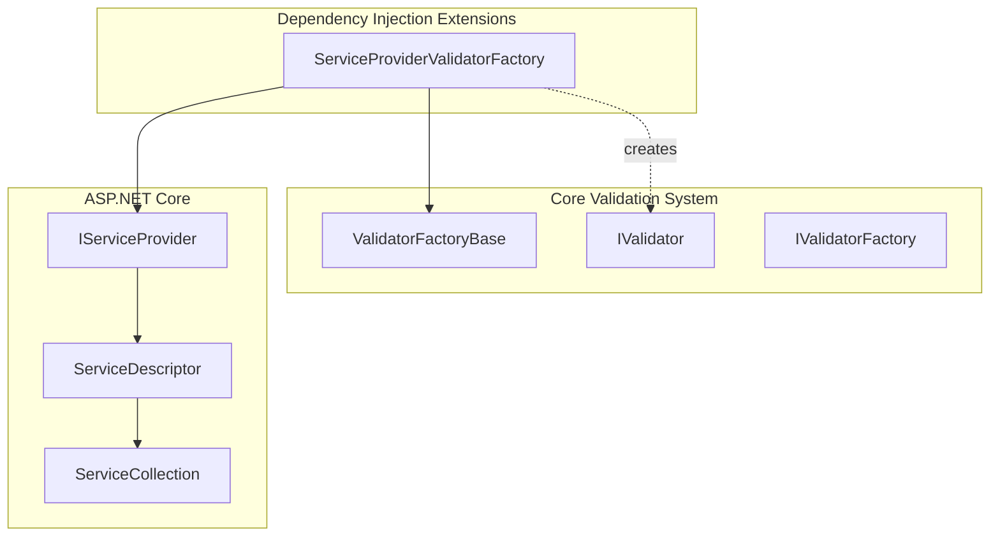

# Dependency Injection Extensions Module

## Introduction

The Dependency Injection Extensions module provides integration between FluentValidation and dependency injection containers, specifically designed to work with ASP.NET Core's built-in service provider. This module enables automatic validator discovery and resolution through the dependency injection system, allowing validators to be registered as services and resolved at runtime.

## Overview

The module consists of a single core component that bridges FluentValidation's validator factory pattern with modern dependency injection practices. While this implementation is marked as obsolete in favor of direct service provider usage, it represents an important transitional component for applications migrating from older FluentValidation versions.

## Core Architecture

### ServiceProviderValidatorFactory

The `ServiceProviderValidatorFactory` is the primary component that enables dependency injection integration. It implements the `ValidatorFactoryBase` class and provides a bridge between FluentValidation's validator factory pattern and the ASP.NET Core service provider.



## Component Details

### ServiceProviderValidatorFactory

**Namespace:** `FluentValidation`

**Purpose:** Provides validator instance creation through dependency injection

**Key Features:**
- Integrates with ASP.NET Core's built-in service provider
- Implements the validator factory pattern for backward compatibility
- Enables automatic validator resolution from the DI container

**Constructor:**
```csharp
public ServiceProviderValidatorFactory(IServiceProvider serviceProvider)
```

**Key Method:**
```csharp
public override IValidator CreateInstance(Type validatorType)
```

**Deprecation Notice:** This class is marked as obsolete and will be removed in future releases. Users are encouraged to use the service provider directly or utilize their DI container's native capabilities.

## Integration Architecture

### Dependency Injection Flow



### System Integration



## Usage Patterns

### Registration Pattern

Validators are typically registered with the DI container using the following pattern:

```csharp
// In Startup.cs or Program.cs
services.AddValidatorsFromAssemblyContaining<Startup>();
// or
services.AddValidator<CustomerValidator>();
```

### Resolution Pattern

The factory can be used to resolve validators:

```csharp
public class MyService
{
    private readonly IValidatorFactory _validatorFactory;
    
    public MyService(IValidatorFactory validatorFactory)
    {
        _validatorFactory = validatorFactory;
    }
    
    public void ValidateCustomer(Customer customer)
    {
        var validator = _validatorFactory.GetValidator<Customer>();
        var result = validator.Validate(customer);
        // Handle validation result
    }
}
```

## Migration Path

### From ServiceProviderValidatorFactory to Direct DI Usage

Since this component is deprecated, applications should migrate to direct service provider usage:

**Before (Using Factory):**
```csharp
public class MyService
{
    private readonly IValidatorFactory _validatorFactory;
    
    public MyService(IValidatorFactory validatorFactory)
    {
        _validatorFactory = validatorFactory;
    }
    
    public void ValidateCustomer(Customer customer)
    {
        var validator = _validatorFactory.GetValidator<Customer>();
        var result = validator.Validate(customer);
    }
}
```

**After (Direct DI):**
```csharp
public class MyService
{
    private readonly IValidator<Customer> _validator;
    
    public MyService(IValidator<Customer> validator)
    {
        _validator = validator;
    }
    
    public void ValidateCustomer(Customer customer)
    {
        var result = _validator.Validate(customer);
    }
}
```

## Relationship to Other Modules

### Core & Validation Execution
The ServiceProviderValidatorFactory integrates with the [Core & Validation Execution](Core%20&%20Validation%20Execution.md) module by:
- Implementing `ValidatorFactoryBase` from the core module
- Creating instances of `IValidator` implementations
- Supporting the validator selection system

### Fluent API & Rule Definition
The factory enables dependency injection for validators created using the [Fluent API & Rule Definition](Fluent%20API%20&%20Rule%20Definition.md) module, allowing complex validators to be registered and resolved through DI.

### Built-in Validators
All [Built-in Validators](Built-in%20Validators.md) can be used within validators resolved through the ServiceProviderValidatorFactory, maintaining full compatibility with the validation ecosystem.

## Best Practices

### Current Recommendations
1. **Avoid using ServiceProviderValidatorFactory** - Use direct DI registration instead
2. **Register validators explicitly** - Use `AddValidatorsFromAssembly` or similar extension methods
3. **Use generic validator interfaces** - Inject `IValidator<T>` directly into services

### Historical Context
The ServiceProviderValidatorFactory was created during the transition period when FluentValidation moved from factory-based validator resolution to modern dependency injection patterns. It provided a bridge for applications using the older factory pattern while adopting DI containers.

## Configuration

### Service Registration
Validators should be registered with appropriate lifetimes:

```csharp
// Singleton for stateless validators
services.AddSingleton<IValidator<Customer>, CustomerValidator>();

// Transient for stateful validators
services.AddTransient<IValidator<Order>, OrderValidator>();

// Scoped for validators with scoped dependencies
services.AddScoped<IValidator<User>, UserValidator>();
```

### Factory Registration (Legacy)
If still using the factory pattern:

```csharp
services.AddSingleton<IValidatorFactory, ServiceProviderValidatorFactory>();
```

## Error Handling

The ServiceProviderValidatorFactory handles several scenarios:

1. **Service Not Registered**: Returns `null` if the validator type is not registered
2. **Invalid Cast**: Returns `null` if the resolved service is not an `IValidator`
3. **Service Provider Exceptions**: Propagates exceptions from the underlying service provider

## Performance Considerations

- **Service Resolution**: Each call to `CreateInstance` triggers a service resolution
- **Lifetime Management**: Validator lifetime is controlled by DI registration, not the factory
- **Memory Usage**: No additional memory overhead beyond the service provider's normal operation

## Future Considerations

As the ServiceProviderValidatorFactory is deprecated, future development should focus on:
- Direct DI container integration
- Validator discovery and registration extensions
- Performance optimizations for validator resolution
- Support for modern DI patterns and practices