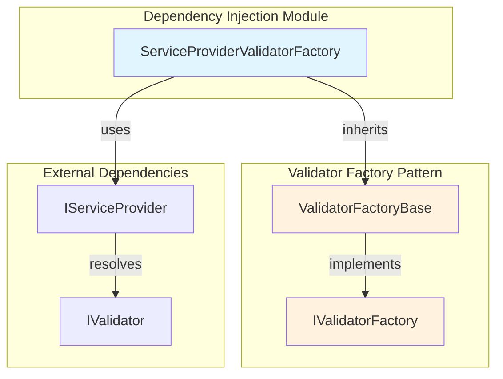
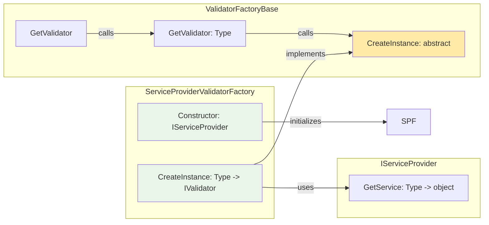
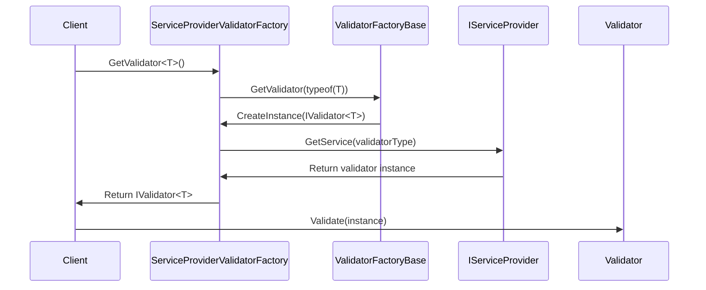
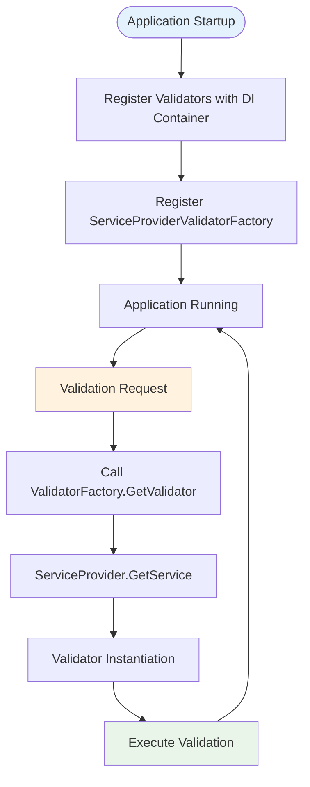

# Dependency Injection Module

## Introduction

The Dependency Injection module provides integration between FluentValidation and dependency injection containers, particularly ASP.NET Core's built-in service provider. This module enables automatic resolution and instantiation of validators through the dependency injection system, facilitating clean separation of concerns and testability in validation scenarios.

## Architecture Overview

The Dependency Injection module serves as a bridge between FluentValidation's validator factory pattern and modern dependency injection frameworks. It provides a single concrete implementation that leverages the service provider pattern to resolve validator instances at runtime.



## Core Components

### ServiceProviderValidatorFactory

The `ServiceProviderValidatorFactory` is the primary component of this module, providing a concrete implementation of the validator factory pattern that integrates with dependency injection containers.

**Key Characteristics:**
- **Purpose**: Bridges FluentValidation with dependency injection systems
- **Pattern**: Factory Method pattern implementation
- **Integration**: Uses `IServiceProvider` for validator resolution
- **Status**: Obsolete (deprecated in favor of direct service provider usage)

**Core Functionality:**
```csharp
public class ServiceProviderValidatorFactory : ValidatorFactoryBase {
    private readonly IServiceProvider _serviceProvider;
    
    public ServiceProviderValidatorFactory(IServiceProvider serviceProvider)
    public override IValidator CreateInstance(Type validatorType)
}
```

## Component Relationships



## Data Flow

The dependency injection integration follows a specific flow for validator resolution:



## Integration Patterns

### 1. Service Registration Pattern

Validators are typically registered with the dependency injection container using various lifetime scopes:

```csharp
// Transient registration
services.AddTransient<IValidator<User>, UserValidator>();

// Scoped registration
services.AddScoped<IValidator<Order>, OrderValidator>();

// Singleton registration
services.AddSingleton<IValidator<Configuration>, ConfigurationValidator>();
```

### 2. Factory Registration Pattern

The factory itself can be registered to enable automatic validator resolution:

```csharp
services.AddSingleton<IValidatorFactory, ServiceProviderValidatorFactory>();
```

### 3. Direct Resolution Pattern

Modern applications are encouraged to resolve validators directly:

```csharp
public class MyService {
    private readonly IValidator<User> _userValidator;
    
    public MyService(IValidator<User> userValidator) {
        _userValidator = userValidator;
    }
}
```

## Process Flow



## Dependencies

### Internal Dependencies
- **[Validator_Factory](Validator_Factory.md)**: Inherits from `ValidatorFactoryBase` and implements `IValidatorFactory`
- **[Core_Validation_Engine](Core_Validation_Engine.md)**: Uses `IValidator` interface for type resolution

### External Dependencies
- **IServiceProvider**: .NET dependency injection abstraction
- **IValidator**: Core validation interface
- **Type**: .NET type system for generic type resolution

## Usage Scenarios

### Scenario 1: ASP.NET Core Integration
```csharp
public void ConfigureServices(IServiceCollection services) {
    // Register validators
    services.AddTransient<IValidator<User>, UserValidator>();
    services.AddTransient<IValidator<Product>, ProductValidator>();
    
    // Register factory (legacy approach)
    services.AddSingleton<IValidatorFactory, ServiceProviderValidatorFactory>();
}
```

### Scenario 2: Manual Factory Usage
```csharp
public class ValidationService {
    private readonly IValidatorFactory _validatorFactory;
    
    public ValidationService(IValidatorFactory validatorFactory) {
        _validatorFactory = validatorFactory;
    }
    
    public ValidationResult ValidateUser(User user) {
        var validator = _validatorFactory.GetValidator<User>();
        return validator.Validate(user);
    }
}
```

## Migration Path

Since `ServiceProviderValidatorFactory` is marked as obsolete, applications should migrate to direct service resolution:

### Before (Legacy)
```csharp
public class MyService {
    private readonly IValidatorFactory _validatorFactory;
    
    public MyService(IValidatorFactory validatorFactory) {
        _validatorFactory = validatorFactory;
    }
    
    public void Validate(User user) {
        var validator = _validatorFactory.GetValidator<User>();
        validator.Validate(user);
    }
}
```

### After (Modern)
```csharp
public class MyService {
    private readonly IValidator<User> _userValidator;
    
    public MyService(IValidator<User> userValidator) {
        _userValidator = userValidator;
    }
    
    public void Validate(User user) {
        _userValidator.Validate(user);
    }
}
```

## Best Practices

1. **Direct Injection**: Prefer direct validator injection over factory pattern
2. **Lifetime Management**: Use appropriate service lifetimes (Transient for stateless validators)
3. **Registration**: Register validators explicitly rather than relying on assembly scanning
4. **Testing**: Mock validators directly in unit tests rather than using factory abstractions

## Limitations

- **Obsolete Status**: The entire factory pattern is deprecated
- **Single Responsibility**: Only provides validator instantiation, not configuration
- **Service Limitation**: Requires validators to be registered in the service container
- **Type Safety**: Runtime resolution may fail if validators are not properly registered

## Related Documentation

- [Validator_Factory](Validator_Factory.md) - Base factory pattern implementation
- [Core_Validation_Engine](Core_Validation_Engine.md) - Core validation interfaces
- [AbstractValidator](AbstractValidator.md) - Base validator implementation
- [Assembly_Scanning](Assembly_Scanning.md) - Automatic validator discovery