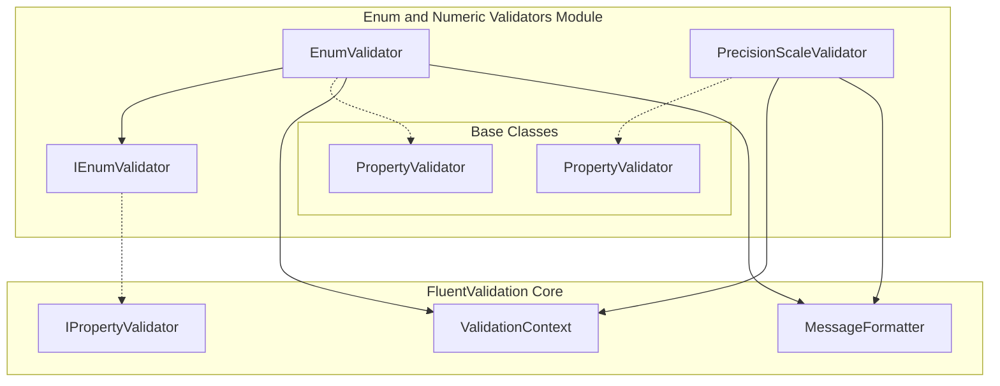
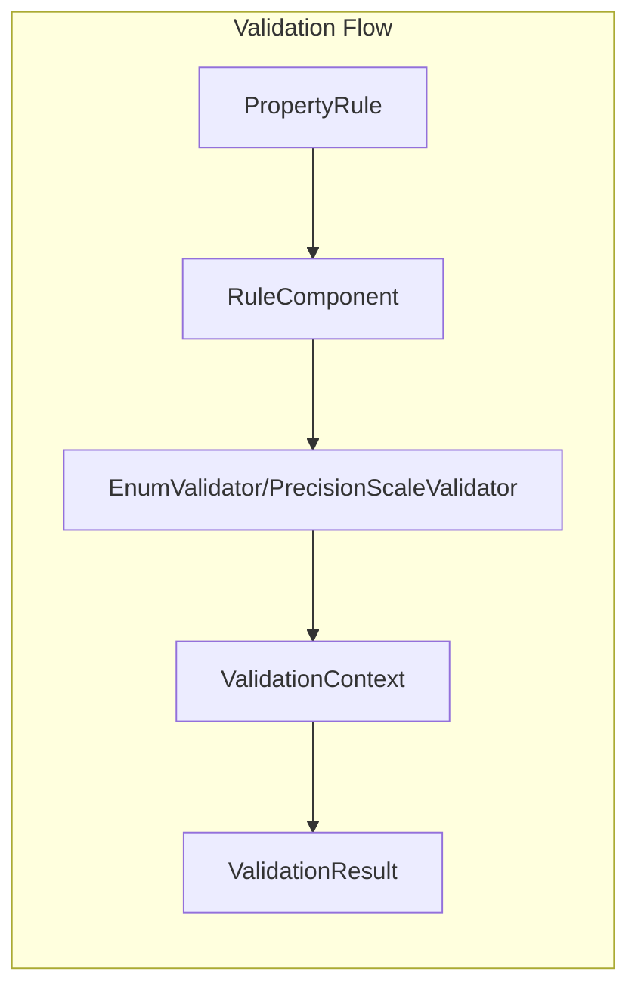
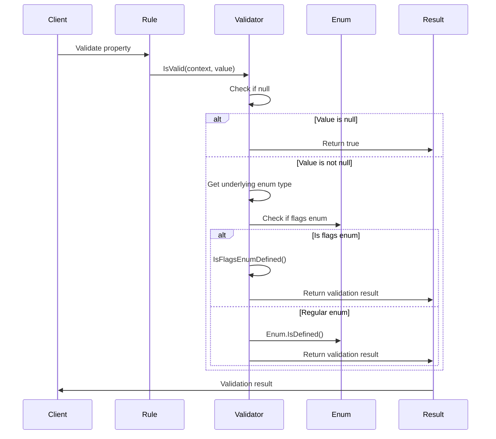
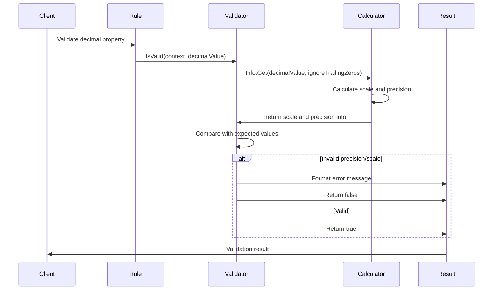

# Enum and Numeric Validators

## Introduction

The Enum and Numeric Validators module provides specialized validation capabilities for enum values and numeric precision/scale requirements. This module is part of the FluentValidation library's built-in validators collection and offers essential validation rules for common data integrity scenarios involving enumerated types and decimal precision constraints.

## Overview

The module consists of two primary validators:

1. **EnumValidator** - Validates that values are valid members of specified enum types, including support for flags enums
2. **PrecisionScaleValidator** - Validates decimal values against precision and scale requirements, commonly used for financial and database constraints

These validators integrate seamlessly with the FluentValidation framework's property validation system and support localization for error messages.

## Architecture

### Component Structure



### Integration with Validation Framework



## Core Components

### EnumValidator<T, TProperty>

The `EnumValidator` is a generic validator that ensures a property value is a valid member of a specified enum type. It handles both regular enums and flags enums with special logic for bitwise validation.

**Key Features:**
- Supports nullable enum types
- Handles flags enums with bitwise validation
- Type-safe validation with compile-time checking
- Automatic detection of enum type and flags attribute

**Validation Logic:**
1. Null values are considered valid (null handling is typically done by separate validators)
2. For non-nullable types, extracts the underlying enum type
3. For regular enums, checks if the value is defined in the enum
4. For flags enums, validates that the value represents a valid combination of flags

**Flags Enum Validation:**
The validator supports all underlying enum types (byte, sbyte, short, ushort, int, uint, long, ulong) and validates that the combined flags represent a valid combination of defined enum values.

### IEnumValidator Interface

Defines the contract for enum validators, exposing the `EnumType` property to identify the type being validated.

### PrecisionScaleValidator<T>

Validates that decimal values conform to specified precision and scale requirements, essential for financial calculations and database constraints.

**Key Features:**
- Configurable precision (total digits) and scale (decimal places)
- Option to ignore trailing zeros for effective precision/scale calculation
- Detailed error messages with actual vs expected values
- Support for edge cases like integer values without decimal places

**Validation Parameters:**
- **Precision**: Total number of digits (both left and right of decimal point)
- **Scale**: Number of digits to the right of the decimal point
- **IgnoreTrailingZeros**: Whether to ignore trailing zeros in the decimal part

**Validation Logic:**
1. Calculates actual scale and precision of the input value
2. Compares against expected precision and scale
3. Provides detailed error information including actual values
4. Handles special formatting for error messages to show effective precision

## Usage Examples

### Enum Validation

```csharp
public class UserValidator : AbstractValidator<User>
{
    public UserValidator()
    {
        // Validate that Status is a valid enum value
        RuleFor(x => x.Status).IsInEnum();
        
        // Validate flags enum
        RuleFor(x => x.Permissions).IsInEnum();
    }
}

public enum UserStatus
{
    Active,
    Inactive,
    Pending
}

[Flags]
public enum Permissions
{
    Read = 1,
    Write = 2,
    Delete = 4,
    Admin = 8
}
```

### Precision and Scale Validation

```csharp
public class ProductValidator : AbstractValidator<Product>
{
    public ProductValidator()
    {
        // Validate price has precision 10 and scale 2 (e.g., 12345678.99)
        RuleFor(x => x.Price)
            .PrecisionScale(10, 2, false)
            .WithMessage("Price must have at most 8 digits before and 2 digits after decimal point");
            
        // Validate with trailing zeros ignored
        RuleFor(x => x.Discount)
            .PrecisionScale(5, 2, true); // 123.4500 would be treated as 123.45
    }
}
```

## Dependencies

The Enum and Numeric Validators module depends on several core FluentValidation components:

### Core Dependencies
- **[PropertyValidator](PropertyValidator.md)** - Base class for all property validators
- **[ValidationContext](Validation%20Context%20Management.md)** - Provides validation context and state
- **[MessageFormatter](Localization.md)** - Handles error message formatting and localization
- **[IPropertyValidator](Built-in%20Validators.md)** - Interface that all property validators implement

### Integration Points
- **[PropertyRule](Fluent%20API%20&%20Rule%20Definition.md)** - Rules that contain these validators
- **[RuleComponent](Fluent%20API%20&%20Rule%20Definition.md)** - Components that execute validators
- **[ValidationResult](Validation%20Results%20and%20Failures.md)** - Results containing validation failures

## Data Flow

### Enum Validation Process



### Precision Scale Validation Process



## Error Handling and Localization

Both validators support FluentValidation's localization system for error messages:

### EnumValidator Error Messages
- Default message key: "EnumValidator"
- Localized messages available for multiple languages
- Message includes the property name and invalid value

### PrecisionScaleValidator Error Messages
- Default message key: "ScalePrecisionValidator"
- Provides detailed error information including:
  - Expected precision and scale
  - Actual precision and scale
  - Formatted values for better user understanding
- Supports all FluentValidation supported languages

## Performance Considerations

### EnumValidator Performance
- Uses reflection to check for `FlagsAttribute` (cached)
- Enum value validation is optimized for different underlying types
- Flags enum validation uses bitwise operations for efficiency

### PrecisionScaleValidator Performance
- Uses decimal bit manipulation for efficient scale calculation
- Caches mantissa calculations to avoid repeated operations
- Minimal memory allocation during validation

## Testing Considerations

When testing validators in this module:

1. **EnumValidator Testing**
   - Test with regular enums and flags enums
   - Test with nullable enum types
   - Test with invalid enum values
   - Test with combined flags values
   - Test edge cases with different underlying types

2. **PrecisionScaleValidator Testing**
   - Test values at precision/scale boundaries
   - Test with and without trailing zeros
   - Test integer values (no decimal places)
   - Test negative values
   - Test very large and very small decimal values

## Related Documentation

- **[Built-in Validators](Built-in%20Validators.md)** - Overview of all built-in validators
- **[Fluent API & Rule Definition](Fluent%20API%20&%20Rule%20Definition.md)** - How to define validation rules
- **[Validation Results and Failures](Validation%20Results%20and%20Failures.md)** - Understanding validation results
- **[Localization](Localization.md)** - Configuring error messages and languages