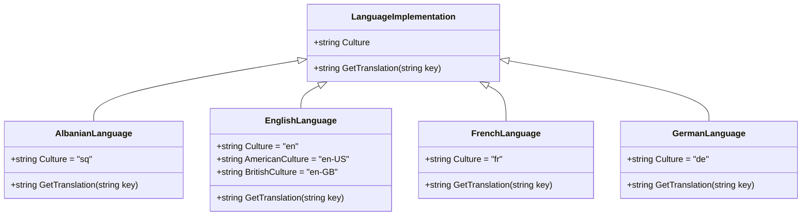
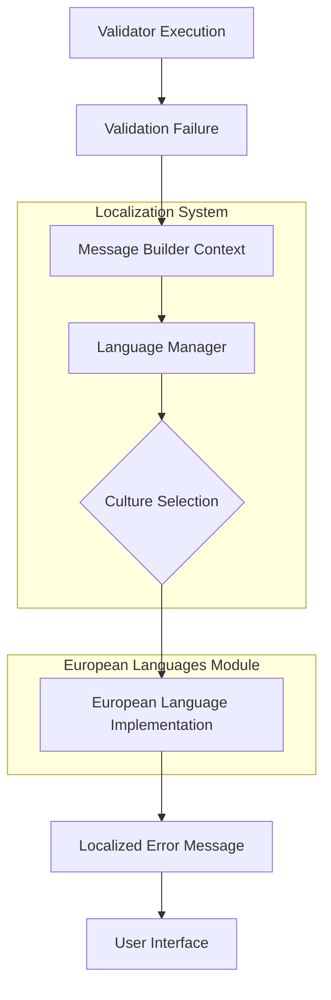
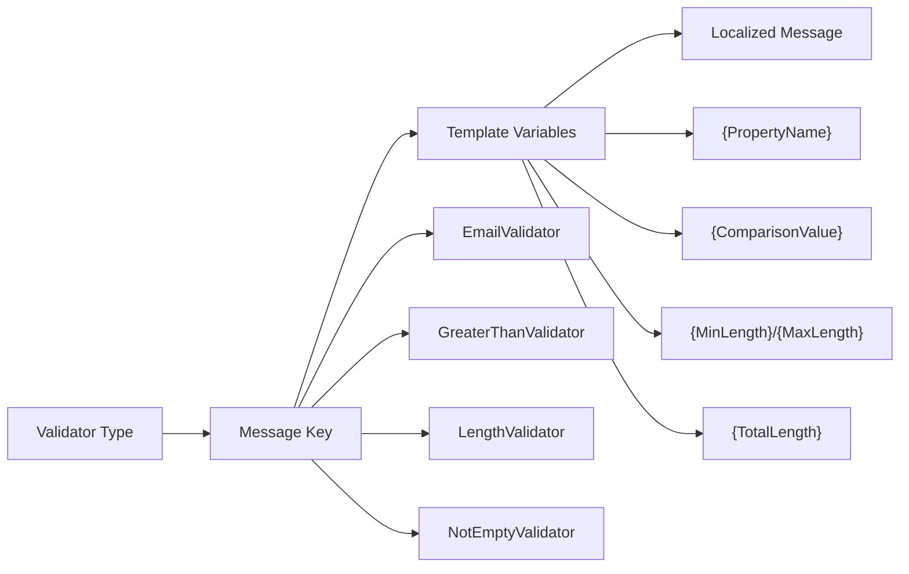
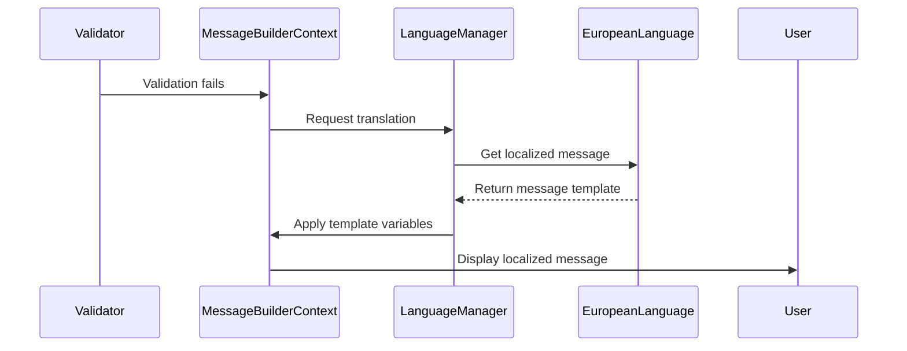
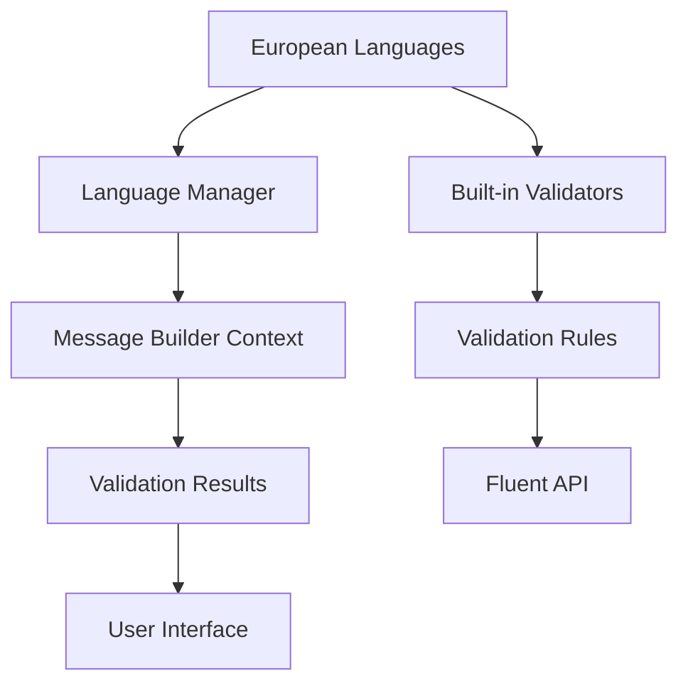

# European Languages Module Documentation

## Introduction

The European Languages module is a comprehensive localization component within the FluentValidation framework that provides native language support for validation error messages across European languages. This module ensures that validation feedback is presented to end users in their preferred language, significantly improving user experience and accessibility in multilingual applications.

The module encompasses 32 European languages and dialects, ranging from widely spoken languages like English, French, and German to regional languages such as Welsh, Romansh, and Icelandic. Each language implementation provides culturally appropriate and grammatically correct validation messages for all built-in validators within the FluentValidation framework.

## Architecture Overview

The European Languages module follows a consistent architectural pattern where each language is implemented as a static class containing culture-specific constants and translation methods. The module integrates seamlessly with the broader [Localization](Localization.md) system through the LanguageManager component.

### Core Architecture Pattern



### Integration with Localization System



## Supported Languages and Cultures

The module provides comprehensive coverage of European languages, organized by linguistic families and geographical regions:

### Germanic Languages
- **English** (`en`, `en-US`, `en-GB`) - Default fallback language
- **German** (`de`) - Germany, Austria, Switzerland
- **Dutch** (`nl`) - Netherlands, Belgium
- **Danish** (`da`) - Denmark
- **Swedish** (`sv`) - Sweden
- **Norwegian Bokmål** (`nb`) - Norway (standard)
- **Norwegian Nynorsk** (`nn`) - Norway (alternative)
- **Icelandic** (`is`) - Iceland

### Romance Languages
- **French** (`fr`) - France, Belgium, Switzerland, Canada
- **Spanish** (`es`) - Spain, Latin America
- **Italian** (`it`) - Italy, Switzerland
- **Portuguese** (`pt`) - Portugal
- **Portuguese (Brazil)** (`pt-BR`) - Brazil
- **Catalan** (`ca`) - Catalonia, Valencia, Balearic Islands
- **Romanian** (`ro`) - Romania, Moldova
- **Romansh** (`rm`) - Switzerland (minority language)

### Slavic Languages
- **Russian** (`ru`) - Russia, Belarus, Kazakhstan
- **Ukrainian** (`uk`) - Ukraine
- **Polish** (`pl`) - Poland
- **Czech** (`cs`) - Czech Republic
- **Slovak** (`sk`) - Slovakia
- **Bulgarian** (`bg`) - Bulgaria
- **Serbian (Cyrillic)** (`sr`) - Serbia
- **Serbian (Latin)** (`sr-Latn`) - Serbia (alternative script)
- **Croatian** (`hr`) - Croatia
- **Slovenian** (`sl`) - Slovenia
- **Macedonian** (`mk`) - North Macedonia
- **Bosnian** (`bs`) - Bosnia and Herzegovina

### Other European Languages
- **Albanian** (`sq`) - Albania, Kosovo
- **Greek** (`el`) - Greece, Cyprus
- **Turkish** (`tr`) - Turkey, Cyprus
- **Hungarian** (`hu`) - Hungary
- **Finnish** (`fi`) - Finland
- **Estonian** (`et`) - Estonia
- **Latvian** (`lv`) - Latvia
- **Georgian** (`ka`) - Georgia
- **Hebrew** (`he`) - Israel
- **Welsh** (`cy`) - Wales, United Kingdom

## Translation Architecture

### Message Template System

Each language implementation provides translations for validation message templates using a consistent key-based approach:



### Translation Categories

The module organizes validation messages into logical categories:

#### Comparison Validators
- **Greater Than**: Messages for numeric and date comparisons
- **Less Than**: Messages for minimum value validations
- **Equal/Not Equal**: Messages for exact value matching
- **Between**: Messages for range validations (inclusive/exclusive)

#### String Validators
- **Length**: Messages for string length constraints
- **Regular Expression**: Messages for pattern matching
- **Email**: Messages for email format validation
- **Credit Card**: Messages for credit card number validation

#### Null/Empty Validators
- **Not Null**: Messages requiring non-null values
- **Not Empty**: Messages requiring non-empty strings or collections
- **Null/Empty**: Messages requiring null or empty values

#### Custom Validators
- **Predicate**: Messages for custom validation logic
- **Enum**: Messages for enumeration value validation
- **Scale/Precision**: Messages for numeric precision validation

## Implementation Details

### Consistent Structure Pattern

All European language implementations follow a standardized pattern:

```csharp
internal class LanguageName {
    public const string Culture = "culture-code";
    
    public static string GetTranslation(string key) => key switch {
        // Core validation messages
        "EmailValidator" => "localized message with {PropertyName} placeholder",
        "GreaterThanValidator" => "localized message with {PropertyName} and {ComparisonValue}",
        // ... additional validators
        
        // Client-side fallback messages (simplified versions)
        "Length_Simple" => "simplified localized message",
        // ... additional simplified messages
        
        _ => null, // Return null for unknown keys
    };
}
```

### Cultural and Linguistic Considerations

#### Grammar and Syntax
Each language implementation respects local grammatical structures:
- **German**: Formal address and compound sentence structures
- **French**: Gender agreement and formal/informal distinctions
- **Slavic languages**: Case systems and verb aspects
- **Nordic languages**: Definite article integration

#### Cultural Context
- **Formality levels**: Appropriate for business applications
- **Regional variations**: Support for dialects and regional preferences
- **Technical terminology**: Consistent technical vocabulary

### Message Formatting Integration

The module integrates with the [Message Formatting](Localization.md#message-formatting) system:



## Usage Patterns

### Automatic Language Selection
The module automatically selects the appropriate language based on:
- Current thread culture
- Application configuration
- User preferences
- Fallback to English

### Manual Language Override
Developers can explicitly specify language preferences:
```csharp
// Set specific culture for validation messages
ValidatorOptions.Global.LanguageManager.Culture = new CultureInfo("fr-FR");
```

### Custom Message Integration
European language messages can be extended or overridden:
```csharp
// Add custom translations for specific validators
LanguageManager.AddTranslation("fr", "CustomValidator", "Message personnalisé");
```

## Quality Assurance and Maintenance

### Translation Quality Standards
- **Native speaker review**: All translations reviewed by native speakers
- **Consistency checks**: Uniform terminology across validators
- **Cultural appropriateness**: Messages suitable for business applications
- **Technical accuracy**: Correct use of technical terms

### Version Compatibility
The module maintains backward compatibility while supporting new validators:
- **Stable message keys**: Consistent key naming across versions
- **Graceful degradation**: Falls back to English for missing translations
- **Extensibility**: Easy addition of new languages and validators

## Performance Considerations

### Memory Efficiency
- **Static implementation**: No instance creation required
- **Lazy loading**: Languages loaded on demand
- **String interning**: Efficient string handling

### Runtime Performance
- **O(1) lookup**: Switch-based translation retrieval
- **No external dependencies**: Pure C# implementation
- **Minimal allocation**: Efficient memory usage

## Integration with Broader System

### Dependency Relationships


### Cross-Module Communication
The European Languages module communicates with:
- **[Built-in Validators](Built-in Validators.md)**: Provides error messages for all standard validators
- **[Localization](Localization.md)**: Integrates with the broader localization infrastructure
- **[Validation Results](Core & Validation Execution.md#validation-results-and-failures)**: Supplies localized error messages
- **[Message Formatting](Localization.md#message-formatting)**: Uses the template variable system

## Future Enhancements

### Planned Language Additions
- **Basque** (`eu`) - Spain, France
- **Catalan (Valencian)** (`ca-ES-valencia`) - Valencia
- **Galician** (`gl`) - Spain
- **Luxembourgish** (`lb`) - Luxembourg
- **Maltese** (`mt`) - Malta

### Technical Improvements
- **Gender-aware messages**: Support for gender-specific grammar
- **Pluralization rules**: Proper handling of singular/plural forms
- **Contextual messages**: Different messages based on validation context
- **Machine learning integration**: Automated translation quality improvements

## Conclusion

The European Languages module represents a comprehensive solution for multilingual validation in European markets. Its consistent architecture, extensive language coverage, and seamless integration with the FluentValidation framework make it an essential component for applications serving European users. The module's design ensures that validation feedback is not only technically accurate but also culturally appropriate and linguistically correct, significantly enhancing the user experience across diverse European markets.