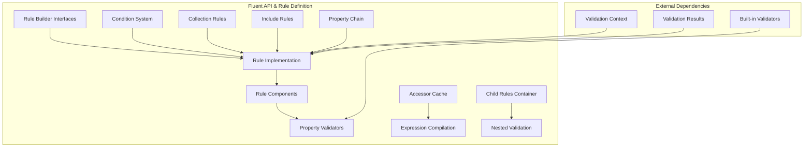

# Fluent API & Rule Definition Module

## Overview

The Fluent API & Rule Definition module is the core of the FluentValidation library, providing the fluent interface for defining validation rules and the underlying infrastructure for rule construction and execution. This module enables developers to create expressive, readable validation rules using method chaining while maintaining type safety and supporting both synchronous and asynchronous validation scenarios.

## Purpose

This module serves as the foundation for:
- **Rule Definition**: Creating validation rules through a fluent, chainable API
- **Property Validation**: Defining validation logic for object properties
- **Collection Validation**: Validating individual elements within collections
- **Conditional Validation**: Applying rules based on runtime conditions
- **Rule Composition**: Building complex validation scenarios through rule inclusion and dependencies

## Architecture



## Core Components

### Rule Builder System
The rule builder system provides the fluent interface for constructing validation rules through method chaining. It supports both property-level and collection-level validation scenarios.

### Rule Implementation
Internal rule classes that handle the actual validation logic, property value extraction, and error message generation. These classes bridge the fluent API with the validation execution engine.

### Rule Components
Individual validation steps within a rule chain, each containing a specific validator (e.g., NotNull, Length, Email) with its own configuration and error messaging.

### Condition System
Supports both synchronous and asynchronous conditions that can be applied to individual validators or entire rule chains, enabling dynamic validation behavior based on runtime state.

## Sub-modules

### [Rule Builder System](Rule%20Builder%20System.md)
The fluent interface for constructing validation rules, providing method chaining capabilities and type-safe rule definition.

### [Rule Implementation](Rule%20Implementation.md)
Core rule classes that handle validation execution, property access, and integration with the validation context.

### [Rule Components](Rule%20Components.md)
Individual validation steps within rule chains, managing validators, conditions, and error message customization.

### [Condition System](Condition%20System.md)
Conditional validation support with both synchronous and asynchronous conditions, including When/Unless constructs.

### [Collection Rules](Collection%20Rules.md)
Specialized rules for validating collections, including filtering, indexing, and element-specific validation.

### [Property Chain Management](Property%20Chain%20Management.md)
Property path construction and management for nested object validation and proper error message formatting.

### [Include Rules](Include%20Rules.md)
Rule composition and reuse through validator inclusion, enabling modular validation logic.

## Key Features

### Type Safety
The fluent API maintains full type safety throughout the rule definition process, ensuring compile-time validation of property access and validator compatibility.

### Expression Support
Leverages LINQ expressions for property access, enabling efficient property value extraction and caching of compiled delegates.

### Async/Await Support
Full support for asynchronous validation scenarios, including async conditions and async property validators.

### Performance Optimization
Includes accessor caching to optimize repeated property access and compiled expression delegates for efficient runtime performance.

## Integration Points

### [Built-in Validators](Built-in%20Validators.md)
The fluent API seamlessly integrates with the built-in validators module, providing access to a comprehensive set of validation rules.

### [Validation Context Management](Core%20&%20Validation%20Execution.md#validation-context-management)
Rules work closely with the validation context to maintain state, track failures, and coordinate validation execution.

### [Validation Results and Failures](Core%20&%20Validation%20Execution.md#validation-results-and-failures)
Rule execution results are captured and formatted for integration with the broader validation result system.

## Usage Examples

### Basic Property Validation
```csharp
RuleFor(x => x.Email)
    .NotEmpty()
    .EmailAddress()
    .WithMessage("Please provide a valid email address");
```

### Collection Validation
```csharp
RuleForEach(x => x.Orders)
    .Where(order => order.Total > 0)
    .SetValidator(new OrderValidator());
```

### Conditional Validation
```csharp
RuleFor(x => x.ShippingAddress)
    .NotEmpty()
    .When(x => x.RequiresShipping);
```

### Complex Rule Composition
```csharp
RuleFor(x => x.Password)
    .NotEmpty()
    .MinimumLength(8)
    .Must(password => password.Any(char.IsDigit))
    .WithMessage("Password must contain at least one digit");
```

## Performance Considerations

The module includes several performance optimizations:
- **Accessor Caching**: Compiled property accessors are cached to avoid repeated expression compilation
- **Condition Caching**: Shared conditions are cached per validation context to avoid redundant evaluations
- **Rule Component Reuse**: Rule components are designed to be lightweight and reusable across validation contexts

## Thread Safety

The fluent API is designed to be thread-safe for rule definition, with immutable rule configurations once constructed. Validation execution is context-specific and maintains thread safety through the validation context isolation.