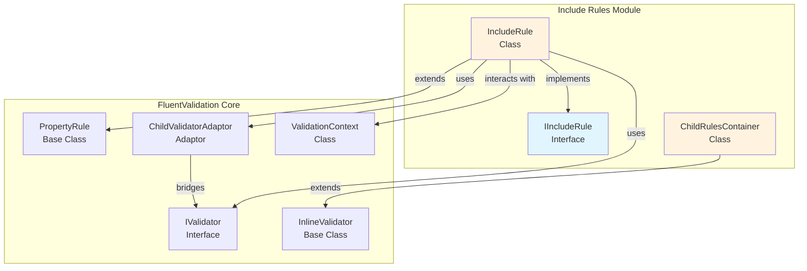
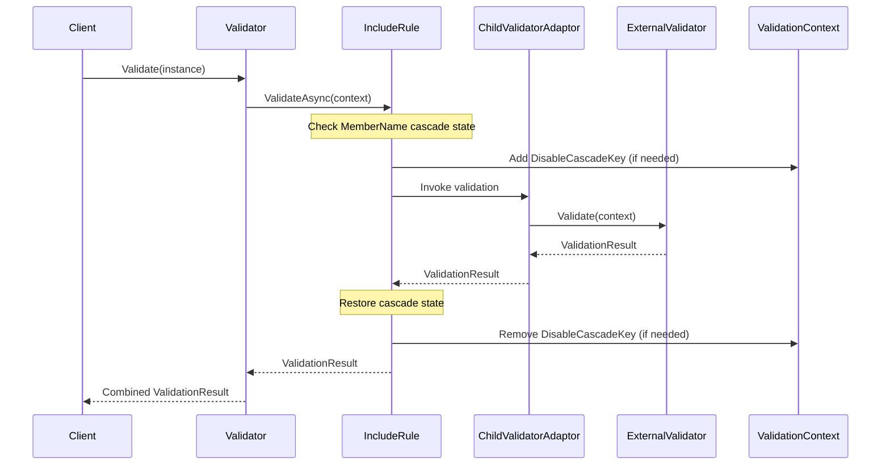
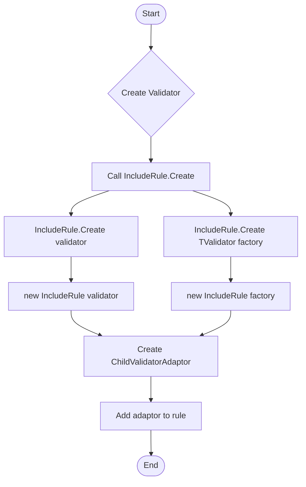
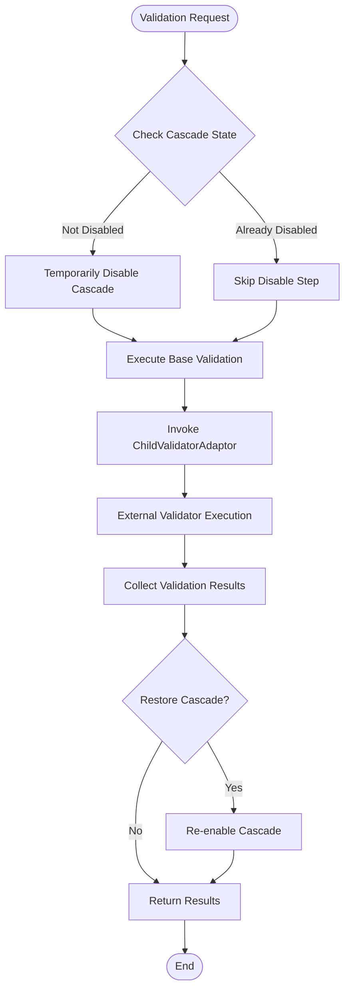

# Include Rules Module Documentation

## Overview

The Include Rules module provides functionality for incorporating external validators into a parent validation context, enabling modular and reusable validation logic. This module is essential for creating complex validation scenarios where validation rules need to be shared across different validators or when implementing conditional validation based on external validators.

## Purpose and Core Functionality

The Include Rules module serves as a bridge between different validators, allowing:
- **Validator Composition**: Include complete validators as rules within other validators
- **Code Reusability**: Share validation logic across multiple validators
- **Modular Validation**: Break down complex validation into smaller, manageable components
- **Conditional Validation**: Apply external validators based on runtime conditions

## Architecture

### Core Components

#### 1. IIncludeRule Interface
- **Purpose**: Marker interface that identifies include rules within the validation system
- **Location**: `src.FluentValidation.Internal.IncludeRule.IIncludeRule`
- **Role**: Provides type safety and identification for include rule implementations

#### 2. IncludeRule<T> Class
- **Purpose**: Concrete implementation of include rules that wraps external validators
- **Location**: `src.FluentValidation.Internal.IncludeRule.IncludeRule`
- **Inheritance**: Extends `PropertyRule<T, T>` and implements `IIncludeRule`
- **Key Features**:
  - Wraps external validators using `ChildValidatorAdaptor`
  - Handles both synchronous and asynchronous validation
  - Manages cascade mode behavior for included validators
  - Special handling for `MemberNameValidatorSelector` to prevent cascade issues

#### 3. ChildRulesContainer<T> Class
- **Purpose**: Container for managing child rules within a validation context
- **Location**: `src.FluentValidation.Internal.ChildRulesContainer.ChildRulesContainer`
- **Inheritance**: Extends `InlineValidator<T>`
- **Key Features**:
  - Tracks rulesets that should be applied to child rules
  - Manages nested child rule scenarios
  - Provides infrastructure for complex validation hierarchies

## Component Relationships



## Data Flow



## Process Flow

### Include Rule Creation



### Validation Execution



## Key Features and Behaviors

### 1. Cascade Mode Handling
The Include Rules module implements special handling for cascade modes to ensure that included validators behave as if their rules are part of the parent validator. This prevents unexpected cascade behavior when using `MemberNameValidatorSelector`.

### 2. Dual Validation Support
Include rules support both synchronous and asynchronous validation through the `ChildValidatorAdaptor`, which implements both `IPropertyValidator` and `IAsyncPropertyValidator` interfaces.

### 3. Factory Pattern Support
The module supports both direct validator instances and factory functions, providing flexibility in how external validators are created and configured.

### 4. Nested Include Rule Support
The implementation handles nested include rules correctly by tracking cascade state and only modifying it at the root level.

## Integration with Other Modules

### Dependency on Core Components
- **[Core & Validation Execution](Core & Validation Execution.md)**: Include rules extend the base `PropertyRule` class and integrate with the core validation execution pipeline
- **[Fluent API & Rule Definition](Fluent API & Rule Definition.md)**: Include rules are created and configured through the fluent API
- **[Built-in Validators](Built-in Validators.md)**: Include rules use `ChildValidatorAdaptor` to wrap external validators

### Usage Patterns
```csharp
// Direct validator inclusion
RuleFor(x => x).Include(new AddressValidator());

// Factory-based inclusion
RuleFor(x => x).Include((instance) => new AddressValidator());

// Generic factory inclusion
RuleFor(x => x).Include<AddressValidator>();
```

## Best Practices

### 1. Validator Design
- Keep included validators focused on specific validation concerns
- Avoid circular dependencies between validators
- Use clear naming conventions for included validators

### 2. Performance Considerations
- Cache validator instances when possible
- Use factory methods for validators with expensive initialization
- Consider the validation hierarchy depth to avoid excessive nesting

### 3. Error Handling
- Ensure included validators provide meaningful error messages
- Consider error message localization when using included validators
- Test cascade behavior in complex validation scenarios

## Common Use Cases

### 1. Shared Validation Logic
```csharp
public class AddressValidator : AbstractValidator<Address> {
    public AddressValidator() {
        RuleFor(x => x.Street).NotEmpty();
        RuleFor(x => x.City).NotEmpty();
        RuleFor(x => x.PostalCode).Matches(@"^\d{5}$");
    }
}

public class CustomerValidator : AbstractValidator<Customer> {
    public CustomerValidator() {
        RuleFor(x => x.Name).NotEmpty();
        RuleFor(x => x.Address).Include(new AddressValidator());
    }
}
```

### 2. Conditional Validation
```csharp
public class OrderValidator : AbstractValidator<Order> {
    public OrderValidator() {
        RuleFor(x => x).Include(x => x.OrderType == "Express" 
            ? new ExpressOrderValidator() 
            : new StandardOrderValidator());
    }
}
```

### 3. Complex Object Validation
```csharp
public class CompanyValidator : AbstractValidator<Company> {
    public CompanyValidator() {
        RuleFor(x => x.Headquarters).Include(new AddressValidator());
        RuleForEach(x => x.Branches).Include(new AddressValidator());
        RuleFor(x => x.CEO).Include(new PersonValidator());
    }
}
```

## Technical Considerations

### Thread Safety
Include rules are designed to be thread-safe when the included validators are thread-safe. The `ChildValidatorAdaptor` handles synchronization appropriately.

### Memory Management
The module uses the `TrackingCollection` infrastructure for proper disposal of resources when validators are no longer needed.

### Extensibility
The `IIncludeRule` interface allows for custom include rule implementations while maintaining compatibility with the FluentValidation framework.

## Conclusion

The Include Rules module is a fundamental component of the FluentValidation library that enables modular, reusable validation logic. By providing a clean abstraction for including external validators, it promotes code organization and reduces duplication while maintaining the fluent API's ease of use. The module's careful handling of cascade modes and support for both synchronous and asynchronous validation makes it suitable for complex validation scenarios in enterprise applications.