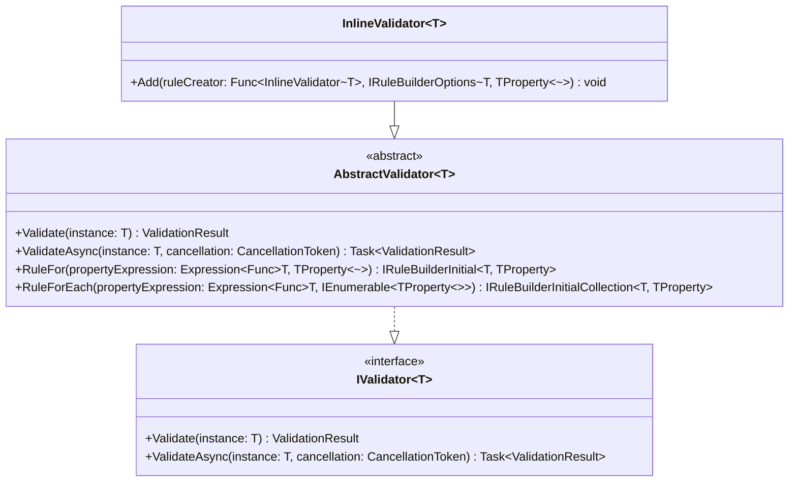
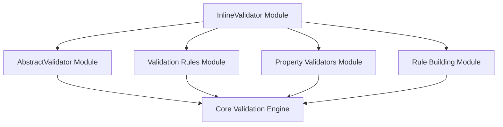
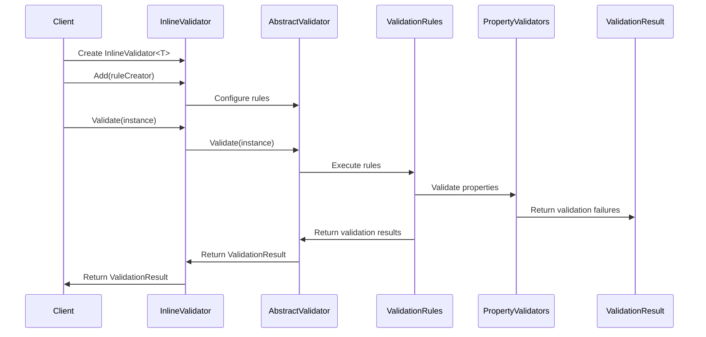
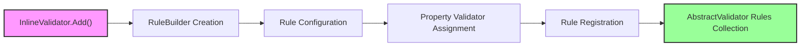

# InlineValidator Module Documentation

## Introduction

The InlineValidator module provides a lightweight, functional approach to defining validation rules without requiring inheritance from the AbstractValidator base class. It serves as a convenient alternative for scenarios where you need quick validation logic without the overhead of creating dedicated validator classes.

## Overview

The InlineValidator<T> class extends AbstractValidator<T> but provides a simplified API for defining validation rules through lambda expressions. This approach is particularly useful for:

- Quick prototyping and testing
- Simple validation scenarios
- Situations where creating a separate validator class would be overkill
- Inline validation within the same class as the model

## Architecture

### Component Structure



### Module Dependencies



## Core Components

### InlineValidator<T>

The main class in this module, providing a simplified interface for defining validation rules.

**Key Features:**
- Inherits all functionality from AbstractValidator<T>
- Provides the `Add()` method for functional rule definition
- Supports the same validation capabilities as AbstractValidator
- Enables inline validation rule definition

**Usage Example:**
```csharp
public class Customer
{
    public int Id { get; set; }
    public string Name { get; set; }
    public string Email { get; set; }

    public static readonly InlineValidator<Customer> Validator = new InlineValidator<Customer>
    {
        v => v.RuleFor(x => x.Name).NotNull().Length(2, 50),
        v => v.RuleFor(x => x.Id).NotEqual(0),
        v => v.RuleFor(x => x.Email).EmailAddress()
    };
}
```

## Data Flow

### Validation Process Flow



## Integration with Other Modules

### Relationship with AbstractValidator

The InlineValidator is essentially a convenience wrapper around AbstractValidator. It:
- Inherits all validation capabilities from AbstractValidator
- Uses the same rule building infrastructure ([Rule Building Module](Rule_Building.md))
- Leverages the same property validation system ([Property Validators Module](Property_Validators.md))
- Produces the same ValidationResult format

### Rule Definition Process



## Usage Patterns

### 1. Static Field Pattern
```csharp
public class Model
{
    public string Name { get; set; }
    
    public static readonly InlineValidator<Model> Validator = new InlineValidator<Model>
    {
        v => v.RuleFor(x => x.Name).NotEmpty()
    };
}
```

### 2. Local Instance Pattern
```csharp
var validator = new InlineValidator<Customer>();
validator.Add(v => v.RuleFor(x => x.Email).EmailAddress());
validator.Add(v => v.RuleFor(x => x.Age).InclusiveBetween(18, 65));
```

### 3. Configuration Method Pattern
```csharp
public static class CustomerValidation
{
    public static InlineValidator<Customer> CreateValidator()
    {
        var validator = new InlineValidator<Customer>();
        validator.Add(v => v.RuleFor(x => x.Name).NotNull().Length(2, 100));
        validator.Add(v => v.RuleFor(x => x.Email).EmailAddress());
        return validator;
    }
}
```

## Advantages and Limitations

### Advantages
- **Simplicity**: No need to create separate validator classes
- **Conciseness**: Validation logic can be defined inline
- **Flexibility**: Easy to modify validation rules dynamically
- **Familiar API**: Uses the same fluent API as AbstractValidator

### Limitations
- **Reusability**: Less reusable than dedicated validator classes
- **Complexity**: Can become unwieldy for complex validation scenarios
- **Testing**: Harder to unit test in isolation
- **Organization**: Validation logic mixed with model logic

## Best Practices

### When to Use InlineValidator
- Simple validation scenarios
- Prototyping and testing
- One-off validation requirements
- When validation logic is tightly coupled to the model

### When to Use AbstractValidator
- Complex validation scenarios
- Reusable validation logic
- Multiple validation contexts
- When validation should be separated from models

## Performance Considerations

The InlineValidator has the same performance characteristics as AbstractValidator since it inherits all the underlying validation infrastructure. The only overhead is the additional lambda expression invocation when adding rules.

## Thread Safety

InlineValidator instances are thread-safe for validation operations once configured. However, rule configuration (calling Add()) should not be performed concurrently from multiple threads.

## Related Documentation

- [AbstractValidator Module](AbstractValidator.md) - Base validation functionality
- [Rule Building Module](Rule_Building.md) - Rule configuration infrastructure
- [Property Validators Module](Property_Validators.md) - Available validation rules
- [Core Validation Engine](Core_Validation_Engine.md) - Core validation concepts
- [Validation Rules Module](Validation_Rules.md) - Rule execution engine