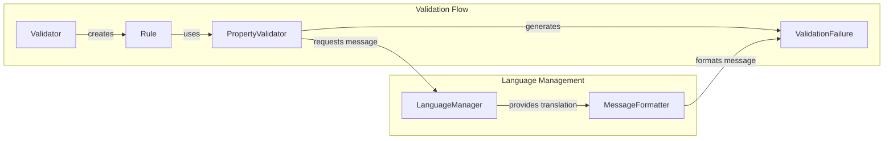

# Language Management Module

## Overview

The Language Management module is a core component of the FluentValidation library that provides comprehensive localization and internationalization support. It enables the validation framework to display error messages in multiple languages, making applications accessible to users worldwide. The module manages translation resources, handles culture-specific message formatting, and provides a flexible architecture for adding new language support.

## Purpose

The primary purpose of the Language Management module is to:
- Provide multi-language support for validation error messages
- Manage translation resources for over 50 supported languages
- Enable dynamic culture switching and fallback mechanisms
- Support custom translations and message customization
- Integrate seamlessly with the validation framework's message formatting system

## Architecture

The Language Management module follows a clean architecture pattern with clear separation of concerns:

```mermaid
graph TB
    subgraph "Language Management Module"
        ILM[ILanguageManager<br/>Interface]
        LM[LanguageManager<br/>Implementation]
        
        subgraph "Message Formatting"
            MBC[MessageBuilderContext]
            MF[MessageFormatter]
        end
        
        subgraph "Supported Languages"
            EL[EnglishLanguage]
            GL[GermanLanguage]
            FRL[FrenchLanguage]
            SLL[SpanishLanguage]
            JPL[JapaneseLanguage]
            CSL[ChineseSimplifiedLanguage]
            CTL[ChineseTraditionalLanguage]
            AL[AlbanianLanguage]
            ARL[ArabicLanguage]
            AZL[AzerbaijaneseLanguage]
            BL[BengaliLanguage]
            BSL[BosnianLanguage]
            BGL[BulgarianLanguage]
            CAL[CatalanLanguage]
            CRL[CroatianLanguage]
            CZL[CzechLanguage]
            DL[DanishLanguage]
            DUL[DutchLanguage]
            ELN[EstonianLanguage]
            FL[FinnishLanguage]
            GLN[GeorgianLanguage]
            GRL[GreekLanguage]
            HL[HebrewLanguage]
            HIL[HindiLanguage]
            HUL[HungarianLanguage]
            IL[IcelandicLanguage]
            INL[IndonesianLanguage]
            ITL[ItalianLanguage]
            KZL[KazakhLanguage]
            KML[KhmerLanguage]
            KL[KoreanLanguage]
            LL[LatvianLanguage]
            ML[MacedonianLanguage]
            NBL[NorwegianBokmalLanguage]
            NNL[NorwegianNynorskLanguage]
            PL[PersianLanguage]
            PLN[PolishLanguage]
            PTL[PortugueseLanguage]
            PBL[PortugueseBrazilLanguage]
            RL[RomanianLanguage]
            RSL[RomanshLanguage]
            RUL[RussianLanguage]
            SCL[SerbianCyrillicLanguage]
            SLLN[SerbianLatinLanguage]
            SKL[SlovakLanguage]
            SLN[SlovenianLanguage]
            SWL[SwedishLanguage]
            TL[ThaiLanguage]
            TUL[TurkishLanguage]
            UL[UkrainianLanguage]
            UCL[UzbekCyrillicLanguage]
            ULL[UzbekLatinLanguage]
            VL[VietnameseLanguage]
            WL[WelshLanguage]
            TJL[TajikLanguage]
            TML[TamilLanguage]
            TEL[TeluguLanguage]
        end
    end
    
    ILM -->|implements| LM
    LM -->|uses| MBC
    LM -->|uses| MF
    LM -->|delegates to| EL
    LM -->|delegates to| GL
    LM -->|delegates to| FRL
    LM -->|delegates to| SLL
    LM -->|delegates to| JPL
    LM -->|delegates to| CSL
    LM -->|delegates to| CTL
    LM -->|delegates to| AL
    LM -->|delegates to| ARL
    LM -->|delegates to| AZL
    LM -->|delegates to| BL
    LM -->|delegates to| BSL
    LM -->|delegates to| BGL
    LM -->|delegates to| CAL
    LM -->|delegates to| CRL
    LM -->|delegates to| CZL
    LM -->|delegates to| DL
    LM -->|delegates to| DUL
    LM -->|delegates to| ELN
    LM -->|delegates to| FL
    LM -->|delegates to| GLN
    LM -->|delegates to| GRL
    LM -->|delegates to| HL
    LM -->|delegates to| HIL
    LM -->|delegates to| HUL
    LM -->|delegates to| IL
    LM -->|delegates to| INL
    LM -->|delegates to| ITL
    LM -->|delegates to| KZL
    LM -->|delegates to| KML
    LM -->|delegates to| KL
    LM -->|delegates to| LL
    LM -->|delegates to| ML
    LM -->|delegates to| NBL
    LM -->|delegates to| NNL
    LM -->|delegates to| PL
    LM -->|delegates to| PLN
    LM -->|delegated to| PTL
    LM -->|delegates to| PBL
    LM -->|delegates to| RL
    LM -->|delegates to| RSL
    LM -->|delegates to| RUL
    LM -->|delegates to| SCL
    LM -->|delegates to| SLLN
    LM -->|delegates to| SKL
    LM -->|delegates to| SLN
    LM -->|delegates to| SWL
    LM -->|delegates to| TL
    LM -->|delegates to| TUL
    LM -->|delegates to| UL
    LM -->|delegates to| UCL
    LM -->|delegates to| ULL
    LM -->|delegates to| VL
    LM -->|delegates to| WL
    LM -->|delegates to| TJL
    LM -->|delegates to| TML
    LM -->|delegates to| TEL
```



## Core Components

### ILanguageManager Interface
The `ILanguageManager` interface defines the contract for language management services within the FluentValidation framework. It provides methods for retrieving translated strings based on culture-specific keys and manages localization settings.

**Key Responsibilities:**
- Enable/disable localization functionality
- Manage default culture settings
- Provide culture-specific translation retrieval
- Support fallback mechanisms for missing translations

### LanguageManager Implementation
The `LanguageManager` class is the concrete implementation of `ILanguageManager`. It provides a comprehensive solution for managing validation error message translations across multiple languages and cultures.

**Key Features:**
- **Multi-language Support**: Built-in support for over 50 languages
- **Culture Fallback**: Automatic fallback from specific to neutral cultures
- **Caching**: Efficient translation caching using ConcurrentDictionary
- **Custom Translations**: Support for user-defined translations
- **Thread-safe**: Concurrent access support for multi-threaded applications

## Integration with Validation Framework

The Language Management module integrates seamlessly with other components of the FluentValidation framework:



## Sub-modules

The Language Management module consists of several specialized sub-modules:

### [Message Formatting](Message%20Formatting.md)
Handles the formatting and interpolation of validation error messages with parameters and placeholders. This sub-module provides the infrastructure for building context-aware error messages with proper parameter substitution and formatting.

### [Supported Languages](Supported%20Languages.md)
Manages the collection of language-specific translation resources and culture information. This comprehensive sub-module includes over 50 language implementations, each providing culture-specific translations for all validation error messages.

## Usage Patterns

### Basic Usage
```csharp
// Get translation for current culture
var message = languageManager.GetString("NotNullValidator");

// Get translation for specific culture
var germanMessage = languageManager.GetString("NotNullValidator", new CultureInfo("de-DE"));
```

### Custom Translations
```csharp
// Add custom translation
languageManager.AddTranslation("en-US", "CustomValidator", "This is a custom message");
```

### Culture Fallback
The module automatically handles culture fallback:
1. Specific culture (e.g., "en-US")
2. Neutral culture (e.g., "en")
3. English fallback (if different from current culture)
4. Empty string (if all else fails)

## Performance Considerations

- **Caching**: All translations are cached in memory after first access
- **Concurrent Access**: Thread-safe implementation using ConcurrentDictionary
- **Lazy Loading**: Language resources are loaded on-demand
- **Memory Efficiency**: Only requested translations are loaded into memory

## Extensibility

The Language Management module is designed for extensibility:
- Custom language implementations can be added
- New translation keys can be registered
- Custom message formatting can be implemented
- Culture-specific behaviors can be customized

## Related Documentation

- [Message Formatting](Message%20Formatting.md) - Detailed documentation on message formatting and interpolation
- [Supported Languages](Supported%20Languages.md) - Complete list of supported languages and their implementation details
- [Localization](Localization.md) - Overview of the broader localization system within FluentValidation