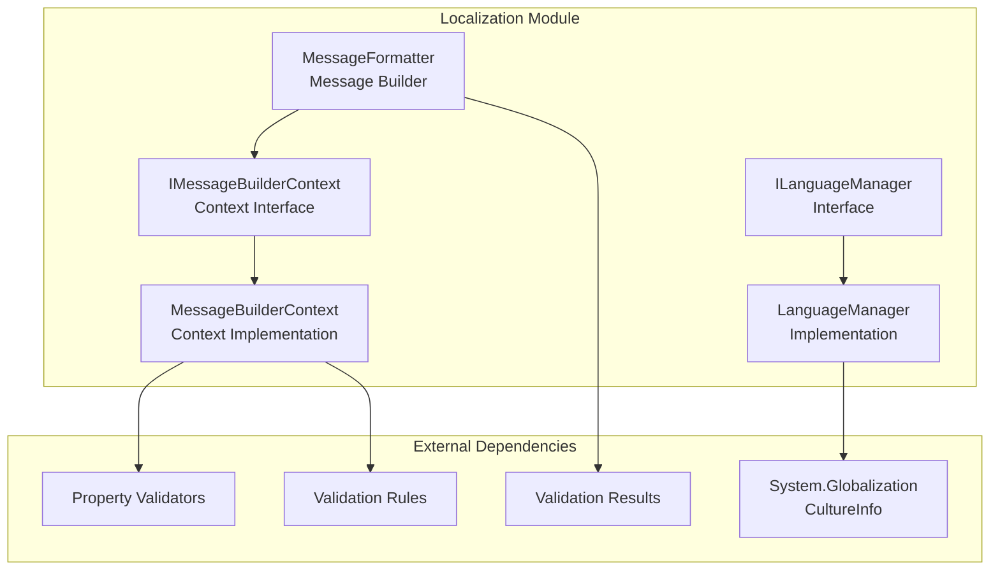
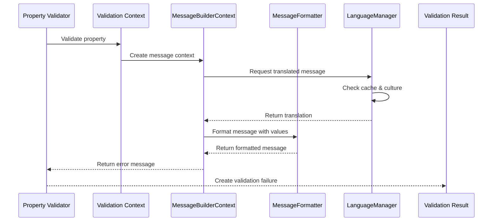
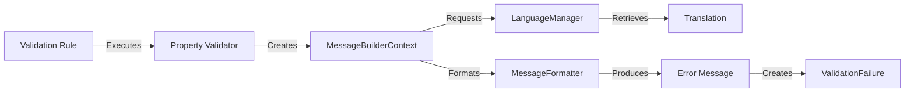
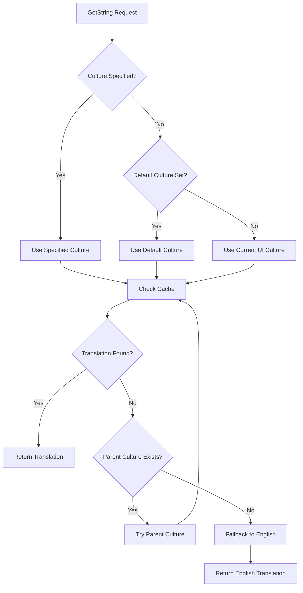

# Localization Module Documentation

## Introduction

The Localization module in FluentValidation provides comprehensive support for multi-language error messages and validation feedback. It enables applications to deliver validation error messages in different languages based on the user's culture, making validation feedback accessible to users worldwide. The module handles message translation, formatting, and culture-specific message delivery throughout the validation pipeline.

## Architecture Overview

The Localization module serves as the internationalization layer within the FluentValidation framework, managing error message translations and formatting across different cultures and languages.



## Core Components

### ILanguageManager Interface

The `ILanguageManager` interface defines the contract for managing localized error messages within the validation framework. It provides the essential methods for retrieving translated validation messages based on culture-specific requirements.

**Key Responsibilities:**
- Enable/disable localization functionality
- Manage culture-specific message retrieval
- Provide fallback mechanisms for missing translations
- Support custom culture settings

**Core Properties:**
- `Enabled`: Controls whether localization is active
- `Culture`: Sets the default culture for message retrieval
- `GetString()`: Retrieves translated messages by key and culture

### LanguageManager Implementation

The `LanguageManager` class implements `ILanguageManager` and serves as the central hub for managing validation message translations. It supports over 50 languages and provides intelligent fallback mechanisms.

**Key Features:**
- **Multi-language Support**: Built-in support for 50+ languages including English, Spanish, French, German, Chinese, Japanese, Arabic, and many others
- **Culture Fallback**: Implements hierarchical culture fallback (specific → neutral → English)
- **Caching**: Uses concurrent dictionary for efficient message caching
- **Custom Translations**: Allows runtime addition of custom translations
- **Thread-safe**: Concurrent operations supported through thread-safe collections

**Supported Languages:**
The system includes built-in translations for major world languages organized by culture codes (e.g., 'en', 'es', 'fr', 'de', 'zh-CN', 'ja', 'ar').

### MessageFormatter

The `MessageFormatter` class handles the dynamic construction of validation error messages by replacing placeholders with actual values. It uses a template-based approach for message formatting.

**Key Capabilities:**
- **Placeholder Replacement**: Supports dynamic placeholder substitution using `{PropertyName}` and `{PropertyValue}`
- **Custom Formatting**: Allows custom format specifiers for value formatting
- **Template Processing**: Uses regex-based template processing for efficient replacement
- **Extensible**: Supports additional custom placeholders through the `AppendArgument` method

**Default Placeholders:**
- `{PropertyName}`: Name of the validated property
- `{PropertyValue}`: Value of the validated property
- Custom placeholders: User-defined placeholders with custom formatting

### MessageBuilderContext

The `MessageBuilderContext` provides the contextual information needed for message construction during validation. It bridges the gap between validation execution and message formatting.

**Context Information:**
- **Validation Context**: Reference to the current validation context
- **Property Information**: Property name, display name, and value
- **Component Details**: Reference to the rule component being validated
- **Message Formatter**: Access to the message formatter instance
- **Default Messages**: Access to default error messages

## Data Flow



## Component Interactions

### Message Construction Process



### Culture Resolution Flow



## Integration with Validation Pipeline

The Localization module integrates seamlessly with the broader validation framework:

### Property Validator Integration
Property validators utilize the Localization module to provide culture-specific error messages. When a validation fails, validators request appropriate translations based on the current validation context.

### Rule Component Integration
Rule components leverage the MessageBuilderContext to construct appropriate error messages that incorporate both translated text and dynamic property values.

### Validation Result Integration
The formatted error messages are incorporated into ValidationFailure objects, which are then collected into ValidationResult instances for consumption by the application.

## Usage Patterns

### Basic Localization Setup
```csharp
// Configure language manager
var languageManager = new LanguageManager();
languageManager.Culture = new CultureInfo("es"); // Spanish

// Custom translations
languageManager.AddTranslation("es", "NotNullValidator", "El campo {PropertyName} es requerido.");
```

### Message Formatting
```csharp
var formatter = new MessageFormatter()
    .AppendPropertyName("Email")
    .AppendPropertyValue("invalid-email");

var message = formatter.BuildMessage("{PropertyName} must be a valid email address.");
// Result: "Email must be a valid email address."
```

### Context-Aware Messages
The MessageBuilderContext automatically provides validation context including property names, values, and validation state, enabling rich, contextual error messages.

## Performance Considerations

### Caching Strategy
The LanguageManager implements aggressive caching using ConcurrentDictionary to minimize translation lookup overhead. Translations are cached by culture-key combinations.

### Thread Safety
All components are designed for concurrent access, with thread-safe collections and immutable operations where appropriate.

### Memory Management
The caching mechanism includes automatic memory management through the concurrent collection's built-in cleanup strategies.

## Extensibility

### Custom Language Support
Developers can extend the system by:
- Adding custom translations at runtime
- Creating custom language classes
- Implementing custom ILanguageManager implementations

### Message Formatting Extensions
The MessageFormatter supports custom placeholders and formatting rules, allowing applications to create domain-specific message templates.

### Culture Providers
Applications can implement custom culture resolution logic by extending the LanguageManager or providing custom ILanguageManager implementations.

## Dependencies

The Localization module has minimal external dependencies:
- **System.Globalization**: For culture information and localization support
- **Core Validation Components**: Interfaces from the validation framework
- **Property Validators**: For message construction context

For detailed information about related modules, see:
- [Property Validators](Property_Validators.md) - For validator-specific message requirements
- [Validation Rules](Validation_Rules.md) - For rule-based message construction
- [Core Validation Engine](Core_Validation_Engine.md) - For overall validation context

## Best Practices

### Message Key Management
- Use consistent naming conventions for message keys
- Group related messages by validator type
- Document available message keys for translators

### Culture Handling
- Always provide fallback to English
- Test with various culture settings
- Consider regional variations (e.g., en-US vs en-GB)

### Performance Optimization
- Enable caching for production environments
- Minimize runtime translation additions
- Use specific cultures when possible to reduce fallback overhead

### Custom Translation Management
- Implement translation validation
- Provide translation management tools
- Version control translation files

This comprehensive localization support ensures that FluentValidation can deliver user-friendly, culturally-appropriate validation feedback across diverse international applications.