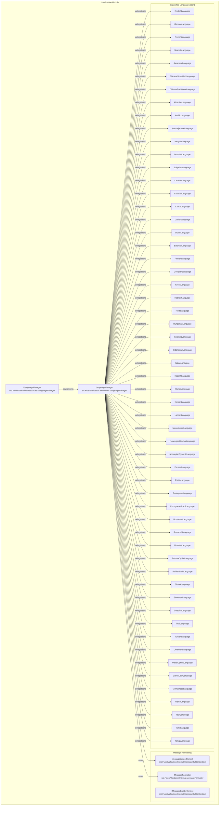

# Localization Module Overview

## Purpose

The Localization module provides comprehensive internationalization and localization support for the FluentValidation framework. It enables validation error messages to be displayed in multiple languages, making applications accessible to users worldwide. The module manages translation resources, handles culture-specific message formatting, and provides a flexible architecture for adding new language support.

## Architecture

```mermaid
graph TB
    subgraph "Localization Module"
        LM[LanguageManager<br/>src.FluentValidation.Resources.LanguageManager]
        ILM[ILanguageManager<br/>src.FluentValidation.Resources.ILanguageManager]
        
        subgraph "Message Formatting"
            MBC[MessageBuilderContext<br/>src.FluentValidation.Internal.MessageBuilderContext]
            IMB[IMessageBuilderContext<br/>src.FluentValidation.Internal.MessageBuilderContext]
            MF[MessageFormatter<br/>src.FluentValidation.Internal.MessageFormatter]
        end
        
        subgraph "Supported Languages (60+)"
            EL[EnglishLanguage]
            GL[GermanLanguage]
            FRL[FrenchLanguage]
            SLL[SpanishLanguage]
            JPL[JapaneseLanguage]
            CSL[ChineseSimplifiedLanguage]
            CTL[ChineseTraditionalLanguage]
            AL[AlbanianLanguage]
            ARL[ArabicLanguage]
            AZL[AzerbaijaneseLanguage]
            BL[BengaliLanguage]
            BSL[BosnianLanguage]
            BGL[BulgarianLanguage]
            CAL[CatalanLanguage]
            CRL[CroatianLanguage]
            CZL[CzechLanguage]
            DL[DanishLanguage]
            DUL[DutchLanguage]
            ELN[EstonianLanguage]
            FL[FinnishLanguage]
            GLN[GeorgianLanguage]
            GRL[GreekLanguage]
            HL[HebrewLanguage]
            HIL[HindiLanguage]
            HUL[HungarianLanguage]
            IL[IcelandicLanguage]
            INL[IndonesianLanguage]
            ITL[ItalianLanguage]
            KZL[KazakhLanguage]
            KML[KhmerLanguage]
            KL[KoreanLanguage]
            LL[LatvianLanguage]
            ML[MacedonianLanguage]
            NBL[NorwegianBokmalLanguage]
            NNL[NorwegianNynorskLanguage]
            PL[PersianLanguage]
            PLN[PolishLanguage]
            PTL[PortugueseLanguage]
            PBL[PortugueseBrazilLanguage]
            RL[RomanianLanguage]
            RSL[RomanshLanguage]
            RUL[RussianLanguage]
            SCL[SerbianCyrillicLanguage]
            SLLN[SerbianLatinLanguage]
            SKL[SlovakLanguage]
            SLN[SlovenianLanguage]
            SWL[SwedishLanguage]
            TL[ThaiLanguage]
            TUL[TurkishLanguage]
            UL[UkrainianLanguage]
            UCL[UzbekCyrillicLanguage]
            ULL[UzbekLatinLanguage]
            VL[VietnameseLanguage]
            WL[WelshLanguage]
            TJL[TajikLanguage]
            TML[TamilLanguage]
            TEL[TeluguLanguage]
        end
    end
    
    ILM -->|implements| LM
    LM -->|uses| MBC
    LM -->|uses| MF
    LM -->|delegates to| EL
    LM -->|delegates to| GL
    LM -->|delegates to| FRL
    LM -->|delegates to| SLL
    LM -->|delegates to| JPL
    LM -->|delegates to| CSL
    LM -->|delegates to| CTL
    LM -->|delegates to| AL
    LM -->|delegates to| ARL
    LM -->|delegates to| AZL
    LM -->|delegates to| BL
    LM -->|delegates to| BSL
    LM -->|delegates to| BGL
    LM -->|delegates to| CAL
    LM -->|delegates to| CRL
    LM -->|delegates to| CZL
    LM -->|delegates to| DL
    LM -->|delegates to| DUL
    LM -->|delegates to| ELN
    LM -->|delegates to| FL
    LM -->|delegates to| GLN
    LM -->|delegates to| GRL
    LM -->|delegates to| HL
    LM -->|delegates to| HIL
    LM -->|delegates to| HUL
    LM -->|delegates to| IL
    LM -->|delegates to| INL
    LM -->|delegates to| ITL
    LM -->|delegates to| KZL
    LM -->|delegates to| KML
    LM -->|delegates to| KL
    LM -->|delegates to| LL
    LM -->|delegates to| ML
    LM -->|delegates to| NBL
    LM -->|delegates to| NNL
    LM -->|delegates to| PL
    LM -->|delegates to| PLN
    LM -->|delegates to| PTL
    LM -->|delegates to| PBL
    LM -->|delegates to| RL
    LM -->|delegates to| RSL
    LM -->|delegates to| RUL
    LM -->|delegates to| SCL
    LM -->|delegates to| SLLN
    LM -->|delegates to| SKL
    LM -->|delegates to| SLN
    LM -->|delegates to| SWL
    LM -->|delegates to| TL
    LM -->|delegates to| TUL
    LM -->|delegates to| UL
    LM -->|delegates to| UCL
    LM -->|delegates to| ULL
    LM -->|delegates to| VL
    LM -->|delegates to| WL
    LM -->|delegates to| TJL
    LM -->|delegates to| TML
    LM -->|delegates to| TEL
```

## Core Components

### Language Management
- **[ILanguageManager](src.FluentValidation.Resources.ILanguageManager)** - Interface defining the contract for language management services
- **[LanguageManager](src.FluentValidation.Resources.LanguageManager)** - Concrete implementation providing multi-language support, culture fallback, and custom translations

### Message Formatting
- **[IMessageBuilderContext](src.FluentValidation.Internal.MessageBuilderContext.IMessageBuilderContext)** - Interface providing context for message construction
- **[MessageBuilderContext](src.FluentValidation.Internal.MessageBuilderContext.MessageBuilderContext)** - Context object containing validation context, property values, and formatting tools
- **[MessageFormatter](src.FluentValidation.Internal.MessageFormatter.MessageFormatter)** - Templating engine for placeholder substitution and message formatting

### Supported Languages
The module includes comprehensive language support for over 60 languages organized by regions:
- **European Languages**: Albanian, Basque, Bosnian, Bulgarian, Catalan, Croatian, Czech, Danish, Dutch, English, Estonian, Finnish, French, Georgian, German, Greek, Hungarian, Icelandic, Italian, Latvian, Macedonian, Norwegian, Polish, Portuguese, Romanian, Romansh, Russian, Serbian, Slovak, Slovenian, Spanish, Swedish, Turkish, Ukrainian, Welsh
- **Asian Languages**: Arabic, Azerbaijani, Bengali, Chinese (Simplified & Traditional), Hebrew, Hindi, Indonesian, Japanese, Kazakh, Khmer, Korean, Persian, Tajik, Tamil, Telugu, Thai, Uzbek, Vietnamese

## Key Features

- **Multi-language Support**: Built-in support for 60+ languages with culture-specific translations
- **Automatic Culture Detection**: Automatic language selection based on current thread culture
- **Culture Fallback**: Hierarchical fallback from specific to neutral cultures
- **Custom Translations**: Support for user-defined translations and message customization
- **Message Formatting**: Advanced templating with placeholder substitution and format specifications
- **Thread-safe**: Concurrent access support using efficient caching mechanisms
- **Extensibility**: Simple pattern for adding new languages or customizing existing ones

## Integration

The Localization module integrates seamlessly with the broader FluentValidation ecosystem, working with validation rules, property validators, and validation results to deliver localized error messages to end users across different cultures and languages.