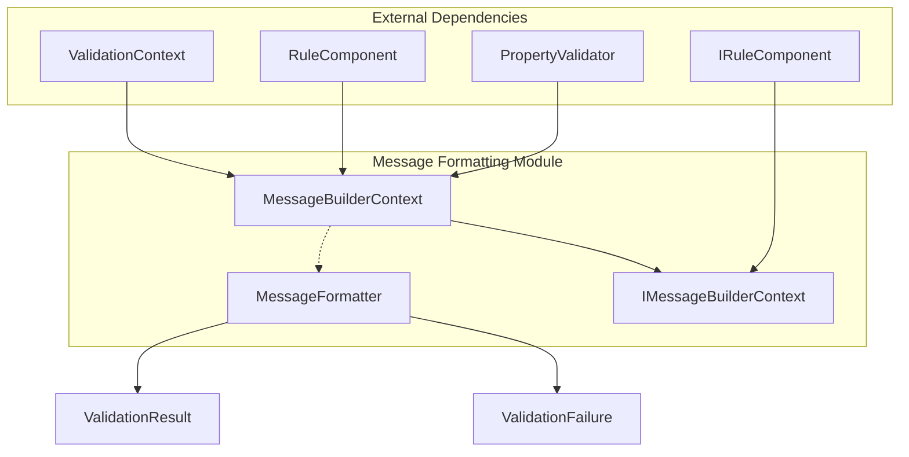
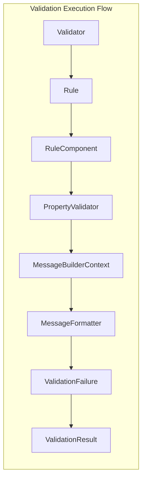
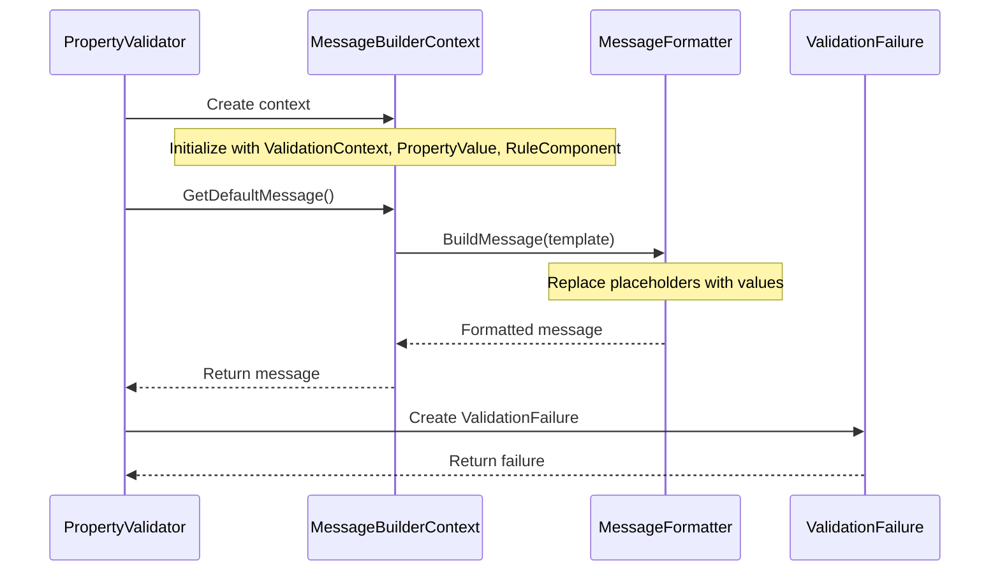
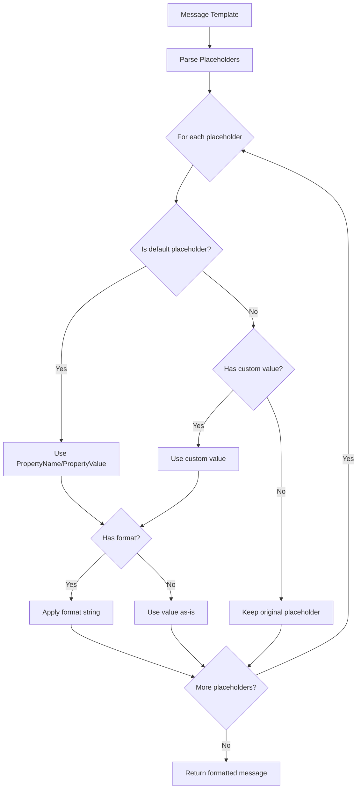

# Message Formatting Module

## Introduction

The Message Formatting module is a core component of the FluentValidation library responsible for constructing and customizing validation error messages. It provides a flexible templating system that allows developers to create meaningful, localized validation messages with dynamic placeholder substitution. This module serves as the bridge between validation rule execution and user-facing error messages, ensuring consistent and professional error reporting across applications.

## Overview

The Message Formatting module provides two primary components that work together to deliver sophisticated message construction capabilities:

1. **MessageFormatter** - A powerful templating engine that replaces placeholders in message templates with actual values
2. **MessageBuilderContext** - A context object that provides access to all necessary information during message construction, including validation context, property values, and formatting options

These components integrate seamlessly with the broader FluentValidation ecosystem, working closely with [Localization](Localization.md) for multi-language support and [Validation Results and Failures](Core%20%26%20Validation%20Execution.md#validation-results-and-failures) for error message delivery.

## Architecture

### Component Architecture



### Integration Architecture



## Core Components

### MessageFormatter

The `MessageFormatter` class is the heart of the message formatting system. It provides a sophisticated templating engine that supports placeholder substitution with optional formatting specifications.

#### Key Features

- **Placeholder Support**: Uses `{PropertyName}` and `{PropertyValue}` as default placeholders
- **Custom Placeholders**: Allows arbitrary placeholder definitions via `AppendArgument()`
- **Format Specifications**: Supports .NET format strings (e.g., `{PropertyValue:F2}` for currency formatting)
- **Fluent API**: Method chaining for easy configuration
- **Regex-based Parsing**: Efficient template parsing using compiled regular expressions

#### Default Placeholders

| Placeholder | Description | Example |
|-------------|-------------|---------|
| `{PropertyName}` | Name of the validated property | `"Email"` |
| `{PropertyValue}` | Current value of the property | `"invalid@email"` |

#### Usage Examples

```csharp
var formatter = new MessageFormatter()
    .AppendPropertyName("Email")
    .AppendPropertyValue("invalid@email")
    .AppendArgument("MinLength", 5);

string message = formatter.BuildMessage(
    "{PropertyName} must be at least {MinLength} characters long. Current value: {PropertyValue}"
);
// Result: "Email must be at least 5 characters long. Current value: invalid@email"
```

### MessageBuilderContext

The `MessageBuilderContext` serves as a comprehensive container for all information needed during message construction. It bridges the validation execution context with the message formatting system.

#### Interface Design

The `IMessageBuilderContext<T, TProperty>` interface provides:

- **Component Access**: Reference to the rule component being validated
- **Validator Access**: Access to the property validator that failed
- **Context Information**: Parent validation context and instance being validated
- **Property Details**: Property name, display name, and current value
- **Formatting Tools**: Access to the MessageFormatter instance
- **Default Message**: Method to retrieve the default error message

#### Implementation Details

The concrete `MessageBuilderContext<T, TProperty>` class:

- Encapsulates the validation context and property value
- Provides strongly-typed access to the instance and property value
- Delegates property name resolution to the validation context
- Offers both interface and concrete type access to components

## Data Flow

### Message Construction Process



### Placeholder Resolution Flow



## Integration with Other Modules

### Localization Integration

The Message Formatting module works closely with the [Localization](Localization.md) module to provide multi-language support:

- **Language Manager**: Retrieves localized message templates based on current culture
- **Resource Resolution**: Message templates are resolved through the language manager before formatting
- **Culture-Specific Formatting**: Format strings respect cultural settings for numbers, dates, etc.

### Validation Context Integration

The module integrates with [Validation Context Management](Core%20%26%20Validation%20Execution.md#validation-context-management) to access:

- **Property Paths**: Full property path for nested object validation
- **Display Names**: User-friendly property names from metadata
- **Validation State**: Access to the overall validation state

### Rule System Integration

Integration with the [Fluent API & Rule Definition](Fluent%20API%20%26%20Rule%20Definition.md) module provides:

- **Rule Components**: Access to rule configuration and custom messages
- **Property Access**: Strongly-typed property access through expression trees
- **Custom Validators**: Support for custom message formatting in user-defined validators

## Advanced Features

### Custom Placeholder Support

Developers can extend the message formatting system with custom placeholders:

```csharp
public class CustomMessageFormatter : MessageFormatter
{
    public MessageFormatter AppendCustomData(object data)
    {
        AppendArgument("CustomData", data);
        return this;
    }
}
```

### Format String Support

The formatter supports .NET format strings for precise value formatting:

- **Numbers**: `{PropertyValue:F2}` → "123.45"
- **Dates**: `{PropertyValue:yyyy-MM-dd}` → "2024-01-15"
- **Custom**: `{PropertyValue:CustomFormat}` → Uses custom format providers

### Performance Considerations

- **Compiled Regex**: Uses source-generated regex for optimal performance
- **Dictionary Cache**: Efficient placeholder value storage
- **Minimal Allocations**: Designed for high-throughput scenarios
- **Reset Capability**: Internal reset method for object pooling scenarios

## Usage Patterns

### Basic Message Formatting

```csharp
// Simple property validation
RuleFor(x => x.Email)
    .NotEmpty()
    .WithMessage("{PropertyName} is required. You entered: {PropertyValue}");
```

### Advanced Customization

```csharp
// Custom message with additional context
RuleFor(x => x.Age)
    .InclusiveBetween(18, 65)
    .WithMessage("{PropertyName} must be between {From} and {To} years. Current value: {PropertyValue}");
```

### Programmatic Message Construction

```csharp
// Building messages programmatically
var context = new MessageBuilderContext<Person, string>(
    validationContext, 
    propertyValue, 
    ruleComponent
);

string message = context.MessageFormatter
    .AppendArgument("MinLength", 5)
    .AppendArgument("MaxLength", 50)
    .BuildMessage("{PropertyName} must be between {MinLength} and {MaxLength} characters.");
```

## Error Handling and Edge Cases

### Placeholder Resolution Failures

- **Missing Placeholders**: Unresolved placeholders remain in the output as-is
- **Null Values**: Null values are converted to empty strings
- **Format Errors**: Invalid format strings fall back to default ToString()

### Thread Safety

- **Instance Methods**: Not thread-safe; create new instances for concurrent use
- **Shared State**: PlaceholderValues dictionary is not synchronized
- **Best Practice**: Use one formatter instance per validation operation

## Testing and Quality Assurance

### Unit Testing Strategies

```csharp
[Test]
public void MessageFormatter_ShouldReplacePlaceholders()
{
    // Arrange
    var formatter = new MessageFormatter()
        .AppendPropertyName("Email")
        .AppendPropertyValue("test@example.com");
    
    // Act
    string result = formatter.BuildMessage("{PropertyName} is invalid: {PropertyValue}");
    
    // Assert
    Assert.AreEqual("Email is invalid: test@example.com", result);
}
```

### Integration Testing

- Test with various [Built-in Validators](Built-in%20Validators.md) to ensure consistent formatting
- Verify integration with [Localization](Localization.md) for multi-language scenarios
- Validate performance under high-load conditions

## Best Practices

### Message Template Design

1. **Be Specific**: Include relevant context in error messages
2. **Be Consistent**: Use consistent terminology across validators
3. **Be User-Friendly**: Avoid technical jargon in user-facing messages
4. **Be Localizable**: Design templates that work across cultures

### Performance Optimization

1. **Reuse Formatters**: When possible, reset and reuse formatter instances
2. **Minimize Placeholders**: Use only necessary placeholders to reduce lookup overhead
3. **Cache Templates**: Cache frequently used message templates
4. **Profile Regex**: Monitor regex performance in high-throughput scenarios

### Extensibility Guidelines

1. **Inherit from MessageFormatter**: For custom formatting logic
2. **Implement IMessageBuilderContext**: For specialized context requirements
3. **Use Extension Methods**: For fluent API enhancements
4. **Document Placeholders**: Clearly document available placeholders for consumers

## Migration and Versioning

### Breaking Changes

- **Placeholder Syntax**: Changes to placeholder syntax would be breaking
- **Interface Changes**: Modifications to IMessageBuilderContext would affect consumers
- **Default Behavior**: Changes to default message construction logic

### Deprecation Strategy

- Mark obsolete methods with appropriate attributes
- Provide migration guides for major changes
- Maintain backward compatibility when possible
- Use semantic versioning for clear change communication

## Conclusion

The Message Formatting module is a critical component that transforms raw validation results into meaningful, user-friendly error messages. Its flexible architecture supports everything from simple placeholder substitution to complex, culturally-aware message formatting. By providing a clean separation between validation logic and message presentation, it enables developers to create professional validation experiences while maintaining code clarity and performance.

The module's integration with the broader FluentValidation ecosystem ensures consistent message formatting across all validators, while its extensible design allows for customization when specific requirements arise. Whether building simple form validations or complex business rule engines, the Message Formatting module provides the tools necessary to deliver clear, actionable feedback to end users.